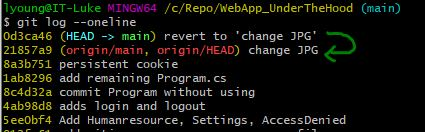

# Git Notes  

## Tips  

- `CTRL + Insert` is copy in git Bash  
- `SHFT + Insert` is paste in git Bash  
- If there is something displayed in the git bash terminal that you would like to be copied to the current command line, highlight the characters with the mouse, then key `SHFT + Insert`
- Help `git help command`
- Git doesn't keep track of empty folders
- force push - ignores all the previous commits on main since the branch was made, and now makes
the push teh head. This orphans or deletes prior commits.

## .gitignore  

- Each project needs a **.gitignore** file so that the `bin` and `obj` folders are not pushed to github.
- If you accidentally commit `bin` and `obj` files because you left out the .gitignore file, there is a way
to remove them.
	- Add a git ignore file to the project
 	- Run the git commands `git rm -r . --cached`
  	- Commit changes	  	

## Git Log  

```
git log
git log --oneline
git log --oneline filename //(Will only show commits to a file)
git log commitHash -p //Creates a patch showing file changes
git log --graph
git log --grep='commit message'
git log -L 100,150:fileName.txt   //Finds the last edits to a line in code
git log -1 //The number one will show just the last git log commit hash and message
```

## Git Show  
```
git show // Will show the commit hash, message, and changes
```

## Revert 
Go back to a previous commit and keep the commit history  
```
git log --oneline  
git revert [CommitSha]  
```  
Abort a git revert that is in progress:  
`git revert --abort`  

## Reset  
This will delete commit history. This is not recommended. An instance of using `reset` can be found in **Undo unpushed commits**  
* Undo a `reset`:  
```
git reflog (or git log-g)
git reset --hard [commitSha]  
```
## Checkout Remote Branch  

1.  `git fetch`
2.  `git branch -v -a` to see the remote branches
3.  `git switch -c <branchName> origin/<branchName>`  

## Create a new branch from the current branch  
This will switch you to the new branch. Leave out the b if you don't want to switch.
`git checkout -b <newBranchName>`

## Push a new local branch to remote repository  

`git push -u origin <branch-name>`

## Re-assign main branch  

`git branch -M <branch-name>`  


## Undo unpushed commits / Reset to previous commit  
There are commits that have not been pushed up to the remote repository. This can be seen in the local git history `git log`, it will show HEAD to be at the un-pushed commit while the origin HEAD is still on a previous commit. **THIS DELETES COMMIT HISTORY!!!** If you would like to keep the commit history, use **revert**.     
  
* Return to a previous commit  
	- View the git logs  
	- Find the commit hash  
	- run the reset command, add the hash to the end by selecting and keying SHFT + Insert  
```
git log --oneline
git reset [CommitSha]
```  
Or, to get back to the head without the commit hash, you can type HEAD~  
`git reset HEAD~`  

## Configure  

Open the global config file for editing:
```
git config --global --edit
```

Save config values from the command line, like set user name:

```
git config --global user.name name
git config --global user.email yourEmail
```
This can be checked with `git config --global --list`   

**Save an Alias to Configure file:**  
```
git config --global alias.cmp '!f() { git add -A && git commit -m "$1" && git push; }; f'
git cmp "This is a text commit"  // Executing the alias
```

Show global configurations and show location:  
`git config --global --list --show-origin`

## Rename

`git mv .\originalFileName newFileName`  

## Unstage  

One file: `git restore --staged fileName`  
All: 'git restore --staged .`  

## Restore to previous Commit 

Last Commit: `git restore .`  
Go back to pervious commit w/o detached head: `git revert commit#`  

## .gitignore file  

Ignore everything in a folder: `folderName/`  
Ignore only a file type in folder: `folderName/.txt`  

## Git Tags  

Lightweight Tags: `git tag tagName commit#` ex: `git tag issue136 655da716e7`  
Annotated Tag: `git tag -a v1.1 -m "Version 1.0" dd5c49428a0`  

List Tags: 
```
git tag
git tag --list
git tag -l
git tag -l “character*”  // The * is a wildcard. Everything after character could be included
git tag -l -n  //list with annotations
```

Lookup Tags: `git show tagName`  

Compare Tags: `git diff tagName1..tagName2  //Note the .. between the two tag names`  

Delete Tag:
```	git tag -d tagName
	git tag --delete tagName
```

Tags are local, even when a Push occurs. Transfer tags explicitly to repo:  
```
git push origin tagName //pushes single tag
git push origin --tags  //pushes all tags

git fetch --tags //pulls tags

git push origin :tagName    //Pushes to an existing tag, not the ':' 

git push --delete origin tagName   //deletes the branch from repository
git push -d origin tagName   //other way to delete from repo
```

Checkout a Tag:  
Right Way => `git checkout -b newBranch tagName`  
Wrong Way => `git checkout tagName`. This creates a new detached head.  

Fixing a Detached Head from Tag checkout:  
```
git tag temp    // Tag the commit (HEAD detached)
git branch tempBranch     //Create a branch (HEAD detached)
git checkout -b tempBranch   // Create a branch and reattach HEAD  
```

## Git Interactive Staging  

`git add -i`  
For elaboration use `?`

- Patching (p) allows staging of portions of a file (hunks) from interactive mode
	- Splitting a Hunk in patch mode requires that there must be at least one unchanged hunk
   	- You can Edit the Hunk when you cannot split the hunk anymore

## Cherry Picking  

`git cherry-pick SHA#`

- Apply the changes from one or more existing commits
- Each existing commit is recorded as a new commit on the current branch
- Conceptually similary to copy-paste
- Use `--edit` or `-e` to edit the commit message  
- IF there is a conflict merging the cherry-pick, you can open the conflict in a merge editor, make the change,
and re-commit the file, then `git cherry-pick --continue`

## Comparing with Diff  

- Look under the Tags section for comparing Tags
- Create a Diff (patch) file: `git diff SHA#1 SHA#2 > ~/fileLocation/fileName.diff`
- Apply the Diff file: `git apply ~/filePath/fileName.diff`   

## Fetch  

`git show origin/branchName // shows the changes that are in the fetched branch`  

## Delete Remote Branch  

```
git push origin :remoteBranch
git push -d origin remoteBranch
```

## Git Blame  

```
git blame fileName.txt  // will show the name on each line of who affected the line
git blame -w fileName.txt  // ignores the white space
git blame -L 100,150 fileName.txt  // no colon, finds specific lines of blame
can list a start to the lines, then amount of lines to add like 100,+50
git blame SHA# fileName.txt
git annotate fileName.txt // better formatted git blame
```

## Bisect  

Used to find where a bug was introduced. Give the command the good and bad versions  
```
git bisect start
git bisect bad <treeish>
git bisect good <treeish>
git bisect reset  (Used to exit)
```

## Submodules  

You can add other repositories into an existing repository.  
>  [!IMPORTANT]
>  Do not use `git clone <repo>` to add submodules. This will not create a `.gitmodules` file to track
>  submodules.

1.  Inside the repository that you want to add a submodule, use the command below to enter the submodule
    repository's address and the location inside of the current repository that you would like the submodule
    to be located. To place the submodule at the root level, do not include a path:

    `git submodule add <submoduleRepositoryAddress> <pathInRepo>`

2.  If changes occured in the submodule, they can be brought into the project using:

    `git submodule update`

3.  If you are cloning down a repository that already has submodules, then after cloning the repository:

    ```
    git submodule init
    git submodule update
    ```


# Github  

## Comapare two branches/commits  
* EX: https://github.com/Alta-Ski-Lifts/ASL_Library/compare/main..7e1b9dfb6cb68d0f1a37c1531d4c4bf4acb0a38d  
* From the branch that you want to compare, add "compare/" then the branch name + ".." + the other branch or commit to the URL.  
* Two dots (..) compares from the current state. Three dots (...) compares from the latest common commit (which doesnt' sound useful).

