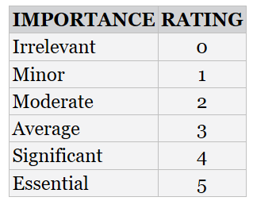
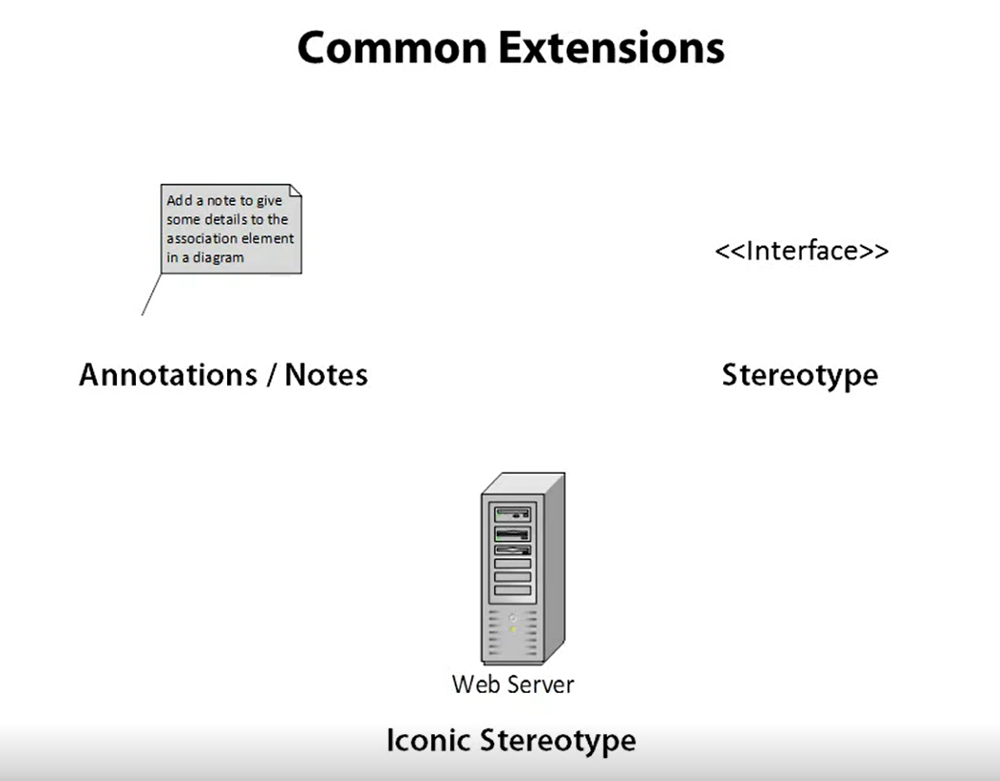
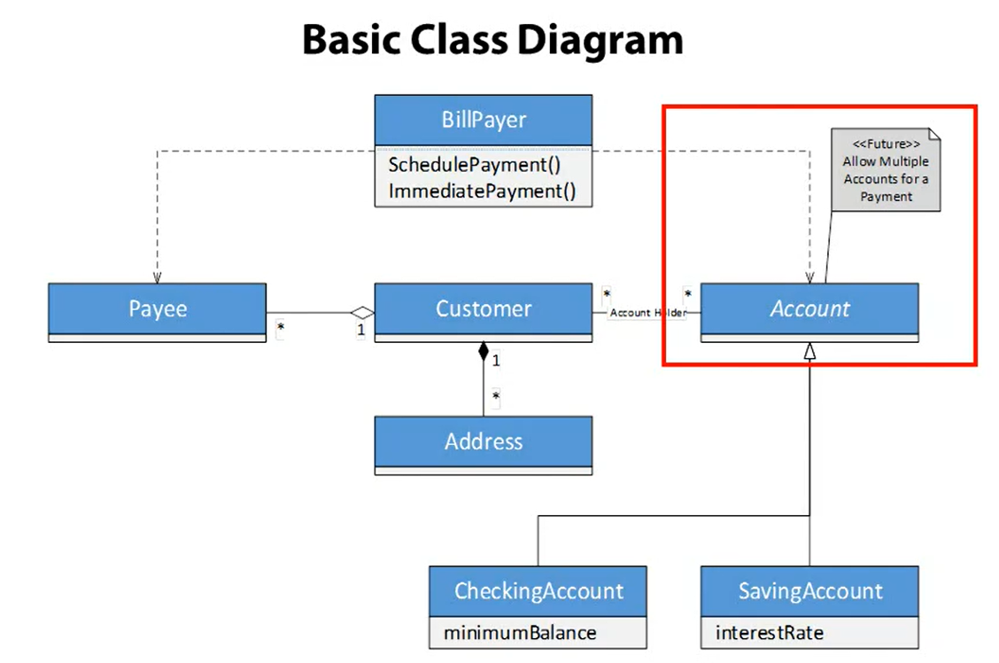
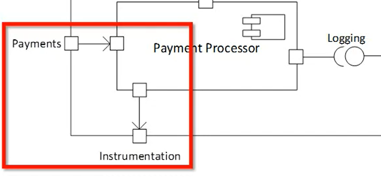
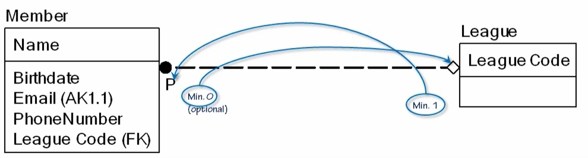
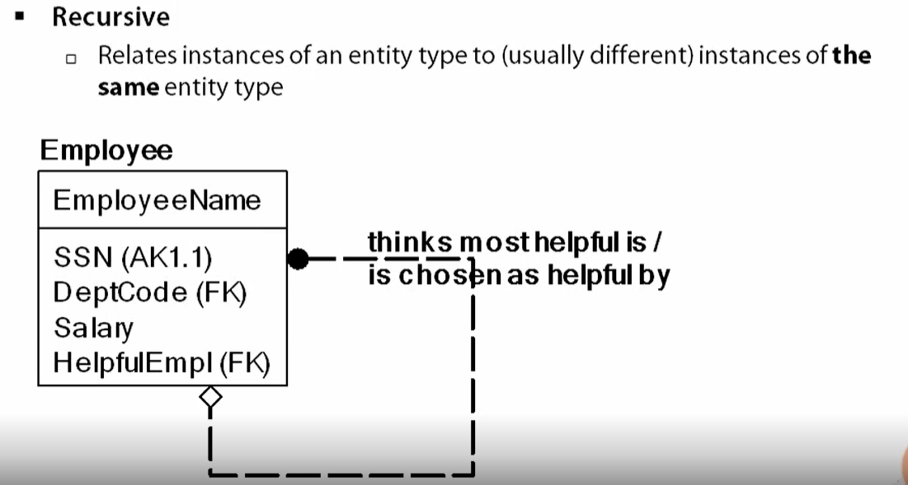
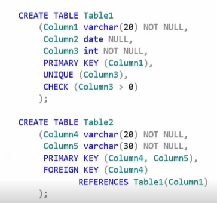

# D284 Software Engineering

Resource: Stephens, R. (2015). Beginning software engineering. Wrox. ISBN: 978-1-118-96914-4  

## CRM  

- Leads, Opportunities, Close Rates
- Forecasting
- Market Feedback 
- Analysis by Channel 
- Teamwork and Engagement 

## SDLC??  

#### Requirements gathering  

#### Change Control  

#### Executive sponsor/ Executive Champion
Highest ranking executive supporting the project  

#### Project manager 
Highest ranking person on the team  
Interface between customers and rest of team  

#### PERT Chart 
Program Evaluation and Review Technique 
- Introduced by the Navy in the 50s
- AOA, activity on arrow, arrow is task and node is a milestone 
- AON, activity on node, node is the task and arrows represent precedence relations 
- Each task lists the time to complete and the predecessor

##### Critical paths
is the longest possible path through the network. The network is usually formed by 
a PERT chart  

#### Gantt Charts  

#### Risk Management  
Rather than wait for an inssue to happen, be proactive and plan:  
- Likelihood  
- Severity  
- Consequences  
- Work-arounds   
    - Dificulty  
    - Impact  
    - Pros  
    - Cons  

## Deployment 

#### Deployment
Puting the project in the customer's hands   
Can also have the terms:
- Implementation, installation, release  

#### Scope 

#### Planning 

List the steps that you hoe to follow, describe eac in detail  
List the ways that the step could fail. Describe the actions that you will 
take. Describe work-arounds.  

#### Cutover  
Process of moving customers over to the new appliation  

#### Staged Deployment  
Reduce catastrophic failures of cutover by doing staged development. Create a
staging area, a fully functional environment for practicing deployment.  
Get a power user involved in the testing, someone that is an expert at the previous
issues.  

#### Gradual Cutover  
Only give the new application to some customer until it is verified that the
deployment worked  

#### Incremental Deployment  
Release features gradually.  

#### Parallel Testing  
Have some users perform their normal tasks on the test application for a while 
as if it were the real thing, while other users are actually doing the tasks 
on the old system. The test system does not count.   

#### Deployment Tasks  
- Physical Environment  
- Hardware  
- Documentation  
- Training  
- Database  
- Other people's Software  
- Your software  

#### Deployment Mistakes  
- Assume everything will work  
- Have no rollback plan  
- Allow insufficient time  
- Don't know when to surrender  
- Skip staging  
- Install lots of updates all at once  
- Use an unstable environment  
- Set an early point of no return  

## Process Models  

### Predictive Models  
**Predictive models** predict in advance what needs to be done.  
A different approach is **Adaptive Development Models**, that enable you to change 
the project's goals if necessay during development.  

When Predictive Models maybe successful:  
- User Involvement: when users help define the requirements, they're more likely 
to be correct.  
- Clear vision: Customer and develpers have the same clear vision.  
- Limited size: Small size make it easier to see the whole picture  
- Experienced Team:  
- Realistic: 
- Established Technology:  

When Predictive Models won't work:  
- Incomplete requirements  
- Unclear requirements  
- Changing Requirements  
- No resources  

Advantages of Predictive Models:  
- Predictability  
- Stability  
- Cost-savings  
- Detailed design  
- Less refactoring  
- Fix bugs early  
- Better documentation  
- Easy maintenance  

Disadvantages of Predictive Models: 
- Inflexible  
- Later initial release  
- Big Design Up Front (BDUF): Can't design until everything is known.

### Waterfall  
Predictive model. Finish each step before moving on to the next step.  

### Waterfall with Feedback 
Allows you to move back a step.  

### Shashimi  
Predictive.  Steps are allowed to overlap.  
- Requirements 
- Design 
- Implementation - code writing
- Verification - testing  
- Deployment 
- Maintenance  
You could have people working on requirements, desing, implementation, and testing
all at the same time.  

#### Shashimi Series  
Multiple shashimi series overlapping. It is incremental. Similar to an incremental 
waterfall below. 

### Incremental Waterfall  
Incremental waterfall (multi-waterfall) uses a seris of separate waterfall 
cascases. Each cascade ends with the delivery of a useable application called an 
increment. Build the project incrementally rather than try to tackle the whole 
thing at once.  
This is somewhat adaptive  

### V-Model 

  

Decomposition- breaks the application down into peices that you can use. This is 
the left side of the diagram.  

Integration - the right side of the diagram. Working towards complettion of the 
delivery.  

### SDLC Software Development Life Cycle  
AKA the application develpment life cycle.  
A waterfall method that circle back around on it's self.  

#### Sub steps of the SDLC  

- Initiation: Customer comes up with the initial idea  
- Concept Development: Initiator and interested parties explore posibilities. This 
step determines if it is a go/no-go. It is expensive to back out after this.  
    - project definitions 
    - feasibility analysis  
    - cost-benefit analysis 
    - risk analysis  
- Preliminary planning: Project Manager and tech lead are assigned to the project.
They start planning and may give tasks to team leads to plan. Estimate resources 
needed, like staff, computers, networks, and such.
    - Document tracking (PERT or Gantt charts) 
    - Gather metrics so the PM can keep track of the project  
- Requirements analysis: Team studies the user's needs and creates requirement 
documents. 
    - UML showing application structure 
    - Pics, use cases, prototypes, business rules
    - Tech requirements for the developers to follow in the build  
- High-level design: Team creates high-level design that specify major subsystems,
data flow, database needs, applications high-level structure.  
- Low-level design: how to build the pieces, to the point a second-shelf programmer
could build the right thing  
- Developement: Write the code. 
- Acceptance testing: User tests the applications  
- Deployement: Roll out the app  
- Maintenance: 
- Review: Use metrics gathered during the development to determine if the design 
process can be improved.  
- Disposal: 

### Iterative Models  
Start by building a small program that is useful, then provide *increments* to 
add more features to the program. 
Improves over predictive models issues of not being flexible to changes, requiring
the exact requirements up front, and this allows for hazy, undefined requriements 
to be used in the start, but figured out as the project moves along.  

#### Comparison:
Fidelity is the completeness of a feature. Low-fidelity is a released feature that 
needs work still. High/full fidelity the feature is complete.  
- Predictive: All features are full fidelity  
- Iterative: Inital features are low fidelity. Every iteration afterwards is 
higher and higher fidelity until full fidelity is reached.  
- Incremental: One feature is rolled out, but it is full fidelity. The other 
features will be released incrementally, at full fidelity.  
- Agile: Start with the lowest fidelity and features. Later versions add features 
and increase fidelity.  

  

#### Prototypes  
Prototype  is a simplified model that demostrates some behaviour you want to 
study. Mimics a part of the appliation you want to build.  
- Horizontal prototypes: demonstrates features but has no depth, like a user interface,
where the user can navigate through pages. That is breadth.    
- Vertical prototype: has little breadth, but great depth. Something may hot have 
a user interface but is able to print a customer receipt.  

#### Prototype types:
- Throw away: build and discard 
- Evolutionary: Build into a finished product  
- Incremental prototyping: building the features in several prototypes, then taking 
the code and building a full application.  

#### Spiral
Used to determine what development approach to take for parts of the project. 
For example, if you don't understand all the requirements, use and iterative approach.  

  

#### Unified Process 
Iterative and incremental development framework  
Four phases: 
- Inception: Come up with project's ideas. 
- Elaboration: Project requirements  
- Construction: Write, test, debug code.  
- Transition: Transfer project ot customers.  
You can add more phases to this if you want. Ex of two more:
- Production: Users use the appliation.  
- Disposal: Remove the app  

##### Rational Unified Process (RUP)  
IBMs version. Uses that same 4 basic phases of UP.  
Uses the same engineering disciplines:  
- Business modeling  
- Requirements  
- Analysis and design  
- Implementation  
- Test  
- Deployment  
RUP has additional IBM tools:  
- artifact templates  
- document production and sharing  
- change rwquest tracking  
- visual modeling  
- performance profiling  

#### Cleanroom model  
Empphaizes defect prevention rather than defect removal.  

## Rapid Appplication Developement (RAD)  
First created by James Martin in the 1980s, he described his method to be RAD.  
Now the term has expanded to mean several more models of rapid development  

### Techniques used in RAD  
- Small teams: half dozen or fewer   
- Requirement gathering through focus groups, workshops, facilitated meetings, prototyping, and brainstorming.  
- Requirement validation through iteration prototypes, use cases, and constant customer testing designs.  
- Repeated customer testing of designs as they evolve.  
- Constant integration and testing of new code into the application.  
- Informal reviews and communication among team members.  
- Short iterations lasting between a few months and as little as a week.  
- Deferring complicated features for later releases. Doing just enough work to get the job done.  
- *Timeboxing*, setting a tight delivery schedule for producing something, usually 
the next iteration. The scope might change but the completion date for the iteration 
cannot.  

**Iteration 0**: RAD starts in the middle of a project, assumably. That iteration 
usually involves setting up hardware and development invironments. Try not to 
include this iteration towards the budget.  

### RAD Advantages  
- More accurate rerquirements. THe suctomer can adjust the requirements as needed 
during the project.  
- The ability to track changing requirements. If requirements must change (within reason), the 
project can start tracking the new requirements in the next iteration.  
- Frequent customer feedback and involvement. In addition to helping keep the project on 
track, theis keeps the users engagged with the project.  
- Reduced development time. If everyting goes smoothly, you don't spend as much time writing 
requirements in exessive detail.  
- Encourages code reuse. One of the key RAD ides is to do whatever it takes to get the 
current iteration done. If an existing piece of code does whit you need it to does 
(or even almost what you need it to do), timeboxing encourages you  to use that code 
instead of writing something new.  
- Possible early realeases with limited functionality.  
- Constant testing promotes high-quality code and eases integration issues.  
- Risk mitigation. Before each iteration, you can look for potential risks and handle them.  
- Greater chand of success. BDUF projects sometimes spend a lot of time following an incorrect 
path before discovering they're heading in the wrong direction and they need to be 
radically redone or even canceled. Frequent increments allow RAD projects to detect 
and correct problems quickly before they become insurmountable.  

### Rad Disadvantages  
- Some software engineering groups resist to change and use RAD  
- Doesn't handle large systems well. Communication is difficult for larger projects.  
- Requires more skilled team members.  
- Requires access to scarce resources.  A lot of interaction with customer and 
system experts.  
- Adds extra overhead if the requirements are known completely and correctly in advance.  
- Less managerial control.  
- Sometimes results in a less optimal design.  
- Unpredictable.  

### James Martin RAD  
Used these four phases:  
- Requirements planning: Executive champion, management, team leaders and other stakeholders 
agree on the project's general goals and requirements.  
- User design: User and team members work together to convert he requirements 
into a workable design.  
- Construction: code  
- Cutover: deliver project (staged delivery, gradual cutover, or incremental deployment)  

  

### Agile  
Set of guidelines, not really a model. 
www.agilemanifesto.org   
The values are:  
- Individuals and interactions over process and tools  
- Working software over comprehensive documentation  
- Customer collaboration over contract negotiation  
- Responding to change over following a plan  

** Self-Organizing Teams**:  has the flexibility and authority to find its own methods 
for achieving its goals.  
- Google 'scrumalliance' and 'sef-organizing teams'  

### Common Agile traits  
- Communication is constant with the customer  
- Incremental development. If every member of the team understands all the development 
functions, the team is called **cross-functional**.  
- Focus on Quality  
- XP: Extreme programming. Increasing the fequency and amount of code reviewed. 
    - Pair programming: two or more programmers write the code together, infront of the same 
    monitor. The *driver* controls the keyboard.  The second programmer, *navigator, pointer, observer* 
    watches and reviews every line of code.  

#### Versioning shcemes  
Version 1.2.3.4 means:  
1 - Major: thist represnts a new mahor release with significant new features. These 
come out once or twice a year.  
2 - Minor: All non major releases are minor   
3 - Build: Each weekly build gets a new build number  
4 - Revision: Builds that are not final weekly builds get a new revision number.  

**Point releases**: 

### XP
  
In addition to the above description of XP, there are other possible roles:  
- Customer: verifies the needs of the Customer are being met  
- Tracker: Monitors the team memvers' progress and provides useful metrics  
- Programmer: Defines the application's architecture and writes the code.  
- Coach: Helps the team work effectively, self-organizing, and use good XP practices.  
- Tester: Helps the suctomer write and perform acceptance test for use cases; looks for missing 
requirements and holse in the design.  
- Administratior: Sets up and maintains the team members' computers, network, and development tools.   
- Doomsayer: looks for trouble  

Values:  
- Communication  
- Simplicity  
- Feedback  
- Courage  
- Respect: see book "Extreme Programming Explained: Embrace Change" by Kent Beck  

Practices: 
- Have a customer on site  
- Play the planning game  
- Use standup meetings  
- Make frequent small releases  
- Use intuitive metaphors  
- Keep designs simple  
- Defer optimization  
- Refactor when necessary  
- Give everyone ownership of the code  
- Use coding standards  
- Promote generalization  
- Use pair programming  
- Test constantly  
- Integrate continuously  
- Work sustainably  
- Use test-driven and test-first development  
    - One way is **Test first development**, write the test first before writing code.  

### SCRUM  
The members of a Scrum team play three roles:  
- Product owner: represent the customer, users, stakeholders  
    - User stories describe project goals  
    - **Backlog**: prioritized list of wanted features  
    - Liason between team and stakeholders  
- Team member: build the application  
- Scum Master: remover of obstacles for the team.  Sometimes leads meetings, makes 
sure team is practicing Scrum, challenges team to improve. Funny name, "Scrum bag"  

#### Scrum spirits  
**Spirits**: series of timeboxed incremental iterations  
- 30 days long, or two weeks, preference based  
- *Potentially shippable increment (PSI)*: fully tested and approved piece  

Hold a sprint planning meeting before each sprint begins  
Product owner selects the stories for the sprint  
Items are moved from the product backlog to the sprint backlog  
During a standup, answer the following three questions:  
- What did I do since the last scrum?  
- What do you hope to accomplish before the next scrum?  
- What obstacles do you see in your way?  
Sprint review meeting at the end of sprint where Product owner makes sure the requirements were met  
**Burndown** charts measure progress   

### Lean Software Development (LSD)  
Work on only the essentials  
 
### Crystal  
Developed by Alistair Cockburn  
Colors that indicate the project's size  

### Feature Driven Development (FDD)  
Iterative and incremental development model. Created to work with large teams.  
Class owners will create a team for making changes to a class. In other agile methods, 
anyone can make changes to the code. In this case, parts are given ownership to 
individuals.  

### Agile Unified Process (AUP)  
Version of Unified Process, developed by Scott Amber  
"Serial at Large" means follows 4 phases of UP, sequentially  
"Iterative in the small" meas performs each of theos phaes iteratively  

### Disciplined Agile Delivery (DAD)  
Scott Amber moved to this in 2012 from AUP.  
People first, learning oriented hybrid agil approach.  

### Dynamic Sytem Development Mehtod (DSDM)  
www.dsdm.org  
Meant to bring business deciplines to the relatively untamed RAD wilderness  

### Kanban  
japanese for sign board  
Just-in-time (JIT) production methodology for controlling logistics in a production chain  
Uses cards, called Kanbans, at each station. When the cards run out at the station, 
that station is sent to the supplier to indicate a need for more.   

  

Limit Work in progress (WIP).  The shaded areas are consided WIP. This is to limit 
task switching and keep production constant. Limit multitasking.  

## Gathering Requirements  

Requirements are:  
- Clear  
- Unambiguous  
- Consistent: Don't contradict each other, not too many constraints that make it unsolvable  
- Prioritized  
    - MOSCOW is a method of Prioritization:  
    - Must: required  
    - Should: there are important features that should be included if possible  
    - Could: Desirable features  
    - Won't: Optional features    
- Verifiable  

Requirement Categories:  
- Audience-Oreinted Requirements  
- Business Requirements  
- User Requirements  
- Functional Requirements  
- Nonfunctional Requirements  
- Implementation Requirements  

### FURPS  
Acronym for this system requirement categories  
- Functionality  
- Usability  
- Reliability  
- Performance  
- Supportability  

FURPS+: adds categories software engineers thought were missing  
- Design Constraints  
- Implementation requirements  
- Interface Requirements  
- Physical requirements  

Common Application Requirements:  
- Screens   
- Menus  
- Navigation  
- Work flow  
- Login  
- User types  
- Audit tracking and history  
- Archiving  
- Configuration  

### How to gather requirements  
- Listen to Customers and Users  
    - Who, what, when, where, why, how  
- Study users  

### Refine Requirements  
- Copy existing systems  
- Clairvoyance  
- Brainstorm  
    - Osborn method: 
        - Focus on quality  
        - Withhold criticism 
        - Encourage unusual ideas  
        - Combine and improve ideas  
    - Popcorn: people shout out ideas that come to them  
    - Subgroups: break into groups for thinking  
    - Sticky Notes: write on something and share with group  
    - Idea passing: pass the idea around for review  
    - Circulation list: idea passing over email  
    - Individual  

### Recording Requirements  
- UML  
- User Stories
- Use cases: description of a series of interactions between actors.  
    - Title  
    - Main success scenario  
    - Extensions  
- Prototypes  
- Requirement Specification  

### Requirement Validation  
Makes sure requirements say the right things

### Requirement Verification  
Checking that the final applications actually satisfies requirements  

### Change Requirements  
Change control board: submittals for changes  

## High-Level Design  
High-level design provides a view of the system at the abstract level. How the major 
pieces of the finished app will fit together and interact  
The following are major things to consider adding to high-level design:  

### Security  
- OS security  
- App security  
- Data  
- Networking  
- Physical  

### Hardware  

### User Interface  

### Internal Interfaces  

### External Interfaces  

### Architecture  
- Monolithic  
- Client/Server architecture  
    - Two-tier architecture: client is separate from the server  
- Component-based software engineering (CBSE): loosely coupled components  
- Service-oriented Architecture (SOA): services that can run as programs on their own that are joined together  
- Data-centric architecture 
- Event-driven architecture  
- Rule-based architecture
- Distributed architecture: different parts of app run on different processors  
- Mix and match  

### Reports  

### Databases  

### Audit trails  
Track user actions on app

### User Access  

### Database Maintenance  

### Configuration Data  

### Data Flows and States  

### Training  

### UML  
www.uml.org  
There are 13 types:
- Structural Diagram  
    - Class Diagram 
    - Composite Structure Diagram  
    - COmponent Diagram  
    - Deployment Ditagram  
    - Object Diagram  
    - Package Diagram  
    - Profile Diagram  
- Behavior Diagram  
    - Activity Diagram  
    - Use Case Diagram  
    - State Machine Diagram  
    - Interaction Diagram  
        - Sequence Diagram  
        - Communication Diagram  
        - Interaction Overview Diagram  
        - Timing Diagram  

#### Structural Diagram  
Shows things that will be in the system  

Here is a class UML:  
  
Above, 1 student is taking one or more classes  

## Development  

### The Right Tools  

#### Profilers  
Let you determine what parts of the program use the most tiem, memory, files 
or other resources.   

#### Static Analysis Tools 
Study the code without executing it.  Focus on the code style.  

#### Testing Tools  
 
#### Source code formatters  

#### Refactoring Tools  

### Selecting Algorithms  
- Effective  
- Efficient  
- Predictable  
- Simple  
- Use packaged code/algorithms already in the language  

### Top-Down Design  
**Top-down, also calleds stepwise refinement**: start with a high-level statement 
of a problem, and you break the problem down into more detailed pieces. 
 
When commenting code, write what the code is supposed to do, not what it actually 
is doing. The 'actually doing' comments are pseudo code.

Avoid *magid numbers*, which are numbers that just appear with no explaination. 
Like just assigning 201 for a return type. You could create a constant variable 
called 'ELEMENT_CREATED' and assign it the value 201.  

First make it work. Then make it faster if necessary.  

Use a **Profiler** to see where the performance bottleneck is.  

## Testing  

### Testing Goals  

**Toolsmith**: The job of a person on large projects. They help out by building tools 
that will help out the teams. Like count lines, re-arrange the controls on a form,
search customer data for pattersn. The handyman  

### Levels of Testing  
Summary:  
Unit testing - You unit test each individual piece of code. Think each file or class.

Integration testing - When putting several units together that interact you need to conduct Integration testing to make sure that integrating these units together has not introduced any errors.

Regression testing - after integrating (and maybe fixing) you should run your unit tests again. This is regression testing to ensure that further changes have not broken any units that were already tested. The unit testing you already did has produced the unit tests that can be run again and again for regression testing.

Acceptance tests - when a user/customer/business receive the functionality they (or your test department) will conduct Acceptance tests to ensure that the functionality meets their requirements.

You might also like to investigate white box and black box testing. There are also performance and load testing, and testing of the "'ilities" to consider.  

Load Test - simulate a lot of users all running simultaneously

#### Unit Testing  
Unit tests verify the correctness of a specific piece of code.  

#### Integration Testing  
After you write a chunk of code and use unit tests to verify that it works, it's time 
to intergrate it into the existing codebase. An **integration test** verifies that the new 
method works and plays well with others. It checks that existing code calls the new 
method correctly , and that the new method can call other methods correctly.  

Regression testing is a type of QA software testing that ensures changes or updates to an existing software product do not affect previously functioning features. 

#### Automated Testing  

Automated testing tools let you define tests and the results 
they should produce. Like what keystrokes or mouse actions should be taken for the 
test.

A good testing tool should let you shcedule tests so that you can run regression testing 
every night after the developers go home.  

#### Component Interface Testing  
 Component interface testing studies the interactions between components.

#### System Testing  
System testing is an end to end run of the whole system.  

#### Acceptance Testing  
Does it meet the user's requirements.  

#### Alpha Testing 
First round of testing by selected customers. Not open to the public.  

#### Beta Testing  
Second round of testing. Sometimes released as a limited trial to users.  

#### And others....

- Compatability test  
- Destructive test  
- Functional test  
- Installation test  
- Internationalization test  
- Nonfunctional test  
- Performance test  
- Security Test  
- Usability test 

### Testing Techniques  

#### Exhaustive Testing  
Proves that a method works under all cases by providing every case  

#### Black-box testing  
You pretend you don't know the way the method works, it's a black box. You just 
spray a whole bunch of different cases into it and see if it breaks.  

#### White-box testing  
You know what the method looks like on the inside.  

#### Gray-box Testing  
You know some, but not all of the internals.  

### Testing Habits  

#### Test and Debug when you are Alert  

#### Test Your Own Code  

#### Have Someone else test your code  

#### The Rules of Egoless Programming:  
1. Understand and accept that you will make mistakes  
2. You are not your code.  
3. No matter how much "karate" you know, someone else will always know more.  
4. Don'e rewrite code without consultation  
5. Treat people who know less than you with respect, deference, and patience.  
6. Th only constant in the world is change.  
7. The only true authority stems from knowledge, not from position.  
8. Fight for what you believe, but gracefully accept defeat.  
9. Don't be "the guy in the room". Collaborate with others, don't be isolated.  
10. Cirtique code instead of people - be kind to the coder, not the code.  

#### Fix your own bugs  

#### Think before you change  

#### Lincoln Index  
Equation for estimating bugs in program  

## Metrics  

### Defect Analysis  
*Defects*: all incorrect features  
- *bugs*: type of defect     
- *changes*: type of defect  

Categorizing defects:  
- Discoverer  
- Severity  
- Time discovered  
- Age at fix  
- Task Type: Like High-level, Security, User Interface, Database...  

#### Ishikawa Diagram  
Called *fishbone* diagrams. Used to determine which category a defect should go into.  
Also called *cause and effect diagrams*.  

  

The defect is listed on the right. All causes leading up to the defect are drawn 
as "bones".  

  

### Software Metrics  
Metrics give you *quantitative* measurements. Defect analysis gives you *qualitative* results.  

**Attribute**: something you can measure.  

**Metric**: value that you sue to study aspects of a project. Sometimes the same as 
and attribute.  

Study the metrics to determine **indicators** of the project's future.  

Use the indicators to make improvements  

#### Attributes of a Metric  
- Simple  
- Measurable  
- Relevant  
- Objective / quantitative  
- Easily obtainable  

#### Process Metrics  
Measure your organization's development process.  

#### Project Metrics  
Measure and track the current project  

#### Things to measure  
- Cost  
- Effort  
- Defect Rates  
- Lines of code (LOC)  
- Pages of documentation  
- Functionality  
- Quality  
- Complexity  
- Efficiency  
- Reliability  
- Maintainability  

#### Measuring Metrics  

  

##### Function Point Normalization  
Generates a number representing the application's complexity.   

Overview:  
- Count five specific function point metrics that include such things as the number of
inputs and the number of outputs.  
- Multiply eash of those values by a complexity fator to indicate how complicated each
activity is. Add up the results to get a raw FP value.  
- Calculate a series of complexity adjustment factors that take into account the 
importance of general features of the application. Add the complexity adjustment factor 
to get the complexity adjustment value (CAV).  
- Take a weighted average of the raw FP and the CAV and you have the final FP value.  

**Count Function Point Metrics**:  
- Inputs: The number of times data moves inot the application and updates the 
application's internal data.  
- Outputs: The number of times outputs move out of the application.  
- Inquiries: The number of times the application performs a query/response action.  
- Internal Files: The number of internal logical files used by the application.  
- External Files: The number of files that the application uses that are maintained by 
some other program.  

  

**Calculate the Complexity Adjustment Value**: 
Use the importance rating to assign for each of the items.  
  

Factors:  
  
  

**Calculate Adjusted FP**:  
> FP = (raw FP) x (0.65 + 0.01 X CAV)  =>  
> FP = (267) x (0.65 + 0.01 X 42) = 285.69  

## UML  

### Common Users of UML Diagrams:  
- Product Owner  
- Business Analyst  
- Architect  
- Operations  
- Quality Assurance  
- Developer  

### Building blocks  
**Things**:  
  
  

**Relationships**:  
  

**Extensions**:  
  

### Structural Modeling  
- Physical and conceptual parts.  
- Static parts  
- Nouns  
- Types:  
    - Class  
    - Component  
    - Package  
    - Deployment  

### Class Diagrams  
- Identifies Vocabulary  
- Relationships  

#### Classes  
- Represents an Entity (Noun):  
    - Attributes  
    - Operations  
- Omit details if not required  
- Interface  

  

- Implementation and Inheritance  
    - *Account* Implements the interface *IAccount*  
    - *CheckingAccount* "Is A" *Account* (Inheritance)  
    - Absract Class: *Account* is an abstract class  
    - Concrete Class: *CheckingAccount* is a concrete class  
    
  

#### Relationships  
  
- Aggregation is a object that can stand alone. "Payee" is a stand alone to "Customer".  
- Composite objects rely on other parts. "Customer" relys on "Address".  
- **Multiplicity** describes how many instances of one class can be connected to an instance of another class through a given association.  

  

### Component Diagram  

  
  
- Interfaces:  
    - Realized: "Lolipop" connected to a square port. Service provided by the lolipop.  
    - Required: Half-circle, services that need to be built  
- Tight connections, two boxes connected between components.  
- Loosely Connected, a half circle connecting to a full circle.  

  

- Components can be inside components  
    - An arrow pointing in means a resource being supplied  
    - An arrow pointing out means a component output. This is a component in a 
    component.  
  

### Package Diagram  
- Logical Container, showing dependencies and groupings  
- Support Large Models  

  

- Nested Package  
    - Use a Fully Qualified Domain name to access nested components  
  

- Web Client has a dependency on Account Services  
- BirthdayBonus is dependent on ChildSavingsPlan

  

### Deployment Diagram  

  

Nodes can be represented as an image (stereotyped) or by cubes. Cubes can also 
be elaborated with details (multiplicity, attributes..).  

  

### Behavoral Modeling  
- Functionality
    - Process 
    - Interactions  
- Dynamic Parts  
- Verbs  
- Types of Diagrams:
    - Use Case
    - Sequence  
    - State  
    - Activity  
    
### Use Case Diagram  
Identify what is needed, not how it is implemented

  

  

- Generalize: two or more actions are grouped into one action for simplification.  

- One *use case* may have many **scenarios**.  
    - In this case, many use case diagrams will have to be created for each scenario.  
    - Scenarios:  
        - Steps in process  
        - Branches  
        - Extensions  
        - Exceptions  
    - Use Case vs. Use Case Diagrams 
        - A non-diagram is a text document  
        - Pre-Conditions  
        - Post-Conditions  
    - May relate to User Stories  
    
### Sequence Diagram  
  

Class:  
- Lifeline: dashedline that shows how long the class is alive.  
- Focus of Control: block on the lifeline  
- X on lifeline to mark that it was deleted  

  

- Asynchronous messages don't have a dotted return line  
- Sequences can loop, indicated by a box that says loop:  
  
- A box that says "Opt" means this sequence is optional. The condition that triggers 
the option is called a **Guard Condition** and is written below opt.  
- A box with "alt" is a conditional. Each if/else gaurd clause is separated by a horizontal dash line:  
  
- A Parallel box is represented with the word "par". Multiple actions can occur at 
the same time, indicated within the box by sequences separated by a horizontal dash line.  

### State Diagram  
  

- *Swim lane*: the area for an individual or party responsible for the actions. 
Represented above with "Customer", "Loan Officer", and "Loan Processor".  

- Internal behavior describes what methods are taken for each action. In the example 
below, on entry into the method, another method is called, logPaymentAttempt(). 
On exit from the method, logConfirmation is performed.  
- The start of a state diagram is a solid circle  
- The end of a state diagram is a solid circle with a circle around it.  
  

- The only transitions that won't be labeled are the start state and end state.  

### Activity Diagrams  
Similar in looks to a flow chart  

  

- *Action*: single step that cannot logically be broken down  
- *Activity*: multi-step that takes multiple actions  
- Both Activity and Action are represented the same.  

  

## Relational Database Design  
- Based on Set Theory  
- First-order predicate logic  
- Row (tuple), Column (attribute), Table (relation)  

- Cod's 12 rules (13 actually):  
    - 0:Foundation Rule 
    - 1:Information Rule  
    - 2:Guaranteed Access Rule  
    - 3:Systematic Treatment of Null Values  
    - 4:Dynamic On-line Catalog Based on the Relational Model  
    - 5:Comprehensive Data Sublanguage  
    - 6:View Updating Rule  
    - 7:High-level insert, update and delete  
    - 8:Physical Data Independence  
    - 9:Logical Data Independence  
    - 10:Integrity Independence  
    - 11:Distribution Independence  
    - 12:Nonsubversion   

### Data Modeling  
- Conceptual Data Model  
    - All information in the organization  
    - Not necessarily stored in computers  
- Logical data model  
    - For storing in computers  
    - For a specific database technology  
    - Implementation independent  
- Physical data model  
    - Optimized for specific vendor  
    - Based on logical model  

### ER Modeling (Entity-Relation)  
- **IDEF1X** notation  

#### Entity Types  
- Entity: Objects, events, or abstractions  
    - Entity Instance  
- Entity Type: describe all instances of the same type.  

#### Attributes  
- Keys:  
    - Composite Key
        - Candidate keys:
            - One primary key 
            - Zero or more alternate key  
            
#### Relationship  
- Identifying relationship: Solid line showing the child is dependent on the parent for its identity and cannot exist without it.  
- Solid lines represent identifying relationships and dashed lines represent non-identifying relationships. In a non-identifying relationship, the foreign key field does not form a part of the parent table's primary key.
- Maximum Cardinality:  
  

- Minimum Cardinality: 
    - Parent adds a "P" if at least one is required, else it is left as is.  
    - A diamond is added from the child if min. is 0.  
  
- Read the realation from parent to child. Ex: "League contains Member". The underside can be the 
child to parent relation. "Member plays in League"  
- Child in a relationship is **weak**, represented with round corners, if it's primary key 
is dependent on the key of the parent. The parent key is part of the child's primary composite key.   
- A Child with corners is **strong** and has it's own primary key, not related 
to other tables' primary key.  
- There can be more than one relationship between entities. (The bottom relation is one to one):  
  
Going the other way:  
  
- Many to many relationship:  
  
- Recursive relation can never be an identifying relationship:  
  
- Normalizing between tables creates a weak relationship with a join table:  
  
- Subtypes:  
    - A board member cannot be a volunteer. A member could be neither board member or volunteer. 
This is marked with a single horizontal line.      
    - A board member is either male or female. Because they have to be one or the other, 
there is a double horizontal bar for the subtype.      
    - Subtypes are one-to-one relationship
  

  

### Create a Data Model  
- Mission statement: Broad overview (I think user story)   
- Interviews:  
    - Management  
    - Subject matter experts  
    - End users  
- Interviewing styles:  
    - Use concrete examples  
- Find the relevant constraints  
- Convert the interview responses to **facts**  
- Create the data model  
    - Functional dependencies  
    - Normalize the data model  
- Reading a mission statement:  
  

### Creating the ER model  

  

- Find Entity Types  
- All Entity types have an identifying fact type  
- You will have to create your own language for identifying an *optional* attribute in an Entity.  

### Converting to Relational database Design  

#### Relational DB representation:  
- Table1(<u>Column1</u>, Column2, Column3)  
    - Very vague. The underlined column is the candidate key(s)  
    - Dashed underlines are alternate keys  
- Another Representaion of DB is Data Description Language (DDL) of SQL:  
  

- Many to many relationships will have to have a join table  
- Generated Column: when attribute is inserted, a check manipulates the value, usually to make it acceptable  
- Asserted column: during an attribute insertion, a check that performs a query on the database to check the value is performed.  

## Normalization  

Steps:  
- First Normal Form (1NF)  
- Second Normal Form (2NF)  
- Third Normal Form (3NF) (best option) 
- Elementary Key Normal Form (EKNF)  
- Boyce-Codd Normal Form (BCNF)  
- 4th
- 5th  
- Domain/Key Normal Form (DKNF)  
- 6th  

### Functional Dependencies  

- Determinant: attribute  A => attribute B  
    - "Attribute B is functionally dependent on attribute A"  
    - Attribute A = Dave  
    - Attribute B = No birthday on file  
    - *Attribute A is the Determinant*  
- Dependent Attribute: attribute B above  
- Trivial Dependency: every attribute depends on itself  
- Derived Attribute: Attribute calculated from other attributes  
    - Storing: Price, tax rate, and taxed amount. Taxed amount is derived.  
    - Avoid derived attributes  

### First Normal Form  
- Every table must have a key  
- Candidate keys: attributes that could qualify as primary keys or alternate keys  
    - All attributes must be dependent on the Candidate Key  

## Agile  

Sprint Board. PBI is "Product Backlog Item". Minimize works in progress (WIP).
Managed by Developers.  Burndown chart measures the developer's approach to completion.    
  

Burn-up Chart: The line at the top represents items that have to be completed.  
  

Estimation Wall: Team members place tasks in the column where they feel it matches the task time duration. 
Other members can move/change once placed.  
  

