# 1 Introduction  
--- 

Sources:  

zyBook ISBN: 978-1-394-09384-7

Operating Systems:  
- Lubomir Bic / Professor of Computer Science / University of California, Irvine  

Operating System Concepts:  
- Abraham Silberschatz / Yale University
- Greg Gagne / Westminster College
- Peter B. Galvin / Starfish Storage

https://www.cs.uic.edu/~jbell/CourseNotes/OperatingSystems/

Last minute ZyBook review:  
- table 1.1  
- table 1.3.1  
- table 1.3.2  

## 1.1 The role of an OS  
---

**operating system (OS)** is the software that runs on the bare hardware of a computer and provides essential support for users to develop and use applications in the most efficient and safe manner.  

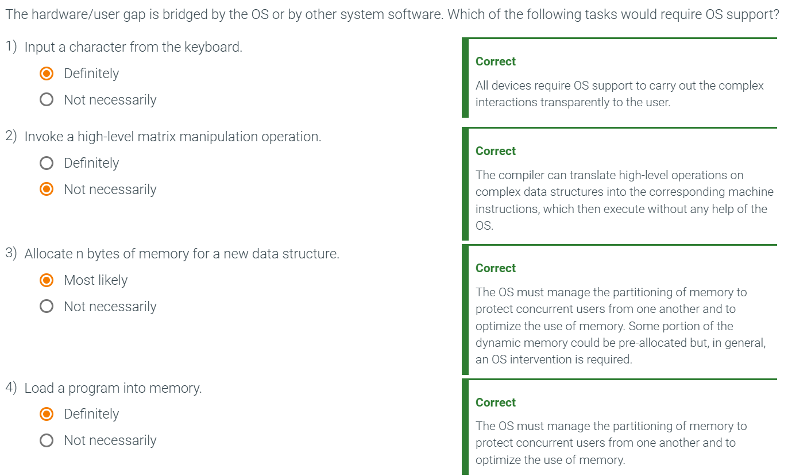  
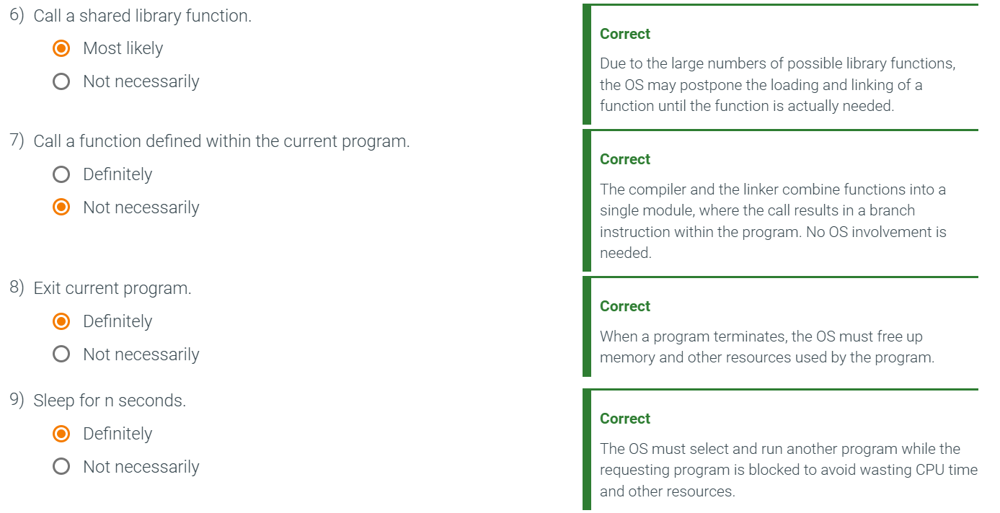  

**Abstraction** is the act of removing unimportant details or attributes of objects in order to construct more general and less complex objects

**Virtualization** is the act of creating the illusion of having one or more objects with more desirable characteristics than the real object. OSs rely on virtualization to create virtual CPUs, memory, I/O devices, and other system components that facilitate the work of programmers and users.

One of the main tasks of an OS is to optimize the use of all computational resources to ensure good overall performance  
and allowing safe communication among different tasks  
 
The overall performance of all applications can be improved by using *concurrency*. The OS strives to keep the CPU, main memory, and all storage and I/O devices busy at all times by overlapping independent operations whenever possible.  

**Multiprogramming** is a technique that keeps several programs active in memory and switches execution among the different programs to maximize the use of the CPU and other resources.  

**Time-sharing (multitasking)** is an extension of multiprogramming where the CPU is switched periodically among all active computations to guarantee acceptable response times to each user. Time-sharing employs the concept of *virtualization* by creating the illusion of having a separate virtual CPU for each computation.

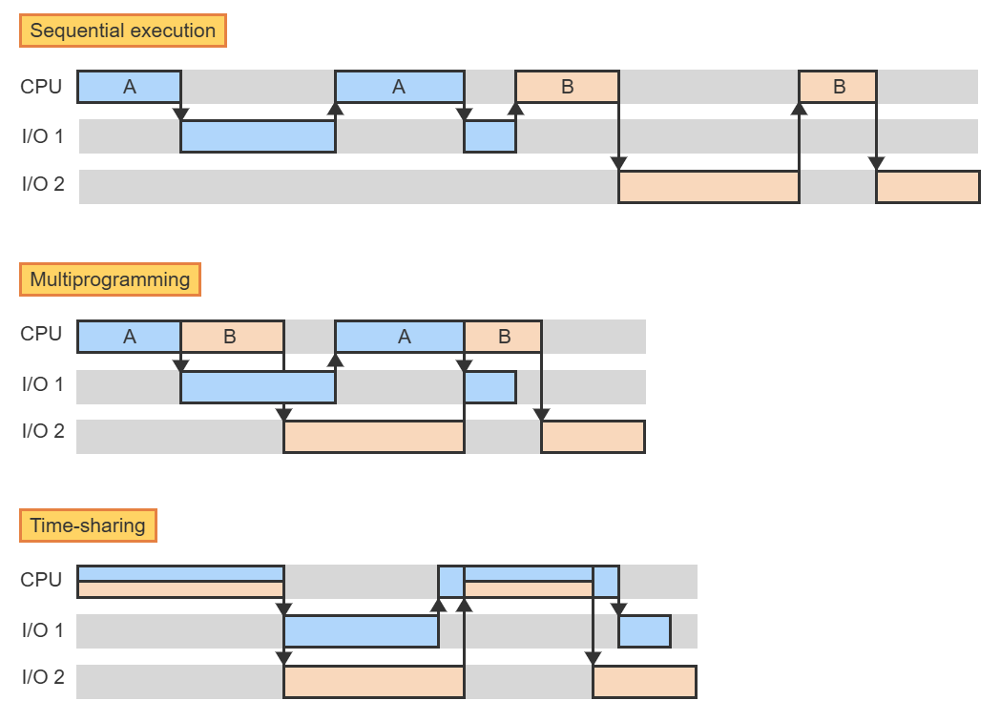  

For Time-sharing; The time interval during which a process runs is typically much shorter than the compute phase and thus the processes appear to run concurrently, albeit at half the speed.  

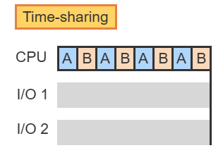  

The main objective of time-sharing is to improve resource utilization. **FALSE!**  

Resource utilization is improved by multiprogramming, which overlaps CPU-bound and I/O-bound computations. Time-sharing only switches the CPU among different computations to create the illusion of simultaneous execution, which generally does not improve resource utilization beyond simple multiprogramming.  

The use of time-sharing will guarantee reasonable response to each computation, 
no computation can monopolize the CPU indefinitely.  

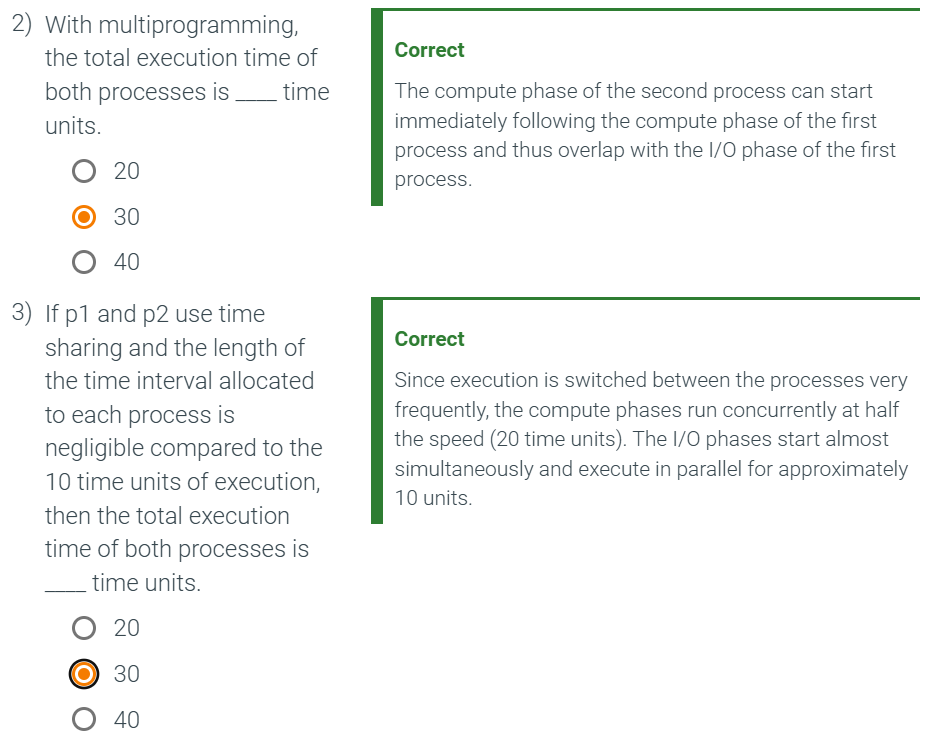  

## 1.2 The OS Structure  

The **kernel** of an OS is the minimal set of functions necessary to manage the system resources safely and efficiently.   
- Services for memory  
- Device management  
- communications among the concurrent activities  

To deal with issues of security, the instruction set provided by the CPU is divided into two sets: privileged and non-privileged.  
- A **privileged instruction** performs critical operations.  Only the OS kernel is allowed to execute privileged instructions.  
    - access I/O devices 
    - access the CPU's status and control registers  

To guarantee that no programs outside of the trusted kernel can use privileged instructions, the CPU operates in two different modes, indicated by a special mode bit.  
- **Kernel mode**: both privileged and non-privileged instructions are used.  
- **User mode**: only non-privilegedinstructions are used.  

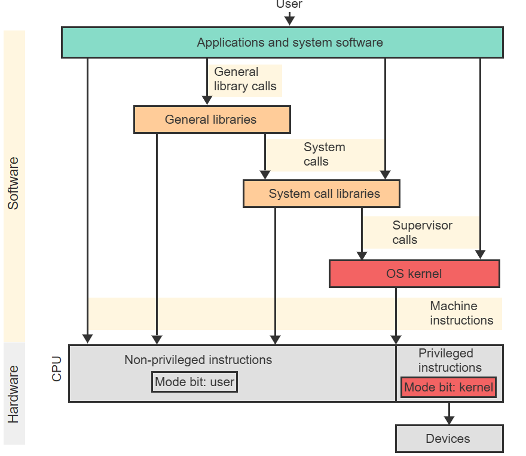  
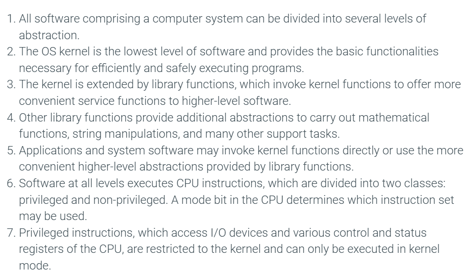  

A **system call** is a request from an application for an OS service.  
- It is a libarary function  


A **supervisor call (kernel call)** is a *privileged instruction* that automatically transfers execution control to a well-defined location within the OS kernel.
Thus supervisor calls provide the interface between the OS kernel and the higher-level software.  

A supervisor call is similar to a function call with two special features:  
- switch mode bit from user to kernel  
- Function is specified by an index into a branch vector. kernel-mode execution is limited to only well-defined entry points within the kernel.  

> A supervisor call can be executed by any program. Any program can make direct use of a kernel function by issuing the corresponding supervisor call.  

> Changing from user mode to kernel mode must be done in a controlled manner using a supervisor call instruction (privileged instruction).  

An **interrupt** is an event that diverts the current execution of a program to a predefined location in the kernel in order to respond to an event. An interrupt is triggered by a hardware signal sent to the CPU from an external device. 

The two most common uses of interrupts are as follows:
- Signal to the OS the completion of an I/O operation. The interrupt is generated by the I/O device.  
- Implement time-sharing by periodically switching the CPU among multiple concurrent computations. The interrupt is generated by a countdown timer.  

A **trap** (also called an internal interrupt) is an interrupt triggered by the currently executing instruction. 
- Divide by zero  
- invalid opcode  
- arithmetic overflow  

An interrupt, both external and internal, stops the execution of the current program, saves the state of the computation, and *transfers control to the kernel*.  

An **interrupt handler** is a kernel function, invoked whenever an interrupt occurs, that determines the cause of the interrupt and invokes the appropriate kernel function to provide the response.  


> An application is requesting an I/O operation from the OS, which consists of several steps:  
> Execute supervisor_call in user mode  
> Execute kernel function in kernel mode  
> Start the I/O device   
> Block the current application  
> Transfer execution to another application  
> Data transfer for the current application completes  
> An interrupt occurs  
> Transfer execution from another application back to the kernel in kernel mode  
> Handle the I/O completion in kernel mode  
> Transfer execution back to S() in user mode  
> Execute another supervisor_call in user mode to restart I/O and again block current application.  
> Resume the other application in user mode.  

## 1.3 The evolution and scope of OS  

Moore's law, formulated by the scientist Gordon Moore, is the observation that the number of transistors in an integrated circuit doubles about every two years.  

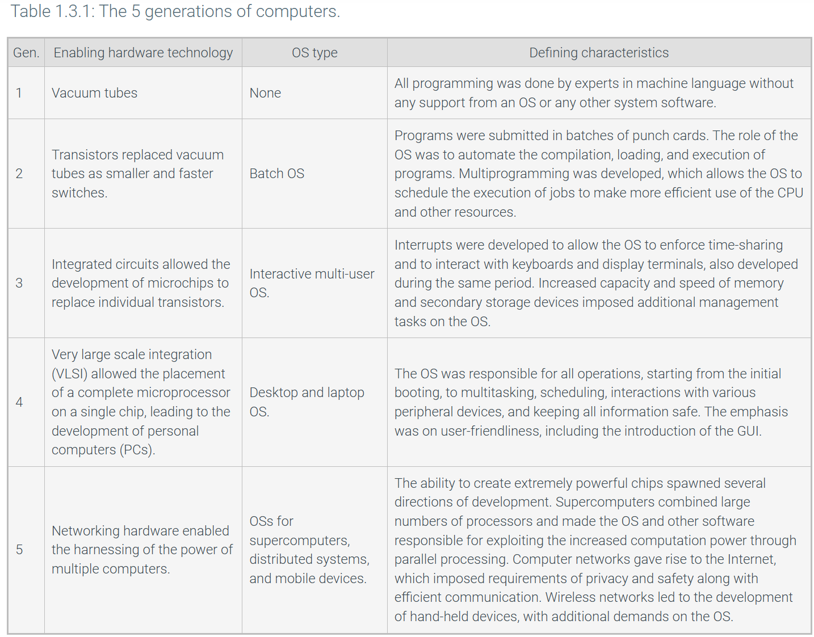  

OS applications:  
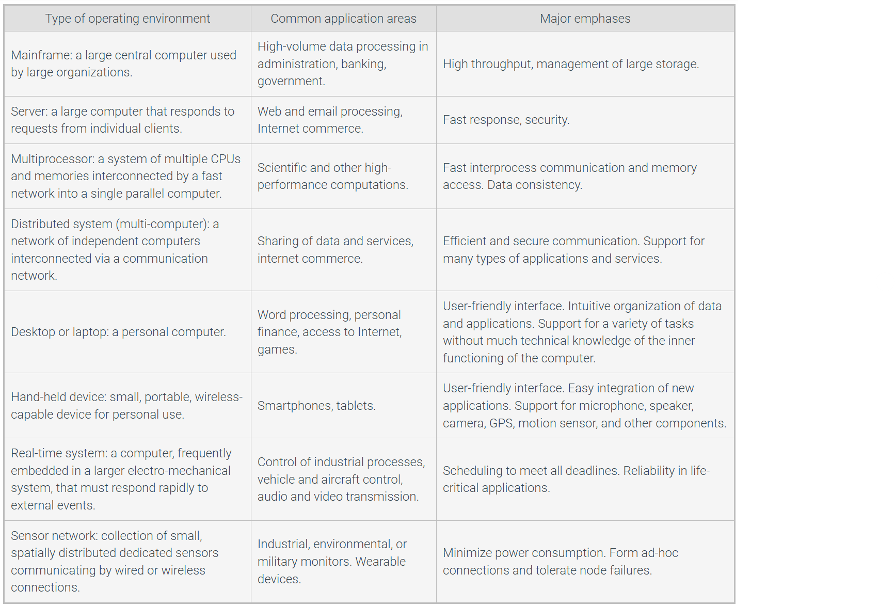  

> Mainframes are considered to be general-purpose computers  

> An advanced aircraft is likely to have a *real-time computer* on board to help control the aircraft  

> Select the typical defining characteristics associated with each OS type:  
> Interactive multi-user OS:  
> - Time-sharing  
> - Interrupts  
> - GUI  
> - Multiprogramming  
> OSs for supercomputers, distributed systems, and mobile devices  
> - Time sharing  
> - Parallel/distributed computing  
> - Interrupts  
> - GUI  
> - Multiprogramming  

## 1.4 Computer system organization  

A device controller maintains some local buffer storage and a set of special-purpose registers. The device controller is responsible for moving the data between the peripheral devices that it controls and its local buffer storage.  

Typically, operating systems have a **device driver** for each device controller. This device driver understands the device controller and provides the rest of the operating system with a uniform interface to the device.  

A memory controller synchronizes access to shared memory between the CPU and device controllers.  
 
How does the controller inform the device driver that it has finished its operation? This is accomplished via an interrupt.  

There is a table of pointers to interrupt routines. The table of pointers is stored in 
low memory (the first 100 or so locations). These locations hold the addresses to the interrupt 
service routines of various devices. This array, called **interrupt vector**  

 The purpose of a vectored interrupt mechanism is to reduce the need for a single interrupt handler to search all possible sources of interrupts to determine which one needs service. 

### How the (less sophistocated) interrupt mechanism works:  
- The CPU hardware has a wire called the **interrupt-request line**. This is checked after every execution.  
- A controller sends a signal     
- The CPU jumps to the **interrupt-handler routine** by using the interrupt number as an index into the interrupt vector.  
- CPU begins execution at the address associated with the index.  
- The interrupt handler saves any state that it will be changing.  
- Interrupt handler determines the cause of the interrupt  
- Interrupt handler performs the necessary processing  
- Interrupt handler restores original state  
- Interrupt handler executes `return_from_interrupt` instruction to CPU  

Device controllers **raise** an interrupt by asserting a signal on the request line  

The CPU **catches** the interrupt and **dispatches** it to the interrupt handler   

The handler **clears** the interrupt by servicing the device.  

Modern OS need a more sophistocated interrupt-handling:  
- Need the ability to defer interrupt handling during critical processing  
- Need an efficient way to dispatch to the proper interrupt handler for a device  
- Need multilevel interrupts, so that the OS can distinguish between high and low 
priority.  

The above features are provided by **interrupt-controller hardware**  

Most CPUs have two interrupt request lines:  
- **Nonmaskable interrupt**: events like unrecoverable memory errors.  
- **Maskable**: can be turned off by CPU before the execution of critical instructions.  
    - USed by device controllers to request service  
    
**interrupt chaining**, in which each element in the interrupt vector points to the head of a list of interrupt handlers.  
This structure is a compromise between the overhead of a huge interrupt table and the inefficiency of dispatching to a single interrupt handler.  

**interrupt priority levels**: These levels enable the CPU to defer the handling of low-priority interrupts without masking all interrupts and makes it possible for a high-priority interrupt to preempt the execution of a low-priority interrupt.  

The first program to run on computer power-on is a **bootstrap program**, which then loads the operating system  

erasable programmable read-only memory (EEPROM):
    - infrequently wirtten to  
    - Nonvolatile  
    - iPhone stores serial numbers and harware information here  

**Direct memory access** is a bus designed to load data from the peripherial directly to 
the volatile memory. This is so that the peripherial data does not have to travel 
to the CPU before being moved to Volatile memeory.  

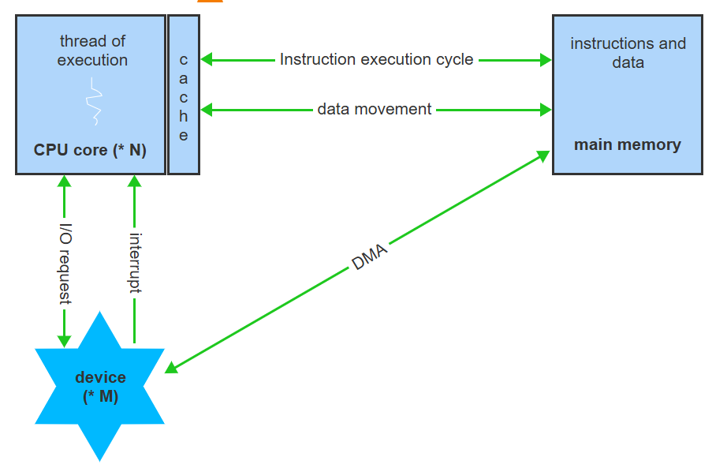  

**tertiary storage**: A type of storage that is slower and cheaper than main memory or secondary storage; frequently magnetic tape or optical disk.  

## 1.5 Computing Environments  

**application-specific integrated circuits (ASICs)** that perform their tasks without an operating system.

Embedded systems almost always run real-time operating systems.  

A real-time system has well-defined, fixed time constraints. Processing must be done within the defined constraints, or the system will fail. For instance, it would not do for a robot arm to be instructed to halt after it had smashed into the car it was building.  

**portals**: Gateways between requestors and services running on provider computers.  

## 1.6 Free and open-source operating systems  

**free operating system**: An operating system released under a license that makes its source code available and allows no-cost use, redistribution, and modification.  

**open-source operating system**: An operating system or other program available in source-code format rather than as compiled binary code.  

**Solaris**: A UNIX derivative that is the main operating system of Sun Microsystems (now owned by Oracle Corporation). There is an active open source version called Illumos.

**SunOS**: The predecessor of Solaris by Sun Microsystems Inc.  

**GNU General Public License (GPL)**: A license agreement that codifies copylefting (allowing and requiring open sourcing of the associated programs); a common license under which free software is released.

**GNU/Linux (aka Linux)**: An open-source operating system composed of components contributed by the GNU foundation and Linus Torvalds, as well as many others.  

Apple's macOS operating system comprises a hybrid approach. It contains an open-source kernel named Darwin but includes proprietary, closed-source components as well.  

Richard Stallman in 1984 started developing a free, UNIX-compatible operating system called GNU (which is a recursive acronym for "GNU's Not Unix!"). To Stallman, "free" refers to freedom of use, not price. The free-software movement does not object to trading a copy for an amount of money but holds that users are entitled to four certain freedoms:  
- Free to run the program  
- To study and change the source code, and give or sell copies of either  
- With charges  
- Or without charges  

In 1985, Stallman published the *GNU Manifesto*, which argues that all software should be free. He also formed the **Free Software Foundation (FSF)** with the goal of encouraging the use and development of free software.  

## 1.7 Benefits and features  

How to sharing resources/data on VMs:  
- First, it is possible to share a file-system volume and thus to share files. 
- Second, it is possible to define a network of virtual machines, each of which can send information over the virtual communications network.  

VMMs go one step further and allow copies and **snapshots** to be made of the guest. The copy can be used to create a new VM or to move a VM from one machine to another with its current state intact.   

**system-development time**: The time during which an operating system is developed, before it is made available in final "release" form.  

**templating**: In virtualization, using one standard virtual-machine image as a source for multiple virtual machines.  

**live migration**: In virtualization, the movement of a running guest between two separate physical hosts.  

## 1.8 Linux History  

**Development kernel**:  
- Kernels with an odd minor-version number, like 1.1 or 2.5 
- development kernels may include newer and relatively untested functionality  

**Production Kernels**:   
- even-numbered minor-version numbers are stable  
- Updates for the stable kernels are intended only as remedial versions  

Linux 2.0 was given a major version-number because:  
- supports multiple architectures  
- symmetric multiprocessing (SMP) support  
- memory-management code was substantially improved to provide a unified cache for file-system data independent of the caching of block devices  
    - incresed file-system and virtual-memory performance  
    
Red Hat: commercial Linux support  

Debian: free-software Linux community  

**Public domain** implies that the authors have waived copyright rights in the software, but copyright rights in Linux code are still held by the code's various authors.
- Linux is *not* public-domain  
- public domain: The total absence of copyright protection. Software in the public domain can be used as desired by anyone, with no limits.  

Linux is free software, however, in the sense that people can copy it, modify it, use it in any manner they want, and give away (or sell) their own copies.

# Operating-System Structures (Ch 2 Silbersachatz)  

## 2.2 Operating-system services  

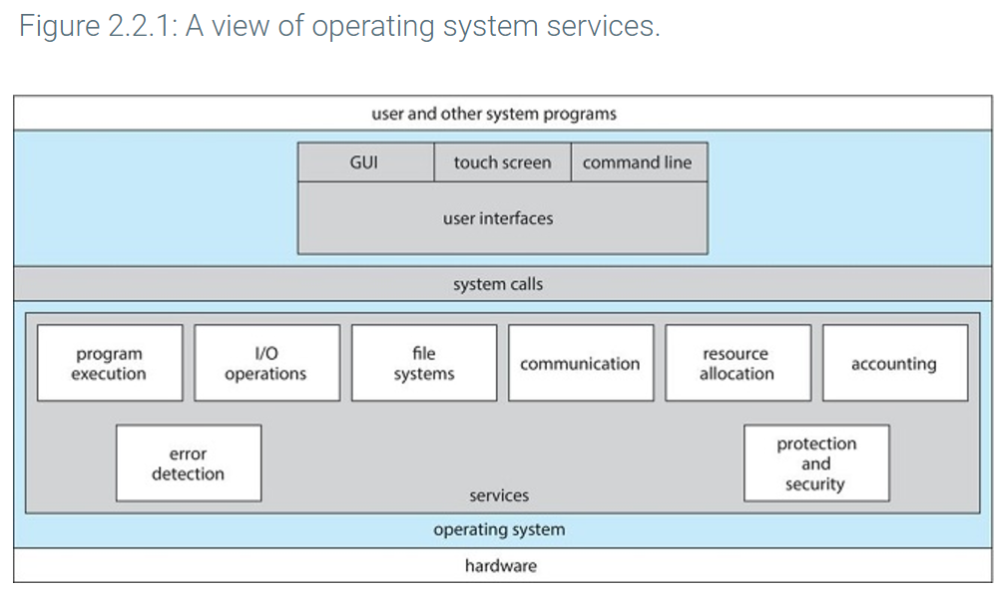  

Other operating-system functions that exist for ensuring efficient operation of the system:  
- Resource Allocation  
- Logging  
- Protection and Security  

**message passing**: In interprocess communication, a method of sharing data in which messages are sent and received by processes. Packets of information in predefined formats are moved between processes or between computers.  

## 2.3 User and operating-system interface  

Unix GUIs: K Desktop Environment (KDE) and GNOME  

## 2.4 System calls  

**System calls** provide an interface to the services made available by an operating system. These calls are generally available as functions written in C and C++  

The API specifies a set of functions that are available to an application programmer  
- Windows API for Windows systems  
- POSIX API for UNIX, Linux, macOS  
    - Written in C, in the library called **libc**  
- Java API for programs that run on the Java VM  

Why would an application programmer prefer programming according to an API rather than invoking actual system calls?  
- Program portability  
- Less complicated than a system call  

**run-time environment (RTE)**: The full suite of software needed to execute applications written in a given programming language, including its compilers, libraries, and loaders.  
The RTE provides **system-call interface** that serves as the link to system calls made available by the operating system.  

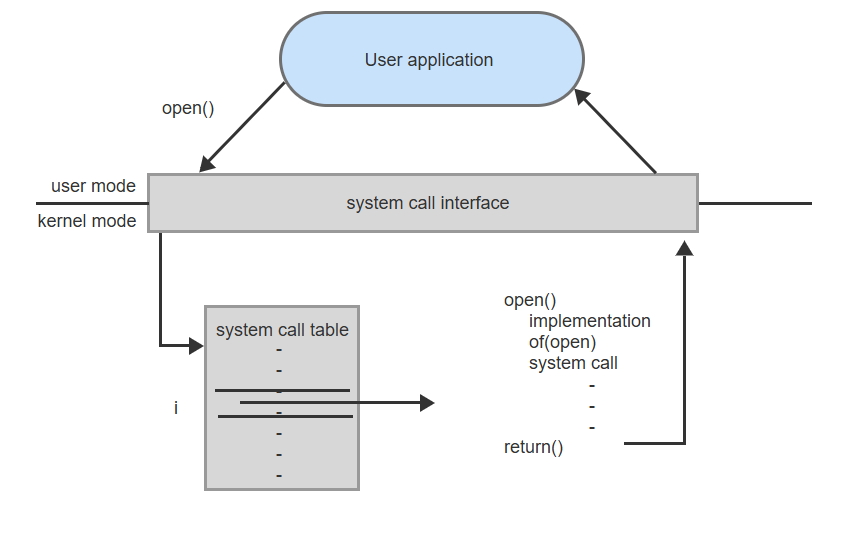  

Each system call has a number, and that number is used as an index in the system call table, to invoke the appropriate routine.  

Three general methods are used to pass parameters to the operating system:  
- Pass parameters in registers  
- Address of the block is passed as a parameter in a register, "*block method*"  
    - Parameters also can be placed, or pushed, onto a stack by the program and popped off the stack by the operating system.  
    - Some operating systems prefer the block or stack method because those approaches do not limit the number or length of parameters being passed.  
- Linux uses a combination of these approaches. If there are five or fewer parameters, registers are used. If there are more than five parameters, the block method is used.  

#### System call 6 categories:  
- Process control
    - create process, terminate process
    - load, execute
    - get process attributes, set process attributes
    - wait event, signal event
    - allocate and free memory
- File management
    - create file, delete file
    - open, close
    - read, write, reposition
    - get file attributes, set file attributes
- Device management
    - request device, release device
    - read, write, reposition
    - get device attributes, set device attributes
    - logically attach or detach devices
- Information maintenance
    - get time or date, set time or date
    - get system data, set system data
    - get process, file, or device attributes
    - set process, file, or device attributes
- Communications
    - create, delete communication connection
    - send, receive messages
    - transfer status information
    - attach or detach remote devices
- Protection
    - get file permissions
    - set file permissions

#### Process Control  

The dump is written to a special log file on disk and may be examined by a *debugger*—a system program designed to aid the programmer in finding and correcting errors, or bugs  

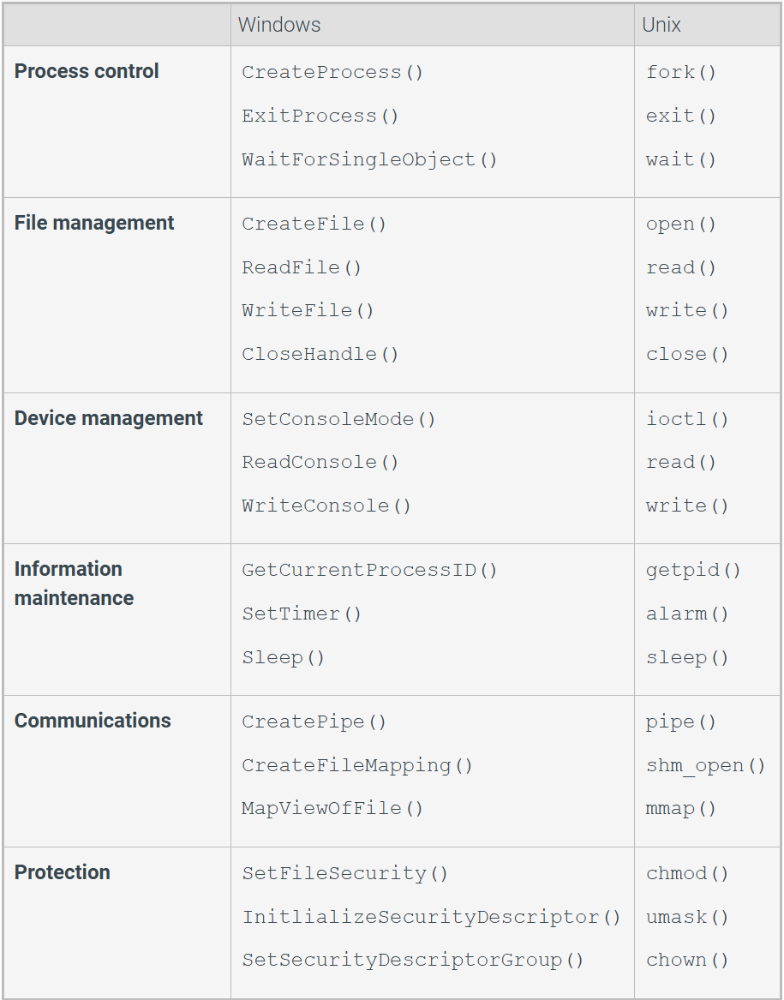  

To write a program for the Arduino, we first write the program on a PC and then upload the compiled program (known as a **sketch**) from the PC to the Arduino's flash memory via a USB connection. 

The standard Arduino platform does not provide an operating system; instead, a small piece of software known as a **boot loader** loads the sketch into a specific region in the Arduino's memory  

An Arduino is considered a *single-tasking system*, as only one sketch can be present in memory at a time  

#### Informatin Maintenance  

Many systems provide system calls to dump() memory. This provision is useful for debugging.  

Even microprocessors provide a CPU mode, known as **single step**, in which a trap is executed by the CPU after every instruction. The trap is usually caught by a debugger.  

#### Communication  

Two common models of interprocess communication:  
- **Message-passing model**: the communicating processes exchange messages with one another to transfer information.  
    - directly or indirectly through a common mailbox  
    - Most processes that will be receiving connections are special-purpose daemons  
- **Shared-memory model**: An interprocess communication method in which multiple processes share memory and use that memory for message passing.  

**daemon**: A service that is provided outside of the kernel by system programs that are loaded into memory at boot time and run continuously.  

## 2.5 System services  

**System services**, also known as **system utilities**, provide a convenient environment for program development and execution.  
- **File management**  
- **Status Information**  
    - Some programs simply ask the system for the date, time, amount of available memory or disk space, number of users, or similar status information.  
    - Some systems also support a **registry**, which is used to store and retrieve configuration information.
- **File modification**  
- **Programming-language support**: compilers, assemblers, debuggers, etc..   
- **Program loading and execution**  
- **Communications**  
- **Background Services**: 
    - Constantly running system-program processes are known as **services, subsystems, or daemons**.  

## 2.6 Resource Management  

An operating system is a resource manager.  

**program counter**: A CPU register indicating the main memory location of the next instruction to load and execute.  

A single-threaded process has one program counter specifying the next instruction to execute.  
A multithreaded process has multiple program counters, each pointing to the next instruction to execute for a given thread.  

**caching**: The use of temporary data storage areas to improve performance.  

**cache coherency**: The coordination of the contents of caches such that an update to a value stored in one cache is immediately reflected in all other caches that hold that value.  

**I/O subsystem**: The I/O devices and the part of the kernel that manages I/O.  

A program in execution is a *process*.  
- Operating system processes  
	- Creating and deleting both user and system processes  
	- Scheduling processes and threads on the CPUs  
	- Suspending and resuming processes  
	- Providing mechanisms for process synchronization  
	- Providing mechanisms for process communication    
- User processes    

A process is the *unit of work* in a system. 

A program is a **passive entity**, like the contents of a file stored on disk, whereas a process is an **active entity**.  

#### Memory Management  
The CPU reads instructions from main memory during the *instruction-fetch cycle*.    
The CPU reads and writes data from main memory during the *data-fetch cycle*.  

The operating system is responsible for the following activities in connection with memory management:  
- Keeping track of which parts of memory are currently being used and which process is using them
- Allocating and deallocating memory space as needed
- Deciding which processes (or parts of processes) and data to move into and out of memory  

#### File System Management  
The operating system is responsible for the following activities in connection with file management:  
- Creating and deleting files
- Creating and deleting directories to organize files
- Supporting primitives for manipulating files and directories
- Mapping files onto mass storage
- Backing up files on stable (nonvolatile) storage media  

#### Mass-storage management  

The operating system is responsible for the following activities in connection with secondary storage management:  
- Mounting and unmounting
- Free-space management
- Storage allocation
- Disk scheduling
- Partitioning
- Protection  

Some operating systems take on this task, while others leave tertiary-storage management to application programs.  

Data transfer from cache to CPU and registers is usually a hardware function, with no operating-system intervention. In contrast, transfer of data from disk to memory is usually controlled by the operating system.  

#### Cache management   

Loading a variable: magnetic disk =\> main memory =\> cache =\> hardware register  
 
#### I/O system management  

The **I/O subsystem** hides the peculiarities of the I/O devices from the OS.  
Only the device driver knows the peculiarities of the specific device to which it is assigned.  

The I/O subsystem consists of several components:  
- A memory-management component that includes buffering, caching, and spooling
- A general device-driver interface
- Drivers for specific hardware devices

Two important design issues for cache memory: 
- Size  
- replacement policy  

The size of cache memory is small and because of this limitation, the replacement policy for managing data is crucial to gaining the most benefit from cache memory.  

# 3 Processes, Threads, and Resources  

## 3.1 The process concept  

The OS is a collection of processes  

The OS keeps track of each process using a **process control block (PCB)**: A data structure that holds information for a process, including the current instruction address, the execution stack, the set of resources used by the process, and the program being executed. The PCB is the concrete representation of a process.  

Two processes can be executing the same program.  

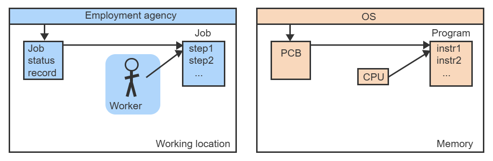  

A process has the states of *ready, running*, and *blocked*.  

The transition (running -\> blocked) of a process p is caused by the process itself.  

The transition (ready -\> running) of a process p is caused by the OS.  

The transition (running -\> ready) of a process p is caused by the OS.  

The transition (blocked -> ready) of a process p is caused by some other process.  

Additional States:  
- A newly created process is placed into the **new state** before the process is allowed to compete for the CPU. Ex: The OS may want to regulate the number of processes competing for the CPU.  
- A process is placed into the **terminated state** when execution can no longer continue but before the PCB is deleted. Ex: The OS may want to examine the final state of a process that committed a fatal error.  
- A process may be placed into the **suspended state** even though the CPU and all resources are available. Ex: The OS may want to stop a process to allow debugging or to regulate performance.  

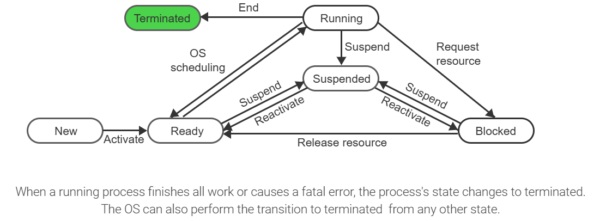  

The transition of a process p from running to terminated can be caused by p itself.  

From the suspended state, the process can only be restored to the ready or blocked states.  

The CPU is always running one process at a time. Multiple processes can share a single CPU by taking turns. A **context switch** is the transfer of control from one process to another.
The information that needs to be saved during the context switch is called **CPU state**.   
The CPU state is stored in the PCB during an interrupt.  
A context switch is either caused by the OS or the process, nothing else.  

Running -\> Ready: OS Scheduler  

Blocked -\> Ready: Resource Release  

Suspend -\> Ready: Reactive    

Suspend -\> Blocked: Reactive  

## 3.2 Why processes  

Multiple processes may run on one physical CPU using a technique known as time sharing. Each process is given a **virtual CPU**: A CPU that the process assumes is available only to itself.

A virtual CPU can be just an abstraction of the physical CPU or it can be software that emulates the behavior of a different CPU.  

Benefits of virtual CPUs:  
- **Multi-user support**: Multiple users, each represented by one or more separate processes, can share the same machine without being aware of each other.  
- **Multi-CPU transparency**: An application written to utilize multiple CPUs will run correctly, although perhaps more slowly, if only one CPU is available.  
- **Portability**: An application compiled for one type of CPU can run on a different CPU without being modified or even recompiled.    

## 3.3 The process control block  

The PCB is the instantiation of a process. Upon creation, the OS assigns every process a unique identifier. This identifier, p, could be a pointer to the PCB structure or an index into an array of PCBs.  

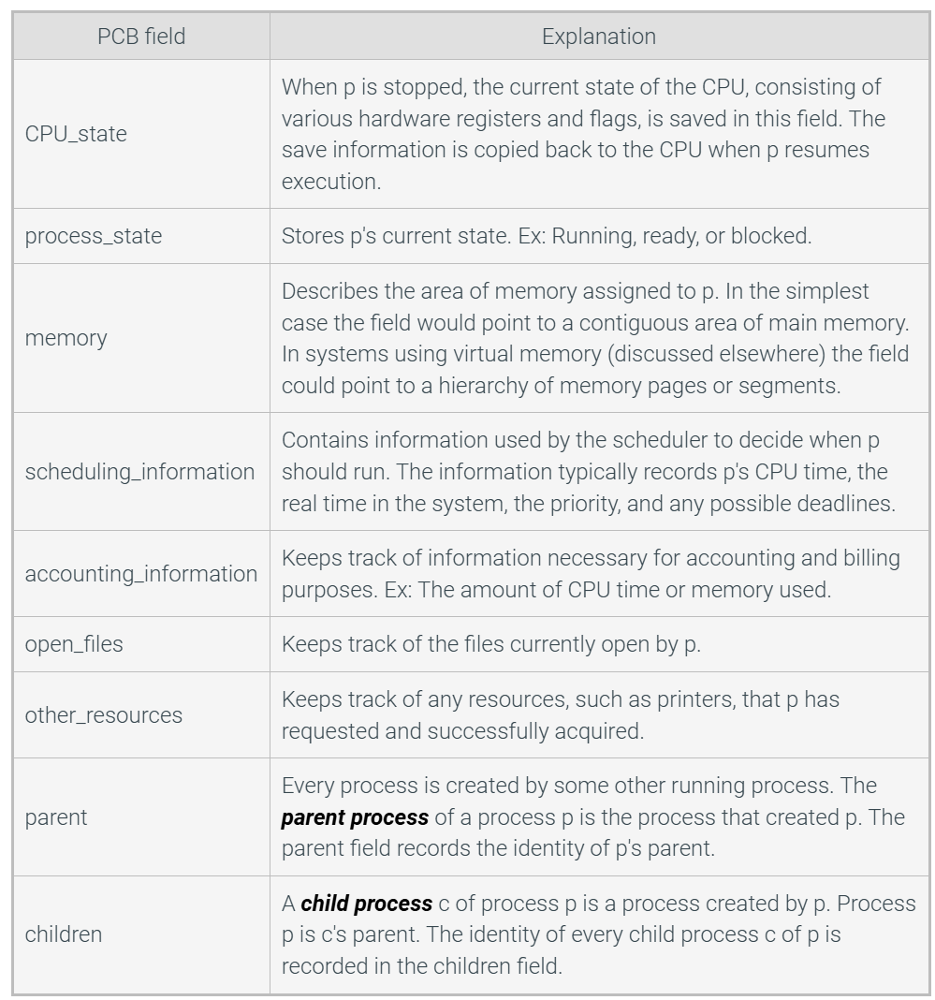  

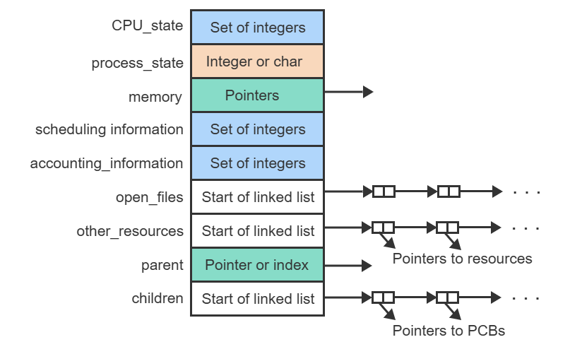  

- The process_state encodes the possible states, such as ready, running, or blocked, using most likely integers or characters.  
- The memory field contains one or more pointers (memory address) and the parent field designates the parent process using a pointer or array index.  
- The open_files field is a pointer to a linked list of open files where each list element points to one open file.  
- The remaining two fields are also pointers to linked lists. One is the list of other resources held by the process and the other is a list of child processes.    

Two ways exist to organize all PCBs:
- An *array of structures*. The PCBs are marked as free or allocated, which eliminates the need for any dynamic memory management. The main drawback is a lot of wasted memory space to maintain a sufficient number of PCB slots.  
- An *array of pointers* to dynamically allocated PCBs. The pointer array wastes little space and can be made much larger than the array of structures. The drawback is the overhead of dynamic memory management to allocate each new PCB and to free the memory when the process terminates.  

Avoiding Linked Lists: Linux OS avoids linked lists by only having a pointer from the 
parent to the first child. Then all other children have pointers to the younger and older 
children.  

The list-free implementation has the fields parent, child, older sibling, and younger sibling.  
The main reason for the list-free implementation was to improve time-efficiency  
Adding a new child process with the list-free implementation uses the same amount of memory as the linked-list implementation.  

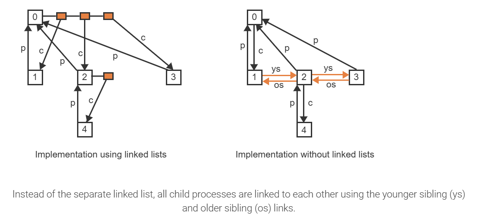  

The OS maintains all PCBs organized on various lists:  
- **Waiting list** is associated with every resource and contains all processes blocked on that resource because the resource is not available.  
- **Ready list (RL)**: A list containing all processes that are in the ready state
    - maintains all processes sorted by their importance usning an integer called the *priority*  
    
## 3.4 Operations on processes  

A **process creation hierarchy** is a graphical representation of the dynamically changing parent-child relationships among all processes. The process creation hierarchy changes each time a process is created or destroyed.  

What would be the most likely outcome if a process called destroy(self)?  
The process woule *crash*. The destroy function is executing as part of the current process. Releasing all memory, resources, PCB, and closing all files would prevent the process from completing the entire destroy function.  

## 3.5 Resources  

**Resource control block (RCB)** is a data structure that represents a resource.
- resource_description  
- state  
- waiting_list  

A resource is **allocated** to a process if the process has access to and is able to utilize the resource. A resource is **free** if the resource may be allocated to a requesting process.  

Functions:  
- Request a resource  
- Release a resource  
- Scheduler:  determines which process should run next and starts the process.  
  
## 3.6 Threads  

A **thread** is an instance of executing a portion of a program within a process without incurring the overhead of creating and managing separate PCBs.

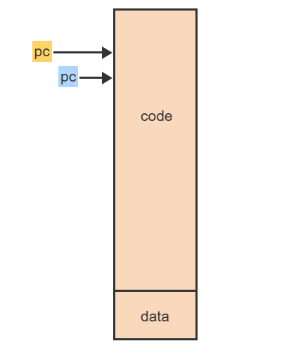  

- A process with multiple threads has a separate *program counter* (pc) for each thread.
- The different pc's advance through the code independently from one another as each thread executes a different sequence of instructions within the same code.
- When multiple CPUs are available, the threads can proceed in parallel.

Since each thread within a process is an independent execution activity, the runtime information held in the PCB and the execution stack must be replicated for each thread. A **thread control block (TCB)** is a data structure that holds a separate copy of the dynamically changing information necessary for a thread to execute independently.
The replication of only the bare minimum of information in each TCB, while sharing the same code, global data, resources, and open files, is what makes threads much more efficient to manage than processes.  

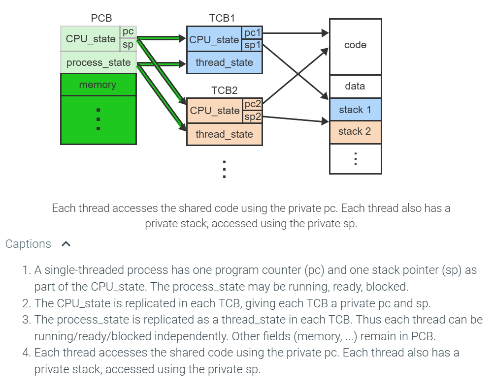  

User Level vs Kernel level threads  

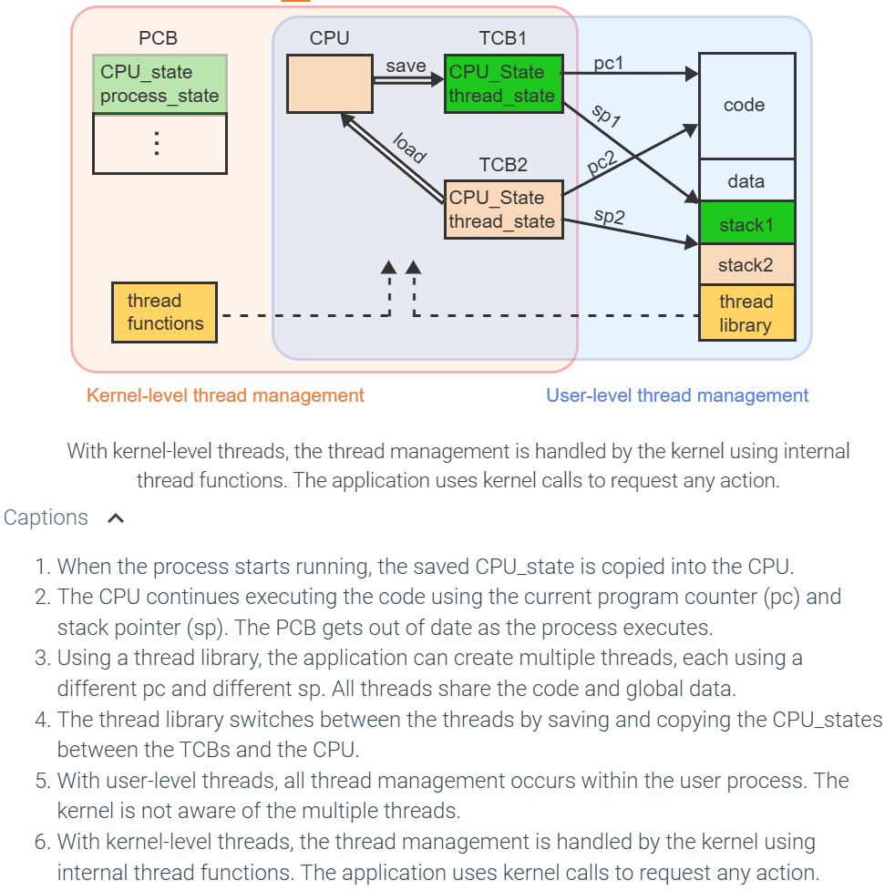  

> With a multi-threaded process, each TCB maintains a separate copy of the thread state (running, ready, or blocked) but the PCB must also have a copy of the process state (running, ready, or blocked).  
> **Only with user-level threads**  
> The kernel is aware of only the PCB, not the individual TCBs, and thus can only keep track of the process state as a whole in the PCB. The individual thread states are manipulated by the thread library independently of the process state.  

#### Advantages of user-level threads (ULTs) over kernel-level threads (KLTs):  
- Because ULTs do not require any cooperation from the kernel, ULTs are much faster to manage (create, destroy, and schedule) and thus many more can be created than KLTs.  
- Applications using ULTs are portable between different OSs without modifications.  

#### Main disadvantages of ULTs over KLTs:    
- ULTs are not visible to the kernel. When one ULT blocks, the entire process blocks, which decreases concurrency and thus the performance and responsiveness of the application.
- *ULTs cannot take advantage of multiple CPUs because the process is perceived by the kernel as a single thread of execution.*

Combining User Level Threads and Kernel Level Threads:  

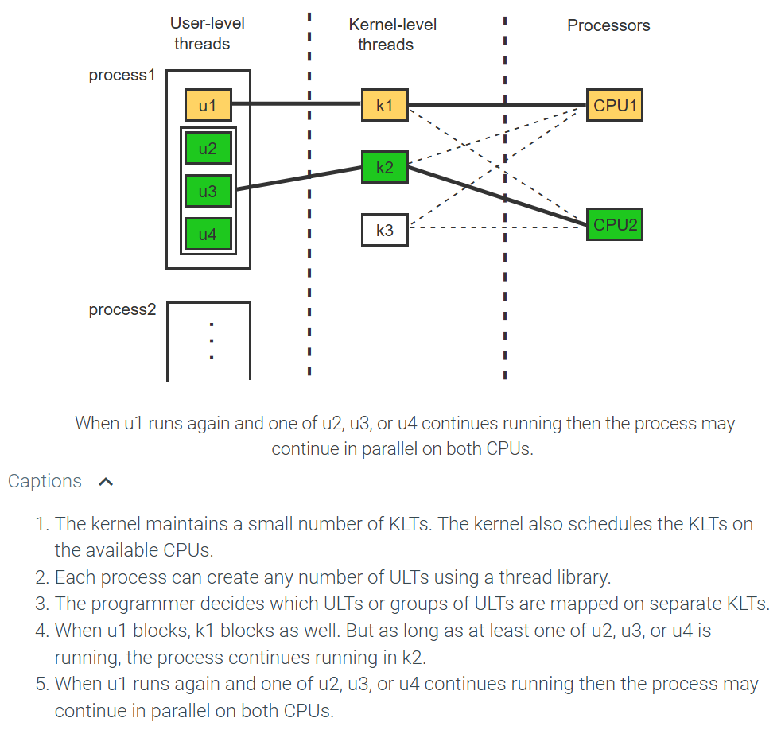  

## 3.7 Interprocess communication  

A process is **independent** if it does not share data with any other processes executing in the system.  
A process is **cooperating** if it can affect or be affected by the other processes executing in the system.  

Resons for cooperation:  
- Information sharing   
- Computation speedup  
- Modularity  

Cooperating processes require an **interprocess communication (IPC)** mechanism that will allow them to exchange data  
- **Shared memory** (a)    
- **Message passing** (b)   

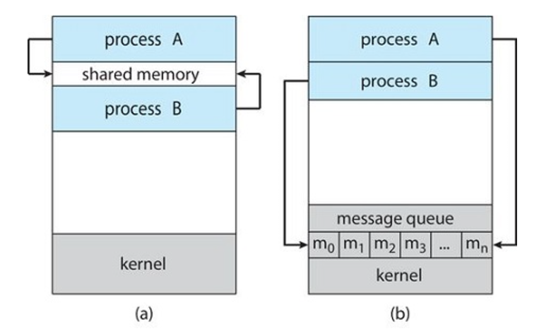  

## 3.8 IPC in shared-memory systems  

Buffers for a producer-consumer model:  
- **Unbounded buffer**: places no practical limit on the size of the buffer    
- **Bounded buffer**:  assumes a fixed buffer size. In this case, the consumer must wait if the buffer is empty, and the producer must wait if the buffer is full.  

> What is the valid test for determining if the bounded buffer is empty?  
> (in == out)  
>  "in" points to the next free position in the buffer and "out" points to the first full position in the buffer. Therefore, if the value of "out" is equal to "in", the buffer is empty.  

## 3.9 IPC in message-passing systems  

Message passing provides a mechanism to allow processes to communicate and to synchronize their actions without sharing the same address space. It is particularly useful in a distributed environment, *where the communicating processes may reside on different computers connected by a network*.  

Message variable sizes:  
- Fixed-size: System-level implementation is straightforward, programming is more difficult.  
- Variable-size: complex system-level implementation, programming is simpler.  

Logically implementing a **communication link** and the send()/receive() operations:  
- Direct or indirect communication  
- Synchronous or asynchronous communication  
- Automatic or explicit buffering  

#### Naming  

**direct communication**: each process that wants to communicate must explicitly name the recipient or sender of the communication.  
- A link is established automatically between every pair of processes that want to communicate. The processes need to know only each other's identity to communicate.  
- A link is associated with *exactly two processes*.  
- Between each pair of processes, there exists exactly one link.  

Think of direct communication as *hard-coding* because the identifiers must be stated.  

**indirect communication**: the messages are sent to and received from mailboxes, or ports.  
- A link is established between a pair of processes only if both members of the pair have a shared mailbox.  
- A link may be associated with *more than two processes*.  
- Between each pair of communicating processes, a number of different links may exist, with each link corresponding to one mailbox.  

The process that creates a new mailbox is that mailbox's owner by default.  

#### Synchronization  

Message passing may be either **blocking** or **nonblocking**—also known as **synchronous** and **asynchronous**.
- Blocking send. The sending process is blocked until the message is received by the receiving process or by the mailbox.  
- Nonblocking send. The sending process sends the message and resumes operation.  
- Blocking receive. The receiver blocks until a message is available.  
- Nonblocking receive. The receiver retrieves either a valid message or a null.  

**Rendezvous**: In interprocess communication, when blocking mode is used, the meeting point at which a send is picked up by a receive.  

**Synchronous**: In interprocess communication, a mode of communication in which the sending process is blocked until the message is received by the receiving process or by a mailbox and the receiver blocks until a message is available. In I/O, a request that does not return until the I/O completes.

**Asynchronous**: In I/O, a request that executes while the caller continues execution.  

#### Buffering  

Whether communication is direct or indirect, messages exchanged by communicating processes reside in a temporary queue. Basically, such queues can be implemented in three ways:  
- **Zero Capacity**: Queue has a maximum length of zero; thus the link cannot have a message 
waiting in it. The sender must block until the recipient recieves the message.  
- **Bounded capacity**: The queue has finite length *n*; thus, at most *n* messages can reside in it. If the queue is not full when a new message is sent, the message is placed in the queue (either the message is copied or a pointer to the message is kept), and the sender can continue execution without waiting. The link's capacity is finite, however. If the link is full, the sender must block until space is available in the queue.  
- **Unbounded capacity**: The queue's length is potentially infinite; thus, any number of messages can wait in it. The sender never blocks.  

A blocking send() and blocking receive() is known as a *rendezvous*.  
A rendezvous has occurred between communicating processes when a blocking send() and receive() are being used: after sending the message, the sender is blocked until the receiver receives the message and the receiver is blocked until the message is sent.  

## 3.10 Examples of IPC systems  

Four different IPC systems

#### POSIX shared memory  

Several IPC mechanisms are available for POSIX systems, including shared memory and message passing. Here, we explore the POSIX API for shared memory.  

POSIX shared memory is organized using memory-mapped files, which associate the region of shared memory with a file.  

#### Mach message passing  

Message passing  

Mach was especially designed for distributed systems, but was shown to be suitable for desktop and mobile systems as well, as evidenced by its inclusion in the MacOS and iOS operating systems  

The Mach kernel supports the creation and destruction of multiple **tasks**, which are similar to processes but have multiple threads of control and fewer associated resources.  

Messages are sent to, and received from, mailboxes, which are called **ports** in Mach.

Ports are finite in size and unidirectional;  

A **simple message** contains ordinary, unstructured user data that are not interpreted by the kernel.  
A **complex message** may contain pointers to memory locations containing data (known as "out-of-line" data) or may also be used for transferring port rights to another task.  
 
- If a port's queue is full:    
- Wait indefinitely until there is room in the queue.  
- Wait at most *n* milliseconds.  
- Do not wait at all but rather return immediately.  
- Temporarily cache a message.  

#### Windows  

Employs modularity to increase functionality and decrease the time needed to implement new features.  

Windows provides support for multiple operating environments, or **subsystems**. 
Application programs communicate with these subsystems via a message-passing mechanism.  

The message-passing facility in Windows is called the **advanced local procedure call (ALPC)** facility.
Used for communication between two processes on the same machine.  

RPC: Remote Procedure Call  

Windows uses a port object to establish and maintain a connection between two processes. Windows uses two types of ports: 
- **connection ports**  
- **communication ports**  

When an ALPC channel is created, one of three message-passing techniques is chosen:  
- For *small messages* (up to 256 bytes), the port's message queue is used as intermediate storage, and the messages are copied from one process to the other.  
- *Larger messages* must be passed through a section object, which is a region of shared memory associated with the channel.  
- When the amount of data is *too large* to fit into a section object, an API is available that allows server processes to read and write directly into the address space of a client.  

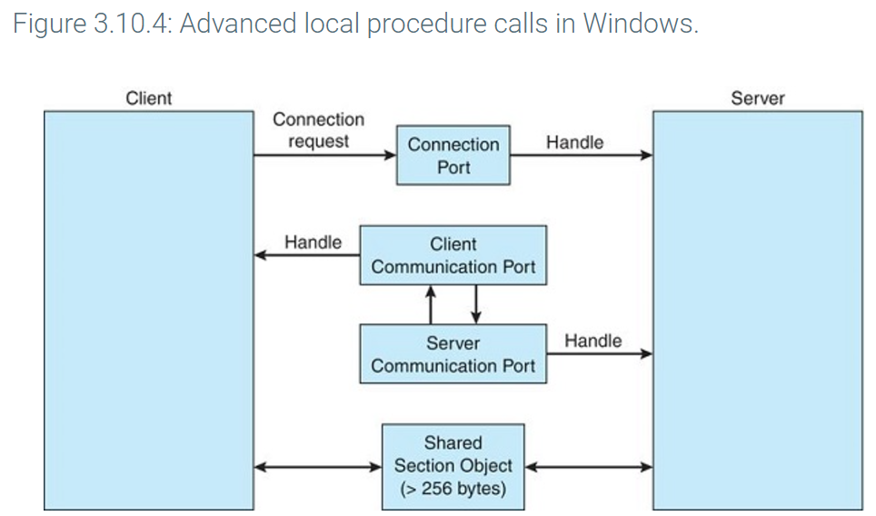  

It is important to note that the ALPC facility in Windows is not part of the Windows API and hence is not visible to the application programmer.  

#### Pipes  

A **pipe** acts as a conduit allowing two processes to communicate. Pipes were one of the first IPC mechanisms in early UNIX systems.  

Considerations with Pipe:  
1. Does the pipe allow bidirectional communication, or is communication unidirectional?  
2. If two-way communication is allowed, is it half duplex (data can travel only one way at a time) or full duplex (data can travel in both directions at the same time)?  
3. Must a relationship (such as parent-child) exist between the communicating processes?  
4. Can the pipes communicate over a network, or must the communicating processes reside on the same machine?  

##### Ordinary Pipes  

Ordinary pipes allow two processes to communicate in standard producer-consumer fashion: the producer writes to one end of the pipe (the write end) and the consumer reads from the other end (the read end).  
- Unidirectional, only allowing one-way communication.  
- If two way communication is required, a second pipe is established  
- Can only be used on the same machine    
- once the processes have finished communicating and have terminated, the ordinary pipe ceases to exist.  

Ordinary pipes on Windows systems are termed anonymous pipes  

##### Named Pipes  

Communication can be *bidirectional*, and *no parent-child relationship* is required. 
Once a named pipe is established, *several processes can use it* for communication.  
Exists until explicitly deleted.  
FIFO.  
UNIX named pipes are half-duplex.  
Windows named pipes are full-duplex.  
Windows communication can reside on different machines.  
  
## 3.11 Mulitcore programming  

**multicore**: Multiple processing cores within the same CPU chip or within a single system.

**data parallelism**: A computing method that distributes subsets of the same data across multiple cores and performs the same operation on each core.

**task parallelism**: A computing method that distributes tasks (threads) across multiple computing cores, with each task is performing a unique operation.

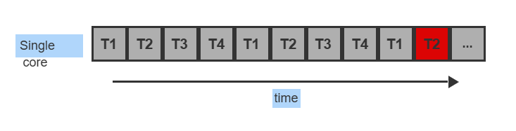  

**Concurrency** means all threads make progress on a single-core system as each thread gets to run for a short period of time on the single processing core.  

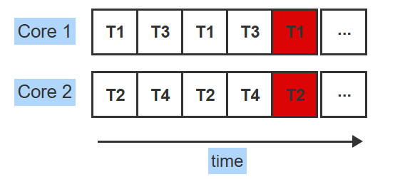  

**Parallelism** allows two threads to run at the same time as each thread runs on a separate processing core​.  

It is possible to have concurrency without parallelism.  

Five areas present challenges in programming for multicore systems:  
- Identifying tasks  
- Balance  
- Data splitting  
- Data dependency  
- Testing and debugging  

**Amdahl's Law** is a formula that identifies potential performance gains from adding additional computing cores to an application that has both serial (nonparallel) and parallel components.  

***S*** is the portion of the application that must be performed serially on a system.  
***N*** is the number of processing cores.  

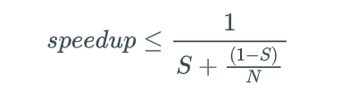  

> According to Amdahl's Law, what is the maximum speedup gain on a system with 4 processing cores for an application that is 20% serial?  
> *2.50*  
> On a system with four processing cores, there is a speedup of up to 250% going from 1 to 4 processing cores. (S=0.2, N=4)  

One interesting fact about Amdahl's Law is that as ***N*** approaches infinity, the speedup converges to ***1/S***.  

### Types of Parallelism  

**Data parallelism** focuses on distributing subsets of the same data across multiple computing cores and performing the same operation on each core.  
 
**Task parallelism** involves distributing not data but tasks (threads) across multiple computing cores.   

## 3.12 Multithreading models  

Relationship models between user threads and kernel threads:

### Many-to-one:

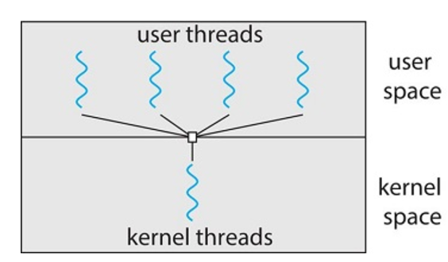  

- Thread management is done by the thread library in user space  
- The entire process will block if a thread makes a blocking system call  
- Multiple threads are *unable* to run in parallel on multicore systems  

Green threads—a thread library available for Solaris systems and adopted in early versions of Java—used the many-to-one model.  

### One-to-one:  

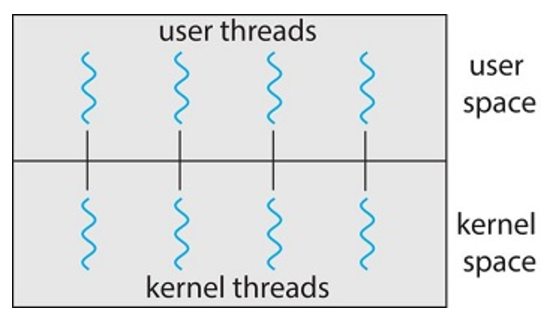  

Maps each user thread to a kernel thread  

The only drawback to this model is that creating a user thread requires creating the corresponding kernel thread, and a large number of kernel threads may burden the performance of a system.  

### Many-to-many  

Multiplexes many user-level threads to a smaller or equal number of kernel threads.  

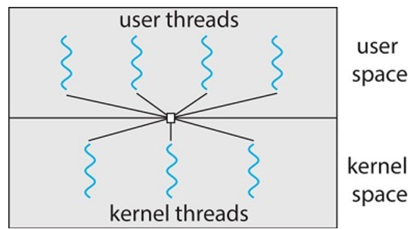  

Developers can create as many user threads as necessary, and the corresponding kernel threads can run in parallel on a multiprocessor.  

When a thread performs a blocking system call, the kernel can schedule another thread for execution.  

#### Two-level model  

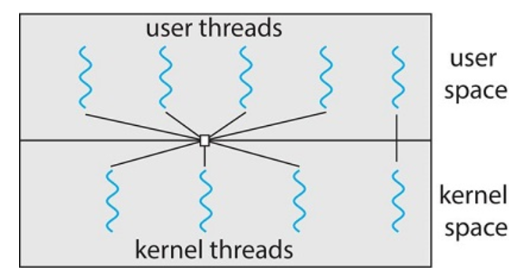  

**Two-level model** is a variation of the many-to-many model still multiplexes many user-level 
threads to a smaller or equal number of kernel threads but also allows a user-level thread 
to be bound to a kernel thread.  

Difficult to implement  

## 3.13 Threading issues  

### The fork() and exec() system calls  

If one thread in a program calls fork(), does the new process duplicate all threads, or is the new process single-threaded?  

fork() system call is used to create a separate, duplicate process.  

### Signal handling  

A signal is used in UNIX systems to notify a process that a particular event has occurred.  

Examples of synchronous signals include illegal memory access and division by 0.   

When a signal is generated by an event external to a running process, that process receives the signal asynchronously. Examples of such signals include terminating a process with specific keystrokes (such as <control><C>) and having a timer expire.   

Every signal has a default signal handler that the kernel runs when handling that signal.  

This default action can be overridden by a user-defined signal handler   

Where to deliver the signal in a multithreaded program?  
- Deliver the signal to the thread to which the signal applies.  
- Deliver the signal to every thread in the process.  
- Deliver the signal to certain threads in the process.  
- Assign a specific thread to receive all signals for the process.  

Although Windows does not explicitly provide support for signals, it allows us to emulate them using **asynchronous procedure calls (APCs)**. The APC facility enables a user thread to specify a function that is to be called when the user thread receives notification of a particular event.


### Thread Cancellation  

**Thread cancellation** involves terminating a thread before it has completed.  
A thread that is to be canceled is often referred to as the **target thread**.  

- **Asynchronous cancellation**: One thread immediately terminates the target thread.  
- **Deferred cancellation**: The target thread periodically checks whether it should terminate, allowing it an opportunity to terminate itself in an orderly fashion.  

The default cancellation type is deferred cancellation. However, cancellation occurs only when a thread reaches a **cancellation point**.  

**Cleanup Handler**: This function allows any resources a thread may have acquired to be released before the thread is terminated.  

### Thread-local storage  

**Thread-local storage**: (TLS) a thread has its own copy of certain data.  

### Scheduler activations  

communication between the kernel and the thread library  

**lightweight process (LWP)**: A virtual processor-like data structure allowing a user thread to map to a kernel thread.  

**scheduler activation**: A threading method in which the kernel provides an application with a set of LWPs, and the application can schedule user threads onto an available virtual processor and receive upcalls from the kernel to be informed of certain events.

**upcall**: A threading method in which the kernel sends a signal to a process thread to communicate an event.  


> Cancellation points are associated with *defeered* cancellation.  
> Deferred cancellation allows a target thread to use a cancellation point to determine if the thread should cancel itself.  

> Thread-local storage is *data that is unique to each thread*  
> Thread-local storage allows a thread to have data that is not accessible to other threads belonging to the same process.  

# 4 Scheduling  

## 4.1 Principles of scheduling  

**Long-term scheduling** decides when a process should *enter the ready state* and start competing for the CPU.  
- New process  
- Suspended list  

**Short-term scheduling** decides which of the ready processes should *run next on the CPU*.  
- Wait list  
- CPU  

### Preemptive and non-preemptive scheduling  

A **non-preemptive scheduling** algorithm allows a running process to continue until the process terminates or blocks on a resource.  

A **preemptive scheduling** algorithm may stop the currently running process and choose another process to run. The decision is made whenever:  
- A new process enters the ready list.  
- A previously blocked or suspended process re-enters the RL.  
- The OS periodically interrupts the currently running process to give other processes a chance to run.  

### Priority for short-term scheduling  

The **arbitration rule** decides which process should proceed if two or more processes have the same priority.  

**Common parameters used to compute short-term priority**  

| Parameter |	Explanation |  
| :-- | :-- |
| Arrival | The point in time when the process enters the RL. |  
| Departure | The point in time when the process leaves the RL by entering the blocked or suspended state, or by terminating all work. |  
| Attained CPU time | The amount of CPU time used by the process since arrival. |  
| Real time in system | The amount of actual time the process has spent in the system since arrival. |  
| Total CPU time | The amount of CPU time the process will consume between arrival and departure. For short-term scheduling, total CPU time is sometimes called the CPU burst. |  
| External priority | A numeric priority value assigned to the process explicitly at the time of creation. |  
| Deadline | A point in time by which the work of the process must be completed. |  
| Period | A time interval during which a periodically repeating computation must be completed. The end of each period is the implicit deadline for the current computation. |  
| Other considerations | The resource requirements of a process, such as the amount of memory used, or the current load on the system. |  

> For a process in the ready state, the real time in the system keeps increasing.  

### Priority for long-term scheduling  

Long-term scheduling occurs much less frequently than short-term scheduling and thus the decisions are made at a higher granularity of time.  
- Arrival is the time of process creation.
- Departure is the time of process destruction.  

## 4.2 Shceduling of batch processes  
 
A **batch process** performs a long-running and generally repetitive task that does not require any intervention from the user. Ex: Payroll, insurance claims processing, weather prediction, scientific calculations.  

FIFO or FCFS (First-come-first-serve)    

**Shortest Job First (SJF) algorithm** or SJN (Shortest job next), shcedules processes according to the 
total CPU time requirements. The shorter the CPU time, the higher the priority.  
*non-preemptive*.  

**Shortest Remaining Time (SRT) algorithm**: shcedules processes according to the 
remaining CPU time needed to complete work. *preemptive*, the scheduler will 
interrupt a running process.  

### Estimate CPU time:  

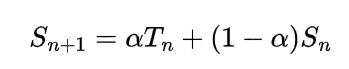  

### Performance of the algorithm  

The main objective in scheduling batch processes is to maximize the number of processes completed per unit of time. The order in which processes are executed cannot reduce the total CPU times of the individual processes but can reduce the waiting times.  

The **turnaround time** of a process is the time between arrival and departure, and is the sum of the total CPU time and the waiting time  

The **average turnaround time (ATT)** for a set of n processes is the mean of the n individual turnaround times.  

**Starvation** is the indefinite postponement of a process while other processes are allowed to proceed.   

#### Average Turnaround Time:  

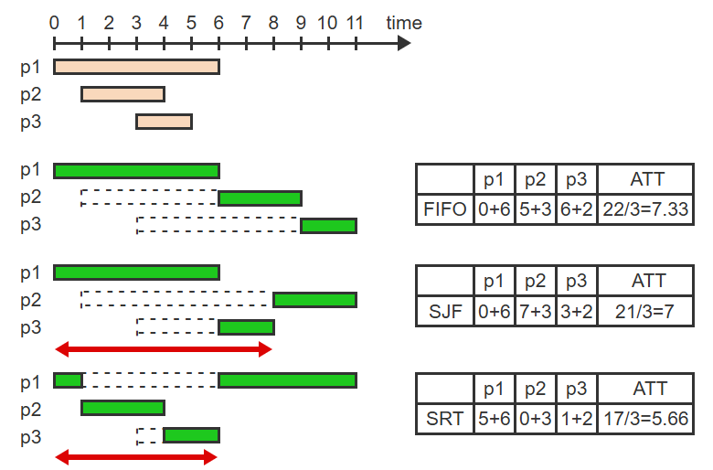  

- *SJF*: The arrival of new processes of length less than 3 (the length of p2) prior to time 8 could lead to an indefinite postponement (starvation) of p2.  
- *SRT*: The arrival of new processes of length less than 5 (the remainder of p1) prior to time 6 could lead to an indefinite postponement (starvation) of p1.  

## 4.3 Scheduling of interactive processes  

An **interactive process** communicates with the user in the form of a dialog by receiving commands or data from the keyboard or a pointing device and responding by generating output on the user's terminal or another output device.  
- time-share the CPU using preemptive scheduling  

A **time quantum**, *Q*, is a small amount of time (typically 10 to 100 milliseconds) during which a process is allowed to use the CPU.  

The **round-robin (RR)** algorithm uses a single queue of processes. The priority is determined solely by a process's position within the queue. The process at the head of the queue has the highest priority and is allowed to run for Q time units.  
Breaks the processes up into equal time quantums and takes turns executing the time quantums.  
Treats all processes as equals.  

**Multilevel (ML)** scheduling maintains a separate queue of processes at each priority level. Within each level, processes are scheduled using RR.  
*preemptive*, it will interrupt a lower priority process if a new higher priority process arrives.  
Lower level queues can only run once the higher level queues have finished.  

**Multilevel feedback** scheduling is similar to ML but addresses the problems of starvation and fairness by:  
- using a different time quantum at each priority level  
- changing the priority of every process dynamically  

Under the multilevel feedback (MLF) algorithm a newly arriving process enters the highest-priority queue, N, and is allowed to run for Q time units. When Q is exceeded, the process is moved to the next lower priority queue, N-1, and is allowed to run for 2Q time units.  
At the lowest priority level the time is unlimited and so p eventually terminates at this level.  

The **response time** of a process is the elapsed time from the submission of a request (pressing the Enter key or clicking a mouse button) until the response begins to arrive. Guaranteeing adequate response time is the primary goal in the scheduling of *interactive processes*.

## 4.4 Scheduling of real-time processes  

A **real-time process** is characterized by continual input, which must be processed fast enough to generate nearly instantaneous output.  

A **period** is a time interval (typically in milliseconds or even microseconds) within which each input item must be processed  

The **rate monotonic (RM)** algorithm schedules processes according to the period. The shorter the period, the higher the priority.  
RM is *preemptive*.  

The **earliest deadline first (EDF)** algorithm schedules processes according to the shortest remaining time until the deadline. The shorter the remaining time, the higher the priority.  
EDR is *preemptive*.  

A schedule is *feasible* if the deadlines of all processes can be met.

The **CPU utilization (U)** is the sum of the individual fractions of CPU times used by each process.  

  

If U = 1 then the CPU is utilized 100%. A feasible schedule exists as long as U ≤ 1.  

## 4.5 Combined approaches  

**2-tier approach**: Real-time processes run at the highest priority level but due to their short running times can use FIFO. Interactive and batch processes can be scheduled together using MLF.  

**2-tier approach with floating priorities**: Real time processes use either FIFO or RR in an ML scheme. Interactive and batch processes use a variation of MLF. 
Modern general-purpose OSs (Windows and LInuz) use more sophistocated scheduling.  

## 4.6 Scheduling criteria  

Criteria for comparing CPU-shceduling algorithms:  
- *CPU utilization*: We want to keep the CPU as busy as possible.  
- *Throughput*: measure of work is the number of processes that are completed per time unit  
- *Turnaround time*: the time of submission of a process to the time of completion.  
- *Waiting time*  
- *Response time*  

It is desirable to maximize CPU utilization and throughput and to minimize turnaround time, waiting time, and response time.  

## 4.7 Multi-processor scheduling  

If multiple CPUs are available, **load sharing**, where multiple threads may run in parallel, becomes possible, however scheduling issues become correspondingly more complex.  

**Multiprocessor**:  
- Multiple CPUs  
- Multithreaded cores  
- NUMA systems  
   -Non-uniform memory access, or NUMA, is a method of configuring a cluster of microprocessors in a multiprocessing system so they can share memory locally.  
- Heterogeneous multiprocessing   

### Approaches to multiprocessor scheduling  

One way is to have a *master server*, which is one processor that handles all the 
scheduling. This is a form of **asymmetric multiprocessing**. Bottle necking is an issue.  

**symmetric multiprocessing (SMP)** is the standard. Each processor is self-scheduling.  
Two options for ready queues:  
- All threads may be in a common ready queue.  
    - race condition  
    - Locks on resources  
    - Bottlenecks  
- Each processor may have its own private queue of threads.  
    - Most popular  
    
Traditionally, SMP systems have allowed several processes to run in parallel by providing multiple physical processors. 
However, most contemporary computer hardware now places multiple computing cores 
on the same physical chip, resulting in a **multicore processor**. Each core maintains its architectural state and thus appears to the operating system to be a separate logical CPU.  

**Memory stall**: when a processor accesses memory, it spends a significant amount of time waiting for the data to become available. 
This is because processors operate at a faster rate than memory. Can also occur due to 
cache misses.  

Applying two or more **hardware threads** to each core can reduce memory stall. 
While one thread is stalled, the cpu can switch to the other thread. *Dual-thread* 
processing cores.  

**chip multithreading (CMT)**: A CPU with multiple cores, where each core supports multiple hardware threads supports chip multithreading.  

So a computer with 4 computing cores, each containing two hardware threads, appears 
to the OS as 8 logical CPUs.  

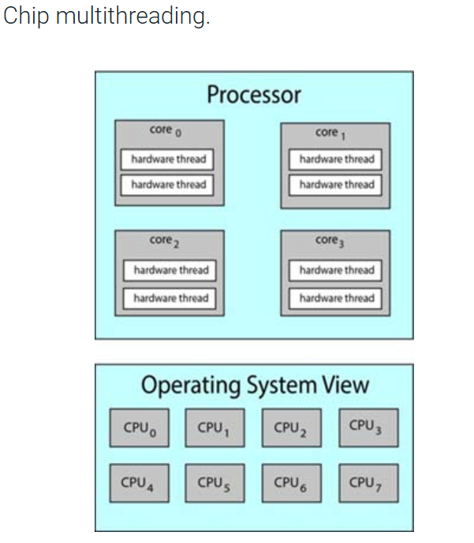  

Intel processors use the term **hyper-threading** (also known as **simultaneous multithreading** or SMT) to describe assigning multiple hardware threads to a single processing core.  

Two ways to multithread a processing core:  
- **Coarse-grained**: coarse-grained multithreading, a thread executes on a core until a long-latency event such as a memory stall occurs. 
To work around the latency, the core switches to another thread. the cost of switching between threads is high, since the instruction pipeline must be flushed before the other thread can begin execution on the processor core.  
- **Fine-grained** or interleaved:  switches between threads at a much finer level of granularity—typically at the boundary of an instruction cycle. However, the architectural design of fine-grained systems includes logic for thread switching. As a result, the cost of switching between threads is small.  

A multithreaded, multicore processor actually requires two different levels of scheduling (software threads and hardware threads)  

Load balancing is typically necessary only on systems where each processor has its own private ready queue of eligible threads to execute.  

Two general approaches to load balancing:  
- **push migration**: a task moves loads from busy processors to idle processors.  
- **pull migration**: idle processor pulls a waiting task from a busy processor.  

cache memory (known as a "warm cache")  

**Processor affinity**: that is, a process has an affinity for the processor on which it is currently running.
Because of the high cost of invalidating and repopulating caches, most operating systems with SMP support try to avoid migrating a thread from one processor to another and instead attempt to keep a thread running on the same processor and take advantage of a warm cache.  

**Soft affinity**: When an operating system has a policy of attempting to keep a process running on the same processor—but not guaranteeing that it will do so.

**Hard affinity**: When an operating system supports or allows a process's threads to run on the same processor at all times (as opposed to being moved to various processors as the thread is scheduled onto CPU).  

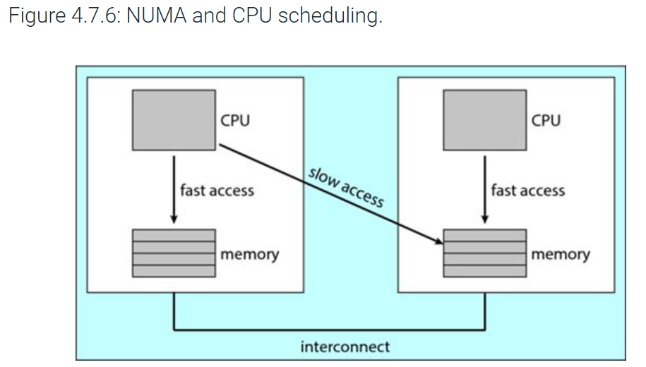  

**heterogeneous multiprocessing (HMP)**: A feature of some mobile computing CPUs in which cores vary in their clock speed and power management.  

**big.LITTLE**: ARM processor implementation of HMP in which high performance big cores are combined with energy efficient LITTLE cores.  

## 4.8 Real-time CPU scheduling  

**soft real-time systems**: Soft real-time systems provide no guarantee as to when a critical real-time thread will be scheduled - they guarantee only that the thread will be given preference over noncritical threads  
**hard real-time systems**: Hard real-time systems have strict scheduling facilities - a thread must be serviced by its deadline and service after the deadline has expired is the same as no service at all.  

**event latency** as the amount of time that elapses from when an event occurs to when it is serviced  

Two types of latencies affect the performance of real-time systems:  
1. **Interrupt latency**: the period of time from the arrival of an interrupt at the CPU to the start of the routine that services the interrupt.  
2. **Dispatch latency**: The amount of time the dispatcher takes to stop one thread and put another thread onto CPU.  

The conflict phase of dispatch latency has two components:  
- Preemption of any process running in the kernel
- Release by low-priority processes of resources needed by a high-priority process

**periodic**: A type of real-time process that repeatedly moves between two modes at fixed intervals- needing CPU time and not needing CPU time.

**rate**: A periodic real-time process has a scheduling rate of 1 / p (where p is the length of its running period).

**admission-control**: In real-time scheduling, the scheduler may not allow a process to start if its scheduling request as impossible - if it cannot guarantee that the task will be serviced by its deadline.

**rate-monotonic**: The rate-monotonic scheduling algorithm schedules periodic tasks using a static priority policy with preemption.

**Earliest-Deadline-First (EDF)**: A real-time scheduling algorithm in which the scheduler dynamically assigns priorities according to completion deadlines.
- Unlike the rate-monotonic algorithm, EDF scheduling does not require that processes be periodic, nor must a process require a constant amount of CPU time per burst.  

**proportional share**: Proportional share schedulers operate by allocating *T* shares among all applications assuring each gets a specific portion of CPU time.  


## 4.9 Algorithm evaluation  

**analytic evaluation**: A means of comparing scheduling algorithm effectiveness by analyzing an algorithm against a workload and assigning it a score.

**deterministic modeling**: One type of analytic evaluation - takes a particular predetermined workload and defines the performance of each algorithm for that workload.

**queueing-network analysis**: An area of computing study in which algorithms are analyzed for various aspects and effectiveness.

On many systems, the processes that are run vary from day to day, so there is no static set of processes (or times) to use for deterministic modeling.  

**Little's formula**: A scheduling equation (n = λ × W) that is particularly useful because it is valid for any scheduling algorithm and arrival distribution.

**trace files**: A scheduling algorithm evaluation method in which thread details are captured on real systems and various scheduling algorithms analyzed to determine effectiveness.

**Regression testing** confirms that the changes haven't made anything worse, and haven't caused new bugs or caused old bugs to be recreated   

# 5 Concurrency  

## 5.1 Process interactions  

Concurrency is the act of multiple processes (or threads) executing at the same time. When multiple physical CPUs are available, the processes may execute in parallel. On a single CPU, concurrency may be achieved by time-sharing.  

A **critical section** is a *segment of code* that cannot be entered by a process while another process is executing a corresponding segment of the code. 
This protects shared data that is accessed at the same time.  
A critical section and must not be interleaved because it will return incorrect results.  

Any solution to the critical section (CS) problem must satisfy the following requirements:  
- Guarantee **mutual exclusion**: Only one process may be executing within the CS.  
- Prevent **lockout**: A process not attempting to enter the CS must not prevent other processes from entering the CS.  
- Prevent **starvation**: A process (or a group of processes) must not be able to repeatedly enter the CS while other processes are waiting to enter.  
- Prevent **deadlock**: Multiple processes trying to enter the CS at the same time must not block each other indefinitely.  

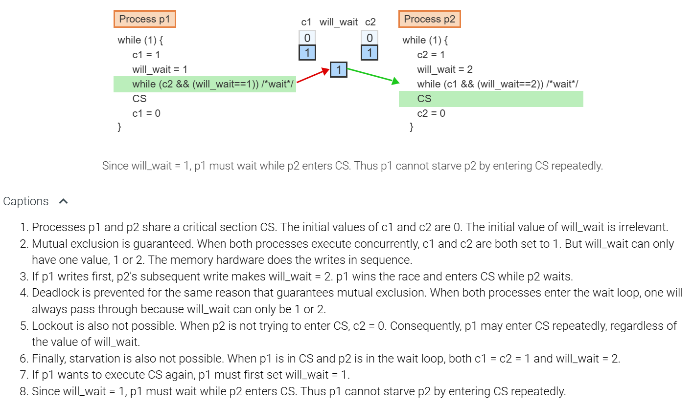  

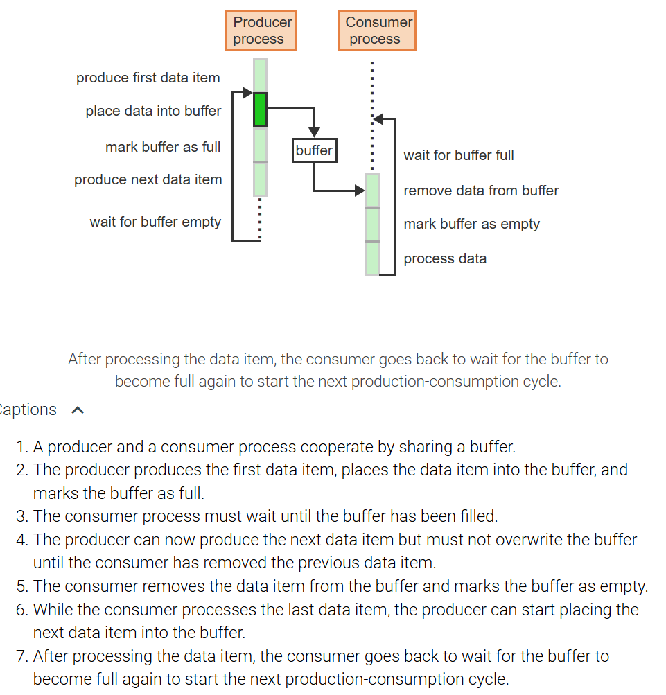  

> The buffer is a data structure vs a critical section is a segment of code  

## 5.2 Mutex locks  

**mutex lock**: A mutual exclusion lock; the simplest software tool for assuring mutual exclusion.  
- The mutex lock protects critical sections and thus prevents race conditions.  

**contended**: A term describing the condition of a lock when a thread blocks while trying to acquire it.  
- High contention: many threads trying to acquire the lock  
- Low contention: small number of threads attempting to acquire the lock  

**uncontended**: A term describing a lock that is available when a thread attempts to acquire it.

**busy waiting**: A practice that allows a thread or process to use CPU time continuously while waiting for something. An I/O loop in which an I/O thread continuously reads status information while waiting for I/O to complete.

**spinlock**: A locking mechanism that continuously uses the CPU while waiting for access to the lock.
- short duration  

The software solution to the CS problem has several major shortcomings:  
- The solutions works only for 2 processes. When 3 or more processes need to share a CS, a different solution must be developed.  
- The solution is inefficient. While one process is in the CS, the other process must wait by repeatedly testing and setting the synchronization variables. The waiting process is only wasting CPU and memory resources without accomplishing any useful work.  
- The solution addresses only competition among processes. To address problems of process cooperation, entirely different solutions must be devised.  

## 5.3 

A **semaphore** is a non-negative integer variable that can be accessed using only two special operations, P and V.

- V(s): increment s by 1
- P(s): if s > 0, decrement s by 1, otherwise wait until s > 0  

The **bounded-buffer problem** is a classic synchronization problem intended to illustrate process cooperation. A producer process shares a buffer with a consumer process. The buffer has a fixed number of slots.   

The bounded buffer problem using semaphores: Semaphores offer a very intuitive and elegant solution to the bounded-buffer problem that satisfies the requirements that producers do not overtake consumers and vice versa.  

## 5.4 Implementation of semaphores  

### Hardware support for synchronization  

Most contemporary computer architectures offer hardware support for process synchronization in the form of *specialized machine instructions*.  

The **test-and-set instruction (TS)** copies a variable into a register and sets the variable to zero in one indivisible machine cycle. Test-and-set has the form TS(R, x) where R is a register and x is a memory location and performs the following operations:  
  
A **lock** is a synchronization barrier through which only one process can pass at a time. TS allows an easy implementation of a lock.  

## 5.5 Monitors  

P and V operations are low-level primitives that are prone to difficult-to-diagnose programming errors.  
 
A **monitor** is a high-level synchronization primitive implemented using P and V operations. Following the principles of abstract data types, a monitor encapsulates data along with functions through which the data may be accessed and manipulated.  
 
A **condition variable** is a named queue on which processes can wait for some condition to become true.  

The implementation of a monitor must:  
- guarantee that the functions are mutually exclusive. Thus only one process at a time may be executing inside a monitor.  
- provide condition variables such that a process can step outside of the monitor while waiting for a condition and thus not prevent other processes from entering the monitor.  
- A condition variable c is accessed using two special operations:  
    - *c.wait* causes the executing process to block and be placed on a waiting queue associated with the condition variable c.  
    - *c.signal* reactivates the process at the head of the queue associated with the condition variable c.    

The monitor primitive offers a simple solution to the *bounded-buffer problem*. Since the monitor *guarantees mutual exclusion*, 
the functions to deposit and to remove data automatically become *critical sections*. Consequently, the solution works for *multiple producers and multiple consumers*.  

A *priority wait* has the form c.wait(p), where c is a conditional variable and p is an integer specifying a priority according to which processes blocked on c are reactivated.  

A compiler or preprocessor uses P and V operations on semaphores to enforce the different features of a monitor.  
- A semaphore mutex (initialized to 1) is used to enforce mutual exclusion among the functions.
- A semaphore c (initialized to 0) is used for each condition variable c to allow a process to block itself on the condition.
- A semaphore urg (initialized to 0) is used to block a process executing a signal operation.
- Associated with each semaphore c is a counter c_cnt, which keeps track of the number of processes blocked on c.
- Associated with the semaphore urg is a counter urg_cnt, which keeps track of the number of processes blocked on urg.

## 5.6 Class synchronization problems  

### The readers-writers problem  
 
The readers-writers problem is an extension of the critical section problem where two types of processes, readers and writers, compete for access to a common resource. Readers are allowed to enter the critical section (CS) concurrently but only one writer is allowed to enter at a time.

The main challenge is to guarantee maximum concurrency of readers while preventing the starvation of either type of process. Specifically, two rules must be enforced:

- A reader is permitted to join other readers currently in the CS only when no writer is waiting. When the last readers exits the CS, the writer is allowed to enter.
- All readers that have arrived while a writer is in the CS must be allowed to enter before the next writer.  

Rule 1 guarantees that writers cannot starve. Rule 2 guarantees that readers cannot starve. Jointly the two rules guarantee maximum concurrency of readers.

#### A montor solution to the readers-writers problem  

The monitor provides 4 functions:

- start_read is called by a reader to get a permission to read
- end_read is called by a reader when finished reading
- start_write is called by a writer to get a permission to write
- end_write is called by a writer when finished writing  

Two counters, reading and writing, are used to keep track of the number of readers and the number of writers currently in CS, respectively.

Two condition variables, ok_to_read and ok_to_write, are used to block readers and writers, respectively.

To avoid maintaining separate counters of processes blocked on a condition c, a primitive count(c) is provided, which returns the number of processes blocked on c. Ex: count(ok_to_read) returns the number of processes blocked on ok_to_read.  

### The dining-philosopher's problem  

The dining-philosophers problem is representative of situations where multiple processes compete for shared resources but each process needs more than one resource at a time.

Five "philosophers", each representing a concurrent process, are seated around a table. Five "forks", each representing a resource, are placed on the table such that each two neighboring philosophers share one fork. Each philosopher alternates asynchronously between a phase of "thinking", which represents execution not requiring any shared resources, and "eating", which requires the prior acquisition of the two forks adjacent to the philosopher and shared with the two respective neighbors.

The main challenge is to prevent deadlock while guaranteeing that any two nonadjacent philosophers can always eat concurrently.  

#### Approaches to preventing deadlock  

The behavior of each philosopher p[i] can be represented as a loop that alternates between the phases of thinking and eating. Prior to eating, p[i] requests the two adjacent forks and returns the forks when finished eating. The forks can be represented as 5 semaphores, f[0] through f[4], all initialized to 1. P(f[i]) then corresponds to picking up fork f[i] and V(f[i]) corresponds to putting down fork f[i].

```C++
p(i) {
   while (1) {
          think
          P(f[i])
          P(f[i+1 mod 5])
          eat
          V(f[i])
          V(f[i+1 mod 5])
   }
}
```

This code leads to deadlock since all philosophers can pick up the left fork f[i] concurrently and then block indefinitely on picking up the right fork. Several approaches exist to avoid the problem:

- Approach 1: Request both forks at the same time in a critical section.
- Approach 2: One philosopher picks up the forks in the opposite order from all other philosophers.

#### A monitor solution to the dining philosophers problem  

Each of the 5 philosophers, p[i], can be in one of 3 states: thinking, hungry, or eating. Thinking does not require any forks. Hungry is a state where the philosopher is blocked because one or both forks are not available. In the eating state the philosopher is holding both forks and is executing.

- The forks are not represented explicitly by any data structure. Rather, the pickup(i) function switches p[i] from thinking to eating if p[i-1] and p[i+1] are not eating. Consequently, deadlock is not possible because no forks are picked up one at a time. Instead, the act of picking up the forks is represented implicitly by the single state transition from thinking to eating.
- Concurrent execution is guaranteed in that the putdown(i) function explicitly enables neighbor p[i-1] if p[i-2] is not eating and similarly the function enables neighbor p[i+1] if p[i+2] is not eating.  

### The elevator algorithm  

A storage disk consists of n concentric tracks that need to be accessed by read/write requests arriving in some unspecified order. The goal is to minimize the travel distance between tracks while preventing starvation.

The elevator algorithm mimics the behavior of an elevator in an n-story building. The elevator (representing the read-write head of the disk), maintains a direction of motion, up or down, for as long as requests for floors (representing disk tracks) exist, in the current direction. When moving up and no more requests for higher floors exist, the elevator reverses direction and services all requests in descending order. When the request for the lowest floor is serviced, the elevator again reverses direction and proceeds moving up.  

## 5.7 Peterson's solution  

**Peterson's solution**: A historically interesting algorithm for implementing critical sections.  

# 6 Deadlock  

## 6.1 A system model for deadlocks  

A **resource allocation graph** shows the current allocation of resources to processes and the current requests by processes for new resources.

- Processes are represented by circles.
- Resources are represented by rectangles. If a resource contains multiple units then each unit is represented by a small circle.
- Resource allocations are represented by edges directed from a resource to a process.
- Resource requests are represented by edges directed from a process to a resource.

A process p is *blocked* on a resource r if one or more request edges directed from p to r exist and r does not contain sufficient free units to satisfy all requests.

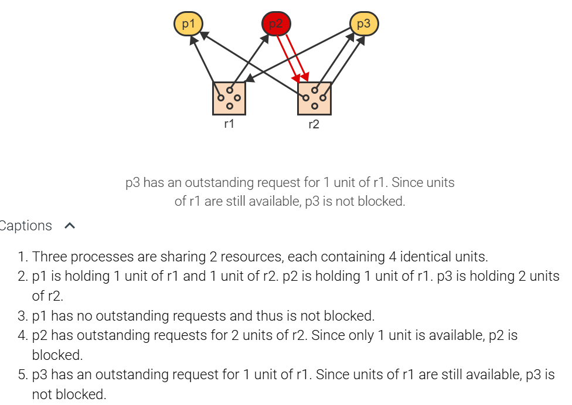  

A **deadlock** involves at least 2 processes and 2 resources (or resource units), where each process holds one resource and is blocked indefinitely on another resource held by another process.  

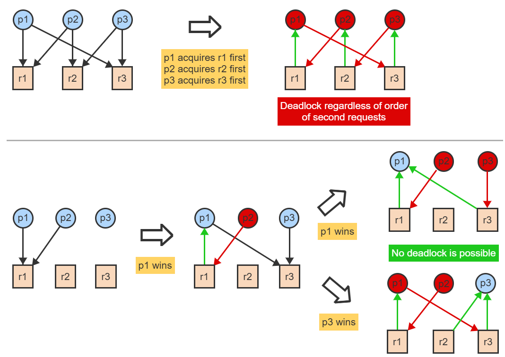  

State transitions:  
- resource request  
- resource acquisition  
- resource release  

A process is **deadlocked** in a state s if the process is blocked in s and if no matter what state transitions occur in the future, the process remains blocked.

A state s is called a **deadlock state** if s contains two or more deadlocked processes.

A state s is a **safe state** if no sequence of state transitions exists that would lead from s to a deadlock state.

When the sequence of all requests and releases by each process is known, a complete *state transition graph* can be constructed and analyzed for the presence of deadlock states and safe states.  

## 6.2 Deadlock detection  

A resource allocation graph is *completely reducible* if at the termination of the graph reduction algorithm all processes have been deleted.

During continuous deadlock detection, the current state s is *not a deadlock state*.  

A **wait-for graph** is a resource allocation graph containing only processes where each process can have multiple incoming resource allocation edges but only one outgoing resource request edge.  

The term "wait-for" indicates that process p is blocked on a resource currently held by another process p'.

> Theorem: A cycle in the wait-for graph is a necessary and sufficient condition for deadlock.

#### Wait for graph:  
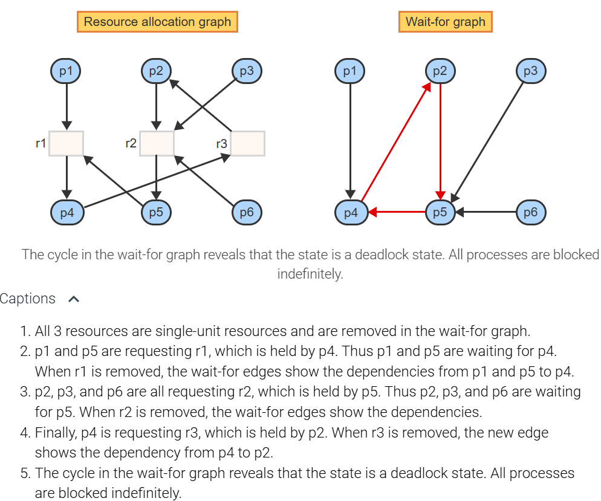  

## 6.3 Dynamic deadlock avoidance  

One approach to dealing with deadlocks is to *allow deadlocks to occur* and to provide means for detection and recovery. Recovery from a deadlock can be accomplished by destroying one or more of the processes involved in the deadlock, or by removing some of the resources held by the deadlocked processes.

An alternative is to *avoid the possibility of a deadlock by delaying the acquisition* of resources that could cause the system to enter a deadlock state.  

The **maximum claim** of a process is the set of all resources the process may ever request. Each potential future claim of a resource is represented by a dashed edge in the resource allocation graph.  

A **resource claim graph** is an extension of the general resource allocation graph. The extended graph shows  
- the current allocation of resources to processes and  
- all current as well as all potential future requests by processes for new resources.    

#### Claims graph:  

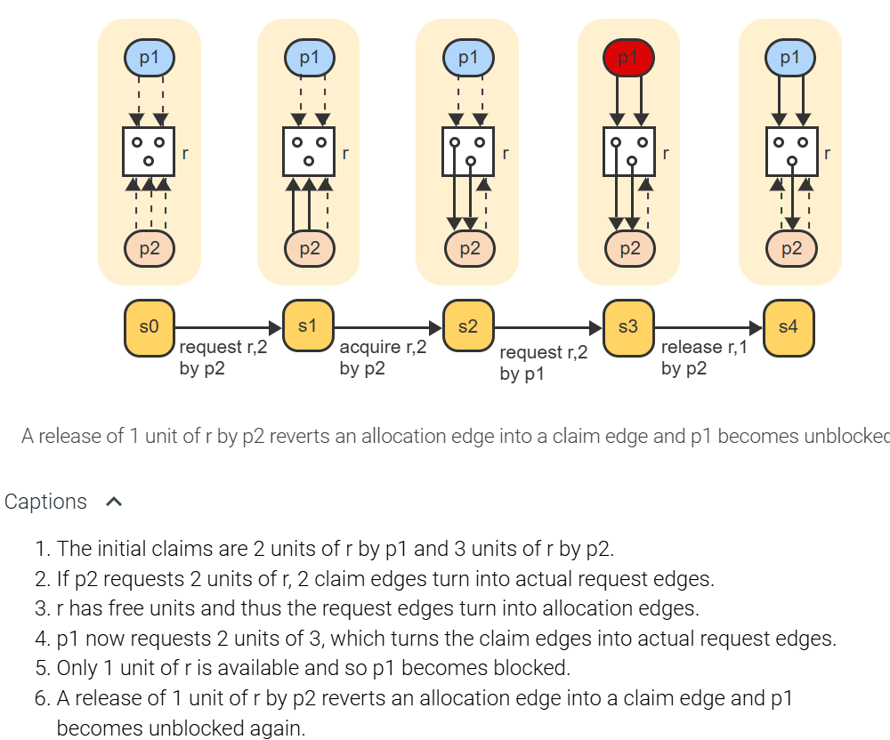  

### The banker's algorithm  

The banker's algorithm emulates the strategy used by a bank when issuing loans. A loan corresponds to a resource allocation and a maximum claim corresponds to the credit limit of a customer (requesting process). The bank grants a request as long as a sequence of loans exist that would satisfy the needs of all customers in some order. Otherwise the granting of the request is postponed.  

#### Deadlock avoidance with single-unit resources  

The banker's algorithm is then simplified:

- Given a request for a resource in a state s, temporarily grant the request by changing the request edge to an allocation edge.  
- Starting with the requesting process p, determine if the graph in the temporary state s' contains a directed cycle.  
- If no cycle exists then accept s' as the new state. Otherwise disallow the acquisition by reverting to the state s.    

A directed cycle can be formed only if the graph already contains an undirected cycle. The reason is that *no new edges are added to or removed* from a claim graph. A claim edge can only change into a request edge, which in turn can change into an allocation edge, and eventually back to a claim edge.  

## 6.4 Static deadlock prevention  

Two conditions must hold for a deadlock to occur with *reusable resources*:

- Hold and wait: A process is already holding one resource and is requesting another resource.  
- Circular wait: A process must issue a resource request that closes a cycle involving at least two processes and two resources.  

Deadlock is structurally impossible if either of the two conditions are eliminated.  

#### Eliminate hold-and-wait  

Several alternatives to eliminating the hold-and-wait condition exist:

- Every process must *request all resources* ever needed at the same time. The price paid for the simplicity of the approach is poor resource utilization since resources are held for unnecessarily long periods of time and thus unavailable to other processes.  
- Every process must *release all currently held resources* prior to making any new request. The approach improves resource utilization but results in repeated requests and releases of frequently used resources.  
- A process can be given the ability to *test* whether a needed resource is currently available. The process must release all currently held resources only if the requested resource is not currently available. Otherwise the new resource may be requested and allocated immediately.    

The below image uses the above three techniques when *p* is requesting *r3*:  

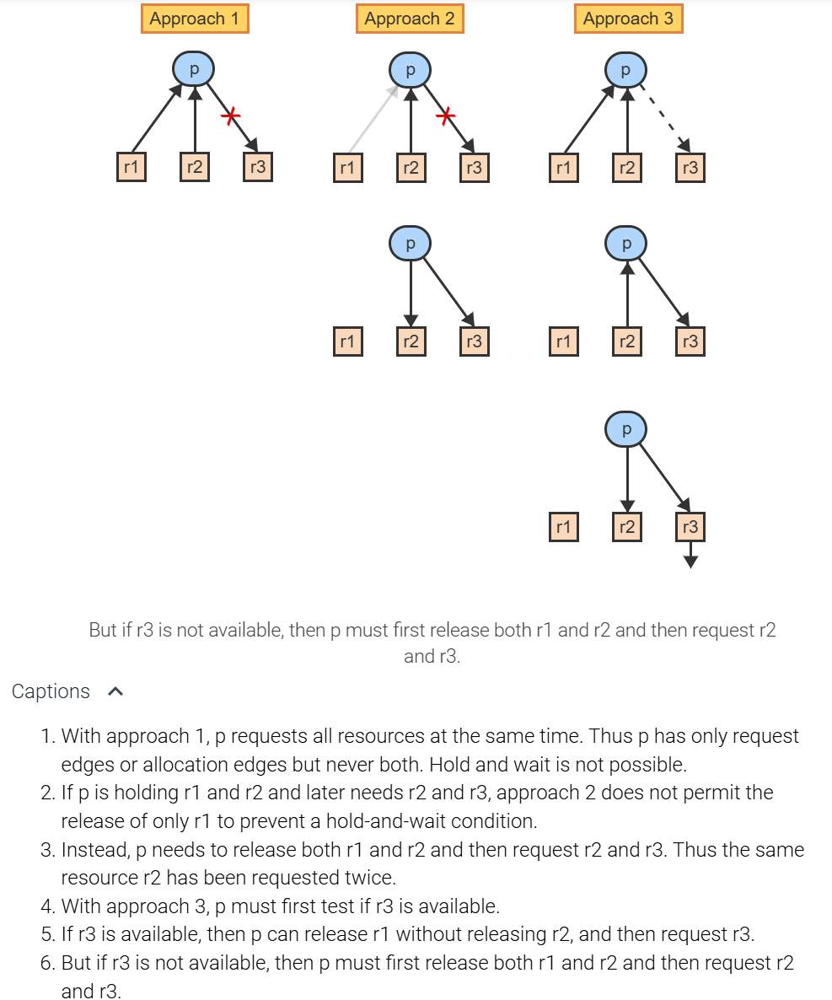  

#### Eliminating circular wait  

A cycle in the resource graph can be closed only when two or more processes request the same resources but in a different order. A **circular wait** *is prevented if all processes are required to request all resources in the same order*.

In the below image, a closed loop would be created if p1 requested r2 (the dashed line) 
or r1.  p1 can only request r4 without creating a closed loop.  p3 can request all 
resouces without creating a closed loop. p2 can only request r3 and r4.  

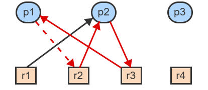   

# 7 Memory management  

## 7.1 Requirements for efficient memory management  

A computer's **physical memory (RAM)** is a hardware structure consisting of a linear sequence of words that hold a program during execution. A word is a fixed-size unit of data. 

A typical *word* size is 1, 2, or 4 bytes.  

A physical address is an integer in the range [0 : n-1] that identifies a word in a physical memory of size n.  

Because when a program is being developed the address of the program in physical 
memory is unknown, a logical address space is employed.  

A **logical address space** is an abstraction of physical memory, consisting of a sequence of imaginary memory locations in a range [0 : m-1], where m is the size of the logical address space.

A **logical address** is an integer in the range [0 : m-1] that identifies a word in a logical address space. Prior to execution, a logical address space is mapped to a portion of physical memory and the program is copied into the corresponding locations.  

A **source module** is a program or a program component written in a symbolic language, like C, or an assembly language, that must be translated by a compiler or assembler into executable machine code.

An **object module** is the machine-language output of a compiler or assembler generated from a source module. An object module may be self-contained and executable or multiple object modules may be linked together into a load module by a linker or linkage editor.

A **load module** is a program or combination of programs in a form ready to be loaded into main memory and executed.  

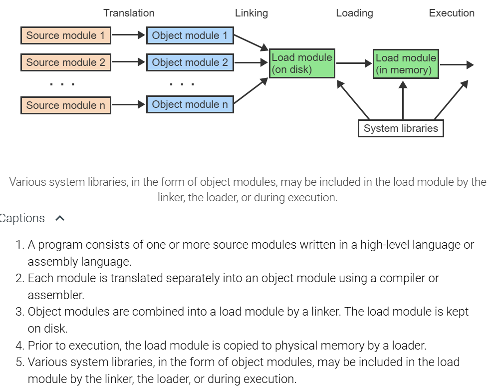  

> System Libraries may be added to the load module either prior to execution or during execution.  

Program relocation is the act of moving a program component from one address space to another.   
- **Static relocation** binds all logical addresses to physical addresses prior to execution.    
- **Dynamic relocation** postpones the binding of a logical address to a physical address until the addressed item is accessed during execution.    

A **relocation register** contains the physical starting address of a program or program component in memory.

Most programs consist of 3 main components: code, static data, and dynamic data. A simple memory management scheme treats the 3 components as one unit  

Dynamic location using relocation registers:  
  
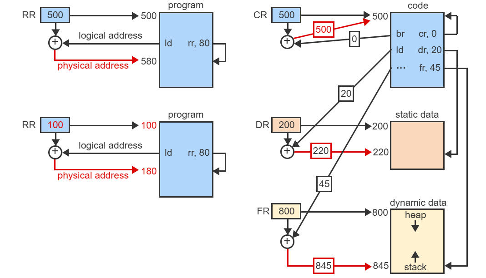  

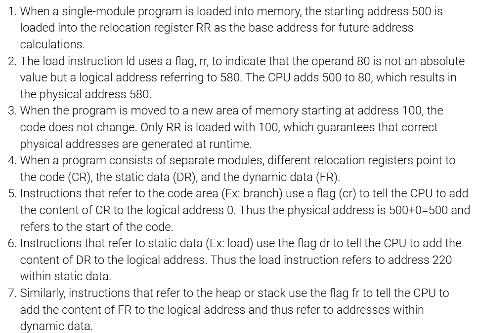  

The OS keeps track of all free spaces, referred to as *holes*, using a linked list. 
The OS has to find a place to put a new program loaded into memory by:  

**First-fit** always starts the search from the beginning of the list and allocates the first hole large enough to accommodate the request.

**Next-fit* starts each search at the point of the last allocation.

**Best-fit** searches the entire list and chooses the smallest hole large enough to accommodate the request.

**Worst-fit** takes the opposite approach from best-fit by always choosing the largest available hole for any request.

## 7.2 Linkers and loaders  

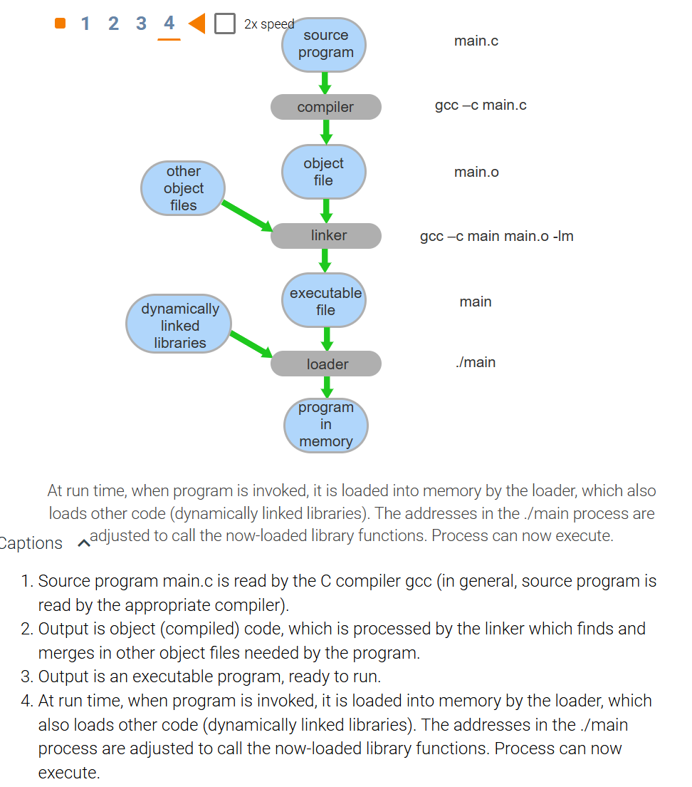  

**relocatable object file**: The output of a compiler in which the contents can be loaded into any location in physical memory.

**linker**: A system service that combines relocatable object files into a single binary executable file.

**executable file**: A file containing a program that is ready to be loaded into memory and executed.

**loader**: A system service that loads a binary executable file into memory, where it is eligible to run on a CPU core.

**relocation**: An activity associated with linking and loading that assigns final addresses to program parts and adjusts code and data in the program to match those addresses.

**dynamically linked libraries (DLLs)**: System libraries that are linked to user programs when the processes are run, with linking postponed until execution time.

**executable and linkable format (ELF)**: The UNIX standard format for relocatable and executable files.

**portable executable (PE)**: The Windows format for executable files.

**Mach-O**: The macOS format of executable files.  

## 7.3  Managing insufficient memory  

**External memory fragmentation**:  is the loss of usable memory space due to holes between allocated blocks of variable sizes.  

The **50% rule** states that, if the probability of finding an exact match for a request approaches 0, one third of all memory partitions are holes and two thirds are occupied blocks. Formally, n = 0.5 m, where n is the number of holes and m is the number of occupied blocks.  

The 50% rule only refers to the number of holes but not the amount of space occupied by the holes.  

When no hole large enough for a request is available, the process can either be delayed until more memory is released or two possible actions may be taken to create more space:

**Swapping** is the temporary removal of a module from memory. The module is saved on a disk and later moved back to memory. Dynamic relocation is necessary so that the module can be placed into a different location without modification.

**Memory compaction** is the systematic shifting of modules in memory, generally in one direction, to consolidate multiple disjoint holes into one larger hole.  

## 7.4 Paging  

The main disadvantage of dividing memory into variable partitions is external fragmentation, which requires the searching of memory for holes large enough to satisfy each request.   

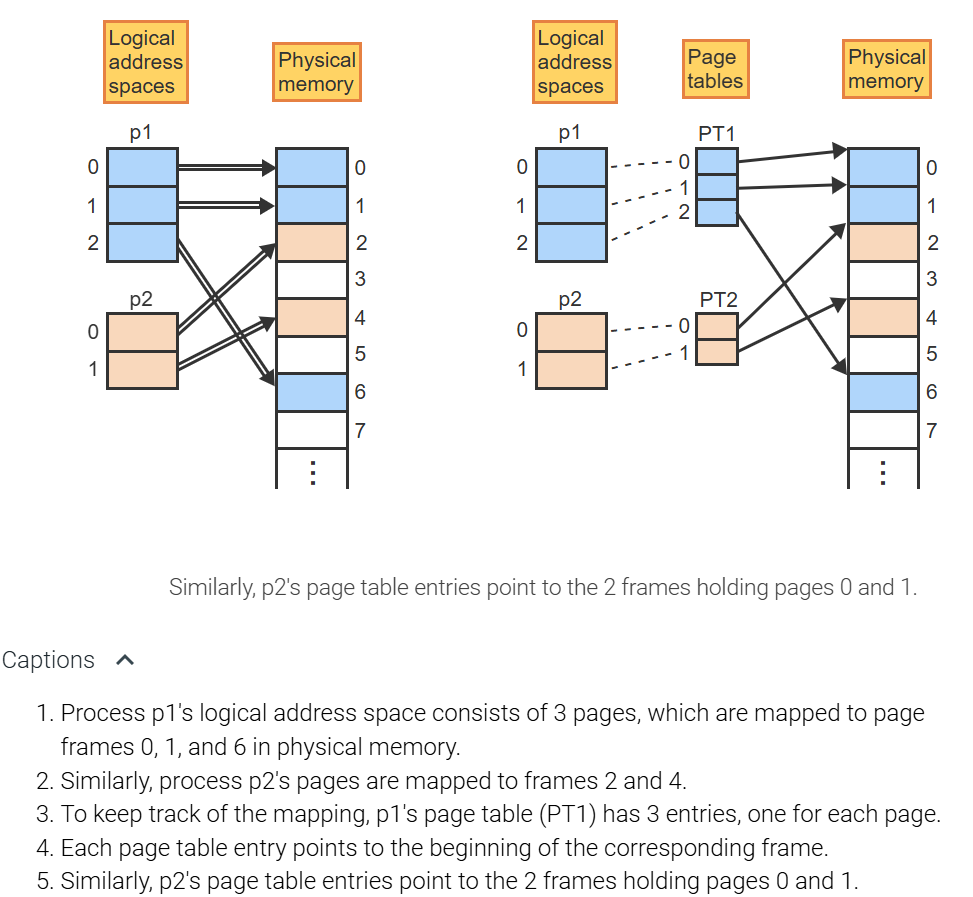  

A **page** is a fixed-size contiguous block of a logical address space identified by a single number, the page number.

A **page frame** is a fixed-size contiguous block of physical memory identified by a single number, the page frame number.

A page frame is the smallest unit of data for memory management and may contain a copy of any page.

A **page table** is an array that keeps track of which pages of a given logical address space reside in which page frames. Each page table entry corresponds to one page and contains the number or the starting address of the frame containing the page.  

Page addressing:  

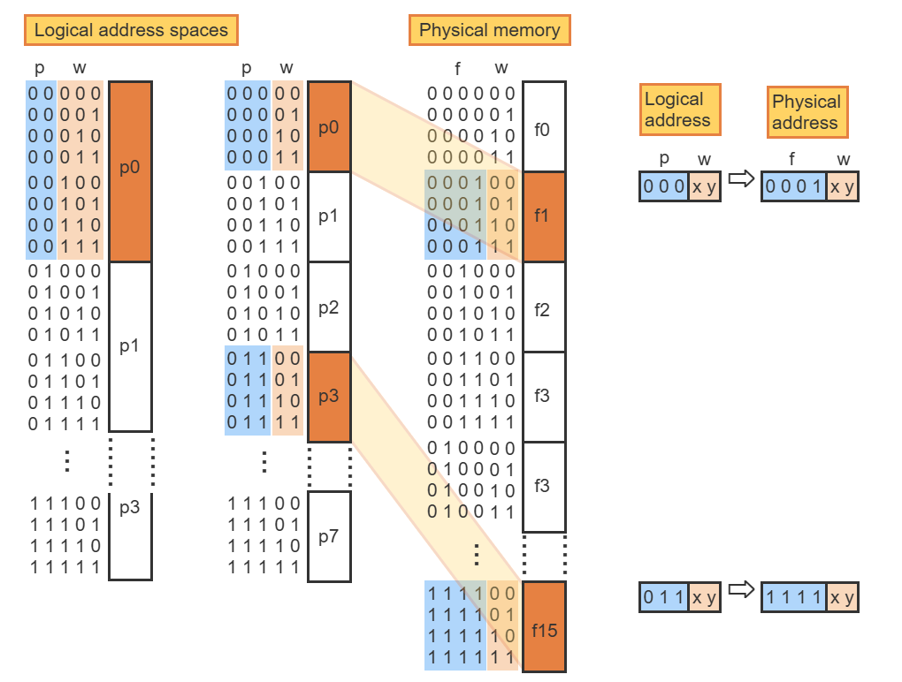  

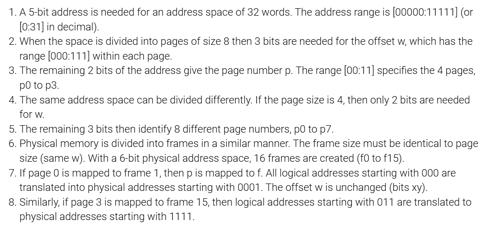  


> The size of p determines the number of pages in the logical address space.  
> p is added to the start of the page table. The size of p determines how many page numbers can be generated.
  
> The size of *f* determines the number of frames in the physical space.  
> The size of *f* determines how many frame numbers can be generated.  

Address Translation:  

  

Paging avoids external fragmentation by having all pages and page frames the same size so that any page fits into any frame without creating holes between frames. However, the size of a program is generally not an exact multiple of the page size and thus some space remains unused at the end of the last page.  

**Internal fragmentation** is the loss of usable memory space due to the mismatch between the page size and the size of a program, which creates a hole at the end of the *program's last page*.

  

## 7.5 Segmentation and paging  

*Segmentation* addresses the problem by providing multiple logical address spaces for each process, where each segment can have a different size.

A **segment** is a variable-size block of a logical address space identified by a single number, the segment number.  

With pure segmentation (no paging), a segment occupies a contiguous area of physical memory and is the smallest unit of data for memory management.

A **segment table** is an array that keeps track of which segment resides in which area of physical memory. Each entry corresponds to one segment and contains the starting address of the segment.  

Segmentation:  

  

  

  

Segmentation addressing:  

  

### Segmentation with paging  

- The main advantage of segmentation is the ability to create multiple variable-size address spaces. 
- The main advantage of paging is the ability to place any page into any frame in memory. To gain the advantages of both, segmentation can be combined with paging.  

Address translation with segmentation and paging:  

  

  

Mapping segmentation with paging to physical memory:  

  

  

When segmentation is combined with paging, the number of memory accesses triples: First the segment table is accessed, then a page table, and finally the page holding the addressed word.  

A **translation lookaside buffer (TLB)** is a fast associative memory buffer that maintains recent translations of logical addresses to frames in physical memory for faster retrieval.  

The **principle of locality** states that locations accessed recently are more likely to be accessed again than locations accessed in the distant past.  

The TLB's **hit ratio** is the fraction of memory accesses that find a match in the TLB. The higher the TLB hit ratio, the lower the overhead of address translation.  

# 8 Virtual Memory  

## 8.1 Principles of virtual memory  

**Virtual memory (VM)** is a collection of one or more logical address spaces, each of which may exceed the size of physical memory. A logical address is then referred to as a virtual address. A paged VM creates a single large contiguous address space per process. A paged VM with segmentation creates multiple large address spaces per process, each of which is paged.  

**Demand paging** is the principle of loading a page into memory only when the page is needed, rather than at the start of the execution.  

A **present bit** is a binary flag in each page table entry that indicates whether the corresponding page is currently resident in memory.  

A **page fault** is an interrupt that occurs when a program attempts to reference a non-resident page. The interrupt triggers the operating system to find the page on disk, copy the page into a frame, and set the present bit to 1.  

Demand paging:  

  

**Page replacement** is the act of overwriting a page in memory with a different page loaded from the disk when needed.  

A **modified-bit (m-bit)** is a binary flag in each page table entry that indicates whether the corresponding page has been modified during execution. The modified bit is set to 1 automatically by any instruction that stores data into the page and is used by the operating system to minimize the movement of data to disk.  

  

  

## 8.2 Page replacement with fixed numbers of frames  

Memory consists of a fixed number of frames.  

A **reference string** is the sequence of page numbers referenced by an executing program during a given time interval. Reference strings are used to compare different page replacement algorithms by counting the number of page faults generated.  

The **optimal page replacement algorithm** selects the page that will not be referenced for the longest time in the future.  

The **FIFO page replacement algorithm** selects the page that has been resident in memory for the longest time.  

The **least-recently-used page replacement algorithm (LRU)** selects the page that has not been referenced for the longest time.  

## 8.3 Approximation of the LRU algorithm  

The LRU requires the queue of pages to be modified at each memory reference, which makes the algorithm too inefficient in practice.  

Several algorithms exist that approximate LRU and can be implemented efficiently:  

- The **aging page replacement algorithm** does not maintain pages sorted in the exact LRU order, but groups together pages referenced during a period of d consecutive references. Each period is represented by 1 bit in a periodically shifting aging register.  
    - A **referenced bit (r-bit)** is a bit associated with a page and is set automatically by the hardware whenever the page is referenced by any instruction.  
    - An **aging register** is associated with a page and is shifted periodically to the right by 1 bit. Unless the most significant bit is set to 1, the page is aging in the sense that the associated register value is steadily decreasing.  

  

- The **second-chance page replacement algorithm** is a coarse-grain approximation of LRU. The algorithm uses the r-bit to divide all pages into only two categories: recently referenced and not recently referenced. A page is selected from the not-recently referenced category.  

  

- The **third-chance page replacement algorithm**, also known as the not-recently-used page replacement algorithm (NRU), is a coarse-grain approximation of LRU, which divides pages into 4 categories based on the 4 possible combination of the r- bit and the m-bit.  

## 8.4 Page replacement with variable numbers of frames  

The **optimal working set** of a process is the set of resident pages that will still be needed in the immediate future and thus should remain resident.   

The optimal working set is unrealizable in practice because the algorithm requires advance knowledge of the RS. 

The working set page replacement algorithm relies on the principle of temporal locality by assuming that recently referenced pages will be similar to pages referenced in the immediate future.  

The **working set (WS)** of a process at time t is the set of pages referenced during the past d memory operations preceding t.

The **working set page replacement algorithm** uses a trailing window of size d superimposed on the RS to determine the size and composition of the working set at time t. Analogous to the forward-looking window of the optimal working set, pages visible in the trailing window belong to the working set.  

At each memory reference, the algorithm follows the steps:

1. Advance the sliding window by 1 to include the current reference.  
2. Keep resident only the pages that appear in the window.  

Working-set page replacement:  

  

The **page-fault-frequency replacement algorithm** takes a direct approach to controlling the page fault rate by adjusting the current resident set based on how frequently consecutive page faults occur.  

When a page fault occurs:

1. Add the currently referenced page causing the page fault to the resident set.
2. When the time since the previous page fault is greater than d, remove all pages from the resident set that have not been referenced since the previous page fault.  

  

## 8.5 Time and space efficiendy of virtual memory  

**Page fault rate** is the number of page faults, f, occurring during a number of memory references, t. The page fault rate can be expressed as P = f/t, where 0 ≤ P ≤ 1.
P = 1 means that every memory reference results in a page fault, and P = 0 means that no page faults occur.  

**Effective access time** is the average time to access memory in the presence of page faults. The effective access time, E, depends on the frequency of page faults:  

` E = (1 - P) * m + P * S `  

where m is the time to access physical memory and S is the time to process a page fault.  

Page fault overhead:  

  

**Load control** is the activity of determining how many processes should be running concurrently at any given time to maximize overall system performance.  

**Thrashing** is an execution state during which most of the time is spent on moving pages between the memory and the disk while the CPU is mostly idle and no process is making any real progress.  

Thrashing occurs when too many processes are sharing memory concurrently and no process has enough pages to operate without frequent page faults.  

  

  

The most common page sizes range between 512 and 4096 bytes but the number has been increasing in recent years with improvements in disk technology.  

Choice of page size:  

  

# 9 Main Memory  

## 9.1 Swapping  

**swapped**: Moved between main memory and a backing store. A process may be swapped out to free main memory temporarily and then swapped back in to continue execution.

**backing store**: The secondary storage area used for process swapping.

**application state**: A software construct used for data storage.  

Standard swapping involves moving entire processes between main memory and a backing store.  
- allows physical memory to be oversubscribed (accomodate more processes than there is physical space)  
- Not used in contemporary os.  

Swapping with pages  
- Still allows oversubscription  
- Does not move entire process  
- paging refers to swapping with paging  

Mobile devices do not have the storage capacity for swapping:  
- Android adopts a strategy similar to that used by IOS. It may terminate a process if insufficient free memory is available. However, before terminating a process, Android writes its application state to flash memory so that it can be quickly restarted.  
- Apple's IOS asks applications to voluntarily relinquish allocated memory. However, any applications that fail to free up sufficient memory may be terminated by the operating system.  

# 10 File System  

## 10.1 Files  

A *file* is a named collection of information managed on secondary storage by the FS.  

A **record** is a structure of related data items, possibly of different data types, identified *within a file* by a record number or a unique key field. Ex: A student ID would uniquely distinguish all student records in a file.

An **access method** is a set of operations provided by the OS as part of the user interface to access files. The most common access method is *sequential*. 

Some OSs (Ex: most IBM systems) support also *direct access methods*, where a record can be accessed directly by specifying a *record number* or a key value.

Fixed-length record files also support direct access because the starting position of any record k can be calculated by multiplying k by the record length.  

  

**Metadata** is information about the format and organization of a file's data and is generally stored in a file header.  

A **file header** is a portion of the file preceding the actual data and is visible to only the FS itself.  

The **magic number** is a short sequence of characters at the start of the file header, which identifies the file type.  

Another way to represent file types is to use file extensions. A **file extension** is a sequence of one or more characters following the file name.

## 10.2 File Directories  

A **file directory** (or folder) is a special-purpose file that records information about other files and possibly other directories. The directory consists of a set of entries, each containing the name of a file followed by other information necessary to access the file.  

A **tree-structured directory hierarchy** is a collection of directories organized such that:  
1) every directory points to zero or more files or directories at the next lower level  
2) every file and directory except the root is pointed to by exactly one parent directory at the next higher level.  

The **root** of a tree-structured directory hierarchy is the highest level directory, which does not have a parent directory.  

Every file and every directory has a unique ID  

An **absolute path name** of a file, uniquely identified by an internal ID, f, is the concatenation of the directory and file names leading from the root to the file f. 

A **relative path** name is a concatenation of file names starting with the current directory.

Access parent directory with ".."  

Root directory "/"  

The main drawback of a tree-structured directory hierarchy is that file sharing is asymmetric. Only one directory can be the parent of any file or another directory. Other users must refer to the file by first navigating up to a common directory and then down to the desired location.  

A **directed acyclic directory hierarchy** organizes directories such that any directory at a given level may point to zero or more files or other directories at lower levels but also permits any file or directory to have more than one parent directory.  

A **reference count** is a non-negative integer associated with a file f, which indicates how many directories are pointing to the file.

A reference count is not sufficient to prevent the creation of unreachable subgraphs in the directory hierarchy, which can only be removed using a garbage collection algorithm.  

A **symbolic link (or shortcut)** is a directory entry that points to a file or directory just like a regular entry but is treated differently with respect to deletion.

## 10.3 Implementation of file directories  

The typical file attributes include:

- Size: The current size in bytes or words.
- Type: Information to differentiate directories, regular files, executable files, and other types of files supported by the system.
- Location: Information necessary to locate the file's physical blocks on disk.
- Protection: Information about who can access the file and the permitted type of access (Ex: read only or execute only).
- Use: The date and time of file creation, last access, or last modification.

A **File control block (FCB)** is a data structure associated with a filename that contains all relevant attributes of the file. FCBs are stored apart from file directories and are pointed to by the corresponding directory entries. In Unix and other OSs an FCB is called an i-node.  

  

## 10.4 Operations on files  

Create file operation creates a new named file with a File Control Block.  

Destroy file operation removes existing file, FCB,and  directory entry.  

To avoid accessing the information repeatedly and to keep track of the file's current state, the FS maintains all relevant information in an open file table kept in main memory.  

To avoid accessing the information repeatedly and to keep track of the file's current state, the FS maintains all relevant information in an open file table kept in main memory.  

The **open file table (OFT)** is a data structure that keeps track of all files currently in use to facilitate efficient access to and manipulation of the files.  

A read file operation copies data from an open file to a specified area in main memory.   

A write file operation copies data from an area in main memory to a specified open file.  

Analogous to the read operation, the write operation also uses the r/w buffer in the OFT.   

A seek operation moves the current position of an open file to a new specified position. 

The **close file** operation reverses the effects of the open operation by saving the current state of the file in the FCB and freeing the OFT entry.  

## 10.5 Disk block allocation  

A **disk block** is a fixed sequence of bytes on the disk, which can only be accessed as a single unit using low-level read-block and write-block operations.  

A file is stored on the disk in units of disk blocks.   

### contiguous block allocation scheme  

In a **contiguous block allocation scheme**, every file is mapped into a contiguous sequence of disk blocks. The FCB points to the first disk block. The file length, also maintained in the FCB, determines how many blocks are occupied by the file.

The main advantages are:  

- *Fast sequential access* because neighboring blocks do not require any seek operations.  
- *Fast direct access* because a target block number can be computed using the file position and the block length.  

The main drawbacks are:  

- *Disk fragmentation*, in that over time, the disk consists of variable-length sequences of free and occupied blocks and requires search algorithms to find free areas of appropriate size for a given file.  
- *Inability to expand a file* if the block following the last file block is not free. The entire file must be copied into a larger area.  
- *Difficulty in deciding how much space to allocate* to a new file to allow for potential expansion.  

### linked block allocation scheme  

With a **linked block allocation scheme**, the blocks containing a file may be scattered throughout the disk. The FCB points to the first block and each block points to the logically next block.

The main advantage is:  
- *Easy expandability* of a file by linking additional blocks to the last block.  

The main drawbacks are:  
- *Slower sequential access* than with a contiguous allocation, since each block access requires a seek operation to a different position on the disk.  
- *Inability to perform direct access* since the location of the target block cannot be computed. To access any block requires following the pointers and reading all blocks preceding the target block.  
- *Decreased reliability of the disk*. If a disk block becomes physically damaged, the rest of the file cannot be found.  
- *Considerable waste of disk space* since every disk block must include a pointer to the next block.    

### Clustered Allocation  

A **clustered block allocation scheme** links together sequences of contiguous blocks. The last block of any cluster points to the beginning of the logically next cluster. The last block also records the number of blocks belonging to the next cluster to facilitate direct access within each cluster. The number of blocks in the first cluster is recorded in the FCB along with the pointer.  

The approach is a compromise between the contiguous and linked allocations. The main advantages are:

- *Easy expandability of a file*. If the block following the last file block is free, than the last cluster is extended as with the contiguous allocation. If the block following the last file block is occupied, then a new cluster is started and the last block points to the first block of the new cluster.  
- A *reduced number of pointers* since only the last block of a cluster contains a pointer.  
- *Improved sequential access* over the purely linked allocation since accessing blocks within a cluster does not require any seek operations.  

The main drawbacks are:  
- *Slower sequential access* than with contiguous allocation since each cluster requires a seek operation to a different position on the disk.  
- *Inability to perform direct access* since the location of the target block cannot be computed. To access any block requires following the pointers until the cluster containing the target block is reached.    

### Using file allocation table  

A variation of the linked organization is to allow file blocks to reside anywhere on the disk but to segregate the links in a dedicated area on the disk, rather than maintaining the links as part of each disk block.  

A **File allocation table (FAT)** is an array where each entry corresponds to a disk block. The FAT keeps track of which disk blocks belong to a file by linking the blocks in a chain of indices. A file's FCB contains the index of the first file block, which in turn contains the index of the next block, etc.  

Since the FAT resides in a small number of designated disk blocks, the blocks can be cached in main memory. Consequently:

- **Sequential access is more efficient** since no seek operations are necessary to follow pointers.  
- **Direct access is also possible**, because the location of the desired block can be found efficiently by scanning the chain of indices in the FAT.  

### Indexed Allocation  

With an indexed block allocation scheme, file blocks may reside anywhere on the disk. An index table is provided for each file, which keeps track of the blocks belonging to the file.

The main advantages are:

- *Fast sequential* as well as direct access.  
- *Ability to efficiently expand* a file by simply adding a new block number to the index table.  
The main drawback is:  

- Necessity to *decide a priori how big the index table should be*. A small table limits the maximum size of any file. A large table wastes disk space, since most file will have no need for the large size.    

### Free Space management  

A **bitmap** is a data structure where each bit represents one disk block.  
 
The space used up by the bitmap is minimal.  

## 10.6 Memory-mapped files  

**memory mapping**: A file-access method in which a file is mapped into the process memory space so that standard memory access instructions read and write the contents of the file; an alternative to the use of read() and write() calls.

Performing file manipulation in the volatile memory. The changes to the file are not save to secondary memory until the file is closed.   

Quite often, shared memory is in fact implemented by memory mapping files. Under this scenario, processes can communicate using shared memory by having the communicating processes memory-map the same file into their virtual address spaces.  

**file mapping**: In Windows, the first step in memory-mapping a file.

**view**: In Windows, an address range mapped in shared memory. Also, the second step in memory-mapping a file, allowing a process to access the file contents.

**named shared-memory object**: In Windows API, a section of a memory-mapped file accessible by name from multiple processes.

# 11 Input/Output  

## 11.1 The hardware-software interface  

Devices are attached to the system using controllers. A **device controller (device adapter)** is an electronic circuit capable of operating a specific I/O device using binary signals. The interface to a device controller is a set of hardware registers and flags, which may be set by and/or examined by device drivers.  

A **device driver** is a device-specific program that implements I/O operations, requested by user applications or the OS, by interacting with the device controller.   

Translating the high-level I/O instruction to a device-specific operation, including error handling, buffering, and other issues, is the job of the disk driver.  

### Programmed I/O with polling  

A generic interface to a device controller consists of a set of registers:  

| Register | Use |  
| :-- | :-- |  
| Opcode | The register specifies the type of operation requested. Ex: read or write. Storing a new value into the register starts the I/O operation. |  
| Operands | One or more operand registers are used to describe the parameters of the requested operation. The values are written by the CPU prior to starting the operation. |  
| Busy | The register (a 1-bit flag) is set by the controller to indicate whether the device is busy or idle. |  
| Status | The register is set by the controller to indicate the success or failure of the last I/O operation. |  
| Data buffer | The data buffer holds the data to be transferred between the device and main memory. Depending on the device type, the buffer may hold a single character or a block of data. |  

**Programmed I/O** is a style of I/O programming where the CPU, running the device driver, performs the copying of all data between the I/O device controller and main memory.  

**Polling** is a technique to determine whether a device is busy or idle by reading a flag set and reset by the device controller.  

  

### Programmed I/O with interrupts  

When interrupts are used for I/O processing, the interface to the controller remains the same, but the controller is equipped with the ability to issue interrupts to the CPU.  

The busy flag is still present but is used only initially to determine whether the device is available to accept a new I/O request. Then, after starting the I/O operation, the current process blocks itself, instead of repeatedly polling the busy flag to detect the termination of the data transfer.  

Inputs with interrupts:  

  

 

### I/O with direct memory access  

A **direct memory access (DMA)** controller is a hardware component that allows devices to access main memory directly, without the involvement of the CPU.  

Inputs with DMA:  

  

  

### Polling vs interrupts  

Polling: a few machine instructions  
- Good for single process  
- Good for devices that complete an I/O operation within a few microseconds  

Interrupt: blocking causes significant CPU overhead   
- Better for general pupose multi-process environments  
- constant, predictable overhead for each I/O  

  

  

## 11.2 Data buffering and caching  

### Using a single buffer  

A **buffer** is a register or an area of main memory used to hold data generated by a producer process or an input device and removed from the buffer at a later time by a consumer process or an output device.  

A keyboard generates characters one at a time but a user process may wish to receive the data only as complete lines. The driver can accumulate multiple characters in a buffer, edit the data in the buffer based on special characters received, and only pass the data to the consumer when the ENTER key is pressed. The driver is said to operate in "cooked" data mode, rather than "raw" data mode, where all characters are passed to the application unchanged.  

  

  

### Buffer Swapping  

In a producer-consumer situation sharing a buffer, the consumer is blocked or idle while the producer is filling the buffer. Similarly, the producer is blocked or idle while the consumer is copying the buffer.

**Buffer swapping** is a technique that allows the operations of a producer process and a consumer process to overlap by using two buffers. While the producer is filling buffer 1, the consumer is copying buffer 2. When both terminate, the two buffers are swapped. The producer starts filling buffer 2 while the consumer starts copying buffer 1.  

### Circular buffer  

Buffer swapping improves performance by overlapping the execution of the producer and the consumer, but only when data is produced and consumed at the same constant rate.   

A **circular buffer** is a fixed array of buffer slots filled by the producer and emptied by the consumer one slot at a time in ascending order, modulo the buffer size.  


### Disk Block caching  

A disk block cache is a set of main memory buffers that contain the most recently accessed disk blocks.  

- *Blocks critical to performance must remain resident* at all times and are kept on a list of Locked blocks.
- *Blocks expected to be accessed again in the near future reside on a list that implements the LRU* (least recently used) policy. Whenever a block is accessed, the block is moved to the rear of the list. Blocks not accessed again gradually migrate to the front of the list and are removed when no free buffers are available.
- *Blocks expected to be accessed only once or very infrequently are added to the front of the same LRU* list and thus will be removed quickly.

The term "buffer" has two different meanings, depending on the context:

- A buffer used to decouple a consumer from a producer holds *new data* generated by the producer and used later by the consumer.
- A buffer used for caching holds a temporary copy of data that *already exists* on the disk and only facilitates faster access to the data.

  

## 11.3 Disk Scheduling  

### Magnetic disk storage  

A **track** is one of many concentric rings on a magnetic disk surface. 

A **sector** is a portion of a track and is the smallest unit of data that can be read or written with a single r/w operation.  

The time to access any data on a disk consists of 3 components:

- The **seek time** is the time to move the r/w head from the current position to the track containing the desired data. The time is directly proportional to the physical distance the r/w head needs to traverse.
- The **rotational delay** (rotational latency) is the time to wait for the desired data item to pass under the r/w head. On average, the rotational delay is one half of the time of one disk revolution. Thus the time depends on the disk's rotational speed.
- The **data transfer time** is the time to transfer the desired number of bits to or from the disk, and is directly proportional to the disk's rotational speed.

The peak transfer rate depends directly on the rotational speed of the disk and the number of sectors per track.  

The seek time depends on the physical distance traveled, which varies with the density of the tracks on the disk.  

### Disk access optimization  

### SSTF shceduling algorithm  

The **Shortest seek time first (SSTF)** scheduling algorithm considers the list of all pending requests and always selects the request that requires the shortest travel distance from the current position  
> Starvation is possible under SSTF  

### Scan and C-scan scheduling algorithms  

The **Scan scheduling algorithm** mimics the behavior of an elevator in a building. The r/w head maintains a current direction of travel and services all request sequentially in the current direction.  
-  tracks closer to the midrange have a greater chance to be serviced quickly than tracks at either extreme of the disk.  

The **C-Scan scheduling algorithm** is a variant of the Scan algorithm that services requests in only one direction. When the outermost request is reached, the r/w head sweeps back to the opposite end of the disk and starts servicing requests again in the same direction.  
- uniform access time to all tracks  

## 11.4 Error handling  

### Error detection and correction  

Data on a disk can become inconsistent for two reasons:

- A *system crash* during a write operation can leave a disk block in a partially updated state.
- A spontaneously occurring *bad block*, caused by aging or physical damage to the recording medium, makes the reading or re-writing of the block impossible.

Data can also be corrupted during transmission *between systems* or I/O devices.

A **parity bit** is a bit added to a string of bits to ensure that the total number of 1's in the string is even or odd. 

An **error correcting code (ECC)** includes multiple parity bits in a string to permit the detection and automatic correction of some number of erroneous bits.  
- A popular ECC is the *Hamming code*, which can correct a single bit error. 

### Bad block detection and handling 

A **bad block (bad sector)** is a storage block that is no longer reliable for storing and retrieving data due to physical damage. An ECC is associated with each block, which allows the detection and automatic correction of some number of corrupted bits in the block.  

To maintain the logical sequence of blocks b[0] ... b[D-1] without gaps, the disk provides some number of spare sectors on each track. The damaged block, b[i], can be remapped to a spare sector in one of two ways:  
- **Sector forwarding** is a technique where a bad disk block b[i] is mapped to one of the spare sectors. The solution is fast and simple but the drawback is that the logical blocks are no longer mapped to consecutive sectors, resulting in additional revolutions of the disk.  
- **Sector slipping** is a technique where all blocks following a bad block b[i] are shifted to the right. The last block is mapped to a spare sector and b[i] is mapped to the sector occupied previously by block b[i+1]. The approach requires more work initially but maintains the sequential order of all blocks.  

### Stable Storage  

**Stable storage** is an approach to data management that uses redundancy, along with a strict protocol for reading, writing, and error recovery, to guarantee that all data remains consistent in the presence of media and crash failures.  

A **stable read** guarantees to return a valid copy of any block.

A **stable write** guarantees that every block is updated atomically. After the write, the block contains either the old or the new value but never a partially updated value.  

#### Stable storage protocol:  
**Stable read**:  
- Read block b from disk A and from disk B.  
- If the two copies are different, go to Media recovery  
**Stable write**:  
- Write block b to disk A.
- If successful, write block b to disk B.  
- If either write fails, go to Media recovery.  
**Media recovery**: 
- Remap the bad block to a spare block.  
- Copy the still correct value from the other disk to the spare block.  
**Crash recovery**: 
- If a crash occurred while writing to disk A, copy the still valid block from disk B back to disk A.  
- If the crash occurred while writing to disk B, copy the new correct block from disk A to disk B  

### RAID  

**Striping** is a technique where a sequence of data blocks, b[i], is distributed over n disks, such that disk[i] contains block b[i] modulo n.  
- Improves performance of RAID.  
- Adding redundant data in the form of parity or an ECC improves *reliability* of a RAID.

A **RAID (Redundant Array of Independent Disks)** is a set of disks viewed by the OS as a single mass storage device.  

## 11.5 HDD scheduling  

Optional  

# 12 I/O systems (ch 12 Silberschatz)  

## 12.1 Intro  

## 12.2 Overview  

device driver: An operating system component that provides uniform access to various devices and manages I/O to those devices.  

## 12.3 I/O hardware  

**port**: A communication address; a system may have one IP address for network connections but many ports, each for a separate communication. In computer I/O, a connection point for devices to attach to computers. In software development, to move code from its current platform to another platform (e.g., between operating systems or hardware systems). In the Mach OS, a mailbox for communication.

**PHY**: The physical hardware component that connects to a network (implements layer 1 in the OSI model).

**bus**: A communication system; e.g., within a computer, a bus connects various components, such as the CPU and I/O devices, allowing them to transfer data and commands.

**daisy chain**: In computer I/O, a connection method involving connecting devices to each other in a string (device A to B, B to C, C to D, etc.).

**PCIe bus**: A common computer I/O bus connecting the CPU to I/O devices.

A lane is composed of two signaling pairs, one pair for receiving data and the other for transmitting. Each lane is therefore composed of four wires, and each lane is used as a full-duplex byte stream, transporting data packets in an eight-bit byte format simultaneously in both directions.  

**expansion bus**: A computer bus for connecting slow devices like keyboards.

**serial-attached SCSI (SAS)**: A common type of I/O bus.

**SAS**: A common type of I/O bus.

**controller**: A special processor that manages I/O devices.

**fibre channel (FC)**: A type of storage I/O bus used in data centers to connect computers to storage arrays. A storage-attachment network.

**host bus adapter (HBA)**: A device controller installed in a host bus port to allow connection of one or more devices to the host.

**memory-mapped I/O**: A device I/O method in which device-control registers are mapped into the address space of the processor.

I/O device control typically consists of four registers, called the status, control, data-in, and data-out registers:

- **data-in register**: A device I/O register where data is placed to be sent to the device.

- **data-out register**: A device I/O register where data is placed by the device to be read by the computer.

- **status register**: A device I/O register in which status is indicated.

- **control register**: A device I/O register where commands are placed by the computer.

**busy waiting**: A practice that allows a thread or process to use CPU time continuously while waiting for something. An I/O loop in which an I/O thread continuously reads status information while waiting for I/O to complete.

**polling**: An I/O loop in which an I/O thread continuously reads status information waiting for I/O to complete.

For this example, the host writes output through a port, coordinating with the controller by handshaking as follows.

1. The host repeatedly reads the busy bit until that bit becomes clear.  
2. The host sets the write bit in the command register and writes a byte into the data-out register.  
3. The host sets the command-ready bit.  
4. When the controller notices that the command-ready bit is set, it sets the busy bit.  
5. The controller reads the command register and sees the write command. It reads the data-out register to get the byte and does the I/O to the device.  
6. The controller clears the command-ready bit, clears the error bit in the status register to indicate that the device I/O succeeded, and clears the busy bit to indicate that it is finished.  

In many computer architectures, three CPU-instruction cycles are sufficient to poll a device: read a device register, logical-and to extract a status bit, and branch if not zero.   

**interrupt**: A hardware mechanism that enables a device to notify the CPU that it needs attention.

**interrupt-request line**: The hardware connection to the CPU on which interrupts are signaled.

**interrupt-handler routine**: An operating system routine that is called when an interrupt signal is received.

In a modern operating system, however, we need more sophisticated interrupt-handling features.

- We need the ability to *defer interrupt* handling during critical processing.  
- We need an efficient way to dispatch to the proper interrupt handler for a device *without first polling all the devices* to see which one raised the interrupt.  
- We need *multilevel interrupts*, so that the operating system can distinguish between high- and low-priority interrupts and can respond with the appropriate degree of urgency when there are multiple concurrent interrupts.  
- We need a way for an instruction to get the operating system's attention directly (separately from I/O requests), for activities such as page faults and errors such as division by zero. As we shall see, this task is accomplished by "*traps*."  

**interrupt-controller hardware**: Computer hardware components for interrupt management.

Most CPUs have two interrupt request lines:  
- **nonmaskable interrupt**: An interrupt that cannot be delayed or blocked (such as an unrecoverable memory error)  
- **maskable**: Describes an interrupt that can be delayed or blocked (such as when the kernel is in a critical section).  

**address space layout randomization (ASLR)**: An operating system technique to avoid code-injection attacks that place memory objects like the stack and heap at unpredictable locations.

**interrupt vector**: An operating-system data structure indexed by interrupt address and pointing to the interrupt handlers. A kernel memory data structure that holds the addresses of the interrupt service routines for the various devices.

**interrupt chaining**: A mechanism by which each element in an interrupt vector points to the head of a list of interrupt handlers, which are called individually until one is found to service the interrupt request.

**interrupt priority level**: Prioritization of interrupts to indicate handling order.

**exception**: A software-generated interrupt caused either by an error (such as division by zero or invalid memory access) or by a specific request from a user program than an operating-system service be performed.

**first-level interrupt handler**: In some operating systems, an interrupt handler responsible for reception and queuing of interrupts; the interrupts are actually handled at another level (by the second-level handler).

**second-level interrupt handler**: In some operating systems, the interrupt handler that actually handles interrupts; reception and queueing of interrupts are handled at another level (by the first-level handler).

Operating systems have other good uses for interrupts as well. For example, many operating systems use the interrupt mechanism for virtual memory paging. A *page fault* is an exception that raises an interrupt.

**software interrupt: A software-generated interrupt**; also called a **trap**. The interrupt can be caused either by an error (e.g., division by zero or invalid memory access) or by a specific request from a user program that an operating-system service be performed.

Interrupts can also be used to manage the flow of control within the kernel. 

**trap**: A software interrupt. The interrupt can be caused either by an error (e.g., division by zero or invalid memory access) or by a specific request from a user program that an operating-system service be performed.

**programmed I/O (PIO)**: A method of transferring data between a CPU and a peripheral device in which data are transferred one byte at a time.

**direct memory access (DMA**): A resource-conserving and performance-improving operation for device controllers allowing devices to transfer large amounts of data directly to and from main memory.  
- DMA-request   
- DMA-acknowledge  

DMA can steal memory access cycles from the main CPU  

**scatter-gather**: An I/O method in which multiple sources or destinations of I/O are specified in one command structure.

**double buffering**: The copying of data twice (e.g., from a device to the kernel and then from the kernel to a process's address space), or the use of two buffers to decouple producers and consumers.

**cycle stealing**: The act of a device, such as a DMA controller, using the bus and preventing the CPU from using it temporarily.

**direct virtual memory access (DVMA)**: DMA that uses virtual addresses rather than physical memory addresses as transfer sources and destinations.

## 12.4 Application I/O interface  

**escape**: Generally, a method of passing arbitrary commands or information when an interface does not provide a standard method.

**back door**: A daemon left behind after a successful attack to allow continued access by the attacker. In cryptography, a method of gaining access to encrypted information without first having the secret keys. More generally, a method of passing arbitrary commands or information when an interface does not provide a standard method.

**block-device interface**: The interface for I/O to block devices.

**raw I/O**: Direct access to a secondary storage device as an array of blocks with no file system.

**direct I/O**: Block I/O that bypasses operating-system block features such as buffering and locking.

**character-stream interface**: The interface for I/O to character devices (like keyboards).

**socket**: An endpoint for communication. An interface for network I/O.

**programmable interval timer**: A hardware timer provided by many CPUs.

**high-performance event timer**: A hardware timer provided by some CPUs.

**network time protocol**: A network protocol for synchronizing system clocks.

Most computers have hardware clocks and timers that provide three basic functions:

- Give the current time.  
- Give the elapsed time.  
- Set a timer to trigger operation X at time T.  

**blocking**: In interprocess communication, a mode of communication in which the sending process is blocked until the message is received by the receiving process or by a mailbox and the receiver blocks until a message is available. In I/O, a request that does not return until the I/O completes.

**nonblocking**: A type of I/O request that allows the initiating thread to continue while the I/O operation executes. In interprocess communication, a communication mode in which the sending process sends the message and resumes operation and the receiver process retrieves either a valid message or a null if no message is available. In I/O, a request that returns whatever data is currently available, even if it is less than requested.

Asynchronous vs Synchronous I/O methods:  

  

**Vectored I/O**: An I/O method in which multiple sources or destinations of I/O are specified in one command structure. 
Without vectored I/O, the data might first need to be transferred to a larger buffer in the right order and then transmitted, which is inefficient.  

**scatter-gather**: An I/O method in which multiple sources or destinations of I/O are specified in one command structure.

standardized set of functions—an **interface**  

One network interface available in many operating systems, including UNIX and Windows, is the network **socket** interface.  

 
## 12.5 Kernel I/O subsystem  

**device-status table**: A kernel data structure (table) for tracking the status and queues of operations for devices. Used to support 
asynchronous I/O.  

**buffer**: A memory area that stores data being transferred (e.g., between two devices or between a device and a process).

Buffering is done for three reasons:  
- cope with a speed mismatch between producer and consumer  
- adaptions for devices that have a different data-transfer size.  
- support copy semantics for application I/O

**double buffering**: The copying of data twice (e.g., from a device to the kernel and then from the kernel to a process's address space), or the use of two buffers to decouple producers and consumers.

**copy semantics**: The meaning assigned to data copying—e.g., whether a block write from a process allows the data to be modified after the write has been requested.

**cache**: A temporary copy of data stored in a reserved memory area to improve performance. In the slab allocator, a cache consists of two or more slabs. Fast memory.  

The difference between a buffer and a cache is that a buffer may hold the only existing copy of a data item, whereas a cache, by definition, holds a copy on faster storage of an item that *resides elsewhere*.  

**spool**: A buffer that holds output for a device (such as a printer) that cannot accept interleaved data streams.

**sense key**: In the SCSI protocol, information in the status register indicating an error.

**advanced configuration and power interface (ACPI)**: Firmware common to PCs and servers that manages certain aspects of hardware, including power and device information.

The I/O subsystem supervises these procedures:

- Management of the name space for files and devices  
- Access control to files and devices  
- Operation control (for example, a modem cannot seek())  
- File-system space allocation  
- Device allocation  
- Buffering, caching, and spooling  
- I/O scheduling  
- Device-status monitoring, error handling, and failure recovery  
- Device-driver configuration and initialization  
- Power management of I/O devices  

The upper levels of the I/O subsystem access devices via the uniform interface provided by the device drivers.

## 12.6 Transforming I/O requests to hardware operations  

UNIX has a mount table that associates prefixes of path names with specific device names.

**mount table**: An in-memory data structure containing information about each mounted volume. It tracks file systems and how they are accessed.  

## 12.7 Streams  

**STREAMS**: A UNIX I/O feature allowing the dynamic assembly of pipelines of driver code.

A stream is a full-duplex connection  

**stream head**: The interface between STREAMS and user processes.

**driver end**: The interface between STREAMS and the device being controlled.

**stream modules**: In STREAMS, modules of functionality loadable into a STREAM  
- A module can be used by more than one device  

**flow control**: Generally, a method to pause a sender of I/O. In networking, a technique to limit the rate of data flow (e.g., to avoid buffer overflow and packet loss on a router).

## 12.8 Performance  

**front-end processors**: Small computers that perform certain tasks in an overall system; used by some systems to manage I/O and offload the general-purpose CPU.

**terminal concentrator**: A type of front-end processor for terminals.  
- multiplex the traffic from hundreds of remote terminals into one port on a large computer.  

**I/O channel**: A dedicated, special-purpose CPU found in large systems like mainframes for performing I/O or offloading the general-purpose CPU.9

We can employ several principles to improve the efficiency of I/O:

- Reduce the number of context switches.  
- Reduce the number of times that data must be copied in memory while passing between device and application.  
- Reduce the frequency of interrupts by using large transfers, smart controllers, and polling (if busy waiting can be minimized).  
- Increase concurrency by using DMA-knowledgeable controllers or channels to offload simple data copying from the CPU.  
- Move processing primitives into hardware, to allow their operation in device controllers to be concurrent with CPU and bus operation.  
- Balance CPU, memory subsystem, bus, and I/O performance, because an overload in any one area will cause idleness in others.  

> I/O implementation *in hardware* will provide the greatest performance benefits.

## 12.9 Summary  

- The basic hardware elements involved in I/O are buses, device controllers, and the devices themselves.  
- The work of moving data between devices and main memory is performed by the CPU as programmed I/O or is offloaded to a DMA controller.  
- The kernel module that controls a device is a device driver. The system-call interface provided to applications is designed to handle several basic categories of hardware, including block devices, character-stream devices, memory-mapped files, network sockets, and programmed interval timers. The system calls usually block the processes that issue them, but nonblocking and asynchronous calls are used by the kernel itself and by applications that must not sleep while waiting for an I/O operation to complete.  
- The kernel's I/O subsystem provides numerous services. Among these are I/O scheduling, buffering, caching, spooling, device reservation, error handling. Another service, name translation, makes the connections between hardware devices and the symbolic file names used by applications. It involves several levels of mapping that translate from character-string names, to specific device drivers and device addresses, and then to physical addresses of I/O ports or bus controllers. This mapping may occur within the file-system name space, as it does in UNIX, or in a separate device name space, as it does in MS-DOS.  
- STREAMS is an implementation and methodology that provides a framework for a modular and incremental approach to writing device drivers and network protocols. Through STREAMS, drivers can be stacked, with data passing through them sequentially and bidirectionally for processing.  
- I/O system calls are costly in terms of CPU consumption because of the many layers of software between a physical device and an application. These layers imply overhead from several sources: context switching to cross the kernel's protection boundary, signal and interrupt handling to service the I/O devices, and the load on the CPU and memory system to copy data between kernel buffers and application space.  

# 13 Mass-Storage Structure  

## 13.1 Introduction  

**hard disk drive (HDD)**: A secondary storage device based on mechanical components, including spinning magnetic media platters and moving read-write heads.

**nonvolatile memory (NVM)**: Persistent storage based on circuits and electric charges.

**platter**: An HDD component that has a magnetic media layer for holding charges.

**disk arm**: An HDD component that holds the read-write head and moves over cylinders of platters.

**track**: On an HDD platter, the medium that is under the read-write head during a rotation of the platter.

**sectors**: On an HDD platter, a fixed-size section of a track.

**cylinder**: On an HDD, the set of tracks under the read-write heads on all platters in the device.

**transfer rate**: The rate at which data flows.

**positioning time**: On an HDD, the time it takes the read-write head to position over the desired track.

**seek time**: On an HDD, the time it takes the read-write head to position over the desired cylinder.

**rotational latency**: On an HDD, the time it takes the read-write head, once over the desired cylinder, to access the desired track.

**head crash**: On an HDD, a mechanical problem involving the read-write head touching a platter.

**effective transfer rate**: The actual, measured transfer rate of data between two devices (such as a computer and a disk drive).

**solid-state disk**: A disk-drive-like storage device that uses flash-memory-based nonvolatile memory.

NAND NVM lifespan is not measured in years but in Drive Writes Per Day (DWPD)  

**USB drive**: Nonvolatile memory in the form of a device that plugs into a USB port.

**flash translation layer (FTL)**: For nonvolatile memory, a table that tracks currently valid blocks.

**garbage collection**: In general, recovery of space containing no-longer-valid data.

**over-provisioning**: In non-volatile memory, space set aside (about 20%) for data writes that is not counted in the device free space.

**wear leveling**: In nonvolatile memory, the effort to select all NAND cells over time as write targets to avoid premature media failure due to wearing out a subset of cells.

**RAM drives**: Sections of a system's DRAM presented to the rest of the system as if they were secondary storage devices.

**magnetic tape**: A magnetic media storage device consisting of magnetic tape spooled on reels and passing over a read-write head. Used mostly for backups.

**I/O bus**: A physical connection of an I/O device to a computer system.

**advanced technology attachment (ATA)**: An older-generation I/O bus.

**eSATA**: A type of I/O bus.

**serial-attached SCSI (SAS)**: A common type of I/O bus.

**universal serial bus (USB)**: A type of I/O bus.

**fibre channel (FC)**: A type of storage I/O bus used in data centers to connect computers to storage arrays. A storage-attachment network.

**NVM express (NVMe)**: A high-speed I/O bus for NVM storage.

**controller**: A special processor that manages I/O devices.

**host bus adapter (HBA)**: A device controller installed in a host bus port to allow connection of one or more devices to the host.

**host controller**: The I/O-managing processors within a computer (e.g., inside a host bus adapter).

**device controller**: The I/O managing processor within a device.

**logical blocks**: Logical addresses used to access blocks on storage devices.

**constant linear velocity (CLV)**: A device-recording method that keeps a constant density of bits per track by varying the rotational speed of the medium.

**constant angular velocity (CAV)**: A device-recording method in which the medium spins at a constant velocity and the bit density decreases from inner to outer tracks.

## 13.2 Storage Device Management  

**low-level formatting**: The initialization of a storage medium in preparation for its use as a computer storage device.

**physical formatting**: The initialization of a storage medium in preparation for its use as a computer storage device.

**partition**: Logical segregation of storage space into multiple area; e.g., on HDDs, creating several groups of contiguous cylinders from the devices' full set of cylinders.

**mounting**: Making a file system available for use by logically attaching it to the root file system.

**volume**: A container of storage; frequently, a device containing a mountable file system (including a file containing an image of the contents of a device).

**logical formatting**: The creation of a file system in a volume to ready it for use.

**cluster**: In Windows storage, a power-of-2 number of disk sectors collected for I/O optimization.

**raw disk**: Direct access to a secondary storage device as an array of blocks with no file system.

**bootstrap**: The set of steps taken at computer power-on to bring the system to full operation.
- The default Linux bootstrap loader is grub2  

**boot disk**: A disk that has a boot partition and a kernel to load to boot the system. A device that has a boot partition and can store an operating system for booting the computer.

**system disk**: A storage device that has a boot partition and can store an operating system and other information for booting the computer.

**boot partition**: A storage device partition containing an executable operating system.

**master boot record (MBR)**: Windows boot code, stored in the first sector of a boot partition.

Booting begins by running code that is resident in the system's firmware. This code directs the system to read the boot code from the MBR.  

**boot sector**: The first sector of a Windows boot device, containing the bootstrap code.

**bad block**: An unusable sector on an HDD.

**sector sparing** or (forwarding): The replacement of an unusable HDD sector with another sector at some other location on the device.

> Sector sparing is a technique for managing bad blocks that maps a bad sector to a different sector.  

**sector slipping**: The renaming of sectors to avoid using a bad sector.

Device I/O is done via blocks, but file system I/O is done via clusters

## 13.3 Swap-Space management  

**swap-space management**: The low-level operating-system task of managing space on secondary storage for use in swapping and paging.

**raw partition**: A partition within a storage device not containing a file system.

**anonymous memory**: Memory not associated with a file. Pages not associated with a file, if dirty and paged out, must not lose their contents and are stored in swap space as anonymous memory.

**page slot**: In Linux swap-space management, a part of the data structure tracking swap-space use.

**swap map**: In Linux swap-space management, a part of the data structure tracking swap-space use.  

A swap space can reside in one of two places: it can be carved out of the normal file system, or it can be in a separate partition.  

> Rather than swapping entire processes, modern operating systems now swap pages belonging to processes.  
> Swapping works in conjunction with virtual memeory techniques.  
> Some systems allow for multiple swap spaces (disks).  

## 13.4 Storage Attachment  

**host-attached storage**: Storage accessed through local I/O ports (directly attached to a computer, rather than across a network or SAN).

**fibre channel (FC)**: A type of storage I/O bus used in data centers to connect computers to storage arrays. A storage-attachment network.

**network-attached storage (NAS)**: Storage accessed from a computer over a network.

**iSCSI**: The protocol used to communicate with SCSI devices; used across a network for more distant access.

**cloud storage**: Storage accessed from a computer over a network to a distant, shared resource data center.

**storage-area network (SAN)**: A local-area storage network allowing multiple computers to connect to one or more storage devices.  
- using storage protocols rather than networking protocols  


**InfiniBand (IB)**: A high-speed network communications link.

Clients access network-attached storage via a remote-procedure-call interface such as NFS for UNIX and Linux systems or CIFS for Windows machines.   

Whereas NFS and CIFS present a file system and send parts of files across the network, iSCSI sends logical blocks across the network and leaves it to the client to use the blocks directly or create a file system with them.  

One drawback of network-attached storage systems is that the storage I/O operations consume bandwidth on the data network, thereby increasing the latency of network communication.  

# 14 File-System Implementation (CH 14 Silberschatz)  

## 14.1 File-system structure  

**block**: A self-contained unit of work. The smallest physical storage device storage unit, typically 512B or 4KB. In the Grand Central Dispatch Apple OS scheduler, a language extension that allows designation of a section of code that can be submitted to dispatch queues.

**file system**: The system used to control data storage and retrieval; provides efficient and convenient access to storage devices by allowing data to be stored, located, and retrieved easily.

**I/O control**: A logical layer of the operating system responsible for controlling I/O, consisting of device drivers and interrupt handlers.

**basic file system**: A logical layer of the operating system responsible for issuing generic commands to the I/O control layer, such as "read block x," and also buffering and caching I/O.

**file-organization module**: A logical layer of the operating system responsible for files and for translation of logical blocks to physical blocks.

**logical file system**: A logical layer of the operating system responsible for file and file-system metadata management; maintains the FCBs.

**file-control block (FCB)**: A per-file block that contains all the metadata about a file, such as its access permissions, access dates, and block locations.

**inode**: In many file systems, a per-file data structure holding most of the metadata of the file. The FCB in most UNIX file systems.

**UNIX file system (UFS)**: An early UNIX file systems; uses inodes for FCB.

**extended file system**: The most common class of Linux file systems, with ext3 and ext4 being the most commonly used file system types.

> I/O control level consists of *device drivers, interrupt handlers*  

> The *risk for code duplication decreases* when a layered structure is used for 
file-systme implementation  


**layered design**: Each level (in a file system) in the design uses the features of lower levels to create new features for use by higher levels.

  

## 14.2 File-system operation  

**boot control block**: A storage block of data containing information needed by the system to boot from the volume containing the block.  
- **boot block**: A block of code stored in a specific location on disk with the instructions to boot the kernel stored on that disk. The UFS boot control block.  
- **partition boot sector**: The NTFS boot control block.  

**volume control block**: A per-volume storage block containing data describing the volume.  
- **superblock**: The UFS volume control block.  
- **master file table**: The NTFS volume control block.  

**mount table**: An in-memory data structure containing information about each mounted volume. It tracks file systems and how they are accessed.

**system-wide open-file table**: A kernel in-memory data structure containing a copy of the FCB of each open file, as well as other information.

**per-process open-file table**: A kernel in-memory per-process data structure containing pointers to the system-wide open-file table, as well as other information, for all files the process has open.

**file descriptor (fd)**: UNIX open-file pointer, created and returned to a process when it opens a file.

**file handle**: Windows name for the open-file file descriptor.  

Typical file control block contains:  
- file permissions  
- file dates (create, access, write)  
- file owner, group, ACL  
- file size  
- file data blocks or pointers to file data blocks  

In-memory file structure OPEN:  

  

In-memory file structure READ:  

  

> A file handle is a pointer to an entry in the per-process file-system table  

> The system-wide open-file table contains a copy of the file control block of each open file  


## 14.3 Efficiency and performance  

**buffer cache**: In file I/O, a cache of blocks used to decrease device I/O.

**page cache**: In file I/O, a cache that uses virtual memory techniques to cache file data as pages rather than file-system-oriented blocks for efficiency.

**unified virtual memory**: In file I/O, the use of page caching for all types of I/O (explicit file system I/O and page fault I/O).

**unified buffer cache**: In file I/O, a cache used for both memory-mapped I/O and direct file I/O.

**double caching**: The problem in which the same data might be in two different caches; solved by a unified buffer cache.

**synchronous writes**: Writes that are stored in the order in which they were issued, are not buffered, and have requesting threads wait for the writes to complete before continuing.

**asynchronous write**: A write that is buffered and written in arbitrary order, with the requesting thread continuing execution after the write is requested.

**free-behind**: Sequential I/O performance optimization that removes a page or block from a buffer as soon as I/O to the next page is requested.

**read-ahead**: Sequential I/O performance optimization that reads and caches several subsequent pages when a read of one page is requested.

### Efficiency  

- Pre-allocation of file control blocks or inodes on a volume  
- cluster scheme: improves file-seek and file-transfer performance at the cost of internal fragmentation  

### Performance  

- storage device controllers include local memeory to form an on-board cache for tracks or blocks  
- buffer cache in main memory  


> A *unified buffer* cache is used for both memory-mapped I/O and I/O read() and wrtie() operations 
in a single cache. (This eliminates the need for a page cache by memory-mapped I/O)  

> Free-behind technique for speeding-up sequential file access is based on: 
freeing any page from the buffer with each new page request.  

# 15 File-system Internals (CH 15 Silberschatz)  

## 15.1 Partitions and mounting  

**raw disk**: Direct access to a secondary storage device as an array of blocks with no file system.

**bootstrap loader**: The small program that loads the kernel as part of the bootstrap procedure.

**dual-booted**: A term describing a computer that can boot one of two or more installed operating systems.

**root partition**: The storage partition that contains the kernel and the root file system; the one mounted at boot.

> At boot time, the system cannot interpret the file system format.  

> When the file system contains more than one bootable partition then: 
the system administrator selects which operating system will be booted.  

# 16 Protection and Security  

## 16.1 Security goals and threats  

**Computer security** is the freedom from theft of or damage to hardware, software, or information, and from disruption or misdirection of services.

**Protection** is the set of mechanisms and policies that guarantee computer security, including the confidentiality, integrity, availability, and authenticity of all data and services.

### Insider attacks  

A **logic bomb** is unauthorized code inserted into the system and executed at a specified time to perform some destructive action. The main use of a logic bomb is for blackmail or an act of revenge.

A **back door (trapdoor)** is a mechanism that bypasses user authentication. Ex: A systems programmer could modify the login utility to accept a specific user without requiring a password, thus permitting unauthorized access to the system at a later time.

**Information leaking** is the disclosure of confidential or secret information by a legitimate user to an unauthorized user. Ex: A user with a high security clearance could down-protect a sensitive file to make the information readable by users without security clearance.

**Login spoofing** is an approach where a legitimate user presents a fake login screen to an unsuspecting user, who unwittingly supplies a valid login name and password to the imposter program. A possible solution to prevent login spoofing is to display the login screen only after the user has typed in a special character sequence that automatically invokes the OS and which a user program cannot intercept (Ex: CTRL-ALT-DEL).

### Exploiting human weaknesses  

A **Trojan horse** is a program that appears to provide a useful service but also contains a hidden function intended to violate computer security.

A **virus** is a piece of executable code that embeds itself into legitimate programs and copies itself to other programs and systems with the intention of causing harm. A Trojan horse attack is a common way for a virus to enter into a system as part of a service program downloaded by a user from the Internet.  

To avoid detection, a virus may employ code compression to maintain the original program length, which is checked by the antivirus software. A more sophisticated virus also employs encryption and various forms of self-mutations that do not change the virus' functionality but prevent the virus' identification in the database.  

Viruses:  

  

### Exploit system weaknesses  

A **buffer overflow attack** is an intrusion technique that exploits the fact that many programs do not check for array overflow, allowing an attacker to overwrite portions of memory beyond the legitimate scope of an input buffer.   

A **worm** is an unauthorized program, which exploits one or more systems weaknesses to spawn copies of itself on other systems via computer networks. The typical objective of a worm is to cause harm to the system by destroying information or causing denial of service. *A buffer overflow attack is a common approach for a worm to enter a system*.  

A buffer overflow allowing a worm to attack:  

  

1. A program starts executing the function main(). Main's local variables and input parameters are kept in main's stack frame.  
2. When main() invokes a function f(), a new stack frame is allocated.  
3. The new stack frame contains the return address to main(), f's local variables, and a buffer for input parameters.  
4. The function f() reads a character string from the user terminal using the library function gets(B, ...). The input string, a...b...c..., is copied into the buffer B.  
5. Since the gets function does not check the size of the input string, a call using a long, carefully crafted string may exceed the buffer length and overwrite the local variables and also the return address.  
6. When f() exists, the modified return address does not transfer control back to main() but to an arbitrary memory location chosen by the attacker.  
7. The input string a...f... could be structured as executable code, representing a malicious program (ex: a worm).  
8. The modified return address, g..., could be the starting address of the worm. Thus the return from f() would trigger the worm's execution.  

> A user is likely to be tricked into revealing personal data using a Trojan horse.  

> A terrorist attack leading to widespread destruction of information and service denial is most likely the result of a buffer overflow attack.  
> A buffer overflow attack aims at gaining control over the entire system, which then allows unlimited acts of damage.  

### Confining mobile code  

One effective method to guard against unauthorized activities is *interpretation*. The imported code is not executed directly and thus all actions can be verified by the interpreter.  

Another approach is **sandboxing**. A sandbox is a small area of memory within which a program may execute and which guarantees that the program cannot access and jump to any location outside of the designated area.  

## 16.2 User Authentication  

User authentication is the act of verifying the identity of a person who wishes to connect to a computer or a network. User authentication can be based on:
- The knowledge of some information (ex: a password).
- The possession of some artifact (ex: a smart card).
- A physical characteristic or behavior of the person (ex: a fingerprint or a signature).

### Protecting ndividual passwords  

- One-time passwords  
    - Smart cards generate unlimited one-time passwords  
- One-way hash functions  
- Challenge-response: dialogue between the user and the system.  


In a biometric user authentication system:  
- 0.3 is the highest possible threshold for accepting all genuine requests.  
- 0.5 is the lowest possible threshold to guarantee that no imposter attempt is accepted.  

## 16.3 Copy-on-write  

**copy-on-write**: Generally, the practice by which any write causes the data to first be copied and then modified, rather than overwritten. In virtual memory, on a write attempt to a shared page, the page is first copied, and the write is made to that copy.

  

**virtual memory fork**: The vfork() system call, which forks a child process, suspends the parent, and lets the child share the parent's address space for both read and write operations (changes are visible to the parent).
-  vfork() must be used with caution to ensure that the child process does not modify the address space of the parent  

> copy-on-write allows the parent and child processes to initially share the same pages, but when either process modifies a page, a copy of the shared page is created.  

## 16.4 Role-based access control  

**role-based access control (RBAC)**: A method of access control in which roles rather than users have access rights; applies the principle of least privilege to the protection of operating systems.
	
**role**: In RBAC, a named set of privileges that can be available to a user.

> Users can take roles based on passwords assigned to the roles.  

## 16.5 Mandatory Access Control  

**discretionary access control (DAC)**: Optional, as opposed to mandatory, access control.  
- access is controlled based on the identities of individual users or groups  
- set by chmod, chown, and chgrp in UNIX  
- Weaknesses:  
	- owner can set or modify its permissions  
	- unlimited access allowed for root or admin user 

**mandatory access control (MAC)**: Access control settings enforced in the form of system policy.  
- root user cannot modify  


**labels**: In mandatory access control, identifiers assigned to objects and/or subjects. The label is checked by the operating system when an operation is requested to determine if it is allowed.
- Consider an example of labels ordered according to level of privilege: "unclassified," "secret," and "top secret."  

> Root user cannot modify mandatory access  

> MAC cannot work without labels  

## 16.6 Access Control  

Access rights:  
- r = read  
- w = write  
- x = execute  
- o = owner / creator of object  

A **protection domain** is a set of pairs <object, rights>, where rights specify what operations a process may perform on the object. Ex: <file1, rx> means that file1 may be read or executed but not modified.

An **access matrix** is a representation of protection domains, where each row corresponds to one domain Di, each column corresponds to one object Oi, and the intersection of the row and the column records the rights that a process in domain Di has with respect to the object Oi).  

Every process is associated with one domain at a time but the domain may change as the process executes, which dynamically changes the set of objects the process may access.

An **access list (AL)** associated with an object O contains entries of the form (D, rights), where rights specify what operations a process in domain D may apply to object O.
- each request requires a search of the potentially long AL for a match  

A **capability list (CL)** associated with a domain D contents entries of the form (O, rights), where rights specify what operations a process in domain D may apply to object O.
- the possession of a capability is sufficient as an authorization to perform operations  
- difficult to revoke rights  

  

## 16.7 Secure Communication  

Cryptography is a technique that allows a sender to transform plaintext into a ciphertext, which the receiver can transform back to the original plaintext  

Public-key cryptography (asymmetric cryptography) uses different keys for encryption and decryption. The encryption key is made public while the decryption key is kept private. The decryption key cannot be derived from the encryption key, and vice versa.  
- RSA  

A **message authentication code (MAC)**, is a short bit string attached to a message and used to confirm that the message came from the stated sender and has not been modified in transit. Thus the MAC protects both the message's data integrity as well as the sender's authenticity.  
To prevent an attacker from replaying a captured message at a later time, a timestamp or a sequence number can be attached to, and encrypted along with, the plaintext when generating the MAC.  

> Without a timestamp or a sequence number, a MAC cannot detect *a reply of an older valid message*.  

Unfortunately, public-key cryptography is computationally very intensive and thus unsuitable for the encryption of large documents. A **digital signature** is a bit string that uses public-key cryptography to undeniably link a document to the producer and guarantees that the document has not been altered in any way.

## 16.8 The security problem  

**masquerading**: A practice in which a participant in a communication pretends to be someone else (another host or another person).

> Man-in-the-middle attacks require masquerading  

**session hijacking**: The interception of a communication.

**privilege escalation**: The enabling of more privileges than an entity (process, system, person) should have.  

**attack surface**: The sum of the methods available to attack a system (e.g., all of the network ports that are open, plus physical access).  

**threat**: The potential for a security violation.  

**secure**: The state of a system whose resources are used and accessed as intended under all circumstances.  

## 16.9 Goals of protection  

**Mechanisms** are distinct from **policies**. Mechanisms determine **how** something will be done; policies decide what will be done.

The role of protection in a computer system is to provide a mechanism for the enforcement of the policies governing resource use

## 16.10 Principles of protection  

**principle of least privilege**: A design principle stating that every program and every privileged user of the system should operate using the least amount of privilege necessary to complete the job.

**permissions**: An entity's access rights to an object (e.g., a user's access rights to a file).

**compartmentalization**: The process of protecting each system component through the use of specific permissions and access restrictions.

**audit trail**: The collection of activities in a log for monitoring or review.

**defense in depth**: The theory that more layers of defense provide stronger defense than fewer layers.

## 16.11 Protection Rings  

**hypervisor**: The computer function that manages the virtual machine; also called a virtual machine manager (VMM).

**TrustZone (TZ)**: ARM processor implementation of the most secure protection ring.

**secure monitor call (SMC)**: An ARM processor special instruction that can be used by the kernel to request services from the TrustZone.  

The kernel, by definition, is a trusted and privileged component and therefore must run with a higher level of privileges than user processes.  

**Bell-LaPadula** model of separation with protection rings  

  

In order to return to a higher privilege level, code usually calls a special instruction, sometimes referred to as a *gate*, which provides a portal between rings.

Another way of ending up in a more privileged ring is on the occurrence of a processor trap or an interrupt.  

> Privilege separation requires a hardware support.

> When the system boots, it boots to the highest privilege level.  

> What most privileged execution environment has exclusive access to hardware-backed cryptographic features: TrustZone  

## 16.12 Domain of protection  

**hardware objects**: The CPU, memory devices, input/output (I/O) devices, and any other physical components that are part of a computer

**software objects**: The software components that make up a computer or device (files, programs, semaphores, etc.).

**need-to-know principle**: The principle that only those resources currently needed should be available to use at a given time.

**protection domain**: In protection, a set of resources that a process may access. In virtualization, a virtual machine manager creates a protection domain for each guest to inform the CPU of which physical memory pages belong to that guest.

**access right**: The ability to execute an operation on an object.

**domain switching**: The mechanism for switching dynamic domains.

Different domains:  
- each user can be a domain  
- each process can be a domain, contacting another process    
- each procedure can be a domain, making a procedure call   

 


# NTFS file system  

- security descriptors  
- encryption  
- disk quotas  
- rich metadata  
- used with Cluster Shared Volumes (CSV) to provide continuously available volumes that can be accessed simultaneously from multiple nodes of a failover cluster.  

### Incread Reliability  

NTFS uses its log file and checkpoint information to restore the consistency of the file system when the computer is restarted after a system failure.  

**Self-healing NTFS**: NTFS continuously monitors and corrects transient corruption issues in the background without taking the volume offline.  

**Chkdsk utility**: Windows server 2012 and later, scans and analyzes the drive while the volume is online, limiting time offline to the time required to restore data consistency on the volume.

### Increased Security  

- Access Control List (ACL)-based security for files and folders   
- Support for BitLocker Drive Encryption  
    - BitLocker provides support for device encryption on x86 and x64-based computers with a Trusted Platform Module (TPM)  
    - prevents malicious users from accessing a drive by physically removing it from the PC and installing it on a different one.  

### Support for large volumes  
NTFS can support volumes as large as 8 petabytes on Windows server 2019  

### Maximum file name path  

- Support for long file names, with backward compatability  
- Support for extended-length paths  
- Clustered storage  

# Linux file system  

### Ext2  

- does not have journaling feature  
- max file size: 16 GB to 2 TB  
- OVerall ext2 file system size can be from 2 TB to 32 TB  

### Ext3  

- Allows journaling  
    - journaling file system, changes are first recorded in a dedicated area called a journal before they are applied to the main file system.  
- There are three types of journaling available in ext3 file system.  
    - Journal – Metadata and content are saved in the journal.  
    - Ordered – Only metadata is saved in the journal. Metadata are journaled only after writing the content to disk. This is the default.  
    - Writeback – Only metadata is saved in the journal. Metadata might be journaled either before or after the content is written to the disk.  
- You can convert a ext2 file system to ext3 file system directly (without backup/restore).  
- Directory can contain a maximum of 32,000 subdirectories

### Ext4  

- Maximum individual file size can be from 16 GB to 16 TB  
- Overall maximum ext4 file system size is 1 EB (exabyte). 1 EB = 1024 PB (petabyte). 1 PB = 1024 TB (terabyte).  
- Directory can contain a maximum of 64,000 subdirectories
- You can also mount an existing ext3 fs as ext4 fs (without having to upgrade it).  
- Option to turn journaling off  

