Java data structure resource:  
https://opendsa-server.cs.vt.edu/ODSA/Books/CS2/html/index.html


# Lecture 1 Explaining Algorithms  

What is an Algorithm: a finite set of instructions carried out in a specific order
to perform a particular task  

**Input** =\> **Algorithm** =\> **Output**  

Characteristics of an Algorithm:

- Unambiguity  

- Finiteness  

- Well-defined inputs  

- Language independent  

- Effectiveness and feasibility  

- Well-defined outputs  

Factors of an Algorithm:  

- Modularity: Broken down into small modules  

- Correctness 

- Maintainability: no significant changes are required when redefining the algorithm  

- Functionality: Uses logical steps to solve a real-world problem  

- Robustness: Ability to define problem clearly  

- User-Friendly: Easily explained  

- Simplicity: Simple to understand  

- Extensibility: Extensible for other designers to use  

Examples of Algorithms:  

- Brute-Force Algorithm

- Searching  

- Sorting  

- Encryption  

- Hashing  

- Recursive  

- Divide and Conquer  

- Greedy Algorithm  

**Time Complexity**:  

- The amount of time required to complete an algorithm.  

- Big O notation is used to represent an algorithm's time complexity  

- Calculated primarily by counting the number of steps required to complete the 
execution  

**Space Complexity**:  

- The amount of space an algorithm requires to solve a problem and produce an output  

- Expressed in Big O notation  

### Big O - O(1)  

- This is the fastest. Looking for any record is equal in time to looking for any 
other record  

- Hash table is an example  

### Big O - O(log n)  

- Binary Search: starts in the middle. If that is not the result, the search repeats 
on the remaining left/right sublist (depending on if the middle element was greater 
than or less than the request). The process repeats until the number is found  

- Binary search uses a "divide and conquer" approach and requires sorted data  

### Big O - O(n)  

- Linear search. Works on sorted and unsorted data. Starts from the beginning of 
a list and checks each element until the search key is found or the end of the 
list is reached.  


### Big O - O(n log n)  

You have a deck of cards and whant to organize them in ascending order. Let's say 
you follow a specific strategy:  

Split the deck into two halves, sort each half separately, and merge the halves into 
a single, sorted deck  

**Divide (log n)**: Each time you divide the deck, you reduce the problem size by 
half  

**Sort (n)**: When you sort each half, you're going through each card once. If 
there are n cards, sorting each half takes O(n) time.  

**Merge (log n)**: After sorting, merging the two halves involves looking at each 
card once. Again, since you're doing this log n times, it's O(n log n).  

### Big O - O(n^2)  

- Quadratic ratio  

Imagine you have a deck of cards and want to arrange them in ascending order. 
Here's how it works:  

- Compare and Swap: Go through the deck repeatedly, comparing the value of each 
card with the one next to it. IF a card's value is greater than the one next to
it, swap their positions  

- Repeat: Keep going through the deck, comparing and swapping, until you make a
pass through the entire deck without needing to swap any cards.  

- Continue: Repeat this process until the entire deck is sorted.  

When you multiply these steps together, you get O(n^2). The time it takes to sort 
the deck grows quadratically with the number of cards in the deck  


# Lecture 2 Data Structures

**Data Structures**: a way of organizing, storing, and performing operations on 
data. Operations performed on a data structure include accessing or updating 
stored data, searching for specific data, inserting new data, and removing data.  

**Record**: like a model in C#, represents an object with properties  

**Array**: In python, it is imported.

- Ordered/Indexed  

- Mutable  

- Duplicates are allowed  

- Must be homogenous  

**Linked List**: Think of it like a music playlist. You add pointers to the songs 
to determine the order of the playlist.  It is faster to add items to the linked 
list.  It is slower to search.  

- Each node has data and pointer to next node  

- First (head) and last (tail) defined  

- Traversed from head to tail  

- Not indexed  

- **Singly Linked List** doesn't have memory of the previous record.

- **Doubly Linked List** has pointers from head to tail AND tail to head  

**Binary Tree**

- Each node has up to two children, known as a left child and right child  

- Leaf: a tree node with no children  

- Internal node: A node with at least one child.  

- Parent: A node with a child is said to be that child's parent  

- Root: The one tree node with no parent (the "top" node)  

**Hash Table**: very fast. Think of a dictionary  

- Stores unordered items by mapping (or hashing) each item to a location in an array  

- Each element is a "bucket"  

- Items use a key to compute bucket value  

**Heap**: scenario would be a priority queue for Task Scheduling 

- Root is always highest number (max heap)  

- Node is always greater than child (max heap)  

- New items percolate to proper spot  

- Heapification - moving nodes in the tree around so that the parent is always 
the highest value  

**Graph**: Think of navigation with Google Maps  

- Vertex (or node) represents an item in a graph  

- An edge represents a connection between two vertices  

# Lecture 3 Abstract Data Types  

**Abstract Data Types**: a data type described by predefined user operations 
without explaination. EX: "insert data at rear" or "add to front"  

- List, array, linked lists are a common ADT  

- Abstraction means to have a user interact with an item at a high-level, 
with lower-level internal details hidden from the user  

- ADTs support abstraction by hiding the underlying implementation details and 
providing a well-defined set of operations  

- Allow programmers to focus on higher level operations  

Common ADTs: 

- List

- Dynamic Array  

- Stack  

- Queue  

- Deque  

- Bag  

- Set  

- Priority Queue  

- Dicionary (map)  

### List  

- Holds ordered data, is indexed. Begin at 0. Underlying structure may be an 
Array or Linked List  

### Dynamic Array  

- holding ordered data and allowing indexed access  

- Don't have to manually resize the array  

### Stack  

- Can only be added or removed to the top of the stack. 

- Underlying could be Linked List  

- Last in First out (LiFi)  

### Queue  

- First in, first out (FiFo)  

- Underlying is Linked List  

### Deque  

- Double ended Queue  

- Can remove from the front and back  

- Underlying is Linked List  

### Set  

- Unordered with No duplicates  

- Underlying Array, linked list

### Bag  

- Allows duplicates, unordered

- Underlying Binary tree, hash table  

### Priority Queue  

- Putting higher priority to the front  

- Underlying is the Heap  

### Dictionary  

- Associates a word with a definition (key value pair)  

- Underlying is Hash, binary search tree  


# Lecture 4 Trees, HEaps, and Hash Tables  

### Binary Tree Basics  

- At most have two children (binary) known as left and right child  

- **Root**: the top node  

- **Internal node**: A node with atleast one child, including the root.  

- No children makes the node a **leaf** 

- **Parent**: a node with a child is the parent.  **Ancestors** include the 
node's parent, the parent's parent and up to the root.  

- **edge**: the link from a node to a child  

- **Depth**: number of edges on the path from the root to the node. The root node
thus has depth 0.  

- **Tree level**: all nodes with the same depth  

- **Tree Height**: the largest depth of any node. A tree with just one node 
has a height of 0.  

- A binary tree is **full** if every node contains 0 or 2 children  

- A binary tree is **complete** if all levels, except possibly the last level,
contain all possible nodes and all nodes in the last level are as far left as 
possible  

- A binary tree is **perfect**, if all internal nodes have 2 children and all 
leaf nodes are the same level.  

### Binary Search Tree  

**Binary search tree (BST)**: has an ordering properyt that any node's left 
subtree keys are less than or equal to the node's key, and the right subtree's 
keys are greater than or equal to the node's key.  

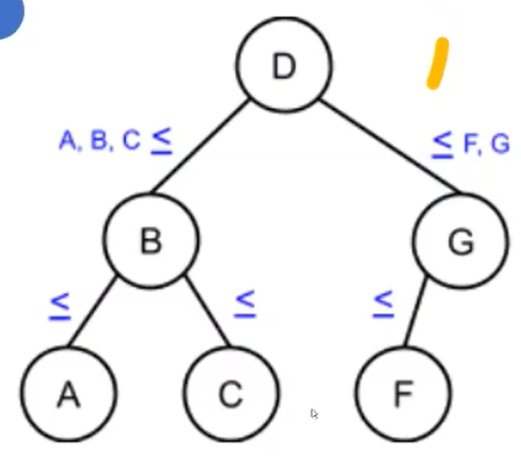

- Binary search trees are fast.  Searching a BST in the worst case scenario requires 
H + 1 comparisons, meaning O(H) comparisons, where H is the tree height  

- A BST search may be as small as O(log n)  

- Thry to keep the tree balanced for best search speed  

- A ** Tree traversal** algorithm visits all nodes in the tree once and performs 
an operation on each node  

- An **inorder traversal** visits all nodes in a BST from smallest to largest, 
which is useful for example to print the tree's nodes in sorted order  

	- Starting from the root, the algorithm recursively prints the left subtree, the 
	current node, and the right subtree  

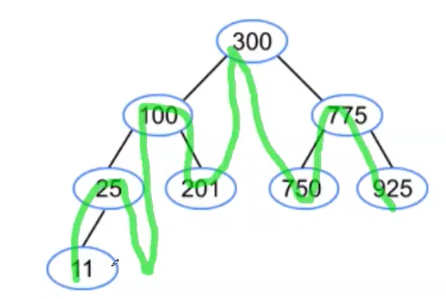  

### Heaps  

- Used when application requires fast access to and removal of the maximum item in 
a changing set of items  

- Heaps keep the highest priority on top but does not fully sort the lower nodes  

- A **max-heap** is a complete binary tree that maintains the simple property that 
a node's key is greater than or equal to the node's children's key  

- Therefore, a max-heap's root always has the maximum key in the entire tree  

- **Heapification**: The process in which an array or binary tree is reshaped 
into a Heap data structure. Since leaf nodes already satisfy the max heap property 
heapifying to build a max-heap is achieved by percolating down on every non-leaf 
node in reverse order. A heap must be a complete binary tree.  

- **Percolating**: ?  

- **Heapsort**: 

	- Heapify the array into a max-heap  
	
	- Initialize an end index value to the size of array minus 1  
	
	- Repeatedly remove the maximum value, stores @ the end index  
	
	- Decrement end index  
	
	- Repeat until the end index is 0  
	
### Hash Table  

- **Has table**: sotres unordered items by mapping (or handling) each item to a 
location in an array  

- Each element is a bucket  

- In a hash table, an item's **key** is the value used to map to an index  

- Keys are ideally unique  

- A **hash function** computes a bucket index from the item's key. O(1)  

	- **Collisions**: occurs when an item being inserted into a hash table maps 
	to the same bucket as an existing item in teh hash table  
	
	- **Chaining**: each bucket has a list of items  
	
	- **Probing**: looks for an empty bucket elsewhere  
	
	- An **empty-since-start** bucket has been empty since the hash table was 
	created  
	
	- An **empty-after-removal** bucket had an item removed that caused the bucket 
	to now be empty  
	

# Lecture 5 Graphs  

**Graphs**: a data structure for representing connections among items  

- Computer networks  

- Product recommendations  

- Social networks  

They are often used to represent a geographic map  

Components:  

- Vertices (nodes)  

- Edges: what connects nodes. Nodes are adjacent, connected by an edge    

### Terminology  

- **Path**: Sequence of edges leading from source to target  

- **Path Length**: Total number of edges in a path  

- **Distance**: Number of edges on the shortes path of 2 werticies  

- **Edge Weights**: Associates a weight (cost, time, etc.) with each edge.
Often represents the length of a travel routes, either in total distance or expected time  

- **Directed Edges**: Sequence of directed edges leading from a source to a 
destination vertex.  

- **Cycle**: a path that starts and ends at the same vertex. A directed graph 
is cyclic if the graph contains a cycle, and acyclic if the graph does not contain 
a cycle  

### Adjacency List  

- Each vertex has a list of adjacent verticies, each list item representing an edge  

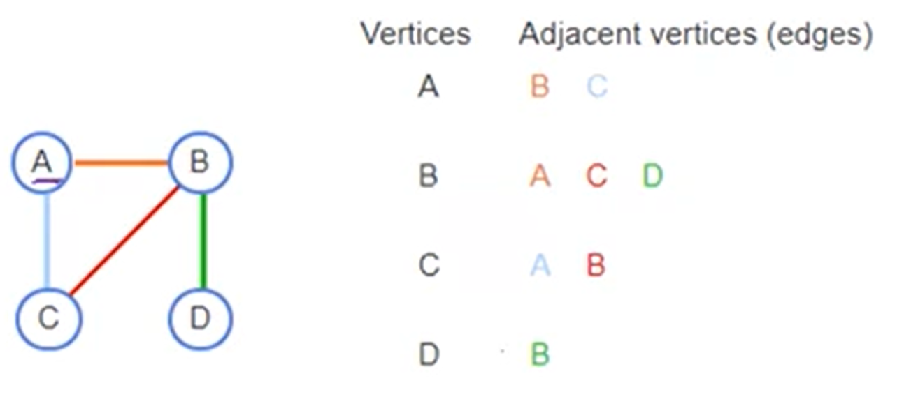  

### Searching  

**Breadth First Search**: traverse a graph by starting at a specific vertex and 
visiting the vertex's adjacent vertices before visiting the next closest verticies. 
No vertex is re-visited  

**Depth First Search**: traverse a graph by first visiting a specific starting vertex,
and then visiting every vertex along each path originating from the starting vertex. 
Each path is traversed to the path's end before backtracking.  

**Dijkstra's Algorithm**: Determines the shortest path from a start vertex to each 
vertex in a graph.  

- For each vertex, Dijkstra's algorithm determines the vertex's distance and
predecessor pointer.  

- **distance** is the shortest path from the start  

- The vertex's **predecessor pointer** points to the previous vertex along the shortest 
path.  


# Lecture 5 Sorting Algorithms  

- Nested for or while loops will cause the algorithm to be O(n^2)

### Bubble Sort  

- Because of the nested loops, bubble sort has a runtime of O(n^2). 

- Bubble sort is often considered impractical for realworld use because many 
faster sorting algorithms exist  

```python
BubleSort(numbers, numbersSize) {
	for (i = 0; i< numbersSize - 1; i++) {
		for (j = 0; j < numbersSize - i - 1; j++) {
			if (numbers[j] > numbers[j +1]) {
				temp = numbers[j]
				numbers[j] = numbers[j + 1] 
				numbers[j + 1] = temp 
			}
		}
	}
}

```

### Selection Sort  

- sorting algorithm that treats the input as two parts, a sorted part and an 
unsorted part. It repeatedly finds the lowest value and swaps it with the current element 
being examined, moving it from the unsorted part to the end of the sorted part 

- runtime of O(n^2). 

```python  
for (i = 0; i < numbersSize - 1; ++i) {
	//Find index of smallest remaining element  
	indexSmallest = i  
	for (j = i + 1; j < numbersSize; ++j) {
		if (numbers[j] < numbers[indexSmallest]) {
			indexSmallest = j
		}
	}
	//Swap numbers[i] and numbers[indexSmallest] 
	temp = numbers[i]
	numbers[i] = numbers[indexSmallest]
	numbers[indexSmallest] = temp
}

```

### Insertion Sort  

- sorts by treating the input as two parts, sorted and unsorted. It repeatedly 
moves the next value from the unsorted part to the sorted part, where it is then
moved into the proper location  

- O(n^2)  

```python  
for i in range(1, len(numbers)):
	j = 1 
	# Insert numbers[i] into sorted part 
	# stopping once numbers[i] in correct position  
	while j > 0 and numbers[j] < numbers[j - 1]:
		# Swap numbers[j] and numbers[j - 1]
		temp = numbers[j]
		numbers[j] = numbers[j - 1] 
		numbers[j-1] = temp 
		j = j - 1

```

### Quick Sort  

- O(n log n)  

- repeatedly partitions the input into low and high parts ( each part unsorted), 
and then recursively sorts each of those parts. To partition the input, quicksort
chooses a pivot to divide the data into low and high parts. The pivot can be any 
value within the array being sorted. 

- Once the pivot is chosen, the array is divided into two parts. Items to the left 
are less than the pivot, while items to the right are greater.  

- The values in each partition are not necessarily sorted  

- Values equal to the pivot may appear in either or both of the partitions  

```python
# Main  

numbers = [ 12, 18, 3, 7, 32, 14, 91, 16, 8, 57]
print('UNSORTED:', numbers)

quicksort(numbers, 0, len(numbers)-1)
print('SORTED:', numbers)
```

```python  
# Quicksort definition  

def quicksort(numbers, start_index, end_index):
	# Only attempt to sort the list segment if there are 
	# at least 2 elements  
	if end_index <= start_index: 
		return  
		
	# Partition the list segment  
	high = partition(numbers, start_index, end_index) 
	
	# Recursively sort the left segment  
	quicksort(numbers, start_index, high)  
	
	# Recursively sort the right segment  
	quicksort(numbers, high + 1, end_index)
	
``` 

```python  
# Partition definition  

def partition(numbers, start_index, end_index): 
	# Select the middle value as the pivot 
	midpoint = start_index _ (end_index - start_index) // 2 
	pivot = numbers[midpoint]
	
	# "low" and "high" start at the ends of the list segment 
	# and move towards each other
	low = start_index 
	high = end_index  
	
	done = False  
	while not done: 
		# Increment Low while numbers{Low} < pivot  
		while numbers[low] < pivot: 
			low = low + 1 
			
		# Decrement high while pivot < numbers[high]
		while pivot < numbers[high]:
			high = high - 1 
			
		# If low and high have crossed eachother, the loop 
		# is done. If not, the elements are swapped, low is 
		# incremented and high is decremented  
		if low >= high:
			done = True  
		else: 
			temp = numbers[low]
			numbers[low] = numbers[high]
			numbers[high] = temp 
			low = low + 1 
			high = high - 1 
	# "high" is the last index in the left segment 
	return high
		
```

### Merge  

- O(n log n)  

- divides a list into two halves, recursively sorts each half, and then merges 
the sorted halves to produce a sorted list. The recursive partitioning continues 
until a list of one element is reached, as a list of one element is already sorted  

```python  
# Main  

# Create a list of unsorted values 
numbers = [61, 76, 19, 4, 94, 32, 27, 83, 58] 

# Print unsorted list 
print('UNSORTED:', numbers) 

# Initial call to merge_sort
merge_sort(numbers, 0, len(numbers) - 1)

# Print sorted list 
print('SORTED:', numbers) 
```

```python 
# Merge Sort definition 

def merge_sort(numbers, i, k):
	j = 0
	
	if i < k: 
		j = (i+ k) // 2 Find the midpoint in the partition 
		
		# Recursively sort left and right partition
		merge_sort(numbers, i, j)
		merge_sort(numbers, j + 1, k)
		
		# Merge left and right partition in sorted order  
		merge(numbers, i, j, k)
```

```python
# Merge definition 

def merge(numbers, i, j, k):
	merge_size = k - i + 1					# Size of merged partition 
	merged_numbers = [0] * merged_size 		# Dynamically allocates temporary array 
											# for merged numbers 
	merge_pos = 0							# Position to insert merged number 
	left_pos = i							# Initialize left partition position 
	right_pos = j + 1 						# Initialize right partition position 
	
	# Add smallest element from left or right partition to merged numbers  
	while left_pos <= j and right_pos <=k:
		if numbers[left_pos] <= numbers[right_pos]:
			merged_numbers[merge_pos] = numbers[left_pos]
			left_pos += 1
		else:
			merged_numbers[merge_pos] = numbers[right_pos]
			right_pos += 1
		merge_pos = merge_pos + 1 
		
	# If left poartition is not empty, add remaining elements to merged numbers 
	while left_pos <= j:
		merged_numbers[merge_pos] = numbers[left_pos]
		left_pos += 1
		merge_pos +=1
		
	# If right partition is not empty, add remaining elements to merged numbers 
	while right_pos <= k:
		merged_numbers[merge_poe] = numbers[right_pos]
		right_pos = right_pos + 1
		merge_pos = merge_pos + 1 
		
	# Copy merge number back to numbers 
	for merge_pos in range(merged_size):
		numbers[i + merge_pos] = merged_numbers[merge_pos]  
		
```

### Radix Sort  

- O(n)  

- designed for integers.  The algorithm makes use of a concept called buckets and
is a type of bucket sort  

- Any array of integer values can be subdivided into buckets by using the integer 
values' digits. Abucket is a collection of integer values that all share a particular
digit value. Ex: Values 57, 97, 77, and 17 all have a 7 as the 1's digit 
and would all be placed into bucket 7 when subdividing by the 1's digit  


# ZyBook  


| Data structure  	|	Description |
| :---				| :--- |
| Record			| A record is the data structure that stores subitems, often called fields, with a name associated with each subitem. |
| Array				| An array is a data structure that stores an ordered list of items, where each item is directly accessible by a positional index. |
| Linked list		| A linked list is a data structure that stores an ordered list of items in nodes, where each node stores data and has a pointer to the next node. |
| Binary tree		| A binary tree is a data structure in which each node stores data and has up to two children, known as a left child and a right child. |
| Hash table		| A hash table is a data structure that stores unordered items by mapping (or hashing) each item to a location in an array. |
| Heap				| A max-heap is a tree that maintains the simple property that a node's key is greater than or equal to the node's childrens' keys. A min-heap is a tree that maintains the simple property that a node's key is less than or equal to the node's childrens' keys. |
| Graph	 			| A graph is a data structure for representing connections among items, and consists of vertices connected by edges. A vertex represents an item in a graph. An edge represents a connection between two vertices in a graph. |  


## 1.2 Algorithm Overview  

**Algorithm**: a set of commands that must be followed for a computer to perform 
calculations or other problem-solving operations  

## 1.3 Introduction to algorithms  

- An algorithm can be described in English, pseudocode, a programming language, 
hardware, etc.  

- **Computational Problem**: specifies an input, a question about the input that 
can be answered using a computer, and the desired output.  

- Algorithm efficiency is most commonly measured by the algorithm **runtime**. 
and an efficient algorithm is one whose runtime increases no more than polynomially 
with respect to the input size.  

- **NP-complete** problems are a set ofproblems for which no known efficient 
algorithm exists. NP-complete problems have the following characteristics:  
	
	- No efficient algorithm has been found to solve an NP-complete problem  
	
	- No one has proven that an efficient algorithm to solve an NP-complete 
	problem is impossible  
	
	- If an efficient algorithm exists for one NP-complete problem, then all 
	NP-complete problems can be solved efficiently  
	
## 1.4 Relation between data structures and algorithms  

Data structures define how data is stored and defines the operations performed 
on the data strucutre.

## 1.5 Abstract Data Types (ADT)  

**Abstract Data Type**: described by predefined usr operations, such as 
"insert data at rear", without indicating how each operation is implemented.   

### Common ADTs:  

|Abstract data type	| Description |	Common underlying data structures |
| :--- | :--- | :--- |
|List	| A list is an ADT for holding ordered data. | Array, linked list |
|Dynamic | array	A dynamic array is an ADT for holding ordered data and allowing indexed access. | Array |
|Stack	| A stack is an ADT in which items are only inserted on or removed from the top of a stack. | Linked list |
|Queue	| A queue is an ADT in which items are inserted at the end of the queue and removed from the front of the queue. | Linked list |
|Deque	| A deque (pronounced "deck" and short for double-ended queue) is an ADT in which items can be inserted and removed at both the front and back. | Linked list |
|Bag	| A bag is an ADT for storing items in which the order does not matter and duplicate items are allowed. | Array, linked list |
|Set	| A set is an ADT for a collection of distinct items. | Binary search tree, hash table |
|Priority | queue	A priority queue is a queue where each item has a priority, and items with higher priority are closer to the front of the queue than items with lower priority. | Heap |
|Dictionary | (Map)	A dictionary is an ADT that associates (or maps) keys with values. | Hash table, binary search tree |

## 1.6 Application of ADTs  

## 1.8 Huffman Compression 

### Basic Compression 

**Compression**: transforms the data to use fewer bits. Compressed data uses less 
storage and can be communicated faster. The basic idea is to encode frequently 
occurring items using fewer bits.  

A **dictionary** can be used to swap the long string for the defined charater in the 
dictionary. Like "01000001" for the original, meaning "A", is changed to "0" by 
the dictionary, where "0" is defined as "A". In the dictionary "G" = 110, so 
01000111 is changed to 110.  

A **character frequency table** is build for an input string. It contains each 
distinct character from the input string and each character's number of occurences  

### Huffman Coding  

**Huffman coding** is a common compression technique that assigns fewer bits to 
frequent items, using a binary tree.  

  

*Note*: For Huffman encoded data, the dictionary must be included along with the
compressed data to enable compression.  

### Building a Huffman Tree  

- Leaf nodes have two data members: a character from the input and an integer frequency 
for that character  

- Internal nodes have left and right child nodes.  

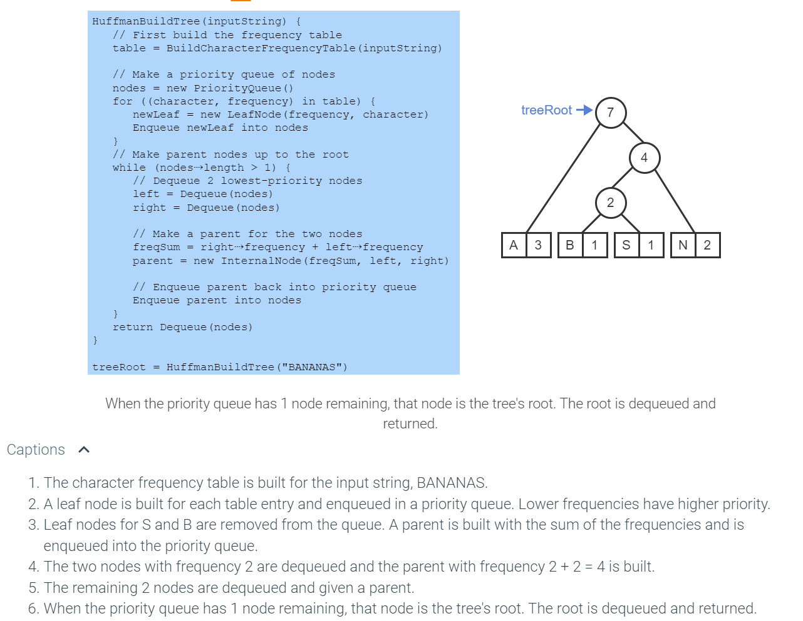  

### Decoding Huffman  

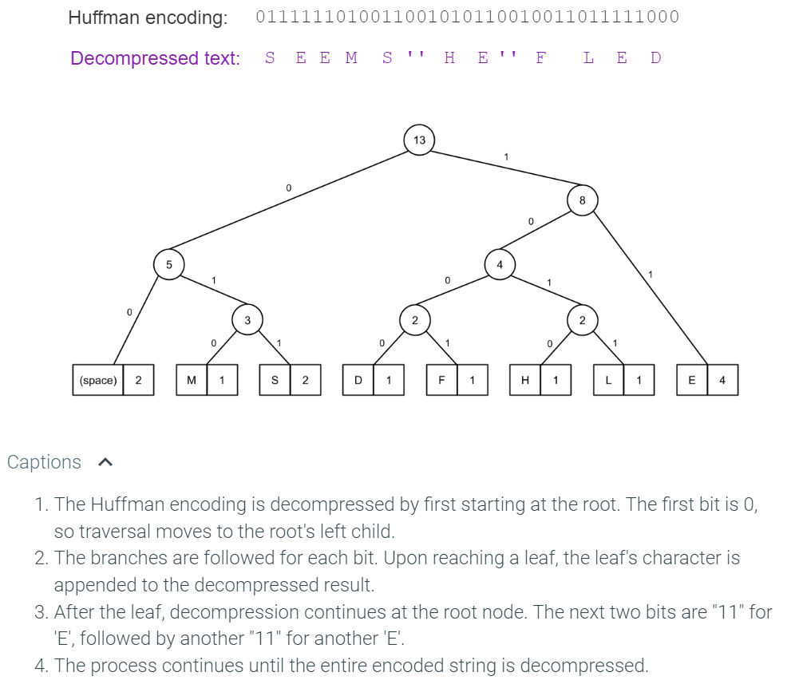

## 1.9 Heuristics  

**Heuristic**: A technique that willingly accepts a non-optimal or less accurate 
solution in order to improve execution speed. *Sacrifice accuracy and optimization*
*for speed*.  

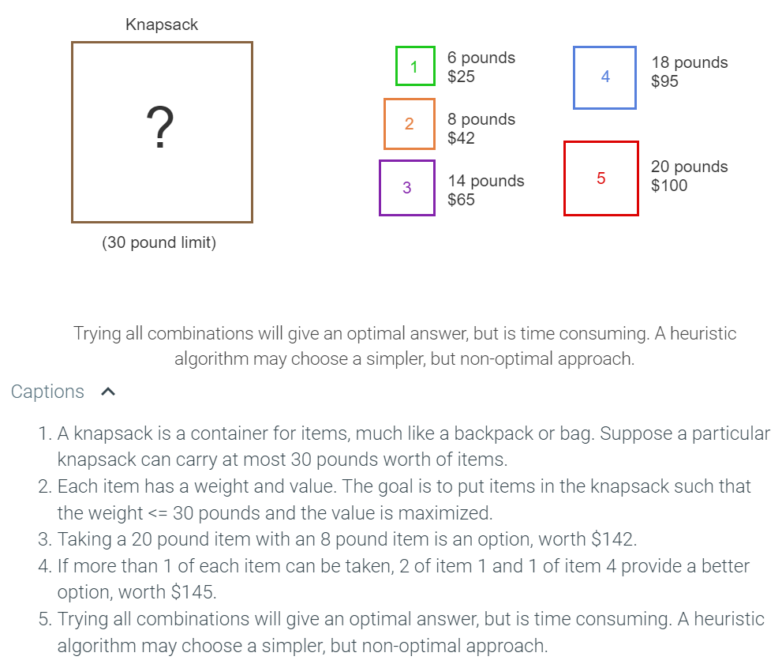  

**Heuristic algorithm**: quickly determines a near optimal or approximate 
solution. 

**Self-adjusting Heuristic**: modifies a data structure based on how the data 
structure is used. Used in a red-black tree or AVL tree. Used to speed up searches 
for frequently-searched items.

## 1.10 Python: Heuristics (Knapsack)  

The 0-1 knapsack problem imposes the restriction that each item can be added at 
most once. A heuristic algorithm to solve the knapsack problem first sorts items 
in descending order by value, and then iteratively places the most valuable items 
that fit within the remaining space into the knapsack until no more items can be 
added.  

## 1.11 Python: Greedy algorithm  

Greedy algorithm solves a problem by assuming that the optimal choice at a given 
moment during the algorithm will also be the optimal choice overall. Greedy algorithms 
tend to be efficient, but some may not find the optimal solution.  

Works for the knapsack problem and the **activity selection problem**  

### Fractional Knapsack Problem  

Sort items by value to weight ratio, in descending order.  

### Activity Selection Problem  

Run the python script for 1.11.3 Activity Selection, the optimal result is the 
count of how many different activities are scheduled. So three one-hour activities 
are considered better than a single four hour activity  

The greedy algorithm shown will always produce the optimal result for the activity
selection problem  

## 1.12 Dynamic Programming  

**Dynamic Programming**: problem solving technique that **splits a problem** into 
smaller subproblems, computes **and stores solutions** to subproblems in memory, and 
then uses the stored solutions to solve the larger problem.  

Look at 1.12.1_fibonacci_recursive_vs_dynamic. The recursive method has a 
runtime of O(1.62^N) while the iterative/dynamic method has a runtime of O(N)  

Dynamic programming avoids recomputing previously computed results by storing and 
reusing such results  

### Longest Common Substring  

**Longest Common Substring** algorithm takes 2 strings as input and determines 
the longest substring that exits in both strings. It uses dynamic programming.  
It uses an N x M integer matrix to keep track of matching substrings.  

The runtimes of the Longest Common Substring is O(NxM)  

A real-world example is finding two common substrings in DNA sequences  

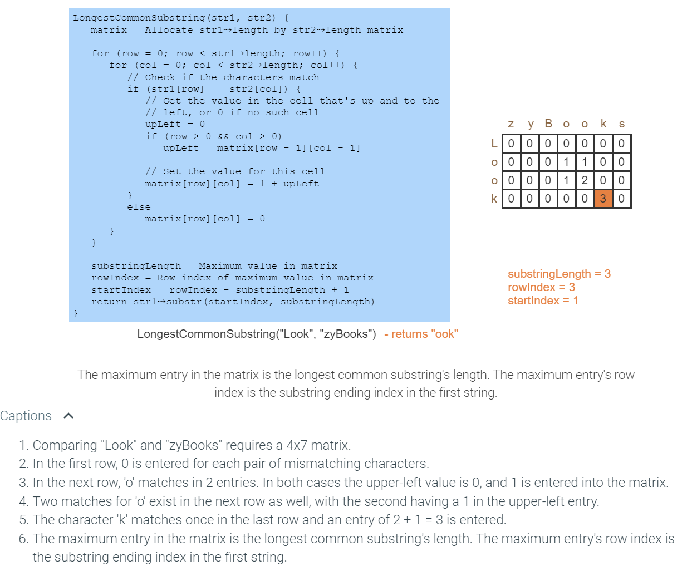  

# Lists  

## 2.1 List abstract data type  

### Common Operations:  

| Operation | Description | Example starting with list: 99, 77 |
| :--- | :--- | :--- |
| Append(list, x)	| Inserts x at end of list	| Append(list, 44), list: 99, 77, 44 |
| Prepend(list, x)	| Inserts x at start of list | Prepend(list, 44), list: 44, 99, 77 |
| InsertAfter(list, w, x) | Inserts x after w | InsertAfter(list, 99, 44), list: 99, 44, 77 |
| Remove(list, x) | Removes x | Remove(list, 77), list: 99 |
| Search(list, x) | Returns item if found, else returns null | Search(list, 99), returns item 99 Search(list, 22), returns null |
| Print(list) | Prints list's items in order | Print(list) outputs: 99, 77 |
| PrintReverse(list) | Prints list's items in reverse order | PrintReverse(list) outputs: 77, 99 |
| Sort(list) | Sorts the lists items in ascending order | list becomes: 77, 99 |
| IsEmpty(list) | Returns true if list has no items | For list 99, 77, IsEmpty(list) returns false |
| GetLength(list) | Returns the number of items in the list | GetLength(list) returns 2 | 

## 2.2 List Data Structure  

**List data structure**: will contain the list's head, tail, and information like 
list size.  

Linked List has an O(N) space complexity. 

A List space complexity is O(1).

## 2.3 Singly-linked Lists  

**Singly-linked list** has pointers to the next node. It is a type of positional 
list.  

## 2.4 Singly-Linked List: Insert  

## 2.5 Singly-Linked List: Remove  

## 2.6 Linked List Search  

## 2.7 Python Linked List

See the example in folder 2.7 Linked List  

## 2.8 Doubly-linked lists  

Has pointer to next and previous node. Another type of positional list.  

## 2.11 Python: Doubly-linked List  

See 2.11 Doubly Linked List folder for example  

## 2.12 Circular Lists  

Where the tail's next pointer is to the head node. Head node previous is to the 
tail node.  

## 2.13 Linked List Traversal  

**List Traversal** visits all nodes and performs an operation  

## 2.14 Sorting Linked Lists  

Insertion sort must be a Doubly-linked-list, it will rerquire backwards traversal.  

Insertion Sort runtime is O(N^2)  

Singly List Sort is the same runtime, O(N^2)  

### Sorting linked-lists vs. arrays

Sorting algorithms for arrays, such as quicksort and heapsort, require 
constant-time access to arbitrary, indexed locations to operate efficiently. 
Linked lists do not allow indexed access, making for difficult adaptation of 
such sorting algorithms to operate on linked lists.  

**Sorting algorithms that easily adapt to link list**: 

- **Insertion Sort**: Operates similarly on doubly-linked lists.Requires searching 
from the head of the list for an elements's insertion position ofr singly-linked 
lists.  

- **Merge Sort**: Finding the middle of the list requires searching linearly from
the head of the list. The merge algorithm can also merge lists without additional 
storage.  

**Sorting Algorithms that are difficult to adapt to efficiently with sort linked lists**:  

- **Shell Sort**: Jumping the gap between elements cannot be done on a linked list, 
as each element between two elements must be traversed.  

- **Quicksort**: Partitioning requires backward traversal through the right 
portion of the array. Singly-linked lists do not support backward traversal.  

- **Heap sort**: Indexed access is required to find child nodes in constant time 
when percolating down.  

## 2.15 Python Sorting Linked Lists

See examples for 2.15 sorting singly and doubly linked lists  

## 2.16 Linked List dummy nodes  

 **dummy node (or header node)**: A node with an unused data member that always 
 resides at the head of the list and cannot be removed. Using a dummy node 
 simplifies the algorithms for a linked list because the head and tail pointers 
 are never null.

An empty list consists of the dummy node, which has the next pointer set to null, 
and the list's head and tail pointers both point to the dummy node.

## 2.17 Linked List: Recursion  

Used for list traversal  

Used for searching  

Used for reverse traversal  

## 2.18 Array-based lists  

**array-based lists**: list ADT implemented using an *array*. Unlike normal arrays, 
the list size will dynamically allocate as needed.  

**Resize Operation**: array-based lists must be re-sized if an item is added when 
the allocation size equals the list length. Copying items from the old array to 
the new array has a runtime of O(N).  

**Prepend**: runtime of O(N), all items have to be moved by one position to make 
room at the front.  

**Search**: returns -1 if not found. Worst case runtime of O(N).  

## 2.19 Python Array based List Example  

see 2.19 Array List folder. After running `py main.py`, enter `insert_after 5 3`  

# Stacks and Queues  

## 3.1 Stack abstract data type (ADT)  

**Stack**: only inserted or removed from the top of the stack.  

- Operations: push and pop  

- Last-in-first-out  

**Common Stack operations**:  

| Operation | Description | Example starting with stack: 99, 77 (top is 99). |
| :--- | :--- | :--- |
| Push(stack, x) | Inserts x on top of stack | Push(stack, 44). Stack: 44, 99, 77 |
| Pop(stack) | Returns and removes item at top of stack | Pop(stack) returns: 99. Stack: 77 |
| Peek(stack) | Returns but does not remove item at top of stack | Peek(stack) returns 99. Stack still: 99, 77 |
| IsEmpty(stack) | Returns true if stack has no items | IsEmpty(stack) returns false. |
| GetLength(stack) | Returns the number of items in the stack | GetLength(stack) returns 2. |  

Note: Pop and Peek operations should not be applied to an empty stack; the 
resulting behavior may be undefined.  

## 3.2 Stacks Using Linked Lists  

## 3.3 Python: Array-based stacks  

**Unbounded stack**: stack with no upper limit on length.  
**Bounded stack**: length that does not exceed a maximum value.  

See example of an optionally bounded Stack ADT in 3.3.1 List Based Stack folder  

## 3.4 Queue abstract data type (ADT)  

**Queue**: items are added to the end of the queue and removed from the front. 
Referred to as a **first-in first-out** ADT.  

**Enqueue**: adds an item to the end of the queue  

**Dequeue**: removes an item from the front.  

**Common Queue operations**:  

| Operation	| Description | Example starting with queue: 43, 12, 77 (front is 43) |
| :--- | :--- | :--- |
| Enqueue(queue, x) | Inserts x at end of the queue | Enqueue(queue, 56). Queue: 43, 12, 77, 56 |
| Dequeue(queue) | Returns and removes item at front of queue | Dequeue(queue) returns: 43. Queue: 12, 77 |
| Peek(queue) | Returns but does not remove item at the front of the queue | Peek(queue) return 43. Queue: 43, 12, 77 |
| IsEmpty(queue) | Returns true if queue has no items | IsEmpty(queue) returns false. |
| GetLength(queue)  | Returns the number of items in the queue | GetLength(queue) returns 3. |  

## 3.5 Queues using linked lists  

Queues often use linked lists  

## 3.6 Python: Array-based queues  

Look at the example in 3.6 Array Based Queue folder.  

A queue can be implemented with an array. Two variables are needed in addition
to the array:

- length: an integer for the queue's length.
 
- front_index: an integer for the queue's front item index.  

Queues can be **bounded** or **unbounded**  

An array-based queue implementation can support both bounded and unbounded 
queue operations by using max_length as follows:

- If max_length is negative, the queue is unbounded.

- If max_length is nonnegative, the queue is bounded.  

### Worst-case time complexity 

Using the implementation from above, worst-case time complexities are the same 
whether the queue is bounded or unbounded: O(N) for enqueue and O(1) for dequeue.

An alternate implementation of the bounded queue, not presented in this section,
uses max_length as the array's initial allocation size. Such an implementation 
never needs to resize and so the enqueue operation's worst-case time is O(1).  

## 3.7 Python: Stacks and queues using linked lists  

see Queue and Stack examples from 3.7 Queue Stack Linked List folder  

## 3.8 Deque abstract data type (ADT)  

**Deque (deck)**: double ended queue, is an ADT in which items can be inserted 
and removed at both front and back.

**Common Operations**:  

| Operation | Description | Example starting with deque: 59, 63, 19 (front is 59) | 
| :--- | :--- | :--- |
| PushFront(deque, x) | Inserts x at the front of the deque	 | PushFront(deque, 41). Deque: 41, 59, 63, 19 |
| PushBack(deque, x) | Inserts x at the back of the deque | PushBack(deque, 41). Deque: 59, 63, 19, 41 |
| PopFront(deque) | Returns and removes item at front of deque | PopFront(deque) returns 59. Deque: 63, 19 |
| PopBack(deque) | Returns and removes item at back of deque | PopBack(deque) returns 19. Deque: 59, 63 |
| PeekFront(deque) | Returns but does not remove the item at the front of deque | PeekFront(deque) returns 59. Deque is still: 59, 63, 19 |
| PeekBack(deque) | Returns but does not remove the item at the back of deque | PeekBack(deque) returns 19. Deque is still: 59, 63, 19 |
| IsEmpty(deque) | Returns true if the deque is empty | IsEmpty(deque) returns false. |
| GetLength(deque) | Returns the number of items in the deque | GetLength(deque) returns 3. |  


# 4 Hash Tables  

## 4.1 Hash Tables  

**Hash Table**: Stores unordered items by mapping (or hashing) each item to a location 
in an array (or vector). An item's key is the value used to map to an index. Each 
hash table array element is called a **bucket**. A **hash function** computes a 
bucket index from the item's key.  

Commonly use the modulo operator % in hash functions  

### Collisions  

**Collisions**: occur when an item being inserted into a hash table maps to the 
same bucket as an exiting item.
	
- **Chaining**: is a collision resolution technique where each bucket has a 
list of items (so bucket 5's list would become 55, 75).  

- **Open addressing**: is a collision resolution technique where collisions 
are resolved by looking for an empty bucket elsewhere (so 75 might be stored 
in bucket 6).  

## 4.2 Chaining  

## 4.3 Linear Probing  

**Linear probing**: handles collision by starting at the key's mapped 
bucket, and then linearly searches subsequent buckets until an empty bucket is 
found.    

### Empty Bucket Types  

Two types of empty buckets:  

- **Empty-since-start**: bucket has been empty since the hash table was created.  

- **Empty-after-removal**: bucket had an item removed that caused the bucket 
to now be empty.  

Searching stops for *empty-since-start* buckets  

## 4.4 Quadratic Probing  

A hash table with **quadratic probing** handles a collision by starting at the 
key's mapped bucket, and then quadratically searches subsequent buckets until 
an empty bucket is found. If an item's mapped bucket is H, the formula
`(H + c1 * i + c2 * i^2)mod (table size)` is used to determine the item's index 
in the hash table. c1 and c2 are programmer-defined constants for quadratic 
probing. Inserting a key uses the formula, starting with i = 0, to repeatedly 
search the hash table until an empty bucket is found. Each time an empty bucket 
is not found, i is incremented by 1. Iterating through sequential i values to 
obtain the desired table index is called the **probing sequence**.  

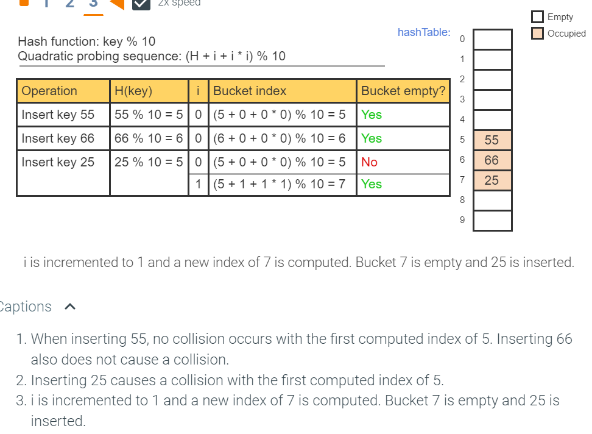  

## 4.5 Double Hashing  

**Double hashing** is an open-addressing collision resolution technique that uses 2 
different hash functions to compute bucket indices. 

- `(h1(key) + i* h2(key)) mod (table size)` where h1 and h2 are the hash functions 
and i is incremented until an empty bucket is found.  

- The i in the above sequence displays a *probing sequence*  

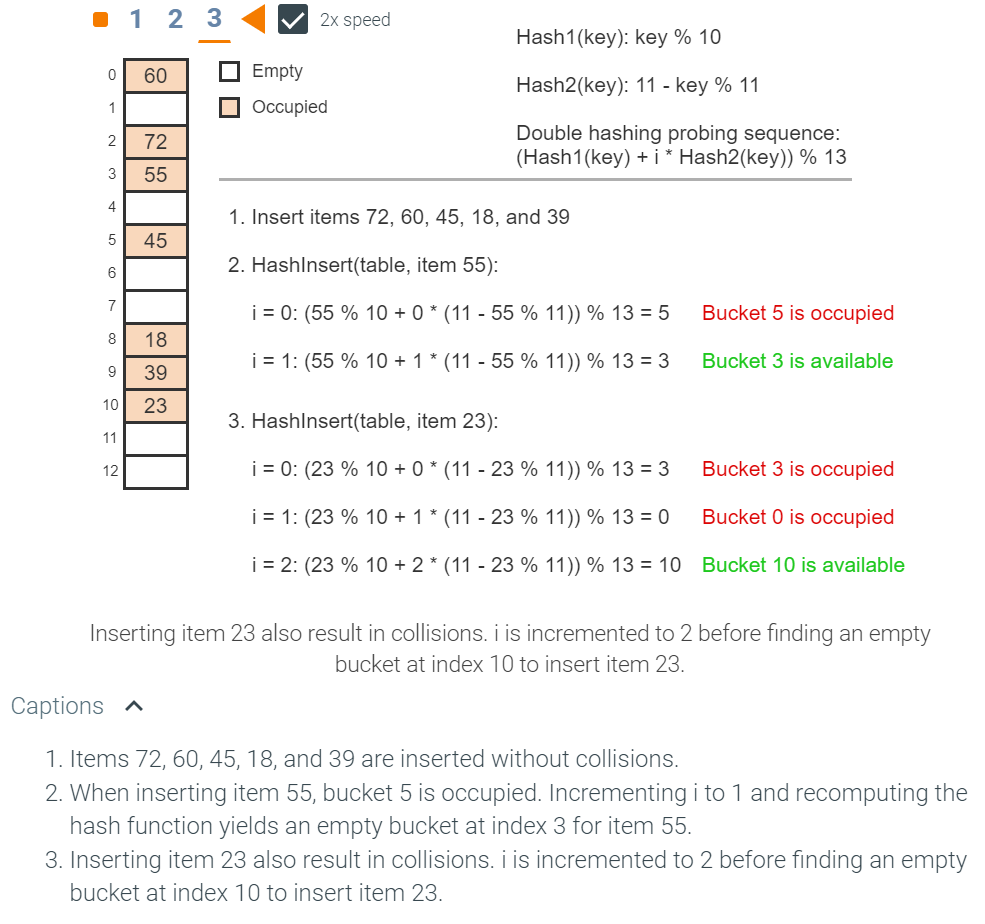  

## 4.6 Hash Table Resizing  

Commonly resizes to the next prime number >= N \* 2. A new array is allocated 
and all items from the old array are re-inserted into the new array. Resizing 
operations time complexity = O(N)  

### When to resize  

**Load Factor**: is the number of itmes in the hash table divided by the number 
of buckets. Ex: 18/31 = 0.58.  

An implementation may choose to resize the hash table when one or more of the 
following values exceeds a certain threshold:

- Load factor
- When using open-addressing, the number of collisions during an insertion
- When using chaining, the size of a bucket's linked-list  

In a hash table using open addressing, the load factor cannot exceed 1.0.  

In a hash table using chaining, the load factor can exceed 1.0.

## 4.7 Common hash functions  

** A good hash function minimizes collisions**  

A **perfect hash function** maps items to buckets with no collisions. A perfect 
hash function can be created if the number of items and all possible item keys 
are known beforehand. The runtime for insert, search, and remove is O(1) with a 
perfect hash function.  

- With chaining, a good hash function results in short bucket lists and thus fast 
inserts, searches, and removes.  

- With linear probing, a good hash function will avoid hashing multiple items to 
consecutive buckets and thus minimize the average linear probing length to 
achieve fast inserts, searches, and removes.

### Modulo hash function  

### Mid-square hash function  

A **mid-square hash** squares the key, extracts R digits from the result's middle, 
and returns the remainder of the middle digits divided by hash table size N.

Ex: For a hash table with 100 entries and a key of 453, the decimal (base 10) 
mid-square hash function computes 453 \* 453 = 205209, and returns the middle 
two digits 52. For N buckets, R must be greater than or equal to `[log10 N]`
to index all buckets. The process of squaring and extracting middle digits 
reduces the likelihood of keys mapping to just a few buckets.  

### Multiplicative string hash function  

A **multiplicative string hash** repeatedly multiplies the hash value and adds the 
ASCII (or Unicode) value of each character in the string.  

EX:  
```  
Initial value = 0
Hash multiplier = 1
String = BAT

A hash multiplier of 1 will simply add the characters' ASCII values.

stringHash = InitialValue + B + A + T = 0 + 66 + 65 + 84 = 215.
215 % 1000 = 215.


------------------------

InitialValue = 17  
HashMultiplier = 3  
String = WE  

stringHash = InitialValue = 17
stringHash = 17 * 3 + W = 17 * 3 + 87 = 138.
stringHash = 138 * 3 + E = 138 * 3 + 69 = 483.
483 % 1000 = 483.
```

## 4.8 Direct Hashing  

A **direct hash function** uses the item's key as the bucket index. Ex: If the key 
is 937, the index is 937. A hash table with a direct hash function is called a 
**direct access table**. Given a key, a direct access table *search* algorithm returns 
the item at index key if the bucket is not empty, and returns null (indicating 
item not found) if empty.  

A direct access table has the advantage of no collisions: Each key is unique 
(by definition of a key), and each gets a unique bucket, so no collisions can 
occur. However, a direct access table has two main limitations.

- All keys must be non-negative integers, but for some applications keys may be
negative.

- The hash table's size equals the largest key value plus 1, which may be very 
large.  


## 4.9 Hashing Algorithms: Cryptography, Passowrd Hashing  

**Cryptography** is a field of study focused on transmitting data securely. Secure 
data transmission commonly starts with **encryption**: alteration of data to 
hide the original meaning. The counterpart to encryption is **decryption**: 
reconstruction of original data from encrypted data.  

Ex: A hashing algorithm called **MD5** produces a 128-bit hash value for any input
data. The hash value cannot be used to reconstruct the original data, but can 
be used to help verify that data isn't corrupt and hasn't been altered.  

## 4.10 Python: Hash Tables  

Section has examples of Double-Hashing, Quadratic Probing Hashing, Linear Probing,
Chaining, and Open Addressing.

See folder 4.10 HashTables  

## 4.11 LAB: Course gradebook with dict  

# 5 Trees  

## 5.1 Binary Trees  

Each node has up to 2 children, known as left child and right child  

**Leaf**: a tree with no children  

**Internal node**: A node with at least one child.  

**Parent**: A node with a child is said to be that child's parent. A node's 
**ancestor** include the node's parent, the parent's parent, etc.. up to the root.  

**Root**: The on tree node with no parent (the top node).  

**Edge**: the link between a child and the parent node.  

**Depth**: is the number of *edges* on the path from the root to the node. The
root node thus has depth 0.  

**Height**: is the largest depth of any node. A tree with just one node has
a height of 0.  

A binary tree is **full** if every node contains 0 or 2 children.  

A binary tree is **complete** if all levels, except possibly the last level, 
contains all possible nodes and all nodes in the last level are as far left as 
possible.  

A binary tree is **perfect** if all internal doces have 2 children and all leaf 
nodes are at the same level.  

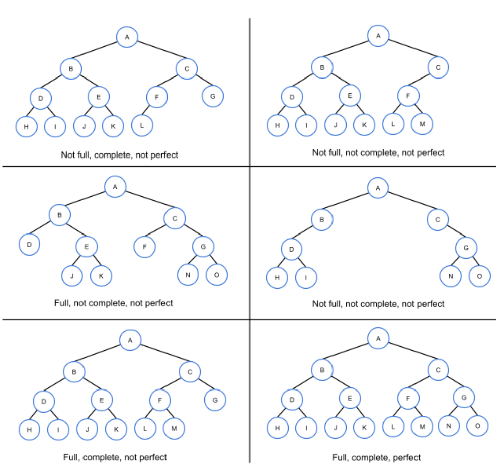  

## 5.2 Applications of Trees  

### File System  

Files are always leafs. Empty folders are leafs.  

### Binary space partitioning  

**Binary Space Partitioning (BSP)**: technique of repeatedly separating a region 
of space into 2 parts and cataloging objects contained within the regions.  

A **BSP tree** is a binary tree used to store information for binary space 
partitioning. Each node in a BSP tree contains information about a region of 
space and which objects are contained in the region.  

In graphics applications, a BSP tree can be used to store all objects in a 
multidimensional world. The BSP tree can then be used to efficiently determine 
which objects must be rendered on screen. The viewer's position in space is 
used to perform a lookup within the BSP tree. The lookup quickly eliminates a 
large number of objects that are not visible and therefore should not be 
rendered.  

## 5.3 Binary Search Trees  

**Binary Serach Tree (BST)**: Ordered so that the left subnode is <= the node, 
and the right subnode is >= the node.  

  

A BST may render faster results *than searching a list*  

### BST search runtime  

Searching a BST in the worst case requires H + 1 comparisons, meaning **O(H)** 
comparisons, where H is the tree height. Node height may be as small as 
O(logN).  

A binary tree's height can be minimized by keeping all levels full, except 
possibly the last level. Such an "all-but-last-level-full" binary tree's 
height is **H = floor(log2 N)**  

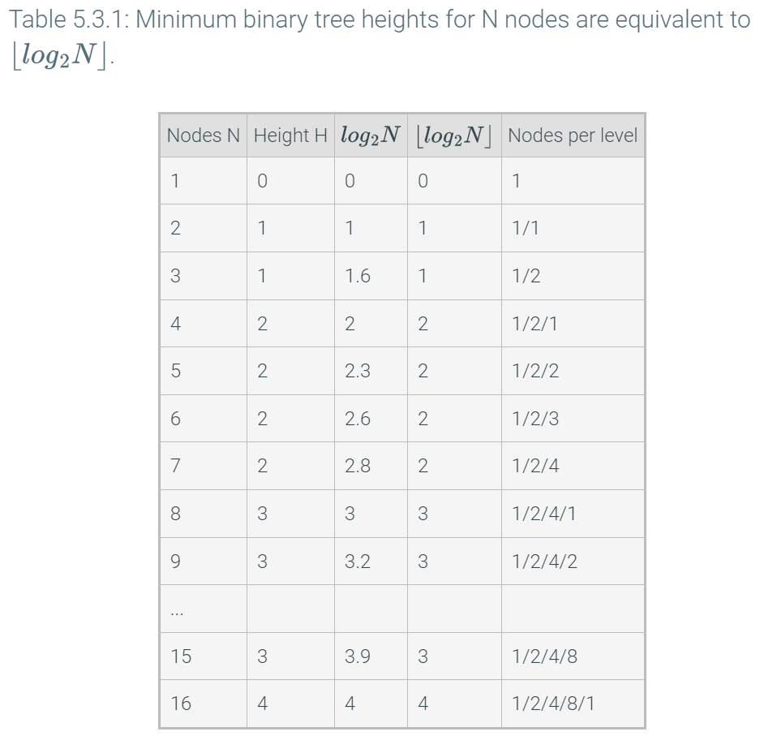  

Searching a perfect BST with N nodes requires only O(logN) comparisons.  

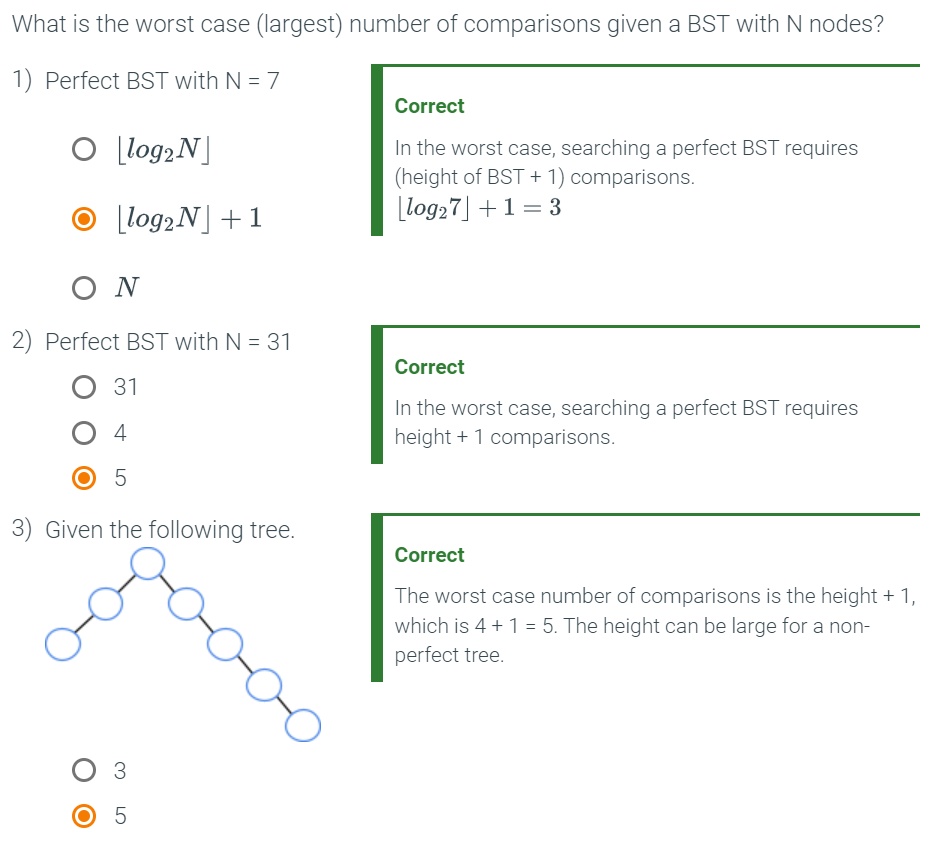  

### Successors and Predecessors  

If the ordering were A,B,C; to B, A would be the **predecessor** and C would 
be the **successor**. 

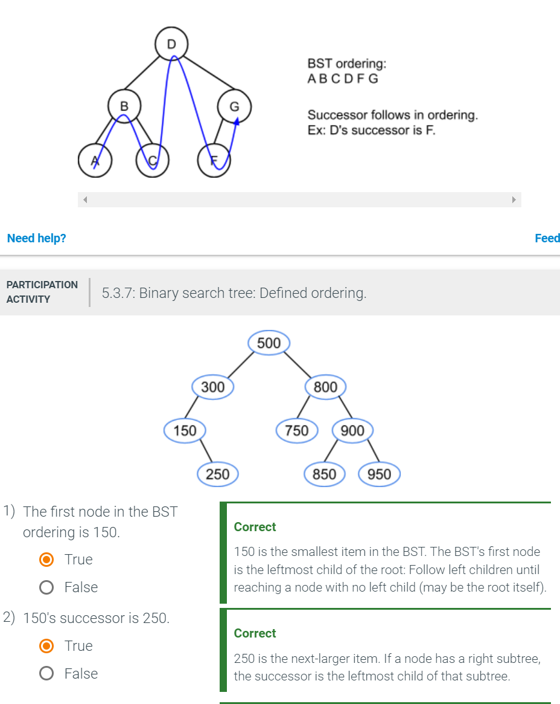 

## 5.4 BST search algorithm  

BST search returns the first matching node or null.  

## 5.5 BST insert algorithm  

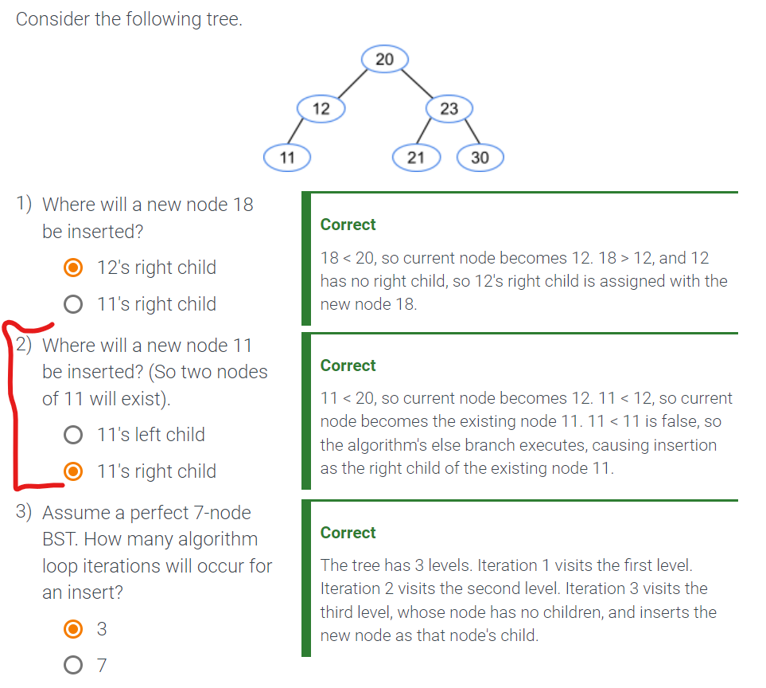 

Insertion *best* runtime is **O(logN)** the *worst case* is **O(N)**

The *space complexity* of insertion is O(1), becuase only a single pointer 
is used to traverse the tree to find the insertion location.  

## 5.6 BST remove Algorithm  

Three different processes based on the condition for **removing a node**: 

- Remove a leaf node: If X has a parent (so X is not the root), the parent's 
left or right child (whichever points to X) is assigned with null. Else, if X 
was the root, the root pointer is assigned with null, and the BST is now empty. 

- Remove an internal node with single child: If X has a parent (so X is not the 
root), the parent's left or right child (whichever points to X) is assigned with
X's single child. Else, if X was the root, the root pointer is assigned with
X's single child.

- Remove an internal node with two children: This case is the hardest. First, 
the algorithm locates X's successor (the leftmost child of X's right subtree), 
and copies the successor to X. Then, the algorithm recursively removes the 
successor from the right subtree.

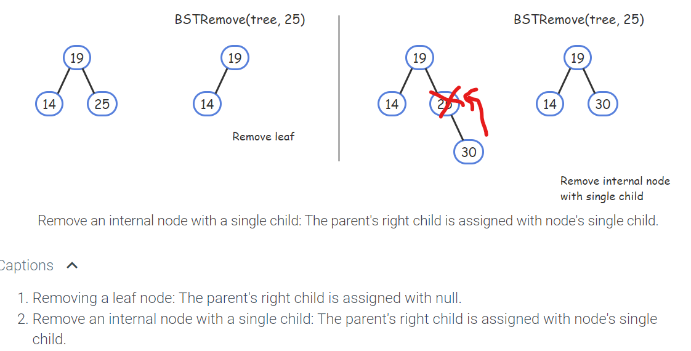  

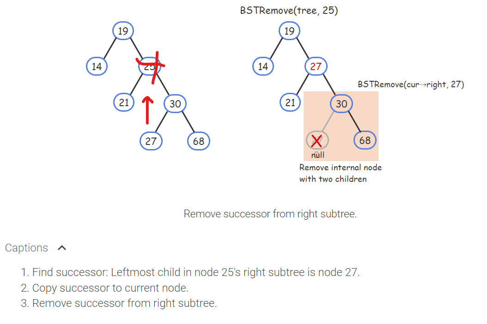  

**Removal Time Complexity**: Worst case time complexity is **O(logN)** for a BST with 
log2 N levels and worst case **O(N)** for a tree with N levels.  

**Removal Space Complexity**: Two pointers are used to traverse the tree during 
removal. When the node being removed has two children, a third pointer and a 
copy of one node's data are also used, and one recursive call is made. So removal's 
space complexity is always **O(1)**  

## 5.7 BST inorder traversal  

A **tree traversal** algorithm visits all nodes in the tree once and performs 
an operation on each node. An **inorder traversal** visits all nodes in a BST 
from smallest to largest, which is useful for example to print the tree's nodes 
in sorted order.  

## 5.8 BST height and insertion order  

The minimum N-node binary tree height is h = floor(log2 N)  

The maximum N-node tree height is N-1 (the -1 because the root is at 0)  

Searching a BST is fast if the tree's height is near the minimum, done by inserting 
nodes in random order:

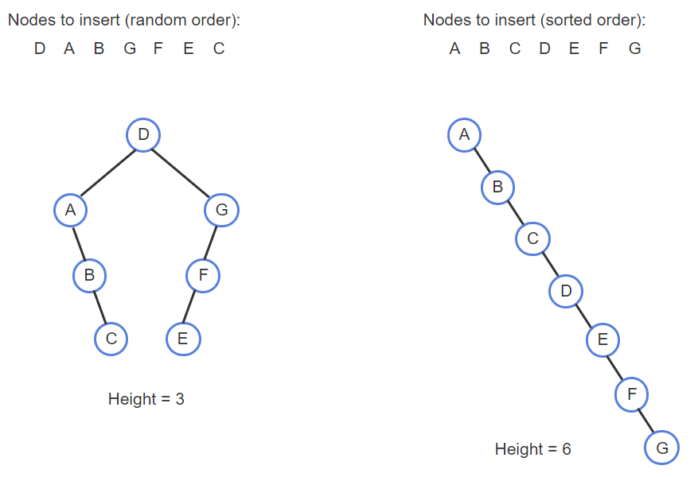  

## 5.9 BST parent node pointers  

## 5.10 BST Recursion  

## 5.11 Tries  

A **trie (or prefix tree)** is a tree representing a set of strings. Each 
non-root node represents a single character. Each node has at most one child 
per distinct alphabet character. A **terminal node** is a node that represents a 
terminating character, which is the end of a string in the trie.

Tries provide efficient storage and quick search for strings, and are often 
*used to implement auto-complete and predictive text input*.  

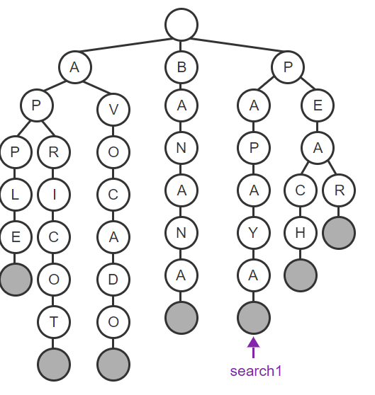  

### Removal  

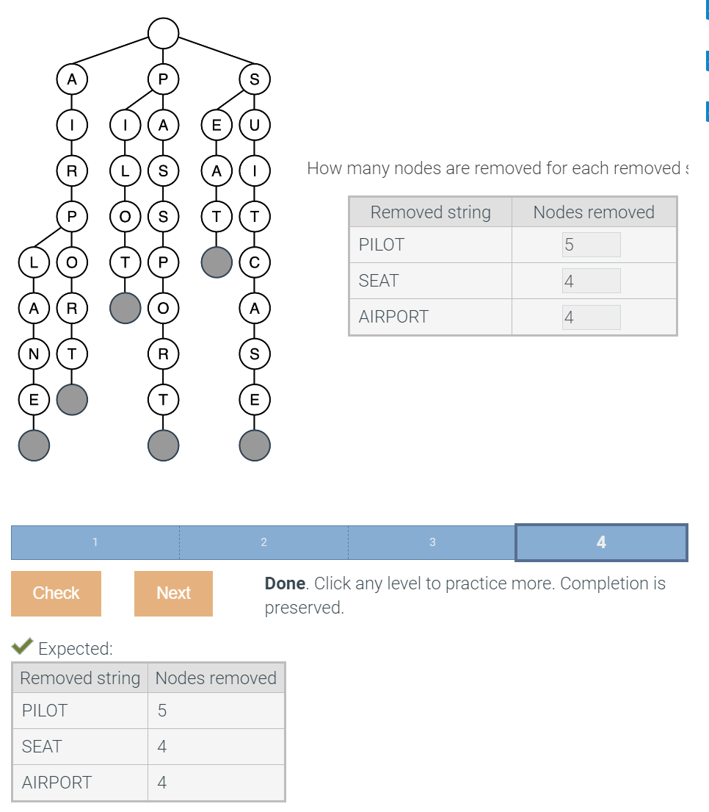  

## 5.12 Python Binary Search Tree  

see folder 5.12 BST. Enter a list of numbers with spaces, like 3 10 7 2 8 8 4 9 5 1 6  

# 6 Balance Trees  

## 6.1 AVL: Balanced tree  

An **AVL tree** *is a BST* with a height balance property and specific operations to 
rebalance the tree when a node is inserted or removed.  

A *BST* is **height balanced** if for any node, the heights of the node's left 
and right subtrees *differ by only 0 or 1*. 

A node's **balance factor** is the left subtree height minus the right subtree 
height, which is 1, 0, or -1 in an AVL tree.  

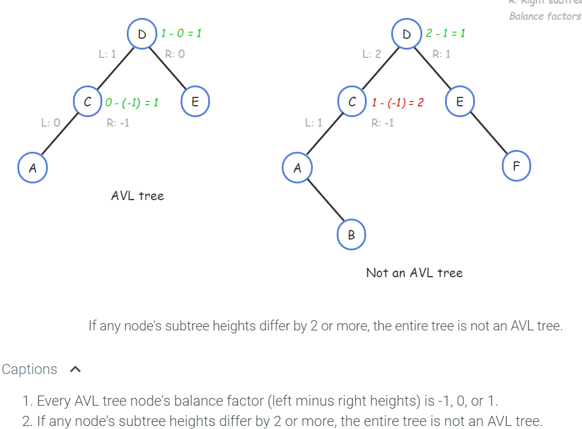  

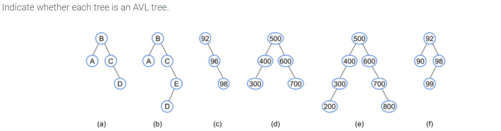  

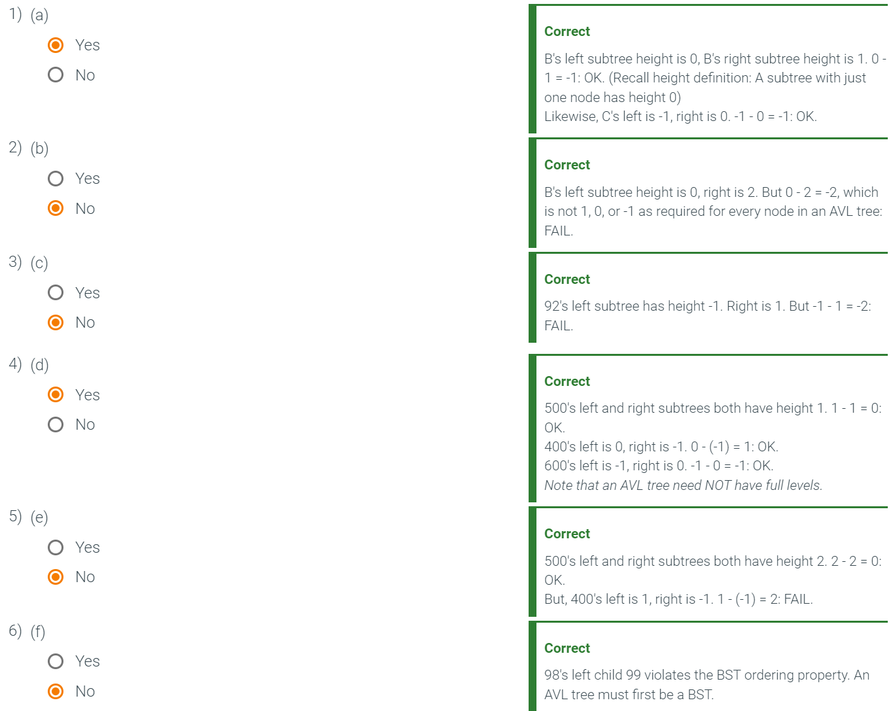  

An AVL tree doesn't always have the minimum possible height, but has a height no 
worse than 1.5x the minimum.  

What is the minimum possible height of an AVL tree with 7 nodes? 2

What is the maximum possible height of an AVL tree with 7 nodes? 3. 1.5 x 2 = 3  

## 6.2 AVL Rotations  

Inserting an item into an AVL tree may require rearranging the tree to maintain 
height balance. A **rotation** is a local rearrangement of a BST that maintains 
the BST ordering property while rebalancing the tree.  

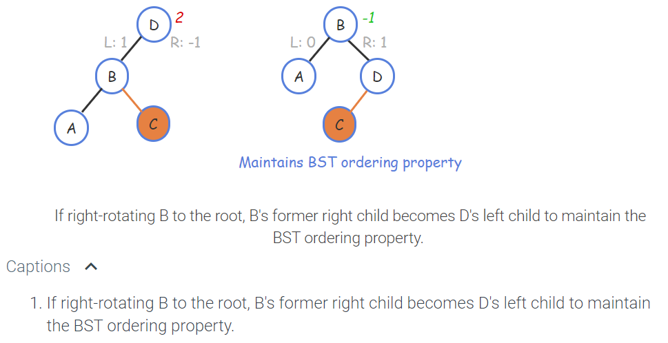  

When an AVL tree node has a balance factor of 2 or -2, which only occurs after 
an insertion or removal, the node must be rebalanced via rotations.  

## 6.3 AVL Insertions  

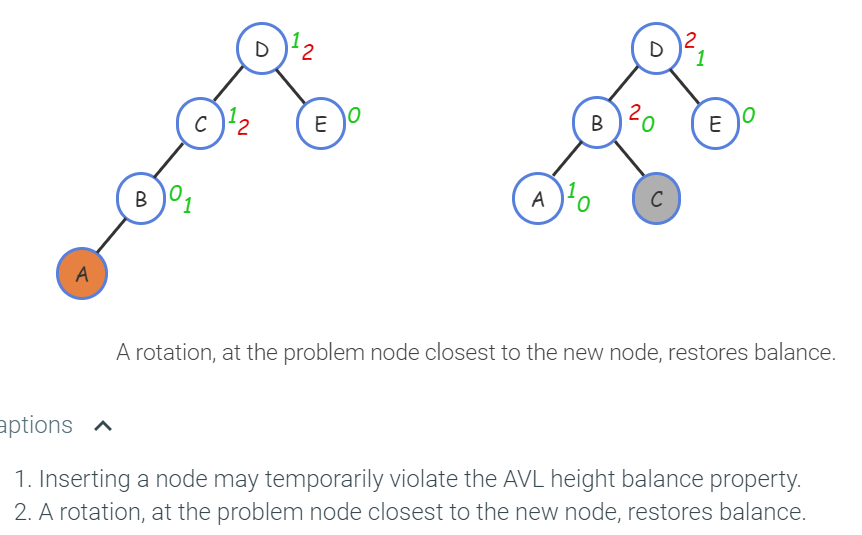  

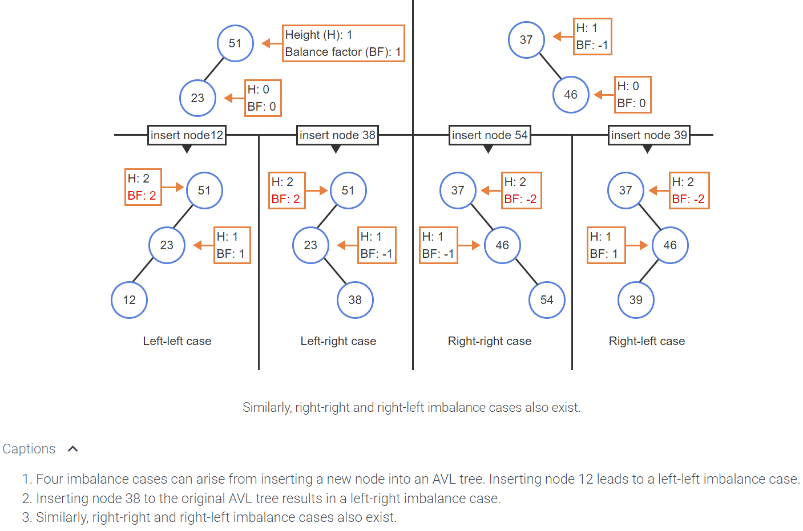  

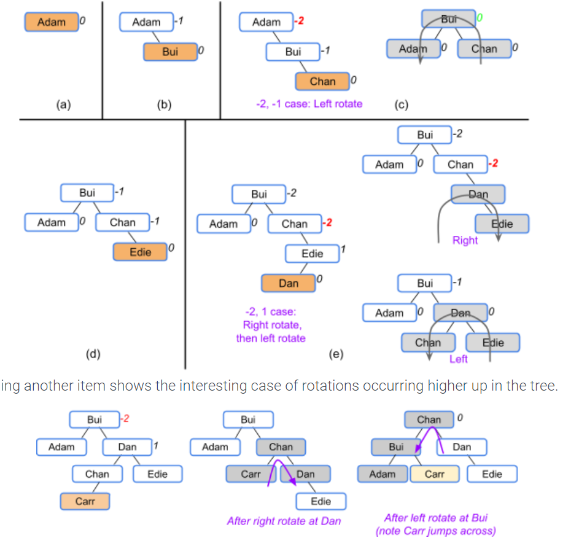  

## 6.4 AVL Removals  

## 6.5 Python AVL Tree  

See example folder  

## 6.6 Red-black tree: A balance tree  

A **red-black tree** *is a BST* with two node types, namely red and black, and 
supporting operations that ensure the tree is balanced when a node is inserted
or removed. The below red-black tree's requirements ensure that a tree with N 
nodes will have a height of O(log N).

- Every node is colored either red or black.
- The root node is black.
- A red node's children cannot be red.
- A null child is considered to be a black leaf node.
- All paths from a node to any null leaf descendant node must have the 
same number of black nodes.  

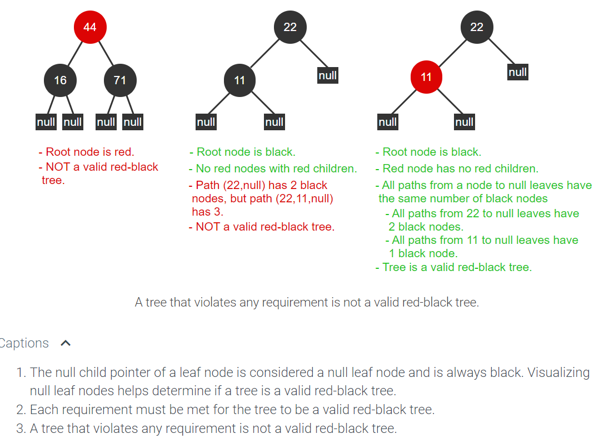  

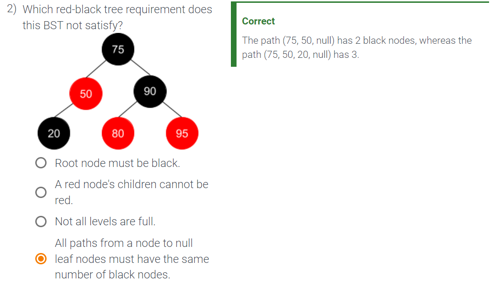  

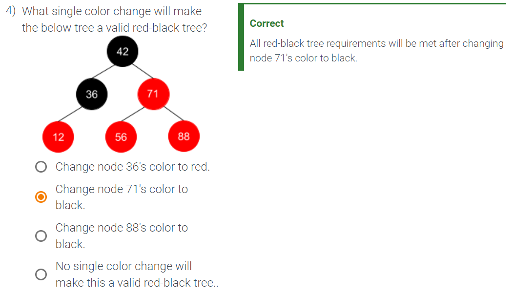  

Coloring all nodes black will NOT make the tree a valid red-black tree. 
Unless all levels in a BST are full, coloring all nodes black will inevitably 
violate the requirement that all paths to null leaf nodes must have the same 
number of black nodes.  

## 6.7 Red-black Rotations  

A left rotation at a node causes the node's right child to take the node's 
place in the tree. A right rotation at a node causes the node's left 
child to take the node's place in the tree.  

## 6.8 Red-black Insertion  

## 6.9 Red-black removal  

### Prepare for removal algorithm case descriptions:

| Case # | Condition | Action if condition is true | Process additional cases after action? |
| :--- | :--- | :--- | :--- |
| 1 | Node is red or node's parent is null. | None. | No |
| 2 | Sibling node is red. | Color parent red and sibling black. If node is left child of parent, rotate left at parent node, otherwise rotate right at parent node. | Yes |
| 3 | Parent is black and both of sibling's children are black. | Color sibling red and call removal preparation function on parent. | No |
| 4 | Parent is red and both of sibling's children are black. | Color parent black and sibling red. | No |
| 5 | Sibling's left child is red, sibling's right child is black, and node is left child of parent. | Color sibling red and sibling's left child black. Rotate right at sibling. | Yes |
| 6 | Sibling's left child is black, sibling's right child is red, and node is right child of parent. | Color sibling red and sibling's right child black. Rotate left at sibling. | Yes |

## 6.10 Python: Red-black tree  

See example in folder 6.10 Red Black Tree.  

Use these values as input:  
15 42 77 18 90 21 36 19 89 47  
15 47 40 19

## 6.11 LAB: AVL tree Nth largest operation  

## 6.12 LAB: Red-black tree Nth Largest operation  

# 7 Heaps  

## 7.1 Heaps  

A use for heaps is to keep the order of priority.  

A **max-heap** is a complete binary tree that maintains the simple property that a 
node's key is greater than or equal to the node's children's keys. A max-heap's 
root always has the maximum key in the entire tree.  

Inserts fill a level (left-to-right) before adding another level, so the tree's 
height is always the minimum possible. The upward movement of a node in a 
max-heap is called **percolating**.  
 
A *remove from a max-heap is always a removal of the* **root**. 
Removing a node (always the root): Replace with last node, then percolate node 
down.  

The complexity for removing the root is **O(logN)**, same for inserting. 

Given N nodes, the height of the max-heap is floor(logN)  

**Min-heap** is the opposite of the max-heap, the lowest number has the highest 
priority and is placed at the root.  

## 7.2 Heaps using arrays  

Heaps are typically stored using arrays.   

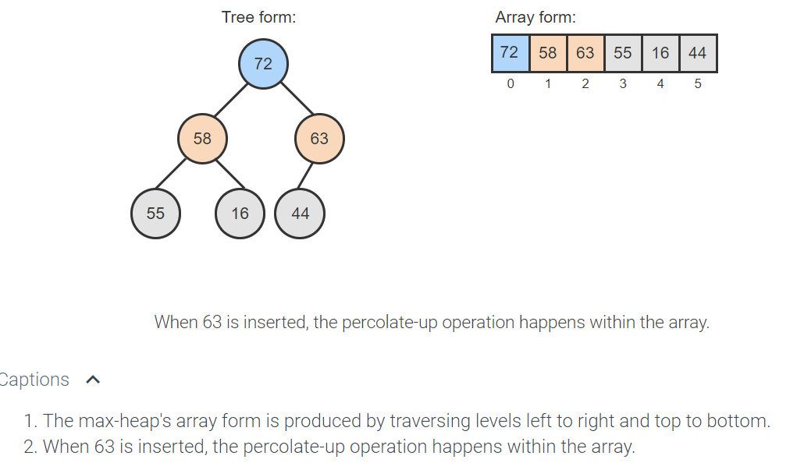  

## 7.3 Python: Heaps  

See folder 7.3 Heap   

## 7.4 Heap sort  

**Heapsort** is a sorting algorithm that takes advantage of a max-heap's properties 
by repeatedly removing the max and building a sorted array in reverse order. An 
array of unsorted values must first be converted into a heap. The 
**heapify** operation is used to turn an array into a heap.  

**Heap Sort** will sort an array.  

Heapsort begins by heapifying the array into a max-heap and initializing 
an end index value to the size of the array minus 1. Heapsort repeatedly 
removes the maximum value, stores that value at the end index, and 
decrements the end index. The removal loop repeats until the end index 
is 0.  

## 7.5 Python Heap Sort  

See folder 7.5 Heap Sort  

## 7.6 Priority queue abstract data type  

A **priority queue** is a queue where each item has a priority, and items with
higher priority are closer to the front of the queue than items with lower priority. 

The priority queue **enqueue operation** inserts an item such that the item is 
closer to the front than all items of lower priority, and closer to the end than 
all items of equal or higher priority. 

The priority queue **dequeue operation** removes and returns the item at the 
front of the queue, which has the highest priority.  

When enqueueing items of equal priority, the first-in-first-out rules apply. So
the second item with priority 7 comes after the first.  

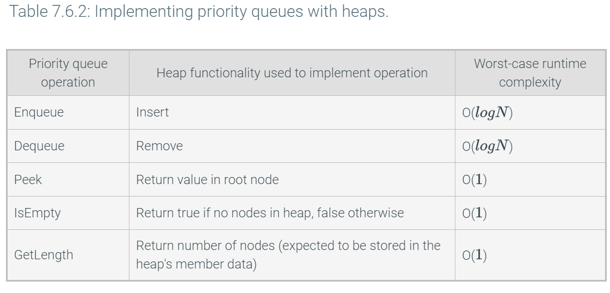  

## 7.7 Treaps  

A **treap** uses a *main key that maintains a binary search tree ordering* property, 
and a *secondary key generated randomly* (often called "priority") during 
insertions that maintains a heap property. The combination usually keeps the 
tree balanced. The word "treap" is a mix of tree and heap. 

  

### Deletion  

The when a node is marked for deletion, the priority is set to negative infinity.
Then the node is percolated down.  

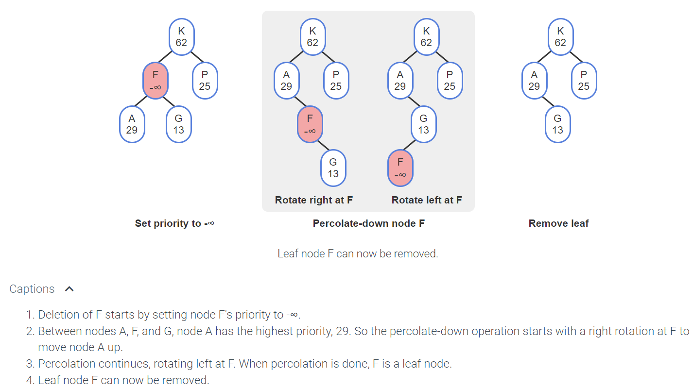  

## 7.8 LAB: Timeout manager with Priority Queue  

# 8 Sets  

## 8.1 Set abstract data type  

A set is an unordered collection. There are no duplicates.  

Represented in curly brackets: {78, 32, 57, 82}  

When storing objects, set implementations commonly distinguish elements based 
on an element's **key value**: A primitive data value that serves as a unique 
identifier for the element. 
 
## 8.2 Set Operations   
 
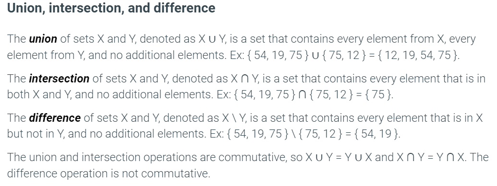  
 
**Filter**  

**Map**: produces a new set that had a function applied to each element in the 
set.  

## 8.3 Static and dynamic set operations  

A **dynamic set** is a set that can change after being constructed. A **static set**
is a set that doesn't change after being constructed. You cannot add or remove 
to a static set.  

## 8.4 Python: Set Implementation  

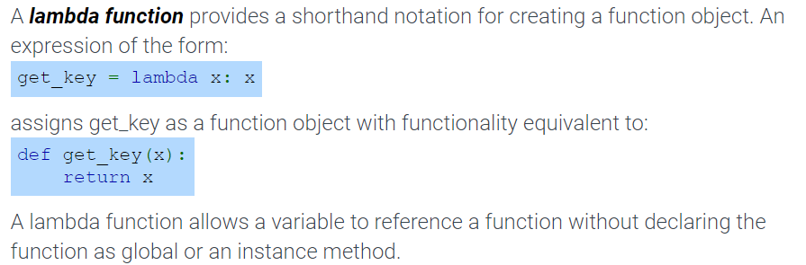  

## 8.5 LAB: Implementing StaticSet using a python set  

# 9 Graphs  

## 9.1 Intro to Graphs  

A graph is a data structure for representing connections among items, and 
consists of vertices connected by edges.

- A **vertex (or node)** represents an item in a graph.

- An **edge** represents a connection between two vertices in a graph.  

In a graph:

- Two vertices are **adjacent** if connected by an edge.

- A **path** is a sequence of edges leading from a source (starting) vertex to 
a destination (ending) vertex. The **path length** is the number of edges in the 
path.  

- The **distance** between two vertices is the number of edges on the shortest 
path between those vertices.  

## 9.2 Applications of graphs  

## 9.3 Graph representations: Adjacency lists  

In an **adjacency list** graph representation, each vertex has a list of adjacent 
vertices, each list item representing an edge.  

A key advantage of an adjacency list graph representation is a size of O(V + E), 
because each vertex appears once, and each edge appears twice. V refers to the 
number of vertices, E the number of edges.  

However, a disadvantage is that determining whether two vertices are adjacent 
is O(V), because one vertex's adjacency list must be traversed looking for the 
other vertex, and that list could have V items. 

A **sparse graph** has far fewer edges than the maximum possible.  

## 9.4 Graph representations: Adjacency matrices  

## 9.5 Graphs: Breadth-first search  

**Graph traversal**: an algorithm visits every vertex in a graph  

** Breadth-first search (BFS)**: is a traversal that visits a starting vertex,
then all vertices of distance 1 from that vertex, then of distance 2, and so on,
*without revisiting a vertex*.  

If multiple traversal paths exist for reaching a single vertex, then the traversal 
of the graph is **not unique**.  

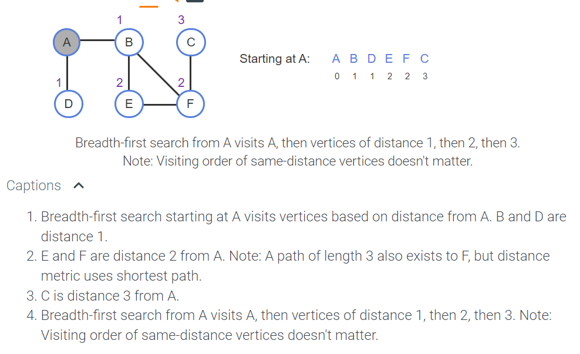  

When the BFS algorithm first encounters a vertex, that vertex is said to have 
been **discovered**. In the BFS algorithm, the vertices in the queue are called 
the **frontier**, being vertices thus far discovered but not yet visited.  

## 9.6 Graphs: Depth-first search  

A **depth-first search (DFS)** is a traversal that visits a starting vertex, then 
visits every vertex along each path starting from that vertex to the path's end 
before backtracking.
 
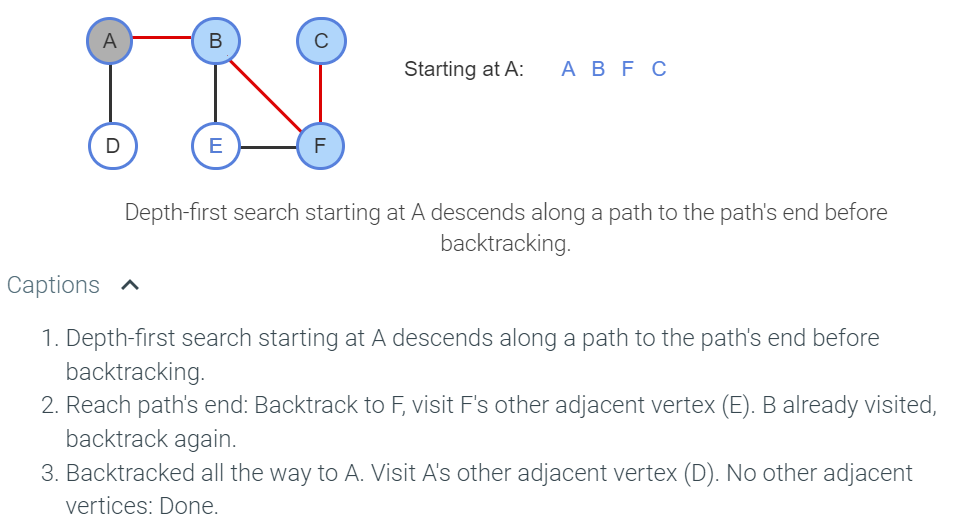  

## 9.7 Directed Graphs  

A **directed graph**, or **digraph**, consists of vertices connected by directed 
edges. 

A **directed edge** is a connection between a starting vertex and a terminating 
vertex. In a directed graph, a vertex Y is adjacent to a vertex X, if there is 
an edge from X to Y.  

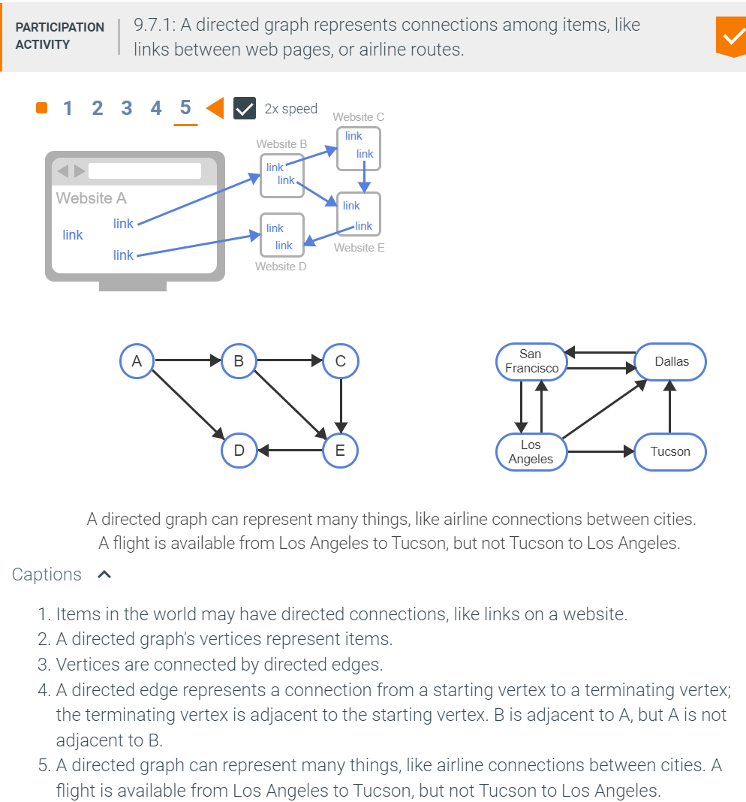  

In a directed graph:

- A **path** is a sequence of directed edges leading from a source (starting) 
vertex to a destination (ending) vertex.

- A **cycle** is a path that starts and ends at the same vertex. A directed 
graph is **cyclic** if the graph contains a cycle, and **acyclic** if the graph 
does not contain a cycle.  

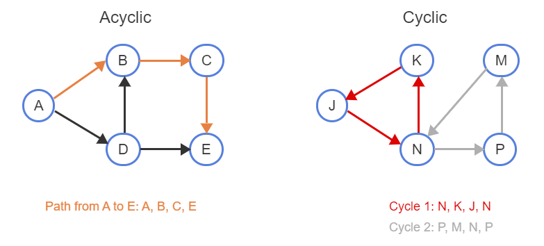  

## 9.8 Weighted graphs 

A **weighted graph** associates a weight with each edge. A graph edge's **weight**, 
or **cost**, represents some numerical value between vertex items, such as 
flight cost between airports, connection speed between computers, or travel 
time between cities. A weighted graph may be *directed or undirected*.

The **path length** is the sum of the edge weights in the path.

The cycle length is the sum of the edge weights in a cycle. A 
**negative edge weight cycle** has a cycle length less than 0. 

*A shortest path does not exist in a graph with a negative edge weight cycle*, 
because each loop around the negative edge weight cycle further decreases the 
cycle length, so no minimum exists.  

## 9.9 Python Graphs  

## 9.10 Python: Breadth-first search  

See folder 9.10 Graphs.  Enter the name "Taj"

## 9.11 Python Depth First Search

See folder 9.11 Depth First  

## 9.12 Python: Dijkstra's shortest path  

See example in 9.12 Dijkstra

Dijkstra's algorithm computes the shortest path from a given starting vertex 
to all other vertices in the graph.

To perform Dijjkstra's algorithm, the Graph and Vertex classes are used. The 
Vertex class is extended to include two additional data members:

- distance - The total sum of the edge weights on a path from some start vertex 
to the vertex.

- pred_vertex - A reference to the vertex that occurs immediately before the 
vertex, on a path from some start vertex to the vertex.  

## 9.13 Algorithm: Dijkstra's shortest path  

Dijkstra's algorithm initializes all vertices' distances to infinity (), 
initializes all vertices' predecessors to null, and enqueues all vertices into 
a queue of unvisited vertices. The algorithm then assigns the start vertex's 
distance with 0. 

## 9.14 Algorithm: Bellman-Ford's shortest path  

The **Bellman-Ford shortest path algorithm**, created by Richard Bellman and Lester 
Ford, Jr., determines the shortest path from a start vertex to each vertex in a 
graph. 

The runtime for the Bellman-Ford shortest path algorithm is **O(VE)**. The outer 
loop (the main iterations) executes V-1 times. In each outer loop execution, 
the algorithm visits each vertex and follows the subset of edges to adjacent 
vertices, following a total of E edges across all loop executions.  

## 9.15 Python: Bellman-Ford's shortest path  

See example 9.15 Bellman Ford  

## 9.16 Topological sort  

A **topological sort** of a directed, acyclic graph produces a list of the 
graph's vertices such that for every edge from a vertex X to a vertex Y, X 
comes before Y in the list.  

**Get Help on Topological Sort!!!!**  

Can be used to graph out a degree's curriculum path. Math 101, Phys 101 has to 
come before CS 103.  

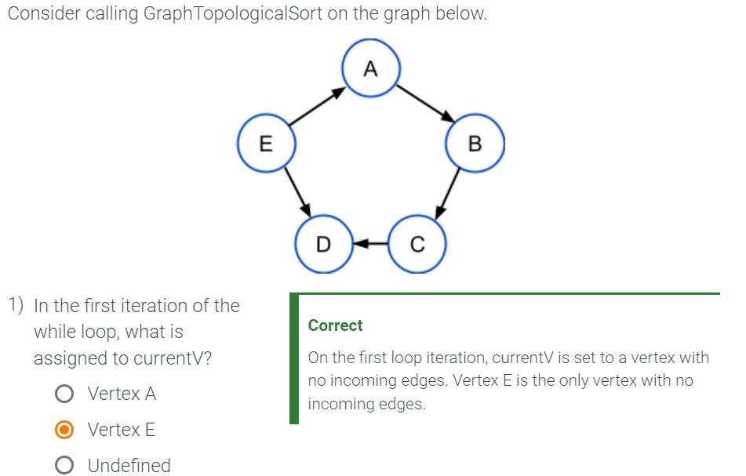  

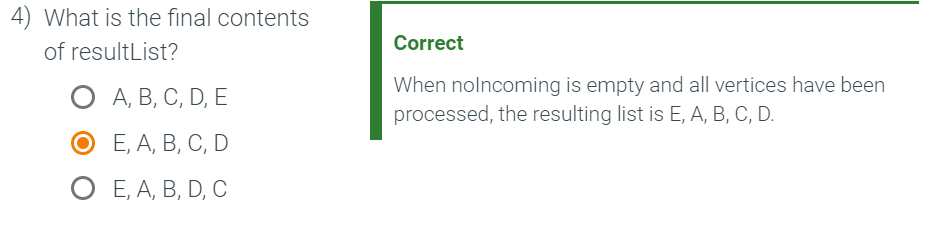  

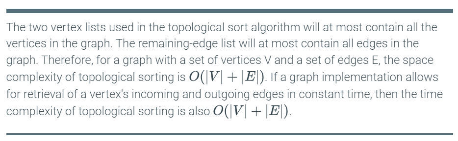  

## 9.17 Python: Topological sort  

See example 9.17 Topo Sort folder  

The following program creates the graph shown earlier in this section and 
prints the result of the topological_sort() function. Verify that the program 
outputs a valid topological ordering of the graph.

Experiment with the algorithm by adding and removing some edges. See if you 
can predict the results before trying the program. (Make each modification 
starting from the original graph, not from the graph resulting from the 
previous step.)

- Add an edge from E to A.
- Add an edge from C to G.
- Remove the edge from A to B.
- Add an edge from F to C.  

## 9.18 Minimum Spanning Tree  

A graph's **minimum spanning tree** is a subset of the graph's *edges* that 
connect all vertices in the graph together with the minimum sum of edge 
weights. The graph must be *weighted and connected*. 

A **connected graph** contains a path between every pair of vertices.  

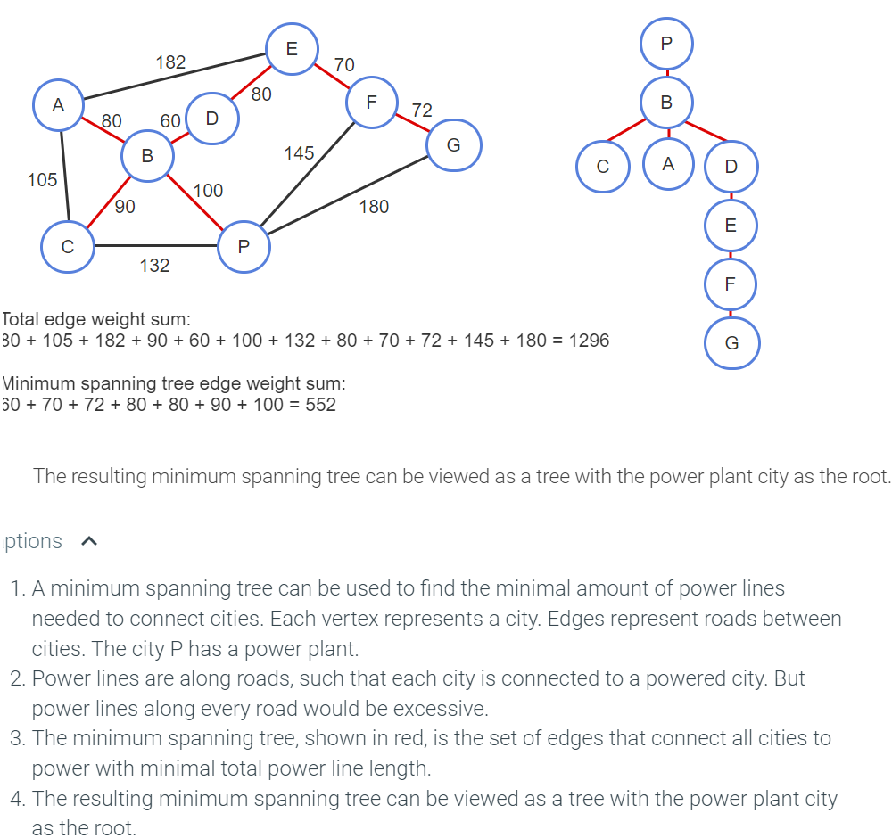  

**Kruskal's minimum spanning tree algorithm** determines the subset of a graph's
edges that connect all the graph's vertices with the minimum possible sum of edge 
weights. Kruskal's minimum spanning tree algorithm uses three collections:

- **edgeQueue**: A priority queue of edges, initially containing all graph edges. Edge weights are priorities.
- **result**: A collection of edges comprising the minimum spanning tree, initially empty.
- **vertexSets**: A collection of vertex sets. Each set represents vertices connected by edges in result. Initially, vertexSets contains one set for each vertex.

## 9.19 Python: Minimum spanning tree  

See folder 9.19 Min Span Tree  

The minimum spanning tree algorithm requires a priority queue for edges, where 
each edge's weight is the edge's priority. The EdgeWeight class implements a 
simple edge object that stores to and from vertices, as well as weight. 
Comparison operators are implemented such that edges are compared to each other 
using edge weights.

## 9.20 All pairs shortest path  

An **all pairs shortest path algorithm** determines the shortest path between all 
possible pairs of vertices in a graph. 

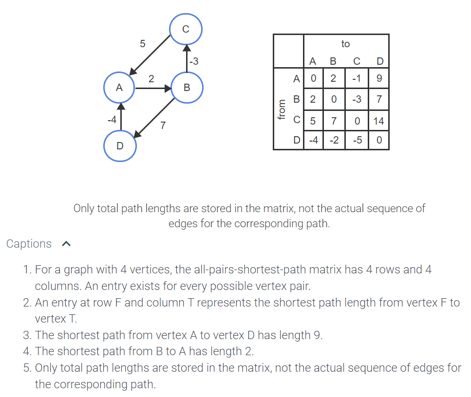  

The **Floyd-Warshall all-pairs shortest path algorithm** generates a |V| x |V| 
matrix of values representing the shortest path lengths between all vertex 
pairs in a graph. Graphs with cycles and negative edge weights are supported, 
but the graph must not have any negative cycles.  

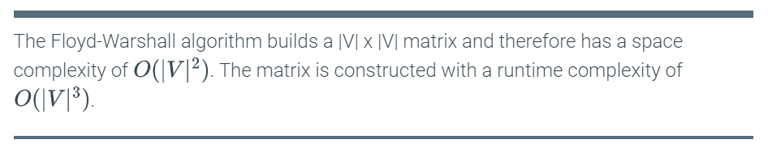  

## 9.21 Python: All pairs shortest path  

See 9.21 All Pairs Short Path

## 9.22 LAB: Graph representations  


# 10 B-Trees  

## 10.1 B-Trees  

In a binary tree, each node has one key and up to two children.  

A **B-tree** with order K is a tree where nodes can have up to K-1 keys and up 
to K children. The **order** is the maximum number of children a node can have. 
Ex: In a B-tree with order 4, a node can have 1, 2, or 3 keys, and up to 4 
children. B-trees have the following properties:

- All keys in a B-tree must be distinct.
- All leaf nodes must be at the same level.
- An internal node with **N keys must have N+1 children**.

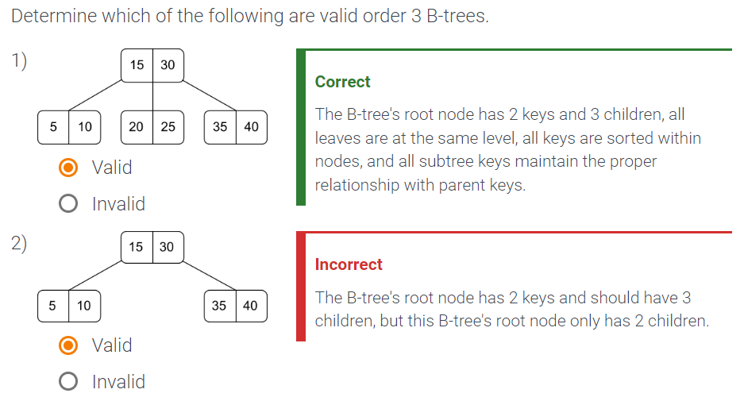  

- Keys in a node are stored in sorted order from smallest to largest.
- Each key in a B-tree internal node has one left subtree and one right 
subtree. All left subtree keys are < that key, and all right subtree keys 
are \> that key.

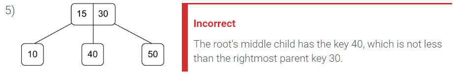  

### 2-3-4 Tree  

A 2-3-4 tree is an order 4 B-tree. Therefore, a 2-3-4 tree node contains 1, 2 
or 3 keys. A leaf node in a 2-3-4 tree has no children.  

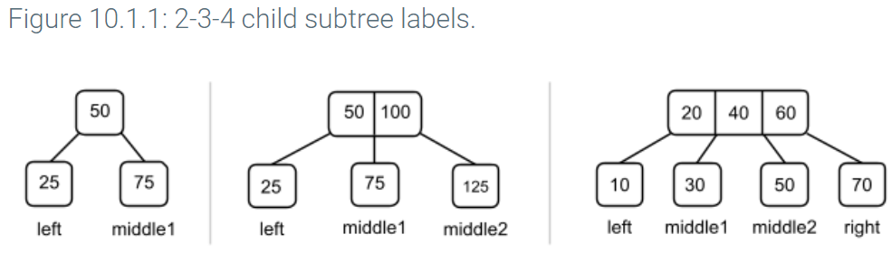  

## 10.2 2-3-4 tree search algorithm  


## 10.3 2-3-4 tree insert algorithm  

 New keys are always inserted into leaf nodes in a 2-3-4 tree. Insertion returns 
 the leaf node where the key was inserted, or null if the key was already in the 
 tree.
 
 Only a full node can be split during insertion.  

### Splits  

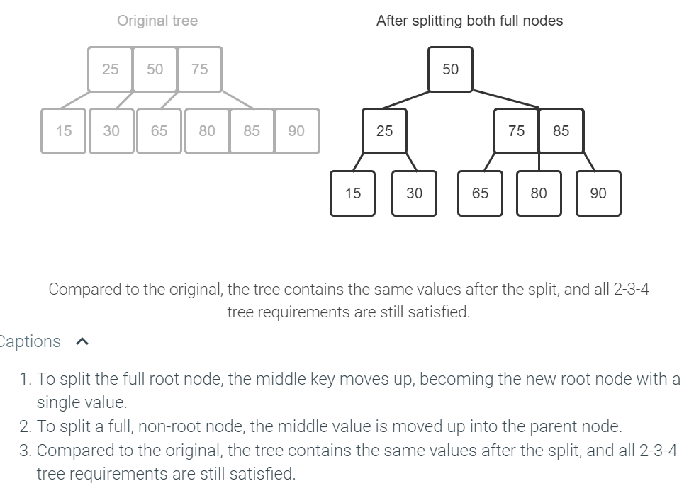  

**2-3-4 tree non full leaf insertion cases**  

| Condition	| Outcome |
| :--- |:--- |
| New key equals an existing key in node | No insertion takes place, and the node is not altered. |
| New key is \< node's first key | Existing keys in node are shifted right, and the new key becomes node's first key. |
| Node has only 1 key or new key is \< node's middle key | Node's middle key , if present, becomes last key, and new key becomes node's middle key. |
| None of the above | New key becomes node's last key. |  

### B-tree insert with preemptive split

Multiple insertion schemes exist for 2-3-4 trees. The **preemptive split insertion**
scheme always splits any full node encountered during insertion traversal. The 
preemptive split insertion scheme ensures that any time a full node is split, 
the parent node has room to accommodate the middle value from the child.  

## 10.4 2-3-4 tree rotations and fusion  

Removing an item from a 2-3-4 tree may require rearranging keys to maintain 
tree properties. A **rotation** is a rearrangement of keys between 3 nodes that 
maintains all 2-3-4 tree properties in the process. The 2-3-4 tree removal 
algorithm uses rotations to transfer keys between sibling nodes. A 
**right rotation** on a node causes the node to lose one key and the node's 
right sibling to gain one key. A **left rotation** on a node causes the node to 
lose one key and the node's left sibling to gain one key.  

A left rotation moves a key into the left sibling node. This cannot happen 
if the node has no left sibling.  

### Fusion  

 A fusion is a combination of 3 keys: 2 from adjacent sibling nodes that have 1 
 key each, and a third from the parent of the siblings. Fusion is the inverse 
 operation of a split.  
 
## 10.5 2-3-4 tree removal 


### Merge 

Only nodes with exactly one key can be merged.  

A node must have 2 or 3 keys to transfer a key to a an adjacent sibling during 
a merge.  

A node has exactly 3 keys after fusion  

After a node is merged, the parent of the node will be left with 1,2, or 3 keys.  

### Removal  

**Leaf Removal**: Remove key 33    

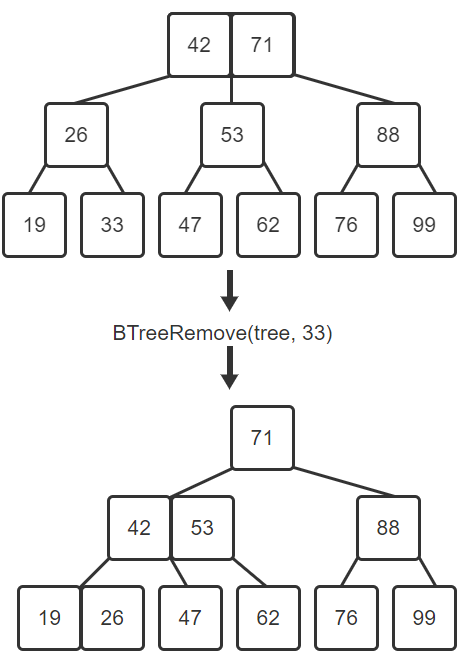  

**Merging makes no sense, get help**

## 10.6 Python 2-3-4 trees  

See 10.6 BTree 

Insert the values:   
15 42 77 18 90 21 36 19 89 47 28 39 55 73 99
15 47 40 19 55 77 58 89

## 10.7 LAB Itwrable 2-3-4 tree  

# 11 Searching and sorting algorithms  

## 11.1 Searching and algorithms  

**Linear search** is a search algorithm that starts from the beginning of a 
list, and checks each element until the search key is found or the end of the 
list is reached.  

An algorithm's **runtime** is the time the algorithm takes to execute. 

## 11.2 Binary Search  

**Binary search** is a faster algorithm for searching a list if the list's 
elements are sorted and directly accessible. Binary search first checks the 
middle element of the list.  

Efficiency: Number of steps to solve a binary search are **floor(log2 N) + 1**  

## 11.3 LAB: Binary search with custom comparer  

## 11.4 Python: Linear and binary search  

## 11.5 Constant Timee Operations  

Therefore, the theoretical analysis of an algorithm describes runtime in terms 
of number of **constant time** operations, not nanoseconds. A constant time 
operation is an operation that, for a given processor, always operates in the 
same amount of time, regardless of input values.

- Assignment operations like y = 10  

- Multiplication like 2 x 5  

## 11.6 Growth of functions and complexity

An algorithm with runtime complexity T(N) has a lower bound and an upper bound.

- **Lower bound**: A function f(N) that is  the best case T(N), for all values of N  1.
- **Upper bound**: A function f(N) that is  the worst case T(N), for all values of N  1.  

I think the lower bound is always the polynomial. EX: best case runtimes is 
T(N) = 3N + 6. The best case runtime complexity is 3N. Or if the best case is 
2N^2 + 5N + 5, then the lower bound is 2N^2.  

I think the upper bound is the sum of the integers in the polynomial. EX: a worst 
case runtime of 3N^2 + 10N + 17 has the upper bound of 30N^2.  Or for 
T(N) = 5N^2 + 7N, the upper bound is 12N^2.  

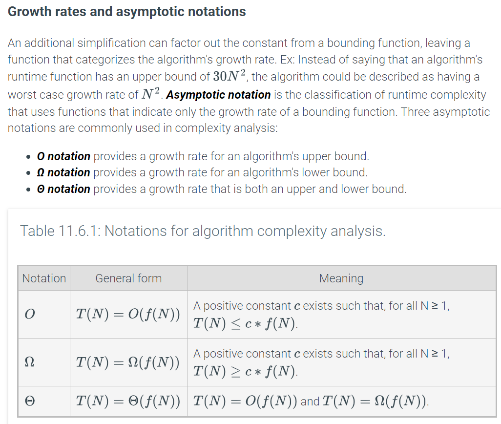  

O is Omicron  
horseshoe is Omega
O with a center mark is theta  

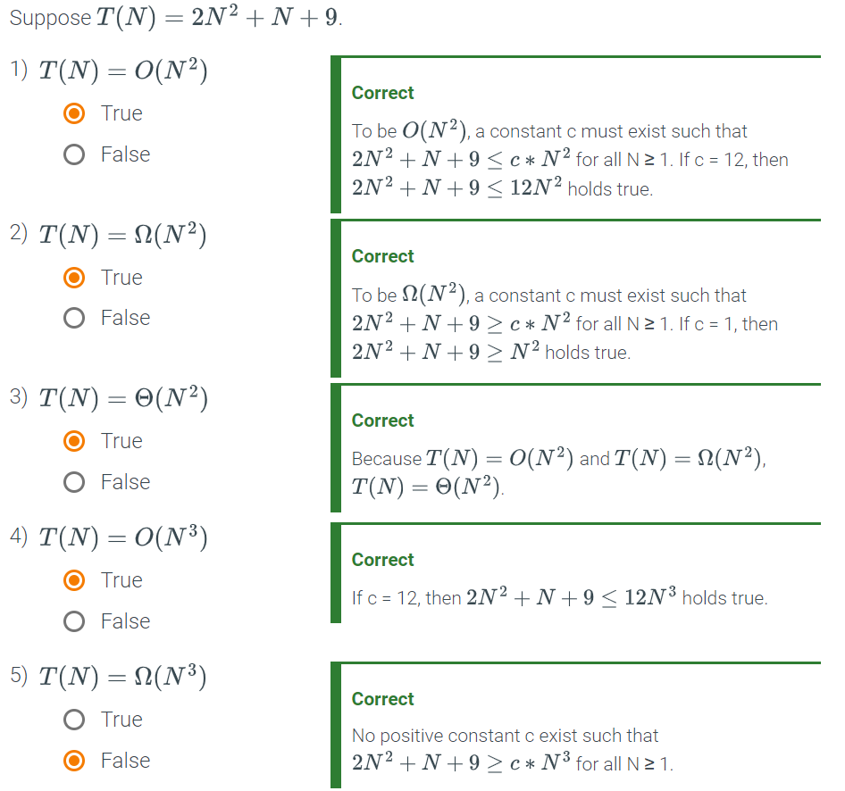

## 11.7 O notation  

**Big O notation** is a mathematical way of describing how a function (running 
time, or runtime, of an algorithm) behaves in relation to the input size.  

  

### Determine Composite Big O notations  

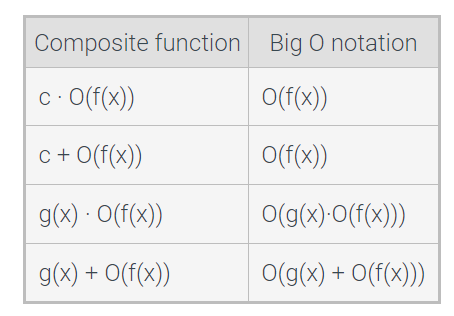  

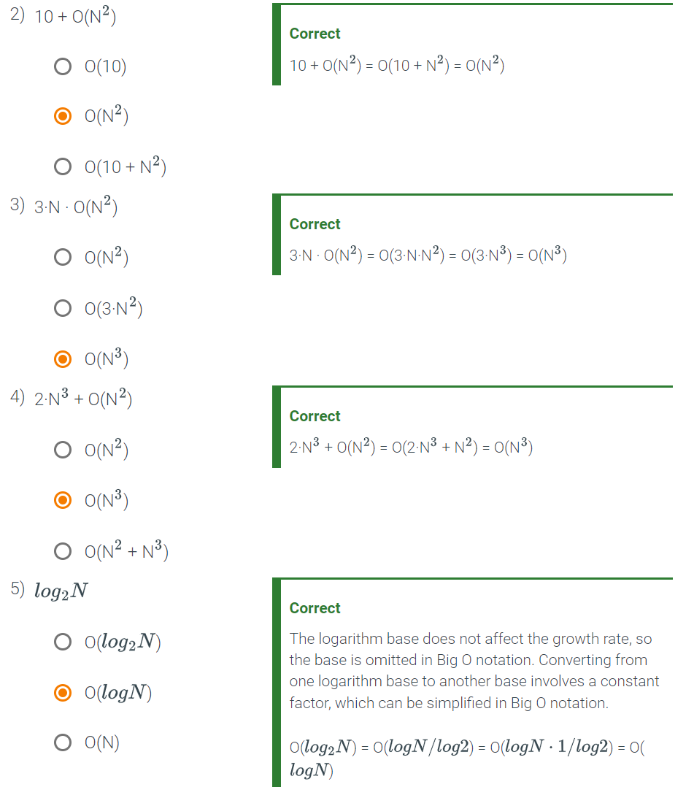  

### Common Big O complexities  

#### Constant - O(1)  

```python
def find_min(x, y):
   if x < y:
      return x
   else:
      return y
```

#### Logarithmic - O(log N)  

**Binary Search** 

```python
def binary_search(numbers, key):
   low = 0
   high = len(numbers) - 1
   
   while high >= low:
      mid = (high + low) // 2
      if numbers[mid] < key:
         low = mid + 1
      elif numbers[mid] > key:
         high = mid - 1
      else:
         return mid
   return -1  # not found

```

#### Linear - O(N)  

```python  
	
def linear_search(numbers, key):
    for i in range(len(numbers)):
        if numbers[i] == key:
             return i
    return -1  # not found

```

#### Log-Linear - O(N log N)  

```python  
	
def merge_sort(numbers, i, k):
   if i < k:
      j = (i + k) // 2              # Find midpoint 
      merge_sort(numbers, i, j)     # Sort left part
      merge_sort(numbers, j + 1, k) # Sort right part
      merge(numbers, i, j, k)       # Merge parts

```  

#### Quadratic - O(N^2)  

```python  
	
def selection_sort(numbers):
    for i in range(len(numbers)):
        index_smallest = i
        for j in range(i + 1, len(numbers)):
            if numbers[j] < numbers[index_smallest]:
                index_smallest = j
            
        temp = numbers[i]
        numbers[i] = numbers[index_smallest]
        numbers[index_smallest] = temp

```  

#### Exponential - O(c^N)  

```python  
def fibonacci(N):
    if (1 == N) or (2 == N):
        return N
    return fibonacci(N-1) + fibonacci(N-2)

```  

## 11.8 Algorithm analysis  

**Worst-case runtime**: longest execution  

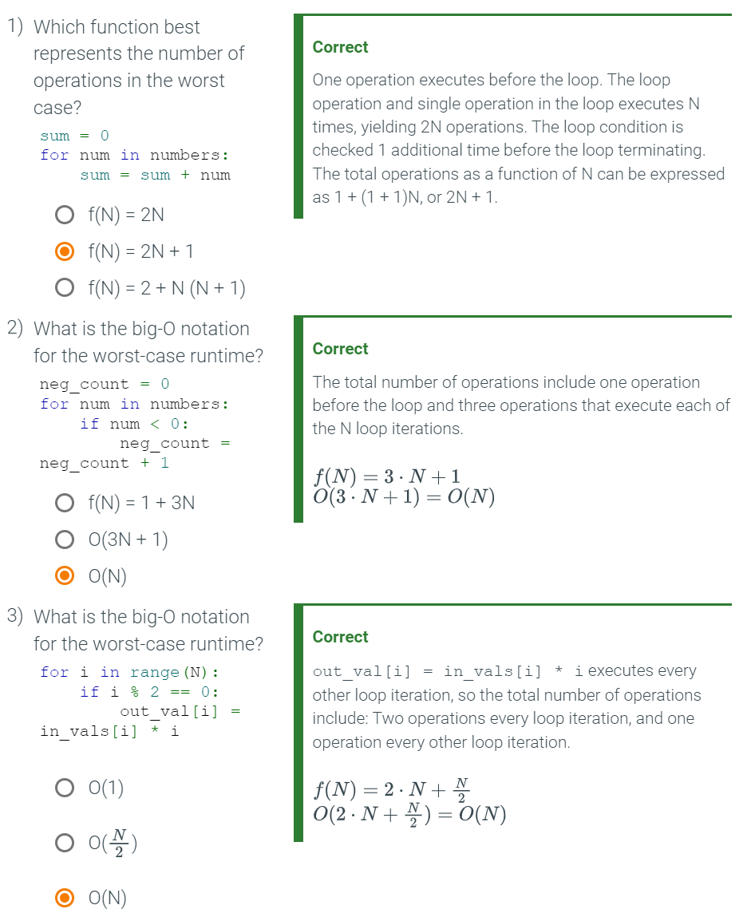  

### Constant Runtime  

Since constants are omitted in big-O notation, any constant number of constant 
time operations is O(1). 

Ex: An algorithm with a single loop that executes five operations before the 
loop, three operations in each loop iteration, and six operations after the 
loop would have a runtime of `f(N) = 5 + 3N + 6`, which can be written as 
`O(1) + O(N) + O(1) = O(N)`  

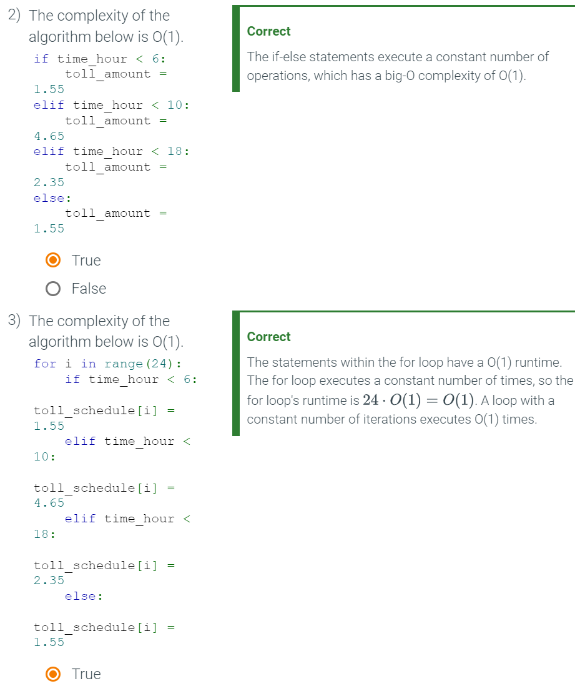  

### Nested Loop Big O notation  

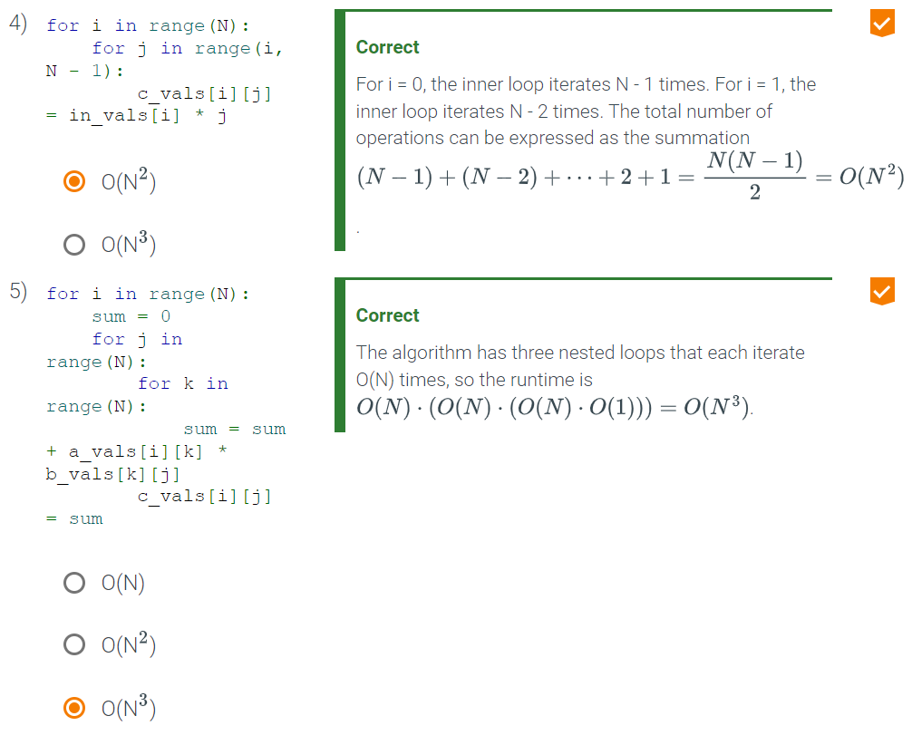  

## 11.9  Algorithm efficiency  

**Algorithm efficiency** is typically measured by the algorithm's computational 
complexity. **Computational complexity** is the amount of resources used by 
the algorithm. The most common resources considered are the *runtime* and 
*memory usage*.  

An algorithm's **runtime complexity** is a function, T(N), that represents the 
number of constant time operations performed by the algorithm on an input of 
size N.  

An algorithm's **space complexity** is a function, S(N), that represents the 
number of fixed-size memory units used by the algorithm for an input of size N. 
Ex: The space complexity of an algorithm that duplicates a list of numbers is 
S(N) = 2N + k, where k is a constant representing memory used for things like 
the loop counter and list pointers.  

An algorithm's **auxiliary space** complexity is the space complexity not 
including the input data. Ex: An algorithm to find the maximum number in a 
list will have a space complexity of S(N) = N + k, but an auxiliary space 
complexity of S(N) = k, where k is a constant.  

## 11.10 Recursive definitions  

A **recursive algorithm** is an algorithm that breaks the problem into smaller
 subproblems and applies the algorithm itself to solve the smaller subproblems.

Because a problem cannot be endlessly divided into smaller subproblems, a 
recursive algorithm must have a **base case**: A case where a recursive 
algorithm completes without applying itself to a smaller subproblem.  

## 11.11 Recursive algorithms  

### Fibonacci 

The **Fibonacci sequence** is a numerical sequence where each term is the sum of the 
previous 2 terms in the sequence, except the first 2 terms, which are 0 and 1.
A recursive function can be used to calculate a **Fibonacci number**: A term in 
the Fibonacci sequence.  

```
FibonacciNumber(termIndex) {
   if (termIndex == 0)
      return 0
   else if (termIndex == 1)
      return 1
   else
      return FibonacciNumber(termIndex - 1) + FibonacciNumber(termIndex - 2)
}
```

### Binary Search  

```javascript  
function BinarySearch(numbers, low, high, key) {
   if (low > high)
      return -1

   mid = (low + high) / 2
   if (numbers[mid] < key) {
      return BinarySearch(numbers, mid + 1, high, key)
   }
   else if (numbers[mid] > key) {
      return BinarySearch(numbers, low, mid - 1, key)
   }
   return mid
}

```  

## 11.12 Analyzing the time complexity of recursive algorithms  

Runtime complexity of recursion: T(N) = O(1) + T(N / 2). 
Such a function is known as a **recurrence relation**: A function f(N) that is 
defined in terms of the same function operating on a value < N. **T must be on** 
**both sides of the equation** 

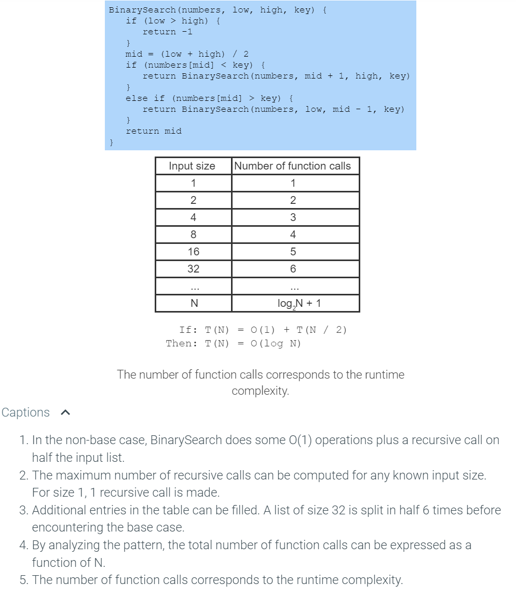  

A useful tool for solving recurrences is a **recursion tree**: A visual diagram 
of an operation done by a recursive function, that separates operations done 
directly by the function and operations done by recursive calls.

## 11.13 Overview of fast sorting algorithms  

A **fast sorting algorithm** is a sorting algorithm that has an average 
runtime complexity of O(NlogN) or better:

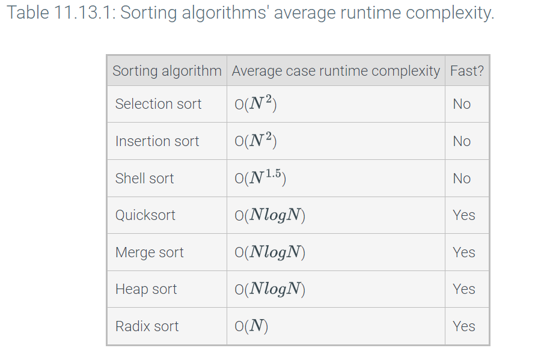  

A **element comparison sorting algorithm** is a sorting algorithm that operates on 
an array of elements that can be compared to each other. *Radix Sort* cannot be 
an element comparison sorting algorithm.  

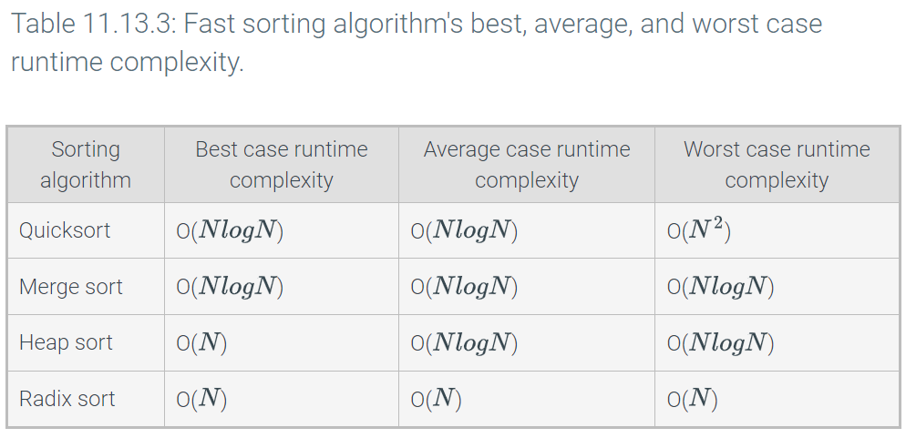  

## 11.14 Sorting Introduction  


## 11.15 Selection Sort  

See 11.15 Selection Sort file  

**Selection sort** is a sorting algorithm that treats the input as two parts, 
sorted and unsorted, and repeatedly selects the proper next value to move from 
the unsorted part to the end of the sorted part.  

## 11.16 Python Selection Sort 


## 11.17 Insertion Sort  

**Insertion sort** is a sorting algorithm that treats the input as two parts, 
sorted and unsorted, and repeatedly inserts the next value from the unsorted 
part into the correct location in the sorted part.  

Runtime: O(N^2)  

For sorted or nearly sorted inputs, insertion sort's runtime is O(N). A nearly 
sorted list contains only a few elements not in sorted order. Ex: 
\[4, 5, 17, 25, 89, 14] is nearly sorted having only one element not in the 
sorted position.  

## 11.18 Python Insertion Sort  

## 11.19 Shell Sort  

**Shell sort** is a sorting algorithm that treats the input as a collection of 
interleaved lists, and sorts each list individually with a variant of the 
insertion sort algorithm. Shell sort uses gap values to determine the number 
of interleaved lists. 

A **gap value** is a positive integer representing the 
distance between elements in an interleaved list. For each interleaved list, 
if an element is at index i, the next element is at index i + gap value.  

Shell sort begins by choosing a gap value K and sorting K interleaved lists 
in place.  

Shell sort divides the list up into gaps. Each gap is sorted, then the gaps are 
returned to the list. The list is not fully sorted, but there will be fewer 
operations to perform using the insertion sort to finally get the order right.  

## 11.20 Python Shell Sort  

See example 11.20_shell_sort 

## 11.21 Quicksort  

**Quicksort** is a sorting algorithm that repeatedly partitions the input into 
low and high parts (each unsorted), and then recursively sorts each of those 
parts. To partition the input, quicksort chooses a pivot to divide the data 
into low and high parts. 

The **pivot** can be any value within the array, commonly the value of the 
middle array element. Ex: For the list \[4, 34, 10, 25, 1], the middle element 
is located at index 2 (the middle of indices 0..4) and has a value of 10.

**h** is the pivot. The pivot and everything to the left is considered **low partition**.  
If there are multiple values equal to the pivot, the value/pivot may appear in the 
**high partition**  

Quicksort runtime: O(N^2)  

## 11.22 Python Quick Sort  

see 11.22_quick_sort  

## 11.23 Merge Sort  

**Merge sort** is a sorting algorithm that divides a list into two halves, 
recursively sorts each half, and then merges the sorted halves to produce a 
sorted list.   

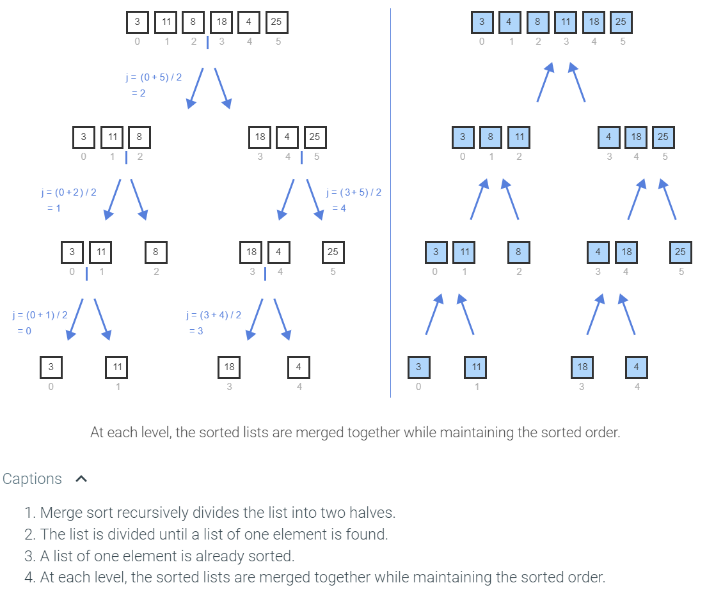  

The index variable i is the index of the first element in the list, and the 
index variable k is the index of the last element. The index variable j is used
to divide the list into two halves. Elements from i to j are in the left half, 
and elements from j + 1 to k are in the right half.  

Merge Sort runtime = O(N log N)  

Requires O(N) additional memory elements for the temporary array  

## 11.24 Python Merge Sort  

see 11.24_merge_sort file  

## 11.25 LAB: Natural merge sort  

The merge sort algorithm recursively divides the list in half until a list with 
one element is reached. A variant of merge sort, called **natural merge sort**, 
instead finds already-sorted runs of elements and merges the runs together.  

Assignment:  

Step 1: Implement the get_sorted_run_length() method
Implement the get_sorted_run_length() method in NaturalMergeSorter.py. Access NaturalMergeSorter.py by clicking on the orange arrow next to main.py at the top of the coding window.

get_sorted_run_length() has two parameters:

- integer_list: a list of integers and
- start_index: an integer for the run's starting index.
The method returns the number of list elements sorted in ascending order, starting at start_index and ending either at the end of the sorted run, or the end of the list, whichever comes first. The method returns 0 if start_index is out of bounds.

File main.py has several test cases for get_sorted_run_length() that can be run by clicking the "Run program" button. One test case also exists for natural_merge_sort(), but that can be ignored until step two is completed.

The program's output does not affect grading.

Submit for grading to ensure that the get_sorted_run_length() unit tests pass before proceeding.

Step 2: Implement the natural_merge_sort() method
Implement the natural_merge_sort() method in NaturalMergeSorter.py. natural_merge_sort() must:

- Start at index i=0
- Get the length of the first sorted run, starting at i
- Return if the first run's length equals the list's length
- If the first run ends at the list's end, reassign i=0 and repeat step 2
- Get the length of the second sorted run, starting immediately after the first
- Merge the two runs with the provided merge() method
- Reassign i with the first index after the second run, or 0 if the second run ends at the list's end
- Go to step 2

The assignment is in 11.25 Natural Merge Sort folder  

## 11.26 Radix Sort  

**Radix sort** is a sorting algorithm designed specifically *for integers*. The algorithm makes use of a concept called buckets and is a type of bucket sort.

Any array of integer values can be subdivided into buckets by using the integer 
values' digits. A bucket is a collection of integer values that all share a 
particular digit value. Ex: Values 57, 97, 77, and 17 all have a 7 as the 1's 
digit, and would all be placed into bucket 7 when subdividing by the 1's digit.  

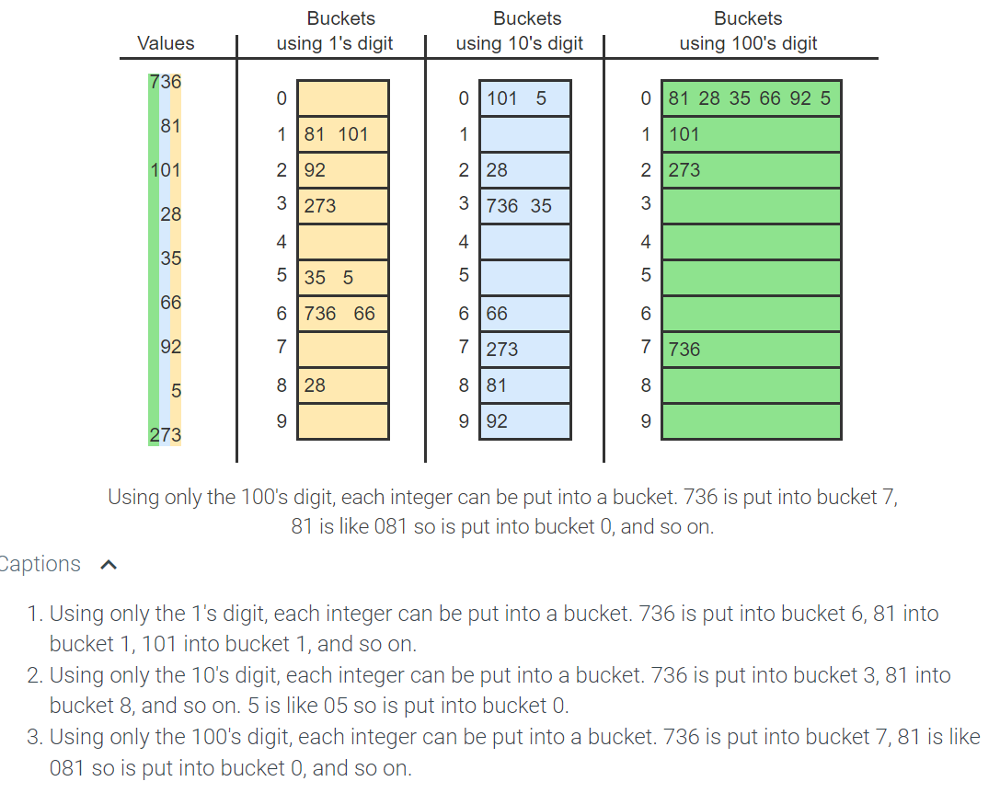  

## 11.27 Python Radix Sort  

See example 11.27_radix_sort  

## 11.28 Python: Sorting with different operators  

## 11.29 Bubble Sort  

**Bubble sort** is a sorting algorithm that iterates through a list, comparing 
and swapping adjacent elements if the second element is less than the first 
element. Bubble sort uses nested loops. Given a list with N elements, the 
outer i-loop iterates N - 1 times. Each iteration moves the 
i^th largest element into sorted position. The inner j-loop iterates 
through all adjacent pairs, comparing and swapping adjacent elements as 
needed, except for the last i pairs that are already in the correct position.

Because of the nested loops, bubble sort has a runtime of O(N^2). Bubble sort 
is often considered impractical for real-world use because many faster 
sorting algorithms exist.  

```
BubbleSort(numbers, numbersSize) {
   for (i = 0; i < numbersSize - 1; i++) {
      for (j = 0; j < numbersSize - i - 1; j++) {
         if (numbers[j] > numbers[j+1]) {
            temp = numbers[j]
            numbers[j] = numbers[j + 1]
            numbers[j + 1] = temp
         }
      }
   }
}
```

## 11.30 Quickselect  

Quickselect is an algorithm that selects the k^th
smallest element in a list. Ex: Running quickselect on the list 
(15, 73, 5, 88, 9) with k = 0, returns the smallest element in the list, or 5.  

For a list with N elements, quickselect uses quicksort's partition function to 
partition the list into a low partition containing the X smallest elements and a 
high partition containing the N-X largest elements.  

Best case average runtime is O(N), worst case goes through the whole list O(N^2)  

## 11.31 Python Quickselect  

see example 11.31_quickselect

## 11.32 Bucket Sort  

Bucket sort is a numerical sorting algorithm that distributes numbers into 
buckets, sorts each bucket with an additional sorting algorithm, and then 
concatenates buckets together to build the sorted result.  

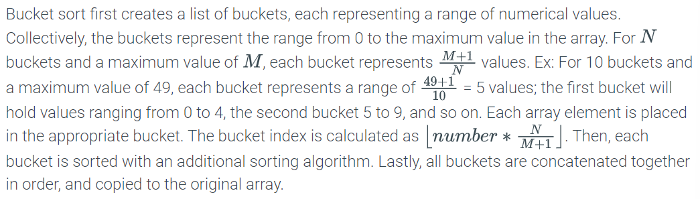  

## 11.33 LAB: Descending selection sort with output during execution  

## 11.34 LAB: Sorting user IDs  

## 11.35 LAB: Insertion Sort  

## 11.36 LAB: Merge sort  

## 11.37 LAB: Binary Search  

# 12 Python  

## 12.1 Programming (General)  

**computational thinking**: creating a sequence of instructions to solve a problem

## 12.2 Programming using Python  

An **interactive interpreter** is a program that allows the user to execute one 
line of code at a time.  

The interactive interpreter displays a prompt ("\>\>\>") that indicates the 
interpreter is ready to accept code.   

**Expressions** are code that return a value when evaluated  

A **statement** is a program instruction. A program mostly consists of a series 
of statements, and each statement usually appears on its own line.  

## 12.3 Basic input and output  

### print()

Each use of print() outputs on a new line. However, sometimes a programmer may 
want to keep output on the same line. Adding end=' ' inside of print() keeps the 
output of the next print on the same line, separated by a single space character. 
Ex: print('Hello', end=' ')  

Output can be moved to the next line using the newline character "\n". 
Ex: print('1\n2\n3') prints "1" on the first line, "2" on the second line, 
and "3" on the third line of output.  

"\t" to insert a tab  
 
Any space, tab, or newline is called whitespace.

### input()  

input() will read text entered by the user, and assign the result as a new 
string to the best_friend variable  

Convert string input to int with `int(input())`  

### Errors  

Python interpreter is able to detect syntax errors when the program is initially 
loaded, prior to actually executing any of the statements in the code.  

**Common error types**:

| Error type | Description |
| :--- | :--- |
| SyntaxError | The program contains invalid code that cannot be understood. |
| IndentationError | The lines of the program are not properly indented. |
| ValueError | An invalid value is used, which can occur if giving letters to int(). |
| NameError | The program tries to use a variable that does not exist. |
| TypeError | An operation uses incorrect types, which can occur if adding an integer to a string. |

**Logic Errors**: often called bugs, occur by the programer coding incorrect logic  

## 12.5 Development Environment  

Python Integrated Development Envirionments (IDE):  

- IDLE is the official Python IDE that is distributed with the installation of 
Python from https://python.org. IDLE provides a basic environment for editing and running programs.

- PyDev (http://pydev.org) is a plugin for the popular Eclipse program. PyDev includes extra features such as code completion, spell checking, and debugging, which are useful tools while programming.

- For learning purposes, web-based tools like CodePad (http://www.codepad.co) or Repl (http://www.repl.it) are helpful.

## 12.6 Computers and programs (General)  

## 12.7 Computer Tour  

## 12.8 Language History  

Sripting Language: 

Interpreted execution is slower because it requires multiple interpreter 
instructions to execute one script instruction. But the advantages include 
avoiding the compilation step during programming and running the same script on 
different processors as long as each processor has an interpreter installed.

Python 3.0 is not backward compatible, so Python 2.7 programs cannot run on 
Python 3.0 or later interpreters.  

## 19.9 Why whitespace matters  


# 20 Classes  

## 20.1 Classes Introduction  

In programming, an **object** is a grouping of data (variables) and operations 
that can be performed on that data (functions or methods).  

**Abstraction** occurs when a user interacts with an object at a high level, 
allowing lower-level internal details to remain hidden   
 
## 20.2 Classes Grouping Data  

The **class** keyword can be used to create a user-defined type of object 
containing groups of related variables and functions.  

An **instantiation** operation is performed by "calling" the class, using 
parentheses like a function call as in my_time = Time(). An instantiation 
operation creates an **instance**, which is an individual object of the given 
class. An instantiation operation automatically calls the \__init__ method 
defined in the class definition. A **method** is a function defined within a 
class. The \__init__ method, commonly known as a **constructor**, is 
responsible for setting up the initial state of the new instance.   

The \__init__ method has a single parameter, "self", that automatically references 
the instance being created.  

Attributes can be accessed using the **attribute reference operator** "." 
(sometimes called the **member operator** or **dot notation**).  

Good practice is to use initial capitalization for each word in a class name. 
So, appropriate names might include LunchMenu, CoinAmounts, or PDFFileContents.  

## 20.3 Instance methods  

## 20.4 CLass and instance object types  

A program with user-defined classes contains two additional types of objects: 
**class objects** and **instance objects**. A class object acts as a factory 
that creates instance objects. When created by the class object, an instance 
object is initialized via the \__init__ method.  

A **class attribute** is shared among all instances of that class. Class attributes 
are defined within the scope of a class.  

An **instance attribute** can be unique to each instance.  

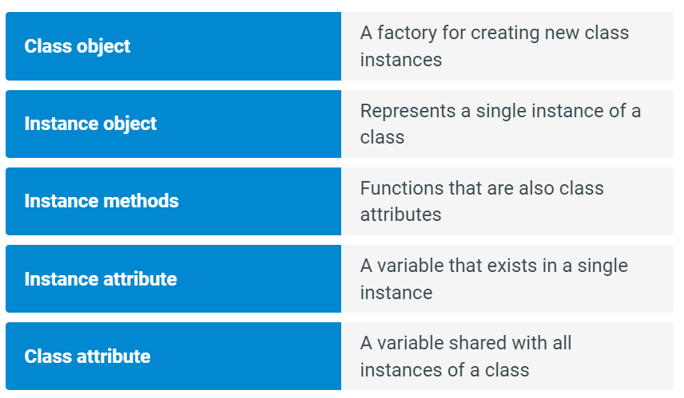  

## 20.5 Class example: Seat reservation system  

## 20.6 Class Constructors  

## 20.7 Class Interfaces  

 A **class interface** consists of the methods that a programmer calls to create, 
 modify, or access a class instance.   
 
 Good practice is to prepend an underscore to methods only used internally by 
 a class.  
 
 ## 20.8 Class Customization  
 
 **Class customization** is the process of defining how an instance of a class 
 should behave for some common operations.   
 
 Class customization can redefine the functionality of built-in operators 
 like `<, >=, +, -, and *` when used with class instances, a technique known as 
 **operator overloading**.

The below code shows overloading of the less-than (\<) operator of the Time 
class by defining a method with the \__lt__ special method name.  

Methods like \__lt__ above are known as **rich comparison** methods.  

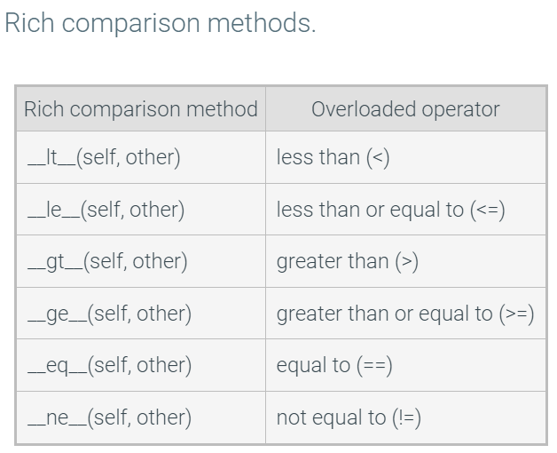  

## 20.9 More operator overloading: Classes as numeric types  

To handle subtraction of arbitrary object types, the built-in **isinstance()** 
function can be used. The isinstance() function returns a True or False Boolean 
depending on whether a given variable matches a given type.  

```python  
def __sub__(self, other):
    if isinstance(other, int): # right op is integer
        return Time24(self.hours - other, self.minutes)
	# more code...

```  

## 20.10 Memory allocation and garbage collection  

The process of an application requesting and being granted memory is known as 
**memory allocation**. Memory used by a Python application must be granted to the 
application by the operating system.

The Python runtime handles memory allocation for the programmer  

**Memory deallocation** is the act of freeing the memory that stores 
variables or objects in a program. Python is a **managed language**, meaning 
objects are deallocated automatically by the Python runtime, and not by the 
programmer's code.   

A **reference count** is an integer counter that represents how many variables 
reference an object. When an object's reference count is 0, that object is no 
longer referenced. Python's garbage collector will deallocate objects with a 
reference count of 0.   

## 20.11 LAB: Car Value (Classes)  

## 20.12 LAB: Nutritional information (classes/constructors)  

## 20.13 LAB: Artwork label (classes/constructors)  

## 20.14 LAB: Triangle area comparison (classes)  

## 20.15 LAB: Winning team (classes)  

## 20.16 LAB: Vending machine  

# Recursion 

## 21.1 Recursive Functions  

A function that calls itself 

## 21.2 Recursive algorithm: Search  

```python  

def find(low, high):
    mid = (high + low) // 2  # Midpoint of low..high
    answer  = input(f'Is it {mid}? (l/h/y): ')

    if (answer != 'l') and (answer != 'h'):  # Base case
        print('Got it!')
    else:
        if answer == 'l':
            find(low, mid)
        else:
            find(mid+1, high)

print('Choose a number from 0 to 100.')
print('Answer with:')
print('   l (your num is lower)')
print('   h (your num is higher)')
print(' any other key (guess is right).')

find(0, 100)

```
Response:
```
Choose a number from 0 to 100.
Answer with:
   l (your num is lower)
   h (your num is higher)
 any other key (guess is right).
Is it 50? (l/h/y): l
Is it 25? (l/h/y): h
Is it 38? (l/h/y): h
Is it 44? (l/h/y): l
Is it 41? (l/h/y): y
Got it!
```

The recursive function has an if-else statement, where the if branch is the 
end of the recursion, known as the **base case**.
