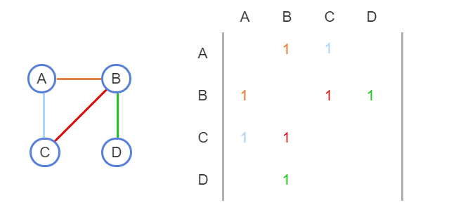
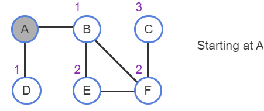
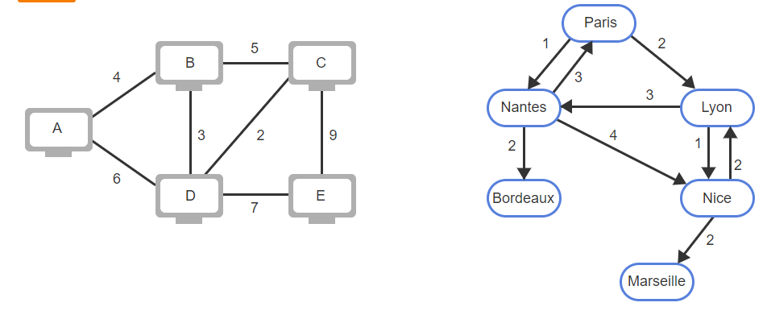
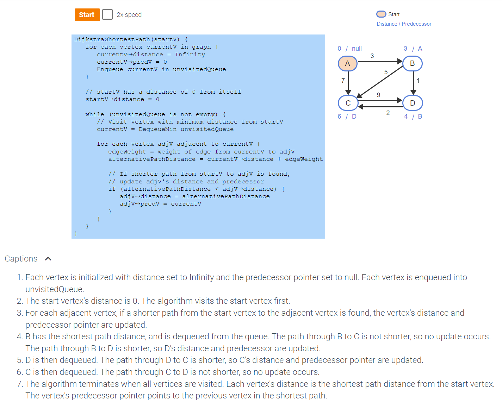
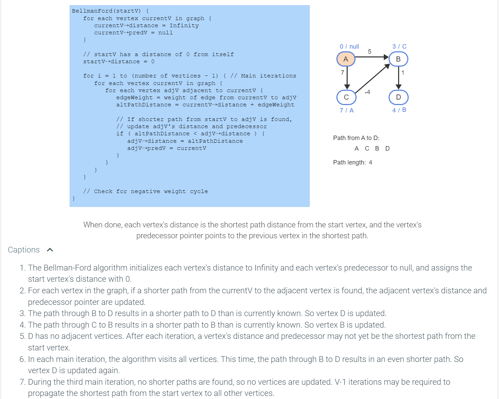
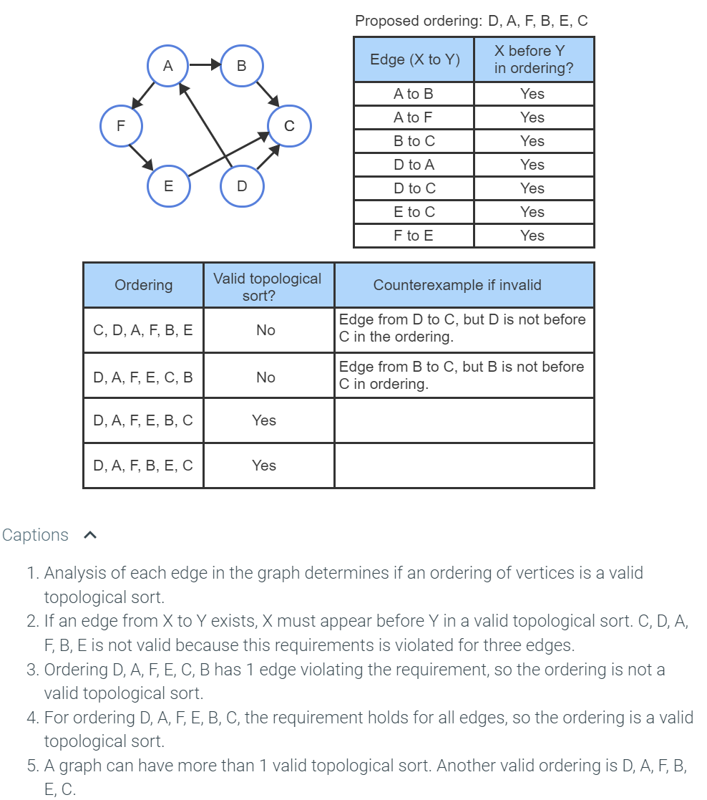
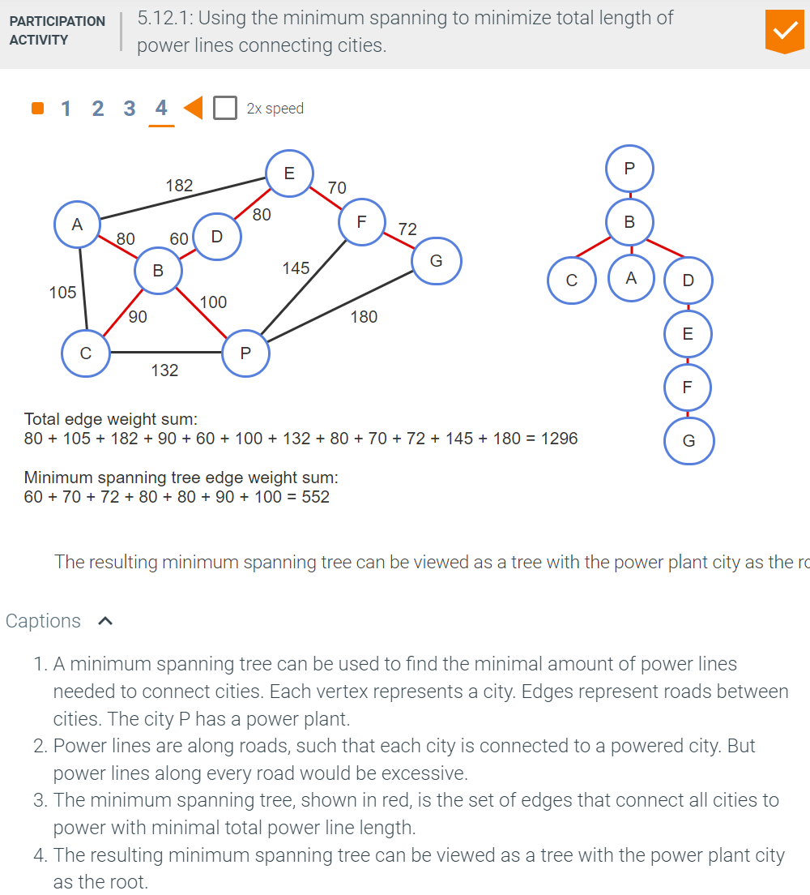
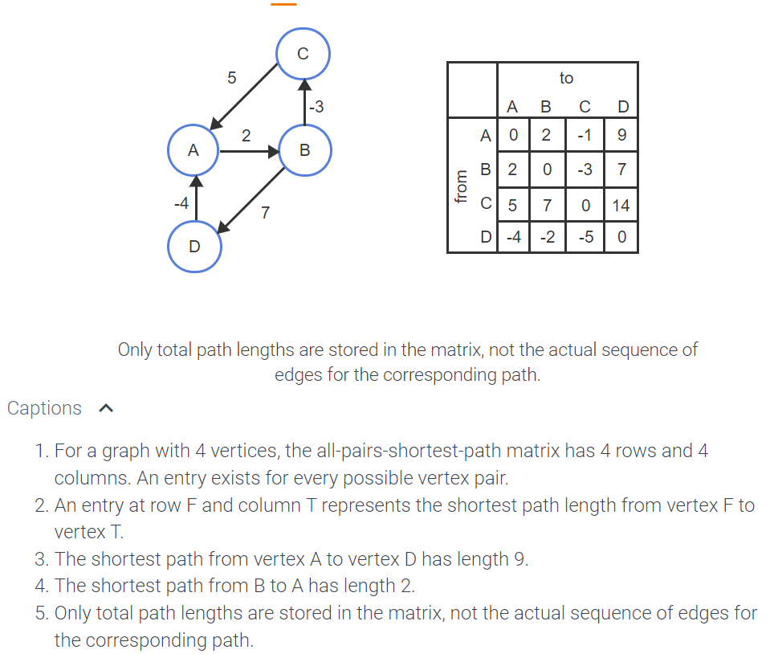

# Lesson 1 Introduction  

## 1.1 Data Structures  

**data structure** is a way of organizing, storing, and performing operations 
on data. 

| Data structure |	Description |
| :--- | :--- |
| Record |	A record is the data structure that stores subitems, often called fields, with a name associated with each subitem. |
| Array |	An array is a data structure that stores an ordered list of items, where each item is directly accessible by a positional index. |
| Linked list |	A linked list is a data structure that stores an ordered list of items in nodes, where each node stores data and has a pointer to the next node. |
| Binary tree |	A binary tree is a data structure in which each node stores data and has up to two children, known as a left child and a right child. |
| Hash table |	A hash table is a data structure that stores unordered items by mapping (or hashing) each item to a location in an array. |
| Heap |	A max-heap is a tree that maintains the simple property that a node's key is greater than or equal to the node's childrens' keys. A min-heap is a tree that maintains the simple property that a node's key is less than or equal to the node's childrens' keys. |
| Graph |	A graph is a data structure for representing connections among items, and consists of vertices connected by edges. A vertex represents an item in a graph. An edge represents a connection between two vertices in a graph. |  

## 1.4 Abstract Data Types  

| Abstract data type |	Description	| Common underlying data structures | 
| :--- | :--- | :-- |
| List |	A list is an ADT for holding ordered data.	 | Array, linked list | 
| Dynamic array |	A dynamic array is an ADT for holding ordered data and allowing indexed access. | 	Array | 
| Stack |	A stack is an ADT in which items are only inserted on or removed from the top of a stack. | Linked list | 
| Queue |	A queue is an ADT in which items are inserted at the end of the queue and removed from the front of the queue. | Linked list | 
| Deque |	A deque (pronounced "deck" and short for double-ended queue) is an ADT in which items can be inserted and removed at both the front and back. | Linked list | 
| Bag |	A bag is an ADT for storing items in which the order does not matter and duplicate items are allowed. | Array, linked list | 
| Set |	A set is an ADT for a collection of distinct items. | Binary search tree, hash table | 
| Priority queue |	A priority queue is a queue where each item has a priority, and items with higher priority are closer to the front of the queue than items with lower priority. | Heap | 
| Dictionary (Map) |	A dictionary is an ADT that associates (or maps) keys with values. | Hash table, binary search tree |   

## 1.8 Constant time operations  

- Addition, subtraction, multiplication, division of fixed size integer or floating point 
values  

- Assignment of a reference, pointer, or other fixed size data value (`x = 110`) 

- Comparison of twor fixed size data values (like an `if` statement)  

- Read or write an array element at a particular index (`x = arr[index]`)  


# 2 

Self-adjusting algorithms:  
https://webdiis.unizar.es/asignaturas/TAP/material/self_adjusting/9002d.htm  


# 5 Graphs  

## 5.3 Ajdacency List  

List of adjacent vertices

  

A **sparse graph** has far fewer edges than the maximum possible. Many graphs are sparse, like those representing a computer network, flights between cities, or friendships among people (every person isn't friends with every other person). Thus, the adjacency list graph representation is very common.

## 5.4 Adjacency Matix  

Each vertex is assigned to a matrix row and column, and a matrix element is 1 if the corresponding two vertices have an edge or is 0 otherwise

  

## 5.5 Breadth-first search  

**BST** is a traversal that visits a starting vertex, then all vertices of distance 1 from that vertex, then of distance 2, and so on, without revisiting a vertex.

- Also known as a **graph traversal**  

  

### Breadth-first seach algorithm  

``` 
BFS(startV) {
   Enqueue startV in frontierQueue
   Add startV to discoveredSet

   while ( frontierQueue is not empty ) {
      currentV = Dequeue from frontierQueue
      "Visit" currentV
      for each vertex adjV adjacent to currentV {
         if ( adjV is not in discoveredSet ) {
            Enqueue adjV in frontierQueue
            Add adjV to discoveredSet
         }
      }
   }
}
```

## 5.6 Depth First Search (DFS)  

A depth-first search (DFS) is a traversal that visits a starting vertex, then visits every vertex along each path starting from that vertex to the path's end before backtracking.

### Depth-first search algorithm  

```
DFS(startV) {
   Push startV to stack

   while ( stack is not empty ) {
      currentV = Pop stack
      if ( currentV is not in visitedSet ) {
         "Visit" currentV
         Add currentV to visitedSet
         for each vertex adjV adjacent to currentV
            Push adjV to stack
      }
   }
}
```

#### Recursive:  

```
RecursiveDFS(currentV) {
   if ( currentV is not in visitedSet ) {
      Add currentV to visitedSet
      "Visit" currentV
      for each vertex adjV adjacent to currentV {
         RecursiveDFS(adjV)
      }
   }
}
```

## 5.7 Directed Graph  

A directed edge is a connection between a starting vertex and a terminating vertex. In a directed graph, a vertex Y is adjacent to a vertex X, if there is an edge from X to Y.  

- A **path** is a sequence of directed edges leading from a source (starting) vertex to a destination (ending) vertex.
- A **cycle** is a path that starts and ends at the same vertex. A directed graph is cyclic if the graph contains a cycle, and **acyclic** if the graph does not contain a cycle.

  

## 5.8 Weighted Graph  

There is a weight associated with each edge. Can be a directed or undirected graph    

 

## 5.9 Dijksta's Shortest Path  

- Finds the shortes path between vertices in a graph by edge weights  

- Cannot have negative edge weights (Bellman-Ford's algorithm can, but it is slower)  

- There are factors for the runtime, but O(V<sup>2</sup>) 

  

## 5.10 Bellman-Ford's shortest path  

Slower than Dijkstra, but can calculate negative edge weights. Runtime is O(VE)    

  

### Bellman-Ford Algorithm  

``` 
BellmanFord(startV) {
   for each vertex currentV in graph {
      currentV⇢distance = Infinity
      currentV⇢predV = null
   }

   // startV has a distance of 0 from itself
   startV⇢distance = 0                

   for i = 1 to number of vertices - 1 { // Main iterations
      for each vertex currentV in graph {
         for each vertex adjV adjacent to currentV {
            edgeWeight = weight of edge from currentV to adjV
            alternativePathDistance = currentV⇢distance + edgeWeight
                  
            // If shorter path from startV to adjV is found,
            // update adjV's distance and predecessor
            if (alternativePathDistance < adjV⇢distance) {
               adjV⇢distance = alternativePathDistance
               adjV⇢predV = currentV
            }
         }
      }
   }

   // Check for a negative edge weight cycle
   for each vertex currentV in graph {
      for each vertex adjV adjacent to currentV {
         edgeWeight = weight of edge from currentV to adjV
         alternativePathDistance = currentV⇢distance + edgeWeight

         // If shorter path from startV to adjV is still found,
         // a negative edge weight cycle exists
         if (alternativePathDistance < adjV⇢distance) {
            return false
         }
      }
   }

   return true
}
```  

## 5.11 Topological Sort  

A topological sort of a **directed, acyclic graph** produces a list of the graph's vertices such that for every edge from a vertex X to a vertex Y, X comes before Y in the list.

Runtime of O(|V|+|E|)  

  

### Topological Sort Algorithm  

```
GraphTopologicalSort(graph) {
   resultList = empty list of vertices
   noIncoming = list of all vertices with no incoming edges
   remainingEdges = list of all edges in the graph

   while (noIncoming is not empty) {
      currentV = remove any vertex from noIncoming
      Add currentV to resultList
      outgoingEdges = remove currentV's outgoing edges from remainingEdges
      for each edge currentE in outgoingEdges {
         inCount = GraphGetIncomingEdgeCount(remainingEdges, currentE⇢toVertex)
         if (inCount == 0)
            Add currentE⇢toVertex to noIncoming
      }
   }
   return resultList
}
```

## 5.12 Minimum Spanning Tree  

A graph's minimum spanning tree is a subset of the graph's edges that connect all vertices in the graph together with the minimum sum of edge weights. The graph must be weighted and connected. A connected graph contains a path between every pair of vertices.  

  

### Kruskal's minimum spanning tree algorithm  

Determines the subset of a graph's edges that connect all the graph's vertices with the minimum possible sum of edge weights.

- Space complexity: O(|E|+|V|)  

- Runtime complexity: O(|E|log|E|)  

```
KruskalsMinimumSpanningTree(graph) {
   edgeList = list containing all edges from graph
   vertexSets = collection of vertex sets, empty initially
   for each vertex V in graph
      Add new set containing only V to vertexSets
   resultList = new, empty set of edges

   while (vertexSets⇢length > 1 && edgeList⇢length > 0) {
      nextEdge = remove edge with minimum weight from edgeList
      vSet1 = set in vertexSets containing nextEdge⇢vertex1
      vSet2 = set in vertexSets containing nextEdge⇢vertex2
      if (vSet1 != vSet2) {
         Add nextEdge to resultList
         Remove vSet1 and vSet2 from vertexSets
         merged = union(vSet1, vSet2)
         Add merged to vertexSets
      }
   }
   return resultList
}
```  

## 5.13 All pairs shortes path  

An all pairs shortest path algorithm determines the shortest path between all possible pairs of vertices in a graph.

  

### Floyd-Warshall algorithm  

Cannot have negative cycles.  This will generate a |V|x|V| matrix of values representing the shortest path lenghts between all vertex pairs in a graph.

Runtime of O(|V|<sup>3</sup>), Space complexity of Runtime of O(|V|<sup>2</sup>)

```
FloydWarshallAllPairsShortestPath(graph) {
   numVertices = graph⇢vertexCount
   // distMatrix is a numVertices x numVertices matrix
   set all values in distMatrix to ∞
   set each distance for vertex to same vertex to 0
   for each edge in graph
      distMatrix[edge⇢fromVertex][edge⇢toVertex] = edge⇢weight

   for (k = 0; k < numVertices; k++) {
      for (toIndex = 0; toIndex < numVertices; toIndex++) {
         for (fromIndex = 0; fromIndex < numVertices; fromIndex++) {
            currentLength = distMatrix[fromIndex][toIndex]
            possibleLength =
               distMatrix[fromIndex][k] +
               distMatrix[k][toIndex]
            if (possibleLength < currentLength)
               distMatrix[fromIndex][toIndex] = possibleLength
         }
      }
   }
   return distMatrix
}
```

### Floyd-Warshall algorithm: Path Reconstruction

Since the matrix only stores the path length, the path itself can be reconstructed with the following algorithm  

```
FloydWarshallReconstructPath(graph, startVertex, endVertex, distMatrix) {
   path = new, empty path

   // Backtrack from the ending vertex
   currentV = endVertex
   while (currentV != startVertex) {
      incomingEdges = all edges in the graph incoming to current vertex
      for each edge currentE in incomingEdges {
         expected = distMatrix[startVertex][currentV] - currentE⇢weight
         actual = distMatrix[startVertex][currentE⇢fromVertex]
         if (expected == actual) {
            currentV = currentE⇢fromVertex
            Prepend currentE to path
            break
         }
      }
   }

   return path
}
```  


