# Unit 1  

#### Some algorithms to look up:  

https://www.youtube.com/watch?v=DjYZk8nrXVY

- Prefix Sum  

- Two Pointers  

- Sliding Window  

- Fast and Slow pointers  

- Linked-List in place reversal  

- Monotonic Stack  

- Top 'k' Element  

	- Find 'k' largest: use min heap 
	
	- Find 'k' smallest: use max heap  

- Overalpping Intervals  

- Modified Binary Search  

- Binary Tree Traversal  

- Depth First Search  

- Breadth First Search  

- Matrix Traversal  

- Back Tracking  

- Dynamic Programming  

 

## 1.1 Algorithms  

## 1.2 Algorithm Structures  

Module 1 will cover these lessons:  

- Introduction to algorithms
- If-then algorithms
- For-loop algorithms
- While-loop algorithms
- Nested loop algorithms

## 1.3 Introduction to Algorithms  

An **algorithm** is a step-by-step method for solving a problem. A description 
of an algorithm specifies the input to the problem, the output to the problem, 
and the sequence of steps to be followed to obtain the output from the input.

There are three basic building blocks of an algorithm: 

- assignments: values to variables  
- conditional statements: direct flow of steps  
- loops: allow for steps to be repeated  

A description of an algorithm usually includes:

- A name for the algorithm  
- A brief description of the task performed by the algorithm  
- A description of the input  
- A description of the output  
- A sequence of steps to follow  

## 1.4 If-then algorithms  

### If-statements  

"if" statements are branches?

### If-else statements  

```
if (condition)  
	one or more steps  
Else 
	one or more steps  
End-if
```

## 1.5 For-loop algorithm  

An **iteration** is a process where a set of instructions or structures are 
repeated in a sequence a specified number of times or until a condition is met.  

To control the iterations, **for-loops** use an **index** or a counter and a variable 
that counts how many times a step or a block of steps executes.  
 
## 1.6 While-loop algorithm  

A **while-loop** iterates an unknown number of times, ending when a certain 
condition becomes false.

## 1.7 Nested loop algorithm  

Placing a loop within another loop is known as nesting. When a loop exists 
within another loop, it is called a **nested loop**.  

The nested loop, known as the **inner loop**  

## 1.8 Analyzing Algorithms  

This module contains three lessons:

- Computational complexity
- Evaluating algorithm complexity
- Worst-case analysis  

## 1.9 Computational complexity  

How do you know which algorithm is more efficient? By counting the operations 
that will happen for an input of any size, you would be able to see how their 
resource requirements grow.  

**Algorithm complexity**: which is the study of the efficacy of algorithms

- **time complexity**: the time the algorithm requires to run. time depends on 
the speed of the processing unit, the number of calculations that need to be 
performed, the number of conditions that need to be evaluated, or the number 
of iterations to be completed by the loops.  

- **space complexity**: the amount of memory used. The values of all variables, 
including the values of the input variables and all other values that will be 
computed, need to be stored somewhere in the memory of the system—in the RAM, 
hard drive, or external devices.  

Time and space efficiency are measured in terms of the input size.  

### Algorithm Fibonacci-1  

The first two elements of the Fibonacci sequence are both 1: 
{1, 1, 2, 3, 5, 8, 13, 21, 34, 55, 89, 144...}

The algorithm calculates the Nth element of the Fibonacci sequence by calculating 
all terms:  

```
F[1] :=1
F[2]:=1
For i:=3 to n
    F[i] := F[i-1]+F[i- 2]
End-for
Return (F[n])
```  

This one has a constant runtime, the one above grows with n:  

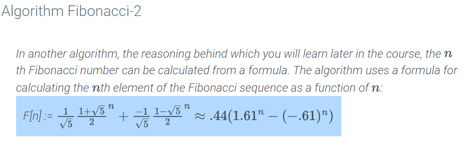  

## 1.10 Evaluating algorithm complexity  

** Atomic Operations**: each algorithm uses assignments, conditional statements, 
and loops, and performs a variety of operations, such as addition and 
multiplication. These operations (e.g., addition, multiplication, comparison) 
that one would find in a single line of pseudocode, are referred to as atomic 
operations. They are called "atomic," because they cannot be split any further; 
a computer would evaluate each in one step.   

```
Max: = 0 							# Atomic operation note 1
For i: =1 to n						# Atomic operation note 2 and 3  
    If (a[i] > Max), Max: = a[i]	# Atomic operation note 4
End-for
```
- Note 1: The atomic operation of assignment, `Max: = 0`, occurs once.

- Note 2: In the first iteration of the for loop, two atomic operations take place. 
`i:= 1` as an assignment and `i<n` for a conditional statment. These 2, plus 
the one assignment above, create 3 atomic operations on the first iteration.  

- Note 3: On the preceeding iterations of the for loop, `i:= 1` i will increment,
and `i<n` the conditional statement will execute again. Since the loop is iterating
`n` times, and everytime it iterates these two atomic operations occur, the count 
is `2n + 3`. The three from the first iteration are added. 

- Note 4: `a[i] > Max` is always performed to determine if branching is needed. 
This occurs `n` times, so add to the previous equation `(2n + 3) + n` is equal to 
`3n +3`. This will **represents the best case scenario** because `Max:= a[i]` is 
never called. **Worst case scenario** `Max:= a[i]` is called on every iteration 
of `n`. That will add to what was the best case scenario `(3n + 3) + n` which is 
`4n + 3`.

Since Atomic operations 2 and 3 occur every time, this adds `2n` operations to 
the count.  

Observe the following atomic operations:

- Assigning a value to a variable
- Looking up the value of a particular element in a sequence
- Comparing two values
- Incrementing a value (and/or arithmetic operations such as addition and multiplication)

Recall that a **sequence** is an ordered set of elements—a list of numbers or 
objects in a special order.  

## 1.11 Worst-case analysis  

## 1.12 Big-O Estimates  

This module contains two lessons:

- Asymptotic growth
- Algorithms and big-O  

## 1.13 Asymptotic growth  

Keeping track of all the constant factors can be overwhelming. Instead computer 
scientists use a special type of language, **asymptotic notations**, to 
determine running time without keeping track of constant factors and to capture 
how the running time of the algorithm grows with the size of the input.  

**asymptotic complexity**: the behavior of the complexity function as n grows.  

Eventually, we arrived at the function F(n) = n, which is the **asymptotic run time function** 
of the algorithm. The function is void of constants and it only retains the 
fastest growing component of the atomic operations counting function.

As a refresher: for an exponential function, the coefficient of the exponent is 
irrelevant to assessing the growth of the function, so the asymptotic run 
function is usually expressed as 2n; whereas, a logarithmic function is 
expressed without the need for specifying the base. So, the asymptotic run time 
function for:

- f(n) = 1,000,032 is 1
- f(n) = 100033<sup>3n</sup> is 2n
- f(n) = log<sub>10003</sub> n is log(n)  

This filter of "dropping all factors" and of "keeping the largest growing term" 
as described above is what we call **asymptotic behavior**. 

### Rule of Thumb:  

- Simple programs can be analyzed by counting the nested loops of the program.

- A single loop over n items yields asymptotic complexity n.

- If you have a program that calls a function within a loop and you know the 
number of atomic operations the called function performs, it is easy to 
determine the number of atomic operations of the whole program. For example, 
let’s consider the following algorithm:

```
For i: = 1 to n
    f(n)
End-for
```

- Since you know that f(n) is a function that performs exactly n instructions, 
you then know that the number of instructions of the whole program is 
asymptotically n2, as the function is called exactly n times.

- Given a series of for-loops that are sequential, the slowest of them 
determines the asymptotic behavior of the program.

- Two nested loops followed by a single loop is asymptotically the same as 
the nested loops alone, because the nested loops dominate the simple loop.

### Asymptotic Notation  

There are three types of asymptotic notation that are commonly used in 
algorithmic analysis, O(n) ("big-O"), Ω(n) ("Omega"), and &theta;(n) ("Theta").

- The big-O notation—O(n)—serves as a rough upper bound for functions 
(disregarding constants and small input values).

- The Ω notation—Ω(n)—is similar to big-O, except that it provides a lower bound 
on the growth of a function.

- The Θ notation—Θ(n)—indicates how the algorithm performs for any case. This is 
referred to as an average time or random case function and, when possible, gives 
us a sense of how the algorithm performs in any case. Note that it is often 
possible to estimate upper and lower bounds, but not average cases especially 
if there are complex branching in the code.

## 1.14 Algorithms and big-O  

Big-O is the notation used to state that a function is the upper bound for the 
asymptotic complexity, while big-Omega is used for a lower bound. In other 
terms, when an algorithm is said to be *O(f(n)), then its asymptotic complexity* 
*never surpasses f(n)*, and when an algorithm is *Ω(g(n)) then its complexity is* 
*never smaller than g(n)*. The functions f(n) and g(n) are called upper and lower 
bounds of the asymptotic complexity of the algorithm and the following is true 
by definition: Ω(f(n)) ≤ Θ(f(n)) ≤ O(f(n)).

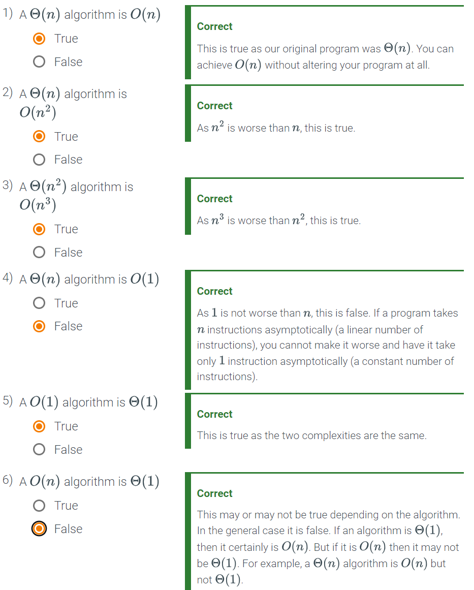  

# Unit 2  

## 2.1 Number Theory and Cryptography  

Material in this Unit  

- Division algorithm
- Modular arithmetic and multiplication
- Congruence mod n
- Prime factorization, greatest common divisor (GCD), and least common multiple (LCM)
- Number representations
- Fast exponentiation  

## 2.2 Divisibility and Modular Arithmetic  

This page marks the beginning of Module 4. This module contains three lessons:

- The division algorithm
- Modular arithmetic and multiplication
- Congruence modulo  

## 2.3 The division algorithm  

**Modular arithmetic** has division, addition, multiplication, and subtraction 
operations. The good news is that modular arithmetic only uses integers-no 
fractional or decimal values.  

**number theory** the branch of mathematics concerned with the study of integers.   

### Integer Division

**Integer division**: the input and output values must always be integers. 
For example, when the number 9 is divided by 4, the answer is 2 with a 
remainder of 1, instead of 2.25.  

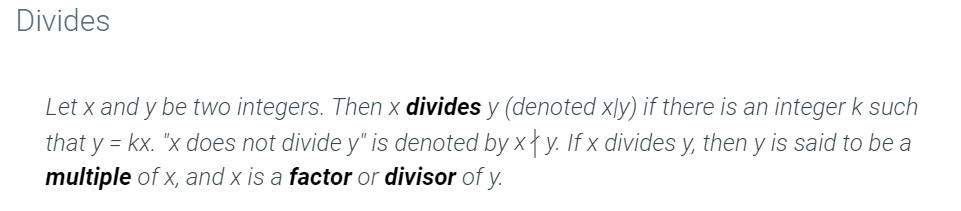  

If a number x divides two different numbers, y and z, then x divides any linear 
combination of y and z.   

A **linear combination** of two numbers is the sum of multiples of those numbers. 
For example, 3x - 7y and -2x + 4y are both linear combinations of x and y.  

A statement about a generic linear combination uses variables to denote the 
integer coefficients. For example, sx + ty is a linear combination of x and y.  

- Let x, y, and z be integers. If x|y and x|z, then x|(sy + tz) for any integers s and t.  

### Quotients and remainders  

If x does not divide y, then there is a non-zero remainder when x is divided 
into y. 

**Division Algorithm** states that the result of the division (the quotient) and 
the remainder are unique:

- Let n be an integer and let d be a positive integer. Then, there are unique 
integers q and r, with 0 ≤ r ≤ d - 1, such that n = qd + r.  

- In the Division Algorithm, the number q is called the **quotient** and the number 
r is called the **remainder**. The operations **div** and **mod** produce the quotient and 
the remainder as a function of n and d.

    - q = n div d

    - r = n mod d

**Division Algorithm**  
```
# Input: Integers n and d > 0.
# Output: q = n div d, and r = n mod d.
# Case 1: n ≥ 0.

q := 0
r := n
While ( r ≥ d )
      q := q + 1
      r := r - d
End-While
```

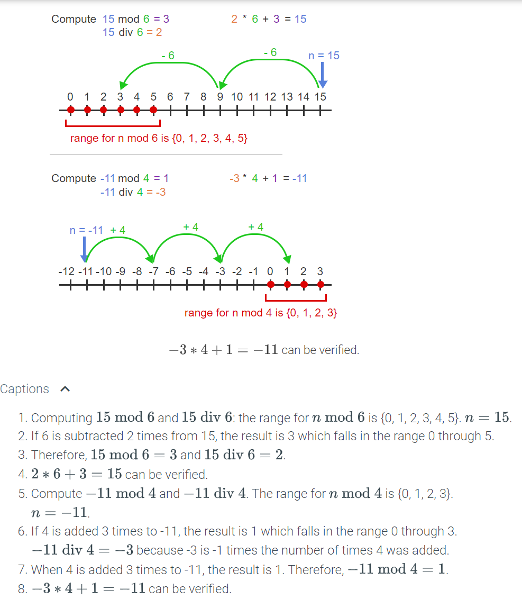 

When finding the division of a negative number, overshoot the division by 1, like:

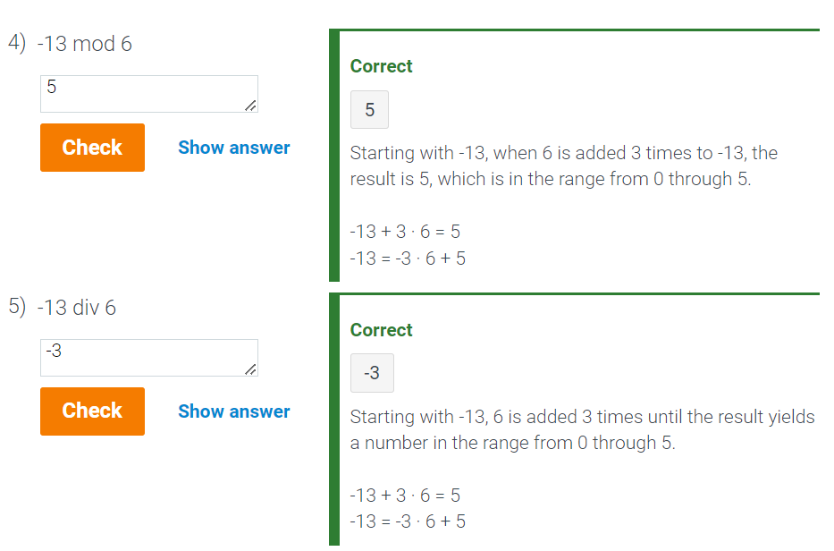  
 

## 2.4 Modular arithmetic and multiplication  

For example, if we wanted to know the date 19 days from January 23, we could 
add 23 + 19 and get January 42. However, there's no such date as January 42, 
so in order to calculate the date you need to use **modular addition**.  

The operation defined by adding two numbers and applying modulo n to the 
result is called **addition modulo n**:

- `(2 + 4) mod 5 = 1 `

The operation defined by multiplying two numbers and applying modulo n to the 
result is called **multiplication modulo n**.  

- `(2*6) mod 5 = 4 `  

## 2.5 Congruence modulo n  

Or perhaps, more simply, recall that military time of 15:00 hours will show 
as 3:00 on a circular, analog clock face. Both of these are examples of 
**congruence**, which means the same measure.  

**Congruence in modular arithmetic** is the same principle. For example, 13 
mod 4 and 29 mod 4 are congruent since the remainder of 13 mod 4 is 1 and the 
remainder of 29 mod 4 is also 1.

Why is it important to know about congruence? In cryptography, one of the most 
important concepts protecting encryption keys is the idea of a number being 
divisible by very large prime numbers. Modular congruence is used frequently to 
determine divisibility of integers.  

### Congruence modulo n

> Let n be an integer greater than 1. Let x and y be any two integers. Then x 
> is **congruent to y modulo n** if x mod n = y mod n. The fact that x is congruent 
> to y modulo n is denoted:
> x  ≡  y (mod n).  

### Alternate characterization of congruence modulo n

> Let n be an integer greater than 1. Let x and y be any two integers. 
> Then x  ≡  y (mod n) if and only if n|(x - y).  

### Exponentiation modulo 71  

Instead of 13<sup>158</sup> mod 71, which is computationally heavy:  

> The following theorem states that in computing arithmetic expressions with 
> multiplication and addition operations modulo n, taking partial results modulo 
> n does not change the final result.

```
p := 13

For i:= 1 to 158
      p := (13*p) mod 71
End-for

Return(p)
```

### Alternative notation for modular arithmetic

Instead of ` x=y(mod n)`, say 'doing operations in **Z**<sub>n</sub>.

**Z**<sub>n</sub> refers to a set of integers {0, 1, 2,...,n-1} along with the 
arithmetic operations mod n (+ mod n, - mod n, x mod n).  Note there is no  ÷ mod n.  

### Computing arithmetic operations modulo n

> Let n be an integer larger than 1. Let x and y be any integers. Then:  

```
[(x mod n) + (y mod n)] mod n = [x + y] mod n

[(x mod n)(y mod n)] mod n = [x·y] mod n
```

> Alternatively, we could say that addition in Z is compatible with addition in 
> Zn. That is, we could reduce first and then do the operation, or we could do 
> the operation and then reduce. Often it simplifies the calculation to reduce as 
> much as possible as a first step.
  
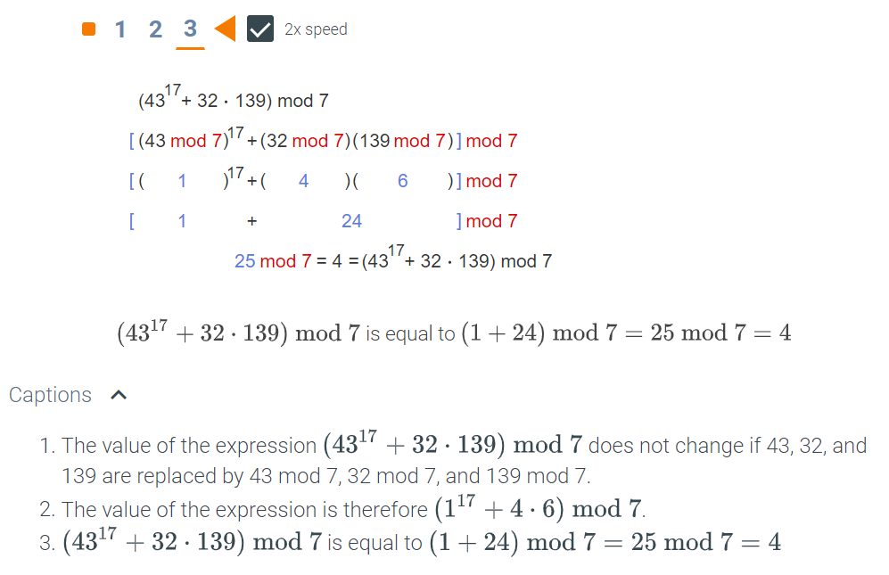  

## 2.6 Prime Factorization, GCD, and Euclid's Algorithm

This page marks the beginning of Module 5. This module contains six lessons:

- Prime factorization
- Greatest common denominators (GCD) and least common multiple (LCM)
- Factoring and primality testing
- Euclidean algorithm
- Extended Euclidean algorithm
- Multiplicative inverse and Euclidean algorithm  

## 2.7 Prime factorizations  

### Prime and composite numbers  

A number p is **prime** if it is an integer greater than 1 and its only factors 
are 1 and p.  

A positive integer is **composite** if it has a factor other than 1 or itself. 

Every positive integer greater than one can be expressed as a product of primes
called its **prime factorization**.  

The fact that every integer greater than one has a unique prime factorization 
is central to number theory and is called **The Fundamental Theorem of Arithmetic**.

### The Fundamental Theorem of Arithmetic

> Every positive integer other than 1 can be expressed uniquely as a product of 
> prime numbers where the prime factors are written in non-decreasing order.  
 
A **non-decreasing sequence** is a sequence in which each number is equal to or 
greater than the one that came before. For example, 1, 1, 2, 3, 17 is an example 
of a non-decreasing sequence, whereas the sequence 1, 1, 3, 2, 17 is not 
non-decreasing because 2 comes after 3. The number 120 has many prime 
factorizations. For example, 2·2·3·2·5 and 2·5·2·2·3 are both prime 
factorizations of 120. However, there is only one prime factorization of 120 in 
which the prime numbers are written in non-decreasing order: 2·2·2·3·5.  

The **multiplicity of a prime factor** p in a prime factorization is the number of 
times p appears in the product of primes. For example, in the prime factorization 
of 120 given above, the multiplicity of 2 is 3 and the multiplicity of 3 is 1. 

For example, the exponential notation for the prime factorization for 120 is:

> 120 = 2<sup>3</sup> x 3 x 5  

## 2.8 Greatest common division and least common multiple  

Prime factorization is important because it is used to determine the greatest 
common divisor (GCD) and the least common multiple (LCM) of integers, which is 
also needed to develop encryption keys.  

### Greatest common divisors and least common multiples

The **greatest common divisor (GCD)** of non-zero integers x and y is the largest 
positive integer that is a factor of both x and y.

The **least common multiple (LCM)** of non-zero integers x and y is the smallest 
positive integer that is an integer multiple of both x and y.  

Two numbers are said to be **relatively prime** if their greatest common divisor is 1.  

Note that any number raised to the power 0 is just 1, so multiplying by 
5<sup>0</sup> or 3<sup>0</sup> does not change the value of the number.  

Find the GCD and LCM of 24 and 50: 

- Perform prime factorization:  

> 24 = 2<sup>3</sup> x 3<sup>1</sup> x 5<sup>0</sup>  
> 50 = 2<sup>1</sup> x 3<sup>0</sup> x 5<sup>2</sup>  

- Find the greatest common factor shared:  

> GCD(24,50) = 2<sup>min(3,1)</sup> x 3<sup>min(1,0)</sup> x 5<sup>min(0,2)</sup> = 2  

- The least common multiple can be determined by using the larger of the two exponents 
for each prime number appearing in the prime factorization:

> LCM(24,50) = 2<sup>max(3,1)</sup> x 3<sup>max(1,0)</sup> x 5<sup>max(0,2)</sup>
> = 2<sup>3</sup> x 3<sup>1</sup> x 5<sup>0</sup> = 600  

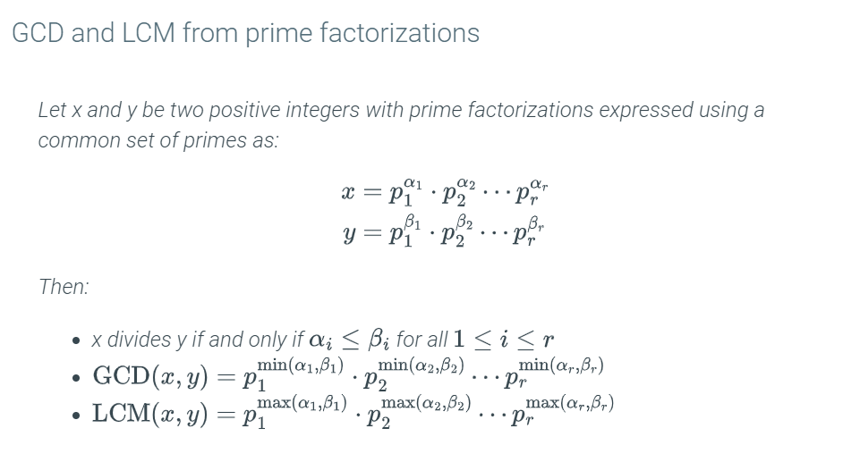  

## 2.9 Factoring and primality testing  

### Primality testing  

Primality Testing: 

- Input: Integer N greater than 1.

- Output: "Prime" if N is prime and "Composite" if N is composite.

Factoring: 

- Input: Integer N greater than 1.

- Output: "Prime" if N is prime. If N is composite, return two integers greater 
than 1 whose product is N.

A **brute force** algorithm solves a problem by exhaustively searching all 
possible solutions without using an understanding of the mathematical structure 
in the problem to eliminate steps.  

This is to find the prime factorization of a number

```
# Brute force algorithm for factoring
# Input: Integer N greater than 1.
# Output: "Prime" if N is prime, else "Composite" if N is composite.

For x = 2 to N-1
      If x evenly divides N,
            Return( "Composite" )
End-for

Return( "Prime" ) 
```

For a number with 110 digits, running the brute force algorithm would not finish 
in our lifetime.  

The procedure can be shortened using the fact that there is no need to test 
factors past &#8730;(N) due to the theorem below:

> **Small factors**  
> If N is a composite number, then N has a factor greater than 1 and at most &#8730;(N).  

Because every composite number N has a factor that is at most &#8730;(N), the 
loop in the factoring algorithm can stop as soon as it gets past &#8730;(N) 
instead of N. Note that although &#8730;(N) may not be an integer, the factor 
must be an integer. Therefore, the last potential factor to test is floor(&#8730;(N))  

  

The reason that RSA is used with such confidence to transmit sensitive information 
is because researchers believe that there is no efficient algorithm for factoring.  

Subtract one from the sqrt of the number, because the count will begin at 2:  
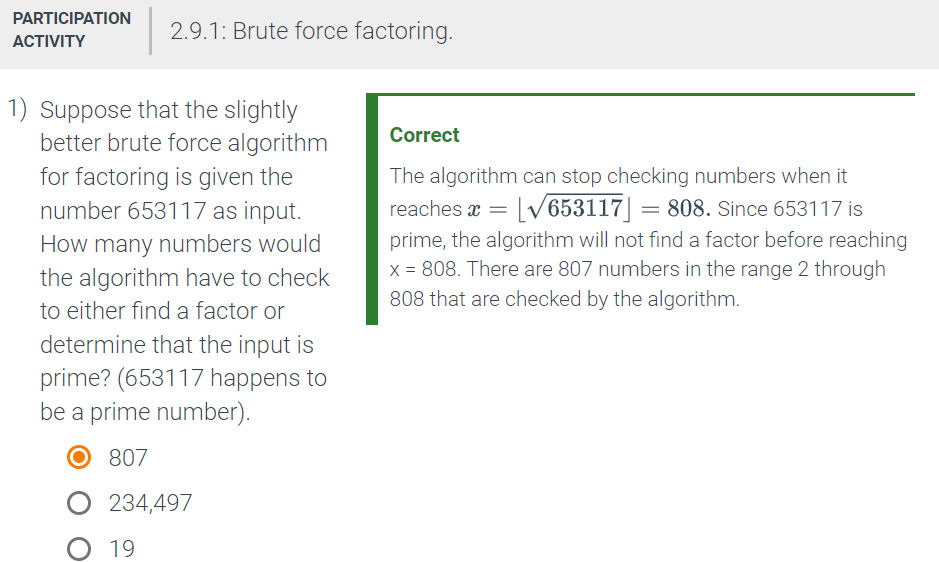  

### The prime number theorem  

The Greek mathematician Euclid around 300 B.C. proved that there are 
*Infinite Prime Numbers*  

The Prime Number Theorem says how dense primes numbers are among the integers:

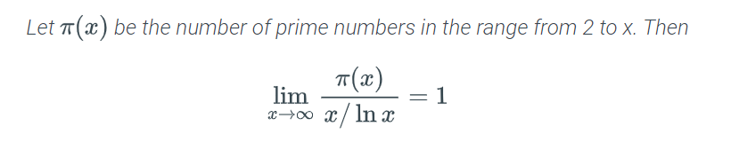  

**Question**
Consider a random integer selected from the range from 2 to 1,000,000,000,000. 
Approximately, what are the chances that the selected number is prime?

Use the equation `1/ln(x)`. So 1/ln(1,000,000,000,000) = 0.036  

**Question**  
Use the prime number theorem to give an approximation for the number of prime 
numbers in the range 2 through 10,000,000.

10,000,000 = 10<sup>7</sup>. The number of prime numbers in the range 2 through 107 is 
approximately 10<sup>7</sup>/ln(10<sup>7</sup>) ≈ 620421.  

## 2.10 Euclidean algorithm  

In this lesson, you'll get to learn how to use Euclid's algorithm, a very old 
method, to find the GCD of two numbers without having to find their prime 
factorizations first.  

**GCD Theorem**:

> Let x and y be two positive integers. Then GCD(x, y) = GCD(y mod x, x).

Suppose that x and y are large numbers and that x < y. According to the GCD 
theorem, y can be replaced with (y mod x) in the computation of GCD(x, y) and 
the result will be the same.   

### Euclid's algorithm for finding the greatest common divisor
```
Input: Two positive integers, x and y.
Output: GCD(x, y).

If ( y < x )
      Swap x and y.
r := y mod x.

While ( r ≠ 0 )
      y := x
      x := r.
      r := y mod x.
End-while

Return( x )
```

**Question** 

Find the GCD of 675 and 210.

The x in this equation is 210, since 210 < 675.  675 is y.  

> GCD(y,x) => GCD(675, 210)

The equation will now look like `y mod x = r`. You will recursively solve this 
until you can't, which I think is 0. 

> 675 mod 210 = 45  
> 210 mod 45 = 30  
> 45 mod 30 = 15  
> 30 mod 15 = 0  

15 was the last number in the iteration, so GCD(675, 210) = 15  

## 2.11 Extended Euclidean algorithm  

### The extended Euclidean algorithm  

Expressing GCD(x, y) as a linear combination of x and y:  

> Let x and y be integers, then there are integers s and t such that
>   
>  GCD(x, y) = sx + ty

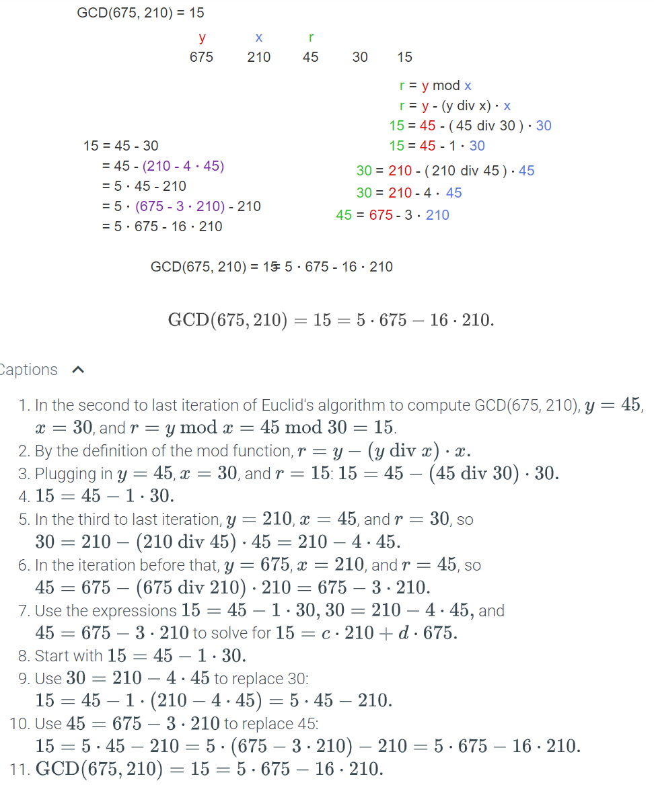  

**GET HELP ON EXTENDED EUCLIDEAN**  

For each of the following pairs of numbers, find the GCD of the two numbers, and express the GCD as a linear combination of the two numbers.

(a) 56 and 42

```
Solution
56      42      14      0

56 mod 42 = 14

42 mod 14 = 0

GCD(56, 42) = 14

The equation is:

14 = 56 - (56 div 42)·42 = 56 - 42

GCD(56, 42) = 14 = 56 - 42
```

(b) 81 and 60

```
Solution
81      60      21      18      3      0

81 mod 60 = 21

60 mod 21 = 18

21 mod 18 = 3

18 mod 3 = 0

The equations for substitution are:

3 = 21 - (21 div 18)18 = 21 -18

18 = 60 - (60 div 21)21 = 60 - 2·21

21 = 81 - (81 div 60)60 = 81 - 60

Substitute (60 - 2·21) for 18 into the equation 3 = 21 -18

3 = 21 - (60 - 2·21) = 3·21 - 60

Substitute (81 - 60) for 21 into the equation 3 = 3·21 - 60

3 = 3·(81 - 60) - 60 = 3·81 - 4·60

GCD(81, 60) = 3 = 3·81 - 4·60
```

(c) 259 and 77

```
Solution
259      77      28      21      7      0

259 mod 77 = 28

77 mod 28 = 21

28 mod 21 = 7

21 mod 7 = 0

The equations for substitution are:

7 = 28 - (28 div 21)21 = 28 - 21

21 = 77 - (77 div 28)28 = 77 - 2·28

28 = 259 - (259 div 77)77 = 259 - 3·77.

Substitute (77 - 2·28) for 21 into the equation 7 = 28 - 21

7 = 28 - (77 - 2·28) = 3·28 - 77

Substitute (259 - 3·77) for 28 into the equation 7 = 3·28 - 77

7 = 3·(259 - 3·77) - 77 = 3·259 - 10·77

GCD(259, 77) = 7 = 3·259 - 10·77
```

## 2.12 Multiplicative inverse and Euclidean algorithm  

### The multiplicative inverse mod n  

> A **multiplicative inverse mod n** (or just inverse mod n) of an integer x, is an 
> integer s ∈ {1, 2, …, n-1} such that sx mod n = 1.  
> Alternatively, we could say that s is the multiplicative inverse of x in 
> Z<sub>n</sub>.

3 is an inverse of 7 mod 10 because 3 · 7 mod 10 = 1    
The number 7 is an inverse of 5 mod 17 because 7 · 5 mod 17 = 1  

**The Goal is to have 1 as the result of the mod**  

**Numbers that are not relative prime will not have an inverse**  

The Extended Euclidean Algorithm can be used to find the multiplicative inverse 
of x mod n when it exists:

- If GCD(x, n) ≠ 1, then x does not have a multiplicative inverse mod n.

- If x and n are relatively prime, then the Extended Euclidean Algorithm finds 
integers s and t such that 1 = sx + tn.

- sx - 1 = -tn. Therefore, (sx mod n) = (1 mod n) = 1. It was shown earlier 
that if A - B is a multiple of n then (A mod n) = (B mod n).

- (s mod n) is the unique multiplicative inverse of x in {0, 1, …, n - 1}.  

**Questions**  
For each x and n, find the multiplicative inverse mod n of x. Your answer should be an integer s in the range 0 through n - 1. Check your solution by verifying that sx mod n = 1.

(a) x = 52, n = 77

```
Solution
77      52      25      2      1

77 mod 52 = 25

52 mod 25 = 2

25 mod 2 = 1

The equations for substitution are:

1 = 25 - 12·2

2 = 52 - 2·25

25 = 77 - 52

Substitute (52 - 2·25) for 2 into the equation 1 = 25 - 12·2

1 = 25 - 12·(52 - 2·25) = 25·25 - 12·52

Substitute (77 - 52) for 25 into the equation 1 = 25·25 - 12·52

1 = 25·(77 - 52) - 12·52 = 25·77 - 37·52

GCD(77, 52) = 1 = 25·77 - 37·52

The coefficient of 52 in the equation above is -37. The multiplicative inverse of 52 mod 77 is (-37 mod 77) = 40.

Check: 52·40 mod 77 = 2080 mod 77 = 1
```

(b) x = 77, n = 52

```
Solution
From the solution to the previous problem:

GCD(77, 52) = 1 = 25·77 - 37·52

The coefficient of 77 in the equation above is 25. The multiplicative inverse of 77 mod 52 is (25 mod 52) = 25.

Check: 77·25 mod 52 = 1925 mod 52 = 1
```

(c) x = 53, n = 71

```
Solution
71      53      18      17      1

71 mod 53 = 18

53 mod 18 = 17

18 mod 17 = 1

The equations for substitution are:

1 = 18 - 17

17 = 53 - 2·18

18 = 71 - 53

Substitute (53 - 2·18) for 17 into the equation 1 = 18 - 17

1 = 18 - (53 - 2·18) = 3·18 - 53

Substitute (71 - 53) for 18 into the equation 1 = 3·18 - 53

1 = 3·(71 - 53) - 53 = 3·71 - 4·53

GCD(71, 53) = 1 = 3·71 - 4·53

The coefficient of 53 in the equation above is -4. The multiplicative inverse of 53 mod 71 is (-4 mod 71) = 67.

Check: 53·67 mod 71 = 3551 mod 71 = 1
```

## 2.13 Number Representation in Other Bases  

This page marks the beginning of Module 6. This module contains three lessons:

- Decimal and binary numbers  
- Hexadecimal numbers  
- Base b expansion  

## 2.14 Number representation- Decimal and binary numbers  

the binary number 1011 corresponds to the decimal 
number 1·23 + 0·22 + 1·21 + 1·20 = 11.  

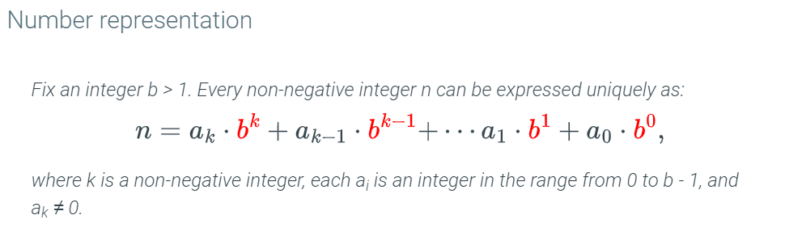  

The representation of n base b is called the **base b expansion of n** and is denoted 
by (akak-1...a1a0)b. The following animation shows how to convert the 
base b expansion of a number into its decimal expansion. The base in the example 
is 3:  

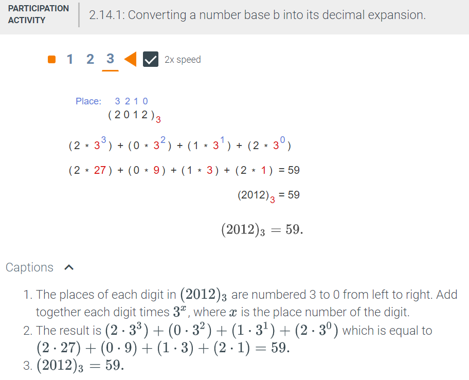  

Match each expression to its decimal expansion:  

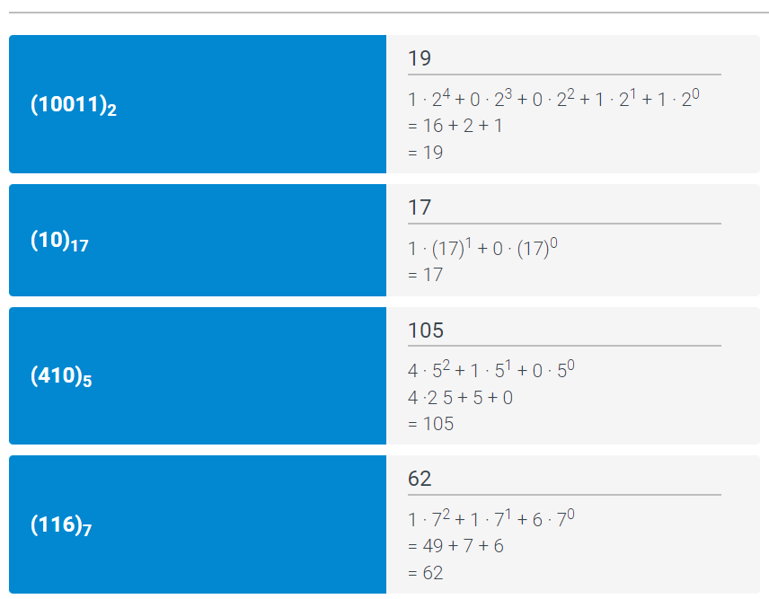  

## 2.15 Number representation- Hexadecimal numbers  

In hexadecimal notation (or hex for short), numbers are represented base 16. 
The 16 digits in hex are the usual 0, 1, 2, 3, 4, 5, 6, 7, 8, 9 along with 
A, B, C, D, E, F  

Convert hex to decimal:  

> 4E0F = 4 x 16<sup>3</sup> + 14 x 16<sup>2</sup> + 0 x 16<sup>1</sup> + 15 x 16<sup>0</sup> = 19983  

Hexadecimal notation is particularly useful in computer science because each 
hexadecimal digit can be used to represent a 4-bit binary number. A **byte**, 
which consists of 8 bits, can be represented by a *2-digit hexadecimal number*.  

**Question**: Give a binary representation for each number given below in hex. 
Drop the leading zeroes in your binary representation.

(a) (A3)16

```
Solution
(A)16 = (1010)2
(3)16 = (0011)2

(A3)16 = (10100011)2
```

(b) (1FC)16

```
Solution
(1)16 = (0001)2
(F)16 = (1111)2
(C)16 = (1100)2

(1FC)16 = (000111111100)2 = (111111100)2
```  

## 2.16 Base b expansion  

**Question**: Find the base 6 expansion of 67.  

Use the formula `[Base b expansion of (n div b)][n mod b]`:  

> \[base 6 expansion of 67 div 6]\[67 mod 6] =\>  
> \[base 6 expansion of 11] 1   

> \[base 6 expansion of 11 div 6]\[11 mod 6] 1 => 
> \[base 6 expansion of 1]  5  1  

> \[base 6 expansion of 0]\[1 mod 6]  5  1  =>
> \[base 6 expansion of 0] 1  5  1  =>  

> (1  5  1)<sub>6</sub> = 67  


### Algorithm to find the base b expansion for a positive integer

```
Input: Integers n and b. b > 1 and n ≥ 1.
Output: Base b expansion of n. Base b digits are output in reverse order.

x := n
while ( x > 0 )
      Output( x mod b )
      x := x div b
End-while
```  

**Question**: Find the expansion base 5 of 57:  

57 mod 5 = 2; Rightmost digit is 2.
57 div 5 = 11

11 mod 5 = 1; Next digit to the left is 1.
11 div 5 = 2

2 mod 5 = 2; Next digit to the left is 2.
2 div 5 = 0

Answer: *212*  

### The number of digits required to represent a number  

The digits in base b range from 0 through b - 1. 

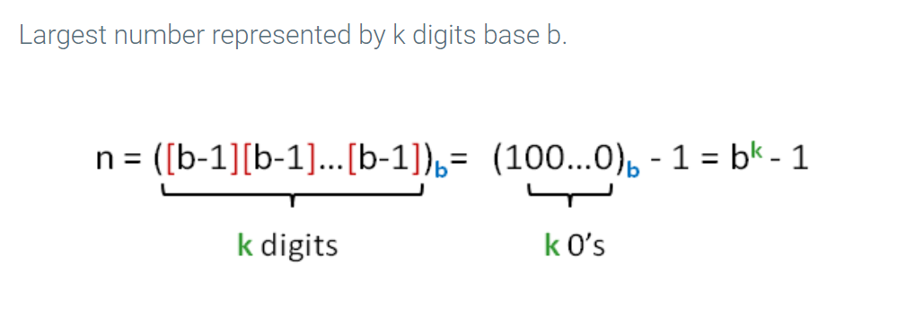  

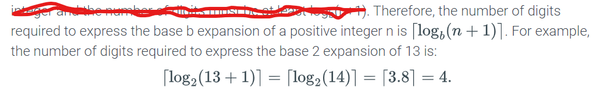  

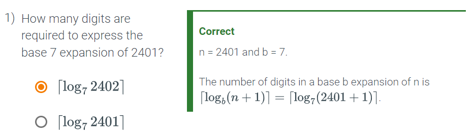  

## 2.17 Fast Exponentiation Algorithms  

This page marks the beginning of Module 7. This module contains two lessons:

- Fast exponentiation
- Modular exponentiation  

## 2.18 Fast exponentiation  

Suppose you wanted to compute x<sup>y</sup>, for positive integers x and y. Computing 
exponents is, in fact, an important step in the RSA cryptosystem  

**An illustration of fast integer exponentiation:**

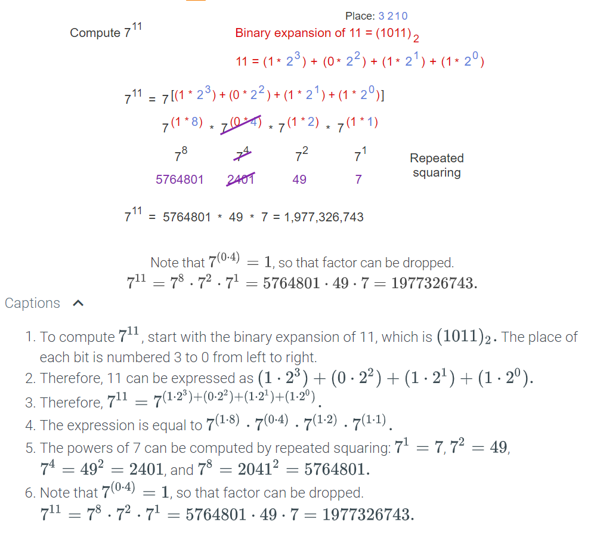  

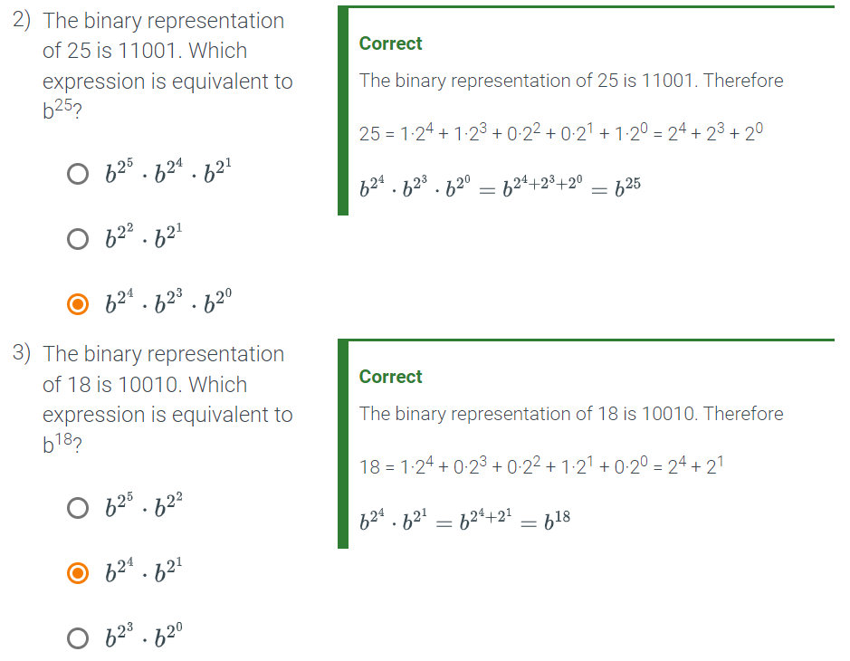  

### An iterative algorithm for fast exponentiation  

The number of operations performed is therefore O(log y), which is much better 
than the y - 1 multiplications required by simply multiplying a partial product 
by x.

```
Input: Positive integers x and y.
Output: xy

p := 1     // p holds the partial result.
s := x     // s holds the current x^2^j
r := y     // r is used to compute the binary expansion of y

While ( r > 0 )
      If ( r mod 2 = 1 )
            p := p·s
      s := s·s
      r := r div 2
End-while

Return(p)
```

## 2.19 Modular exponentiation  

If you thought fast exponentiation was efficient, you are in for a treat. In 
this lesson you will learn about an even faster, more efficient method for 
exponentiation, when you only care about the value mod N. **modular exponentiation or iterative fast exponentiation.**  

### An iterative algorithm for fast modular exponentiation

```
Input: Positive integers x, y, and n.
Output: xy mod n

p := 1     //p holds the partial result.
s := x     //s holds the current 
.
r := y     //r is used to compute the binary expansion of y

While ( r > 0 )
      If ( r mod 2 = 1 )
            p := p·s mod n
      s := s·s mod n
      r := r div 2
End-while

Return(p)
```  

**Get Help**  

**Questions** Find the modulos fo the following exponential expressions: 

(a) 535 mod 11

```
Solution
520 mod 11 = 51 mod 11 = 5 mod 11 = 5

521 mod 11 = 52 mod 11 = 25 mod 11 = 3

522 mod 11 = 32 mod 11 = 9

523 mod 11 = 92 mod 11 = 81 mod 11 = 4

524 mod 11 = 42 mod 11 = 16 mod 11 = 5

525 mod 11 = 52 mod 11 = 25 mod 11 = 3

35 = (100011)2

535 mod 11 = (525 mod 11)(521 mod 11)(520 mod 11) mod 11 = (3·3·5) mod 11 = 45 mod 11 = 1
```

(b) 568 mod 7

```
Solution
520 mod 7 = 51 mod 7 = 5 mod 7 = 5

521 mod 7 = 52 mod 7 = 25 mod 7 = 4

522 mod 7 = 42 mod 7 = 16 mod 7 = 2

523 mod 7 = 22 mod 7 = 4 mod 7 = 4

524 mod 7 = 42 mod 7 = 16 mod 7 = 2

525 mod 7 = 22 mod 7 = 4 mod 7 = 4

526 mod 7 = 42 mod 7 = 2 mod 7 = 2

68 = (1000100)2

568 mod 7 = (526 mod 7)(522 mod 7) mod 7 = (2·2) mod 7 = 4 mod 7 = 4
```

(c) 1120 in Z<sub>33</sub>

```
Solution
22
```

## 2.20 Mathematical Foundations of Encryption  

This page marks the beginning of Module 8. This module contains four lessons:

- Introduction to cryptography
- Encryption and decryption
- RSA encryption
- RSA decryption

## 2.21 Introduction to cryptography  

**Cryptography** is the science of protecting and authenticating data and 
communication.

**sender**: sends message to receiver.   

**receiver**: receives sender's message  

**encrypt**: sender encrypts the message    

**plaintext**: unencrypted message  

**ciphertext**: Encrypted message    

**secret key**: needed by the receiver to decrypt the sender's message  

**decrypt**: change ciphertext to plaintext    

**cryptosystems**

## 2.22 Encryption and decryption  

**Symmetric key cryptosystem**: Alice and Bob must meet in advance (or communicate 
over a reliably secure channel) to decide on the value of a shared secret key  

### Simple encryption scheme requirements:

- no two distinct plaintexts map to the same ciphertext  

> If m ≠ m' and m, m' ∈ Z<sub>N</sub> then (m + k) mod N ≠ (m' + k) mod N
> (no two distinct plaintexts map to same ciphertext)

- second fact to verify is that the decryption scheme is indeed the inverse of 
the encryption scheme  

> If m ∈ Z<sub>N</sub> then (((m + k) mod N)-k) mod N = m
> (decryption scheme is inverse of encryption scheme)  

- To accurately map plaintext (unencrypted message) to ciphertext (encrypted 
message) and then reverse the process (decryption) requires a mathematical 
function that is one-to- one. Each input maps to one and only one output, and 
each output maps back to one and only one input.

- One simple cryptosystem uses modular arithmetic to encode and decode a 
plaintext message. Specifically, ciphertext can be expressed as 
c = (m + k) mod N; where m is the plaintext message, N is an integer, and k is 
a secret value known only to the sender and receiver. Then the decryption 
function can be expressed as m = (c - k) mod N. Note that the 
addition/subtraction inverse operations use the secret value k.

- The systems used in this lesson are **private key cryptosystems**. In a private 
key system both Bob and Alice must meet to decide upon the value of the secret 
key-in our example the value of k-prior to sending encrypted messages.  


## 2.23 RSA encryption  

In a **public key cryptosystem**, anyone can encrypt the message, but only the receiver 
has the correct decryption key to ultimately read the encrypted message.  

Public key cryptosystems rely on two premises: 

- the presumed difficulty of the computation required to decrypt the message 

- the assumption that there exists no more efficient method to decrypt the 
ciphertext without knowing the key.  

The mostly widely used public key cryptosystem is the 
**RSA (Rivest, Adelman, and Shamir) cryptosystem**(1978). This method of encryption 
depends on the difficulty of factoring large numbers. As of now, there is no 
efficient method of factoring numbers without having information (the key) 
about how the numbers were created.  

### Public key Cryptography  

In public key cryptography, Bob has an **encryption key** that he provides publicly 
so that anyone can use it to send him an encrypted message. Bob holds a matching 
**decryption key** that he keeps privately to decrypt messages. While anyone can 
use the public key to encrypt a message, the security of the **scheme depends on** 
**the fact that it is difficult to decrypt the message without having the matching** 
**private decryption key.** 

**Preparation of public and private keys in RSA**:

1) Bob selects two large prime numbers, p and q.

2) Bob computes N = pq and φ = (p-1)(q-1). \[Note the symbol φ is read Phi.]

3) Bob finds an integer e such that gcd(e, φ) = 1.

4) Bob computes the multiplicative inverse of e mod φ: an integer d such that 
(ed mod φ) = 1.

5) Public (encryption) key: N and e.

6) Private (decryption) key: d.  

**Public Key Generation**:  

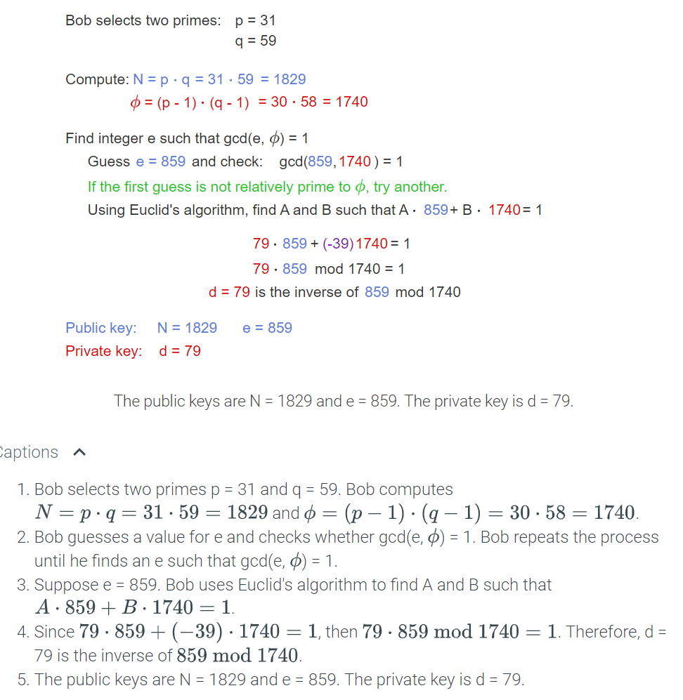  

There are infinitely many possibilities for public and private keys, which depend 
on the choice of **e** that is relatively prime to **phi**.  

Look at Section 2.11, Extended Euclidean Algorithm to solve for d.

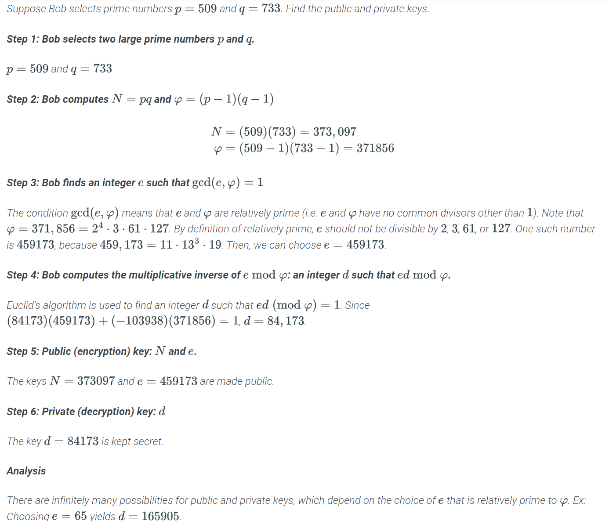  

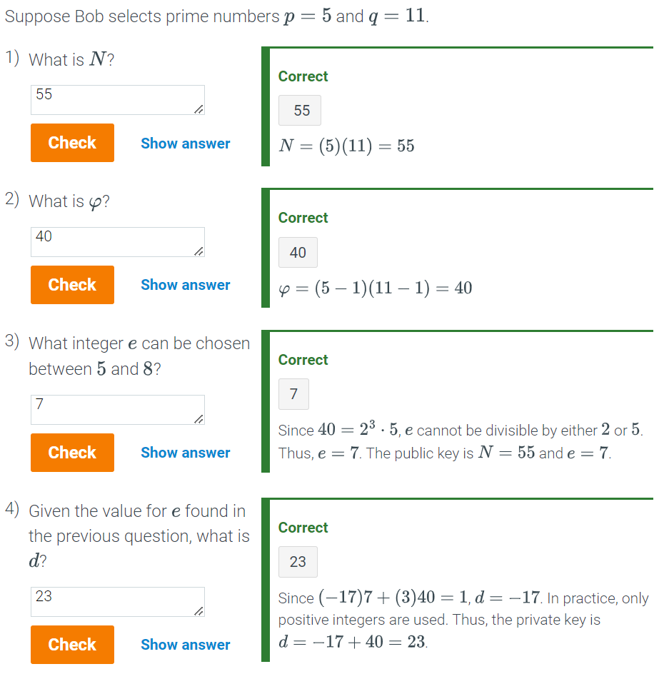  

### RSA Encryption  

The RSA scheme requires that m is an integer in Z<sub>N</sub> and is not a 
multiple of p or q. Since p and q are primes with hundreds of digits, it is 
extremely unlikely that m is a multiple of primes p or q.
Alice encrypts her plaintext using e and N to produce ciphertext c as follows:  

> c = m<sup>e</sup> mod *N* (encription)  
> m is the message  
> c is the ciphered message

**Encrypting plaintext into ciphertext using RSA**

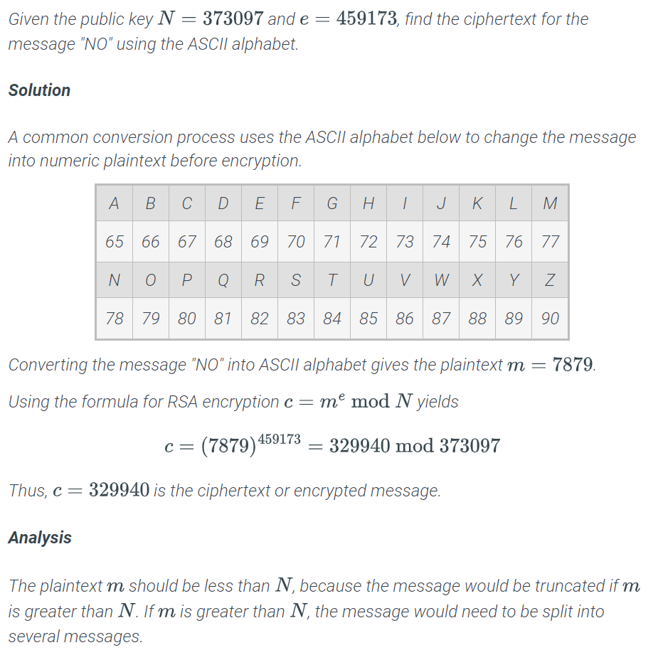

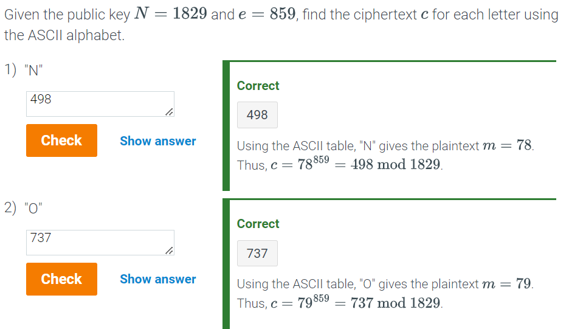  

## 2.24 RSA decryption  

public keys (values referred to as N and e) and private keys (the value d)

To decrypt an RSA encoded message, not only must the receiver know the public 
key, but the private key d, must also be known.  

You will need the following mathematical skills: 

- modular arithmetic  
- the extended Euclidean algorithm  
- the algorithm for fast exponentiation

**RSA Decryption**:  

> m = c<sup>d</sup> mod *N* (decryption)  
> m is the plaintext message  
> c is the cipher  

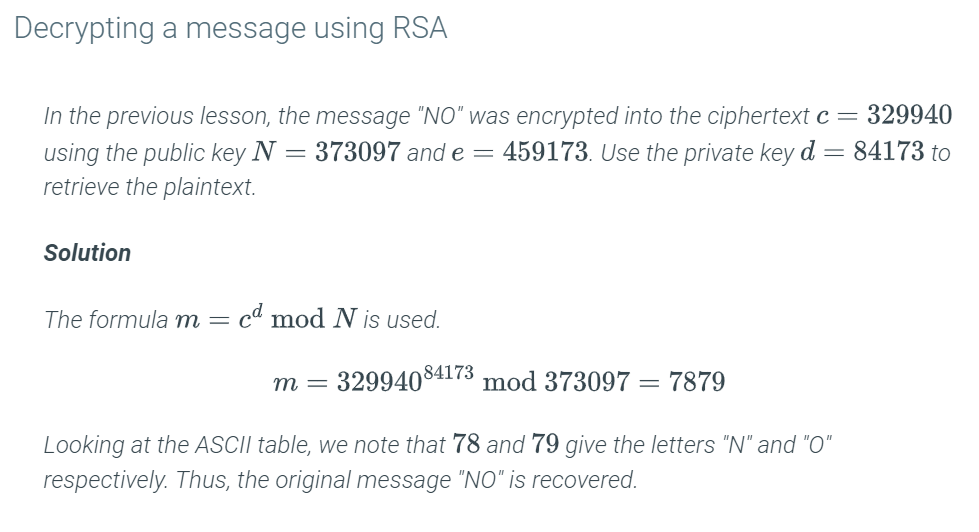  

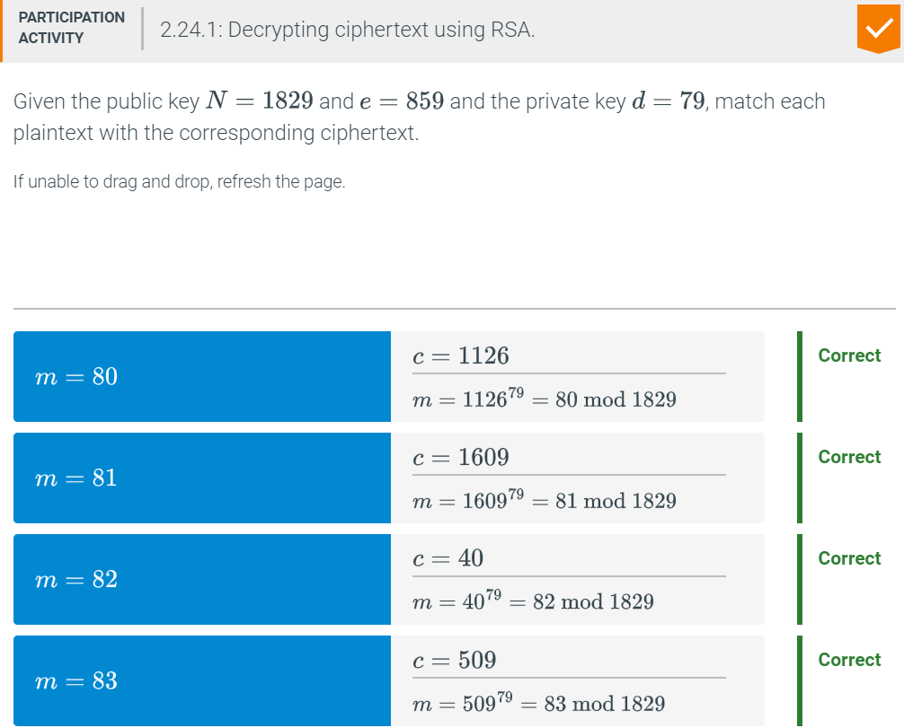  

### Encrypting and decrypting a message using RSA

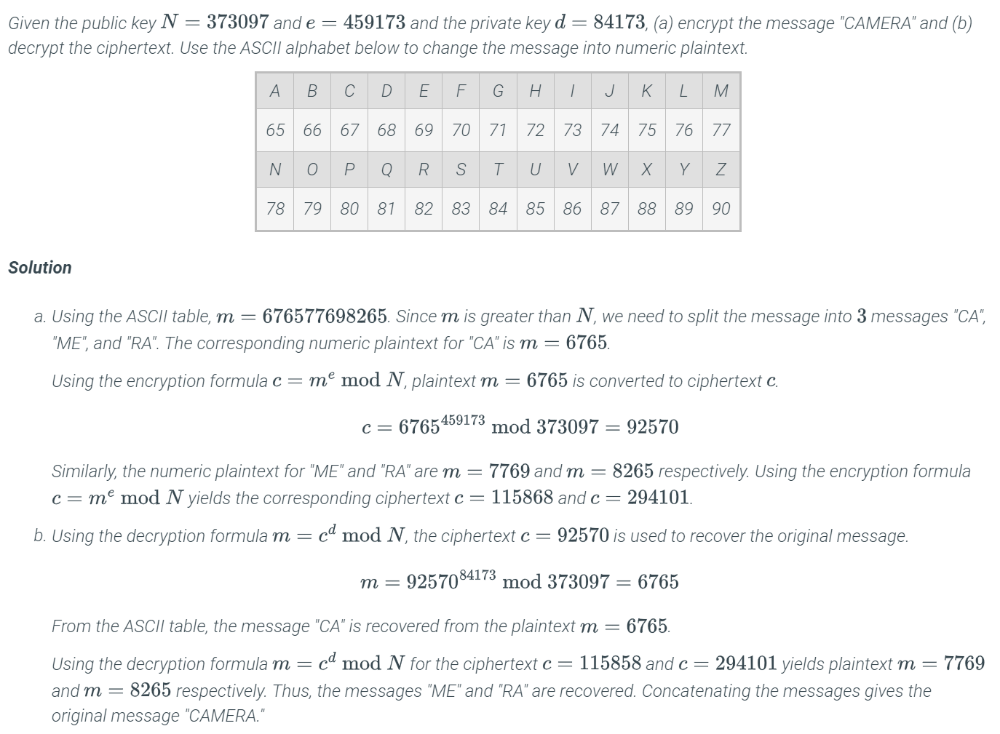

**Question**: In this problem, we will implement the RSA algorithm to encrypt 
and decrypt the message "HI". For this exercise, you may want to use a 
calculator that can compute the mod function.

(a) Use the scheme used in your text to convert the message "HI" into an integer. Call the integer m.

```
Solution
H → 08, I → 09. m = 0809 = 809
```

(b) Set the primes p and q as follows: p = 43 and q = 79. What are the values 
for N and φ?

```
Solution
N = 43·79 = 3397

φ = (43 - 1)(79 - 1) = 42·78 = 3276
```

(c) The value for e is chosen to be 29. Use Euclid's algorithm to verify that 
e and φ are relatively prime and to find d, the multiplicative inverse of 
e mod φ.

```
Solution
3276      29      28      1

3276 mod 29 = 28

29 mod 28 = 1

The equations for substitution are:

1 = 29 - 28

28 = 3276 - 112·29

Substitute (3276 - 112·29) for 28 into the equation 1 = 29 - 28

1 = 29 - (3276 - 112·29) = 113·29 - 3276

gcd(3276, 29) = 1 = 113·29 - 3276

The coefficient of 29 in the equation above is 113. The multiplicative inverse of 29 mod 3276 is 113.

Check: 29·113 mod 3276 = 3277 mod 3276 = 1

d = 113
```  

(d) Encrypt the message m by computing me mod N

```
Solution
ciphertext = 80929 mod 3397

80920 mod 3397 = 8091 mod 3397 = 809 mod 3397 = 809

80921 mod 3397 = 8092 mod 3397 = 654481 mod 3397 = 2257

80922 mod 3397 = 22572 mod 3397 = 5094049 mod 3397 = 1946

80923 mod 3397 = 19462 mod 3397 = 3786916 mod 3397 = 2658

80924 mod 3397 = 26582 mod 3397 = 7064964 mod 3397 = 2601

29 = (11101)2

80929 mod 3397 =
(80924 mod 3397)(80923 mod 3397)(80922 mod 3397)(80920 mod 3397) mod 3397 =
(2601·2658·1946·809) mod 3397 = 336

ciphertext = 336
```

(e) The result of the previous question is the ciphertext c that is transmitted. 
To decrypt the message, compute cd mod N.

```
Solution
Message = 336113 mod 3397

33620 mod 3397 = 3361 mod 3397 = 336 mod 3397 = 336

33621 mod 3397 = 3362 mod 3397 = 112896 mod 3397 = 795

33622 mod 3397 = 7952 mod 3397 = 632025 mod 3397 = 183

33623 mod 3397 = 1832 mod 3397 = 33489 mod 3397 = 2916

33624 mod 3397 = 29162 mod 3397 = 8503056 mod 3397 = 365

33625 mod 3397 = 3652 mod 3397 = 133225 mod 3397 = 742

33626 mod 3397 = 7422 mod 3397 = 550564 mod 3397 = 250

113 = (1110001)2

336113 mod 3397 =
(33626 mod 3397)(33625 mod 3397)(33624 mod 3397)(33620 mod 3397) mod 3397 =
(250·742·365·336) mod 3397 = 809

Message = 809
```

(f) Verify that the decrypted message is the same as m. Convert m back into a 
text message.

```
Solution
The decrypted message is 809, the original value for m.

809 → 08 09 → HI
```

# Unit 3  

## 3.1 Recursion and Induction  

The material in this unit comprises 20% of the high-stakes assessment and includes such concepts as:

- Recurrence Relations
- Induction Methods
- Summations and Limits
- Recursive Structures
- Recursive rules with functions, sets, and binary trees
- Simple Recurrence Relations

There is an old joke in computer science:

To understand recursion you must first understand recursion.  

## 3.2 Recurrence Relations  

This page marks the beginning of Module 9. This module contains two lessons:

- Introduction to recursive relations  

- Evaluating recursive relations  

## 3.3 Introduction to recursive relations

a key process for **divide and conquer algorithms**  

**Recursion** is a method that finds new values using previous values.  

- To denote the nth term you write a<sub>n</sub>. The 4th term is 16; 
written a<sub>4</sub>=16.  

### Recurrence relations  

A **recurrence relation** is an equation that expresses a new term using 
previous terms. Requires two things:  

- the initial terms  

- a rule defining the new term based on the previous term  

## 3.4 Evaluating a recursive relation  

Recurrence relation defining an **arithmetic sequence**:

> a0 = a   (initial value)
> an = d + an-1   for n ≥ 1   (recurrence relation)
> Initial value = a. Common difference = d.

Recurrence relation defining an **geometric sequence**:  

> a0 = a   (initial value)
> an = r⋅ an-1  for n ≥ 1   (recurrence relation)
> Initial value = a. Common ratio = r.

Fibonacci defined the sequence in an attempt to mathematically describe the 
population growth of rabbits.  

Divide the previous term by the current term. Then do the same thing to previous 
terms. If the quotient is the same, it is a *geometric sequence*.  

If the terms change by a constant amount, then it is an *arithmetic sequence*

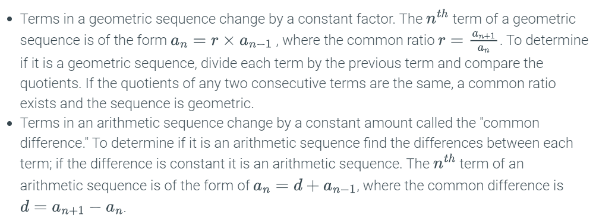  

## 3.5 Induction Methods  

This page marks the beginning of Module 10. This module contains eight lessons:

- Computing summations
- Summation: limits and variables
- Inductive proof
- Divisibility proof by induction
- Induction proof of a recurrence relation
- Induction proof of closed summation
- Strong induction
- Well-ordering principle  

## 3.6 Summations  

Summation of sequences (also called series)  

**Summation notation** is used to express the sum of terms in a numerical sequence. 
Consider a sequence:  

  

- **k** is called the *index*  

- **s** is the *lower limit*  

- **n** is the *upper limit*  

When the index starts at 1, the summation:  
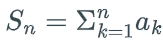  
is referred to as the **nth partial sum**  
  
Since: 
S<sub>n</sub> = a<sub>1</sub> + a<sub>2</sub> + a<sub>3</sub> +...+ a<sub>n - 1</sub> + a<sub>n/sub>    
and the *nth* term of a sequence can be defined recursively in terms of 
partial sums **a<sub>n</sub> = S<sub>n</sub> - S<sub>n-1</sub>**  

The capital letter sigma (Σ) is used to denote the fact that the terms are to be 
added together.  
Summation notation can be used to sum up the terms in a sequence defined by an 
explicit formula:  

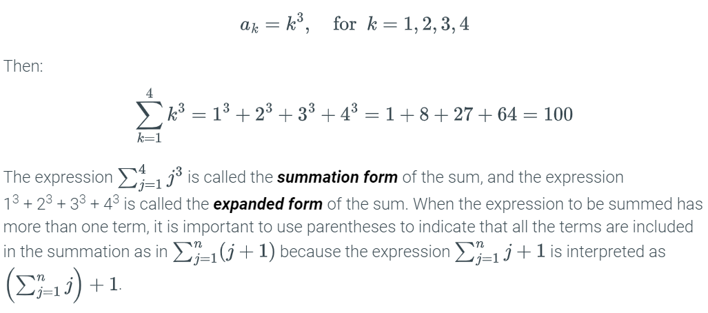  

Summation Example:  

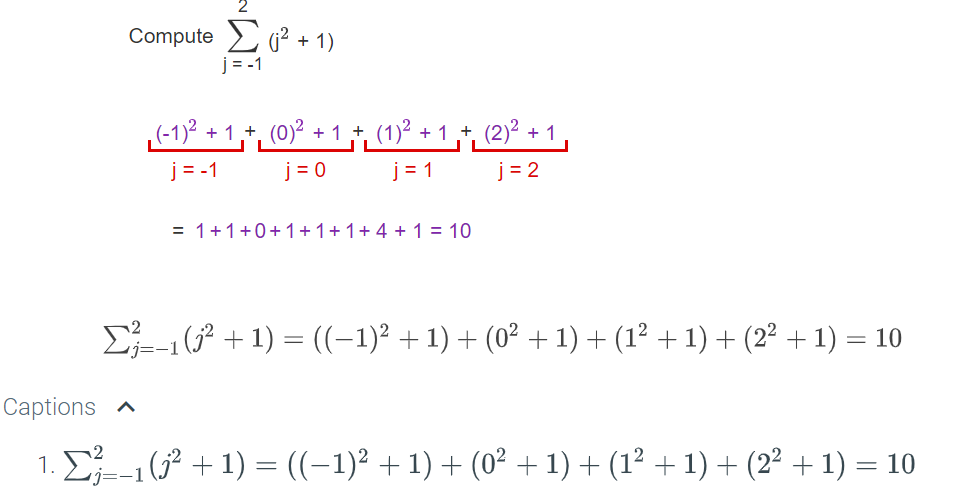  

### Pulling out a final term from a summation  

Representing pulling out the final sum: 

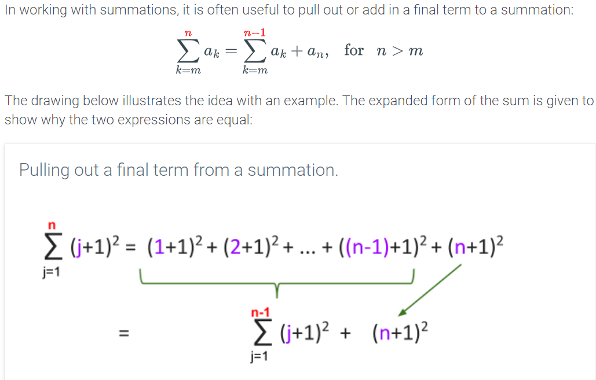  

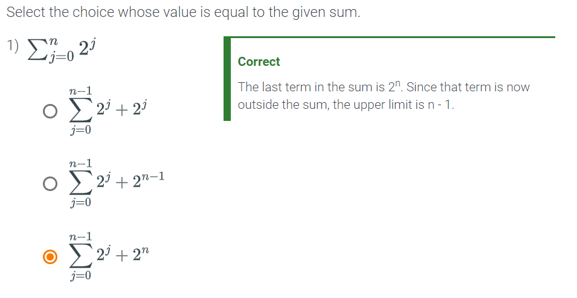  

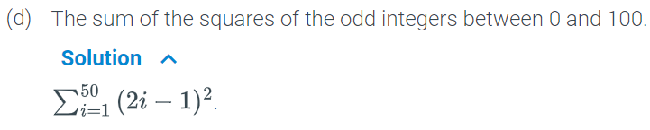  

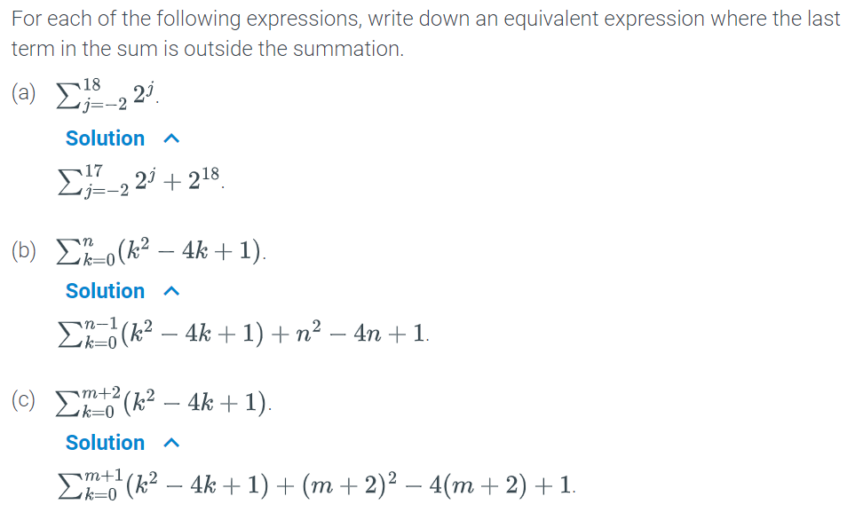  

## 3.7 limits and variables  

Change the index variable:  

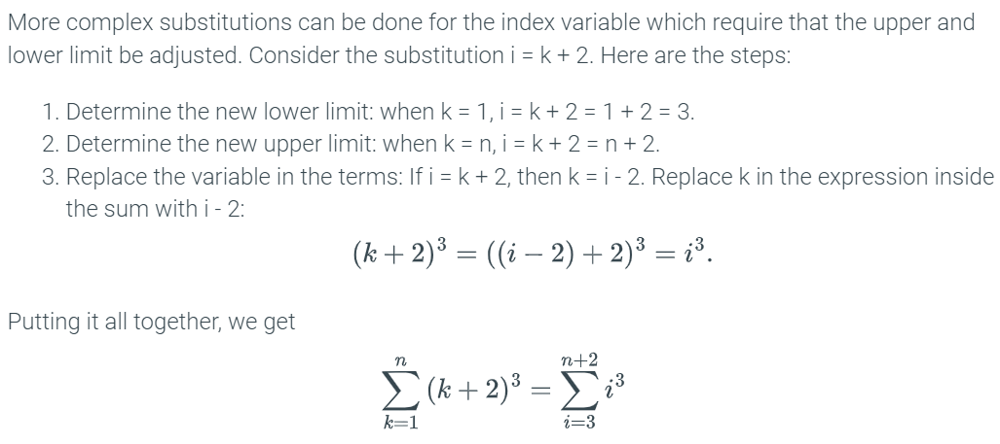  


Change variable of summation, change the upper and lower limits:  

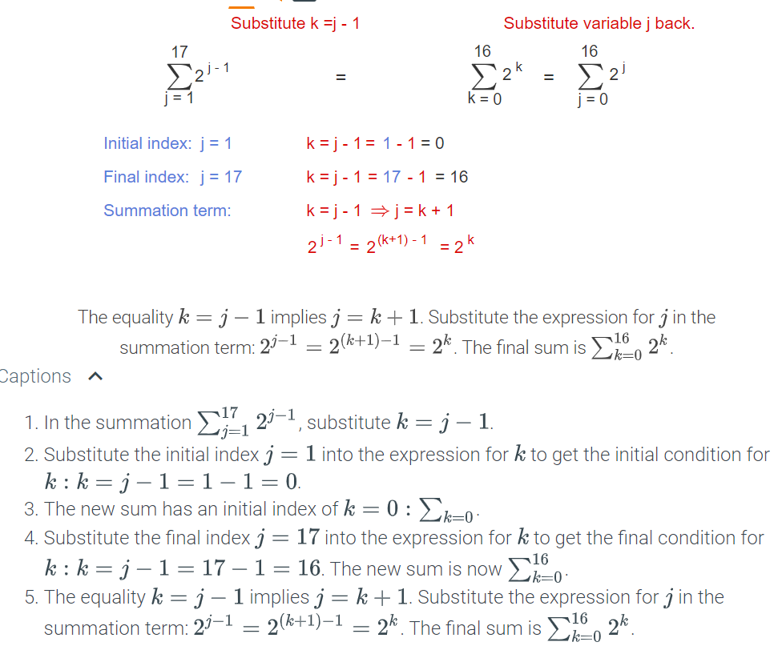  

Note below for practicing change of variables: 
You must re-arrange the given substitution `j = i + 2`. Where the question is 
asking for j, you keep the equation `j = i + 2` the same. But if the question 
asks for i, then re-arrange to `i = j - 2`  

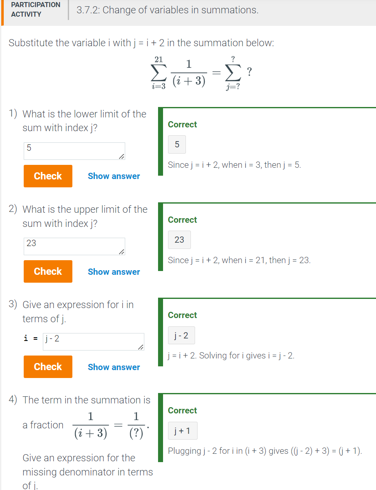

### Closed forms for sums  

A **closed form** for a sum is a mathematical expression that expresses the value 
of the sum *without summation notation*. There are closed form expressions for 
some, although not all, of the summations that arise naturally in scientific 
applications. 

#### Closed form for arithmetic  

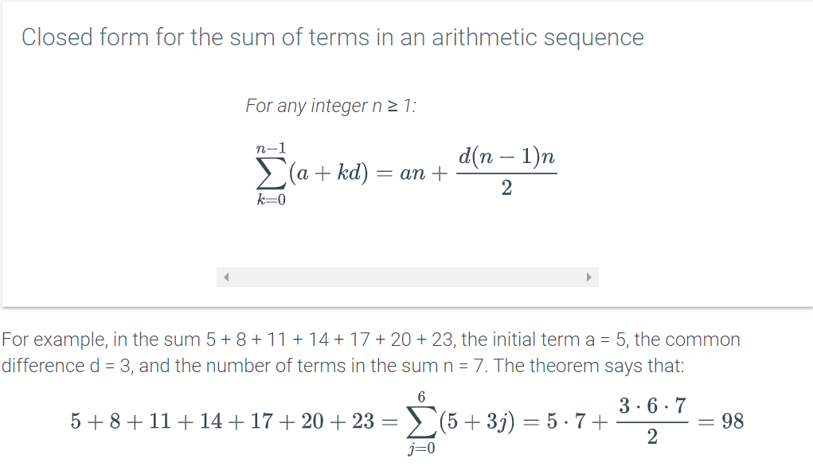

#### Closed form for geometric  

  

Arithmetic and Geometric Closed Form practice:  

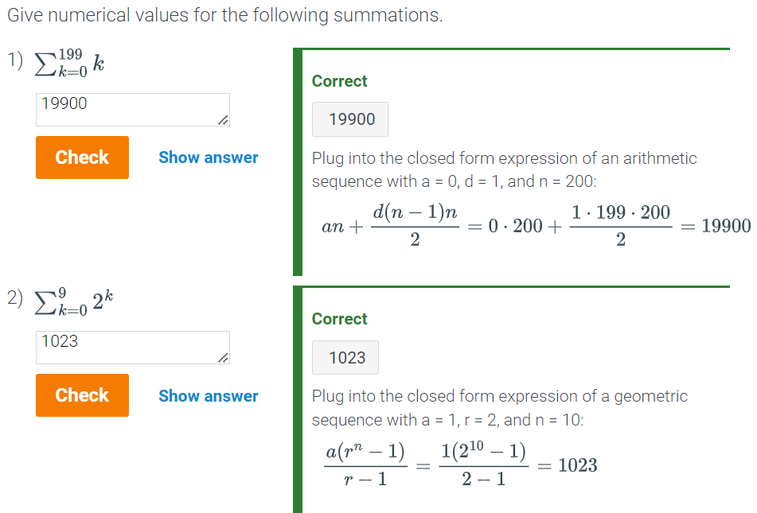  

## 3.8 Inductive proof  

**Induction** (not to be confused with inductive reasoning). Knowing that 
if the nth compartment filled then the (n+1)th compartment would fill, is the 
inductive step. For the dominos to start falling, the first compartment, n=1, 
had to fill; this is the base case.   

Suppose that one day a genie grants you three wishes. You make two wishes and 
then for your third wish, you wish for three more wishes the next day. Given 
the fact that you can always use your third wish to renew your wishes for the 
next day, it is possible to prove that from that first day onward, you can have 
three wishes every day for the rest of your life. This is an example of the 
**principle of mathematical induction** (or just induction for short).  

The **principle of mathematical induction** states that if the base case 
(for n = 1) is true and inductive step is true, then the theorem holds for all 
positive integers.

Use induction to prove that a series is equal to a given formula  

Use induction to prove that inequalities are true.  

**The two components of an inductive proof.**

- The base case establishes that the theorem is true for the first value in 
the sequence.

> The genie grants you three wishes on day 1  

- The inductive step establishes that if the theorem is true for k, then the 
theorem also holds for k + 1.

> If you have three wishes on day k, then you can get three wishes for day 
> k+1 (by using the third wish to ask for three more wishes the next day).  

- To be valid, an inductive proof must have a base case and at least one 
inductive step.  

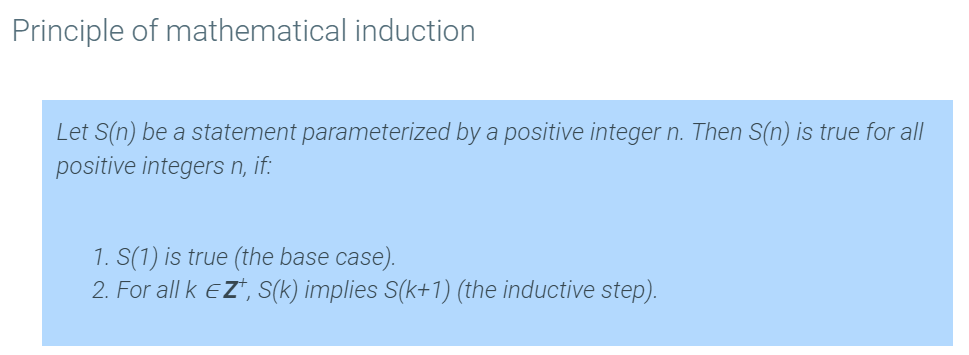  

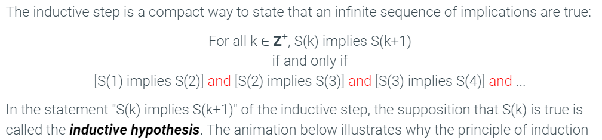  


### Proving an identity by induction.

The next example will be *a (inductive?) proof* that for any positive integer n, the following 
equality is true:

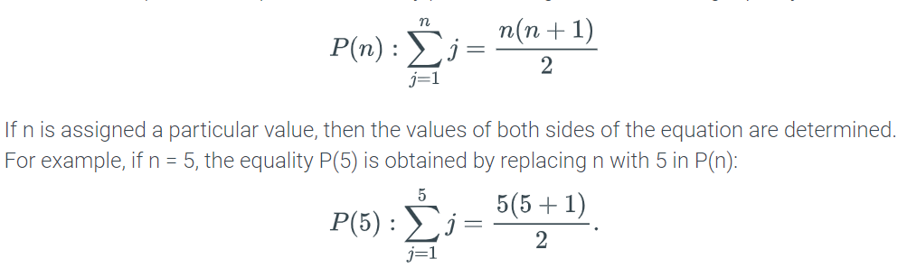 

The left side of the equation is the sum 1 + 2 + 3 + 4 + 5. The expression on 
the right side of the equation is 5(5 + 1)/2. Now it is possible to check that 
both sides evaluate to the same number (**in this case 15**). The assertion that 
the equality holds for a particular n can be denoted by the predicate P(n). 
The statement P(n) may be true or false, depending on the value of n.

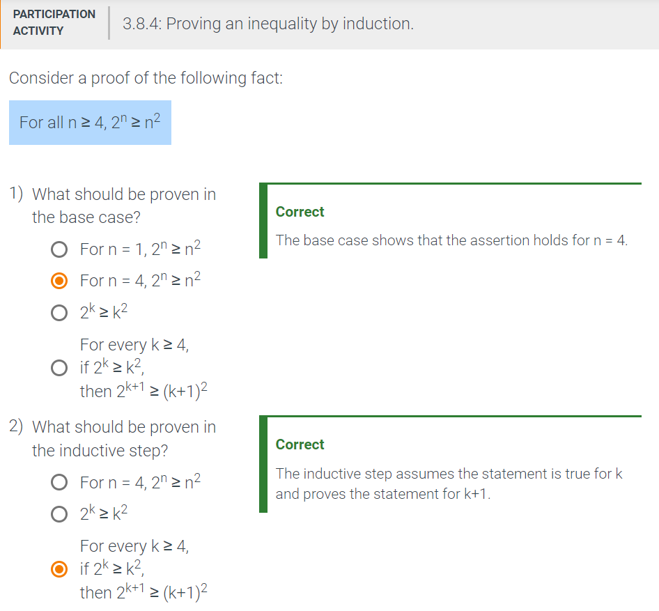  

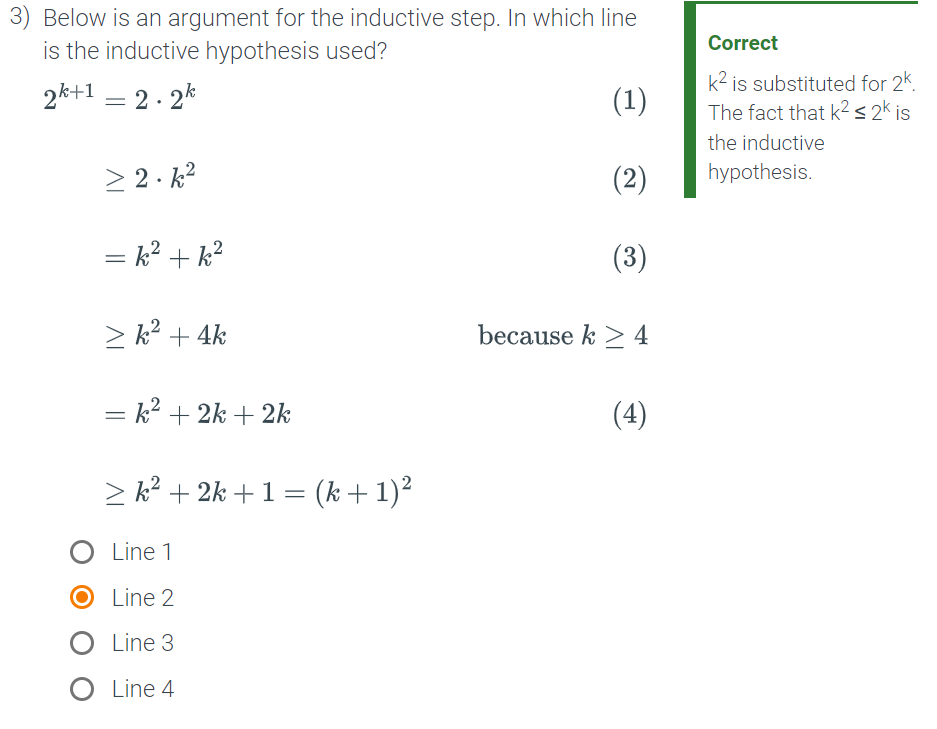  

## 3.9 Divisibility proof by induction  

The next example of a proof by induction proves that 3 evenly divides the value
of a mathematical expression parameterized by an integer n. A quantity is evenly 
divisible by 3 if it can be expressed as 3·m for some integer m. Define the 
predicate Q(n) to be the statement:

> Q(n): 3 evenly divides 2<sup>2n</sup> - 1.

The statement Q(3) says that 3 evenly divides 22·3 - 1. Q(3) is true because 
22·3 - 1 = 26 - 1 = 63 and 3 does in fact evenly divide 63 (because 63 = 3·21).

The following example shows an inductive proof of the theorem that Q(n) is true 
for all positive integers n:

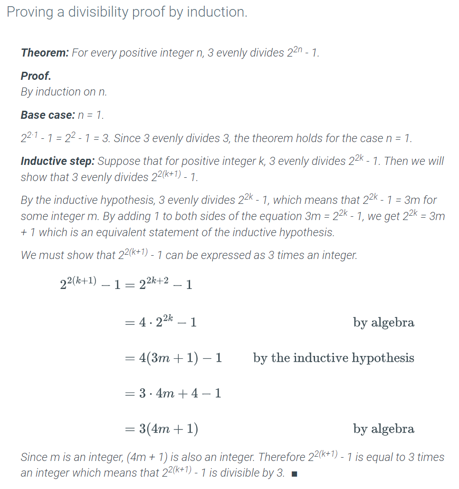  

## 3.10 Induction proof of a recurrence relation  

- Find the base step of an induction proof by substituting in n = 0 or n = 1.

- Find the inductive step of an induction proof by substituting in n + 1.

- Check that the base and inductive steps of a recurrence proof are satisfied.

- Prove the explicit formula for a recurrence relation using induction. Show the 
base case by substituting in n = 0 or n = 1. Next substitute n + 1 into the 
formula. Algebraically manipulate the result so the case for n is separated. 
The n case is assumed to be true; now leverage this to show that the remaining 
parts are true. For recursion, this often means isolating the fn+1 term.  

### Explicit formula for a sequence defined by a recurrence relation  

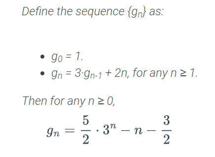  


**Proving the explicit formula for a recurrence relation by induction** 

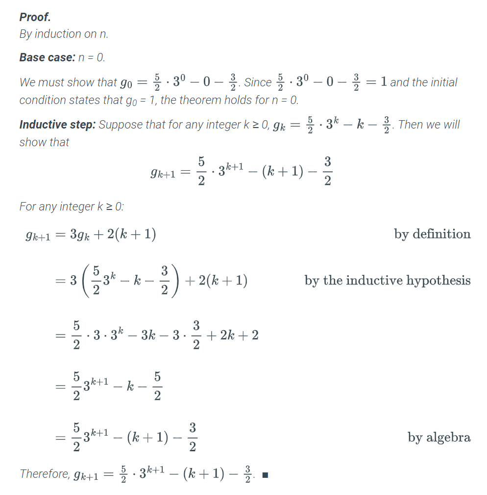  

The next set of questions present an **inductive proof** of the following theorem:

### Explicit formula for a sequence defined by a recurrence relation

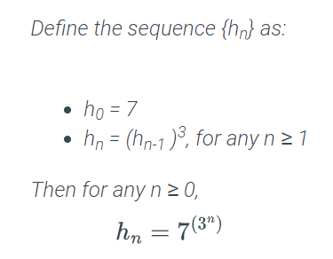  

## 3.11 Induction proof of closed summation  

### Inductive proofs showing the *closed forms* for sums of arithmetic and geometric sequences  

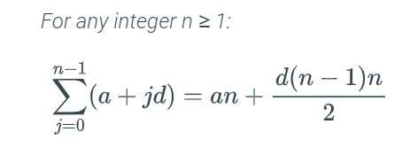  

### Closed form for the sum of terms in a geometric sequence

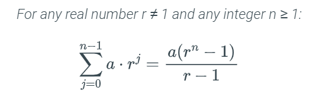  


# Unit 6  

## 6.1 Modeling Computation  

The material in this unit comprises 13% of the high-stakes assessment and 
includes such concepts as:

- Theory of computation
- Deterministic Finite State Automata (DFA)
- Nondeterministic Finite State Automata
- State diagrams and transition tables  

## 6.2 Deterministic Finite State Machine  

This page marks the beginning of Module 21. This module contains six lessons:

- Theory of computation
- Introduction to deterministic finite state automata (DFA)
- DFA state diagrams
- DFA state transition tables
- Analyzing transition rules of a DFA
- Evaluating outcomes of a DFA  

## 6.3 Theory of computation  

### Introduction to computational models  

**Computation** is any type of calculation that includes both arithmetical and 
non-arithmetical steps and follows steps that provide a solution to a problem.  

**Computational models** are abstract models that allow computer scientists to 
reason about what can and cannot be computed by a particular kind of device.  

- pushdown automata 
- linear-bounded automata
- Turing machines  

### Major families of automata  

There are four major families of automaton listed in order of complexity from 
simplest to most complex:  

- **The finite state machine** is the simplest family of automaton. In a finite 
state machine, every bit exists in either of two states, 0 or 1, and a finite 
number of possible inputs exist.
    - Ideal for small amounts of memory.  
    - Used in analysis of mathematical problems  
    - Recognize regular language  
    - Handle type-3 grammars
    
- A **pushdown automaton** uses a stack, or an abstract data type that collects 
elements.  
    - Used in theories to determine what machines can compute  
    - Handle Type-2 grammars and context-free languages 
    
- A **linear-bounded automaton** consists of two endmarkers with input in 
between. Data is contained in a "tape" between the endmarkers. 
    - handle Type-1 grammars 
    - context-sensitive languages  
    
- A **Turing machine** is the most complex family of automaton. The Turing machine 
consists of a finite automaton with infinite storage. 
    - Can change symbols on its tape
    - can model all computations that can be handled by modern computers  
    - handle Type-0 grammars
    - Recursively enumeable languages  
    
### Languages and grammars  

The **language** accepted by a computational model is the set of all strings which 
the computational model accepts.  

A **grammar** is a set of rules for generating strings. The 
**language generated by a grammar** is the set of all strings that can be generated 
according to the rules of the grammar.  

### The finite state automaton  

A **finite state automaton** (plural: **finite state automata**) consists of a finite 
set of states with transitions between the states triggered by different input 
actions. A finite state automaton is also known as a **finite state machine (FSM)**.  


### Summary:  

- Computation is the process of solving problems using a physical device. The physical device that can perform computations is referred to as a "computer."

- Computational models are abstract models that allow computer scientists to reason out what can and what cannot be computed.

- Computational models receive a string as an input and produce an output based on the input. Some models output "yes" when the input string is accepted by the machine or "no" if it is rejected.

- The set of strings accepted by a machine is called a language. A language is generated by a set of rules called grammar. The concepts of languages, grammars, and automata are intrinsically connected. A grammar generates a language that is accepted by an automaton.

- Finite state automaton is a computational model that consists of a finite set of states with transitions between the states triggered by different input actions. It is also called a finite state machine (FSM).


## 6.4 Deterministic finite state automata (DFA)

- A **deterministic finite automaton (DFA)** is a finite state automaton whose next state is uniquely determined by the current state and the next input symbol.

    - Is a specific category of FSM  
    
    - There is no possibility of going into two different states at any given step, which is what makes it "deterministic."  

    - Simplest model of computation  
    
    - Type-3 grammars, the simplest
    
- A deterministic finite automaton is a **quintuplet (5-tuple)** that consists of:

    - a set of finite **states**,
    
    - a set of symbols (**alphabet**),
    
    - a **transition function** (set of rules for transitioning between states),
    
    - an **initial state**  
    
    - a set of final, **accepting states**.  
    
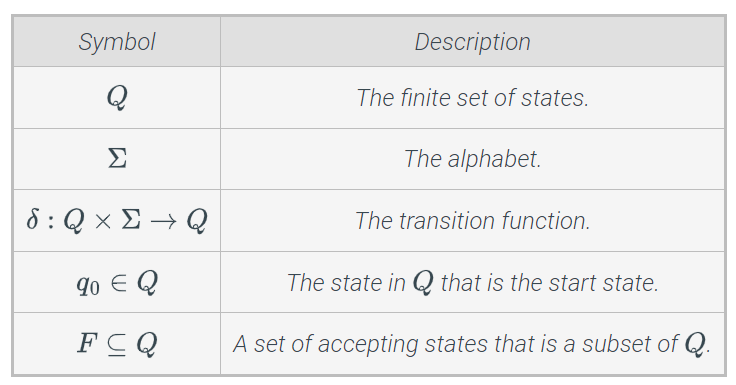  

- Initially the DFA is in the given initial state. It initiates its transitions by looking at the first symbol of the input string. The state the DFA will transition to depends on the symbol currently at the beginning of the input string and the transition function.

- A string is accepted by a DFA if the machine does not have any symbols from the initial string to read and it has transitioned into an accepting state.

## 6.5 DFA state diagrams  

- A **state diagram** is a visual representation of a deterministic finite automation.

    - Circles denote the states of the automation
    
    - The labeled arrows explain the transitions between states, i.e. they model the transition function.

- The automaton transitions between states jumping from one state to another following the arrow that is labeled by the next alphabet symbol from the input string.

## 6.6 DFA state transition tables  

- The transition function of a deterministic automation can be represented by a 
table that defines the state to which the automation transitions, based on the 
current state. 

    - states are represented as rows 
    
    - the current alphabet symbols are represented in the columns  
    
- DFA transition functions can be described using: 

    - words  
    
    - state transition diagrams
    
    - state transition tables  
    
## 6.7 DFA analyzing transition rules  

- The DFA always starts in the "start" state and initiates the transition based 
on the first symbol of the input string. In the new state it reacts to the 
second symbol, transitions to a new state, and so on.

- Some DFAs can build output as they transition based on the input symbol.

- The input and output alphabets may coincide, but they do not need to. The DFA 
with output is virtually a rewriting system, one that uses one string and 
generates another based on the rewriting rules defined by the transition 
function.

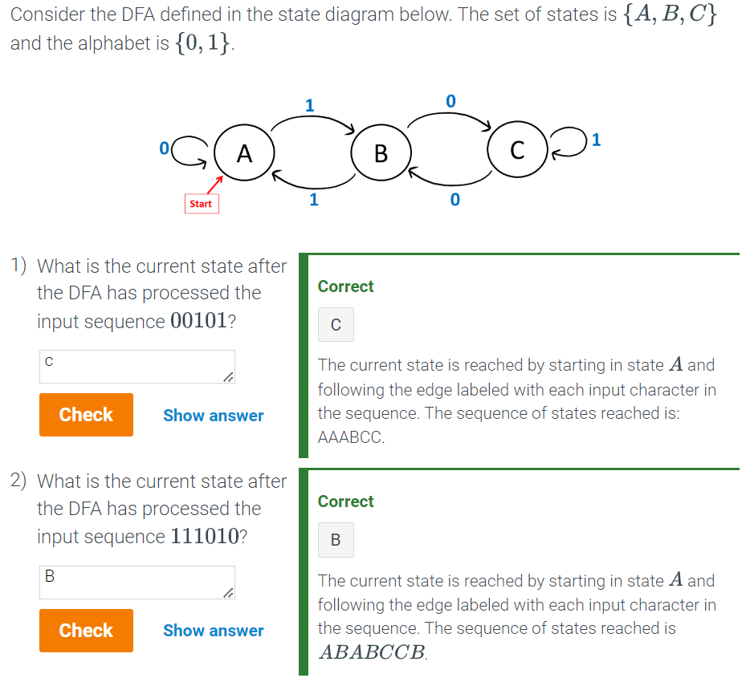  

DFA State table: 

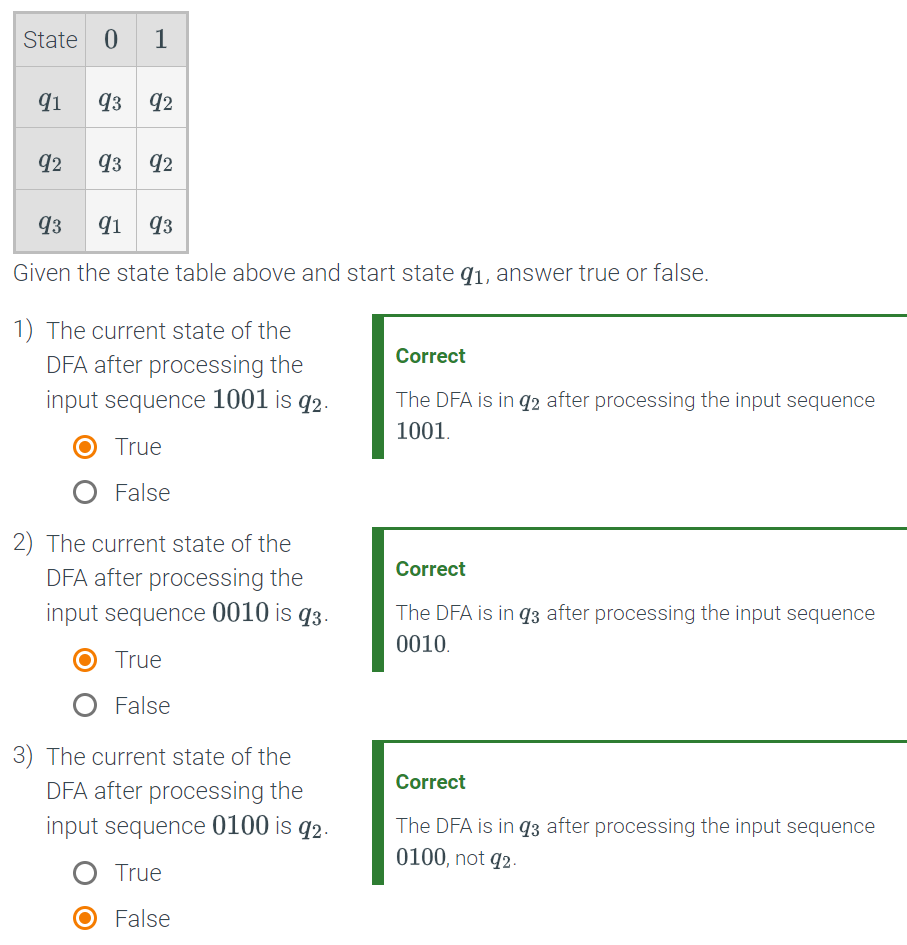  

## 6.8 DFA evaluating outcomes  

There are languages a DFA cannot recognize, as its memory is limited on the 
current state and the next symbol of the input string.  

The property of whether a number is odd or even is called the **parity** of a number. 
The parity of a string is the parity of the number of 1's. 

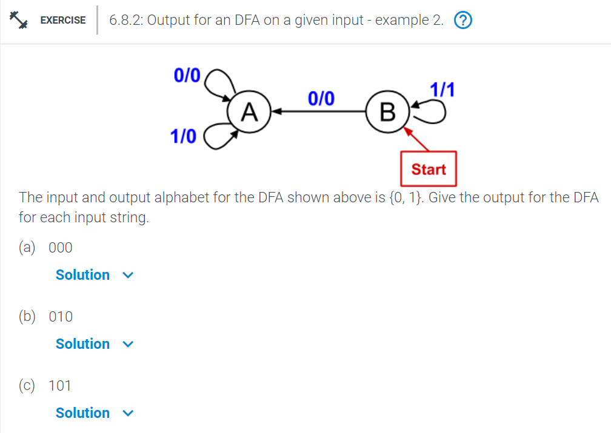  

Accepted Strings of a DFA:  

  

## 6.9 Nondeterministic Finite State Machine  

This page marks the beginning of Module 22. This module contains five lessons:

- Introduction to nondeterministic finite automata (NFA)

- NFA state diagrams

- NFA state tables

- NFA analyzing transition rules

- NFA evaluating outcomes

## 6.10 Nondeterministic finite automata (NFA)  

The NFA are a superset of the DFAs.  

A **non-deterministic finite automaton (NFA)** is a finite state automaton 
whose next state is not uniquely determined by the current state and the next 
input symbol.  

- Nondeterministic finite automata are a quintuplet, where the transition 
function maps into the power state of the set of states. The components of the 
NFAs are:  
    - states set  
    - the alphabet
    - set of final states
    - initial state
    - a transition function

- NFAs can transition into multiple states with one symbol or no symbols.

- An **epsilon transition** is a transition from one state or another without 
reading an input symbol.  

- it is impossible to design a DFA that takes as input any binary string and 
accepts if and only if the majority of the bits are 1  

## 6.11 NFA state diagrams  

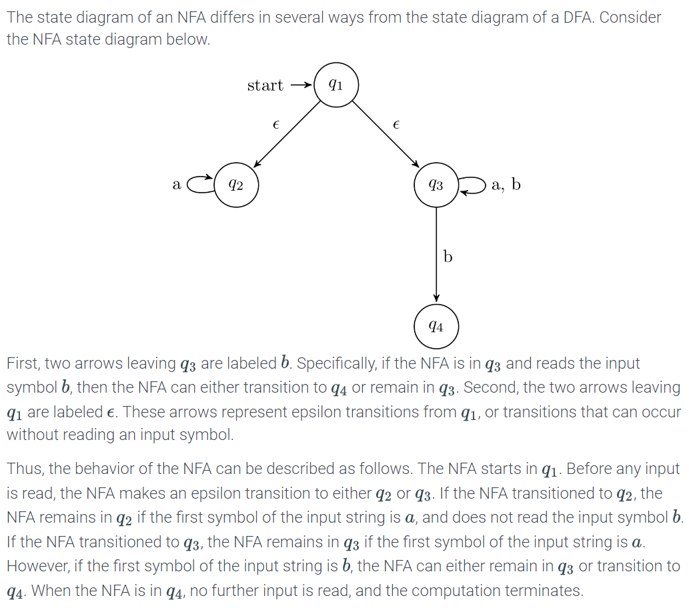  

  

## 6.12 NFA state transition tables  

Use the state diagram above in 6.11 as a reference:

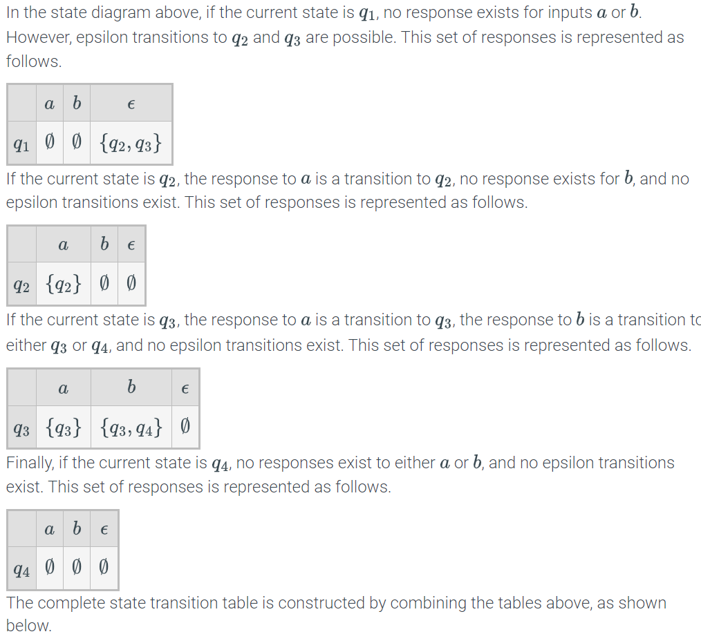

## 6.13 NFA analyzing transition rules  

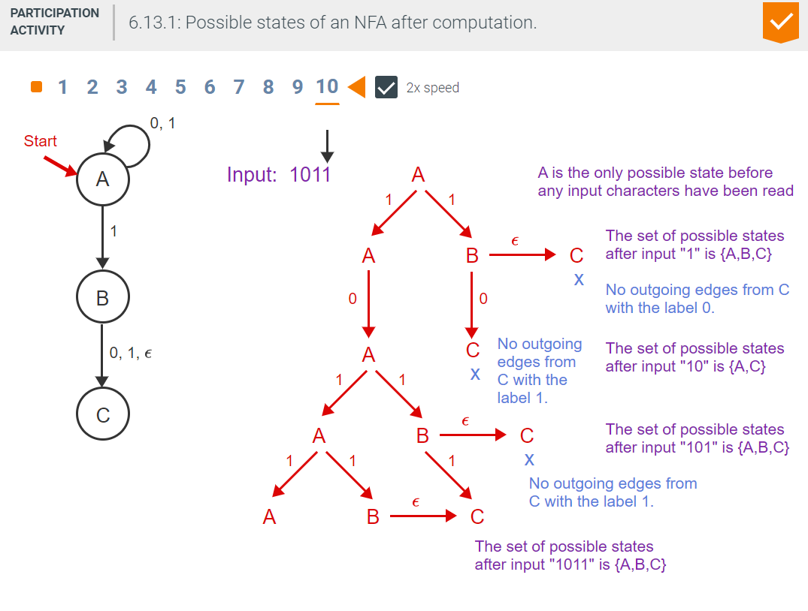  

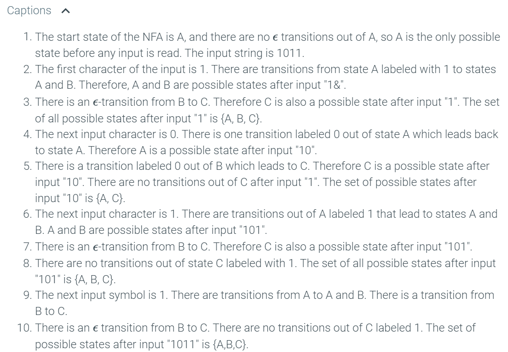  

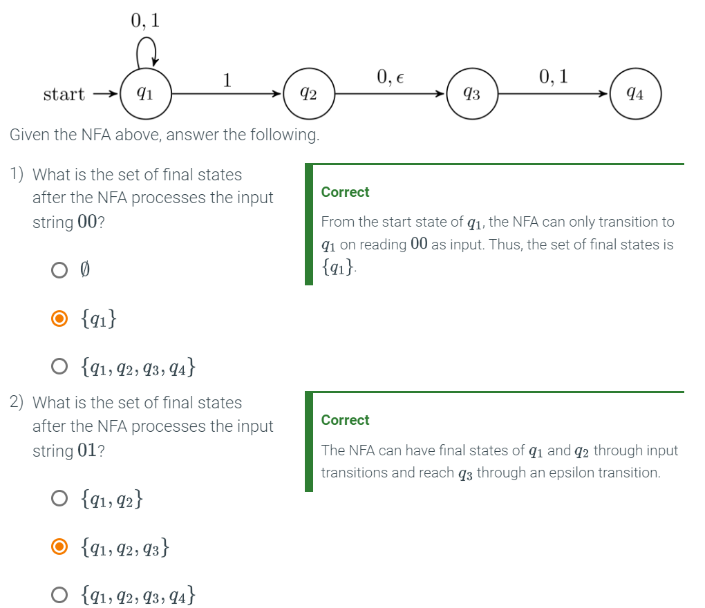  

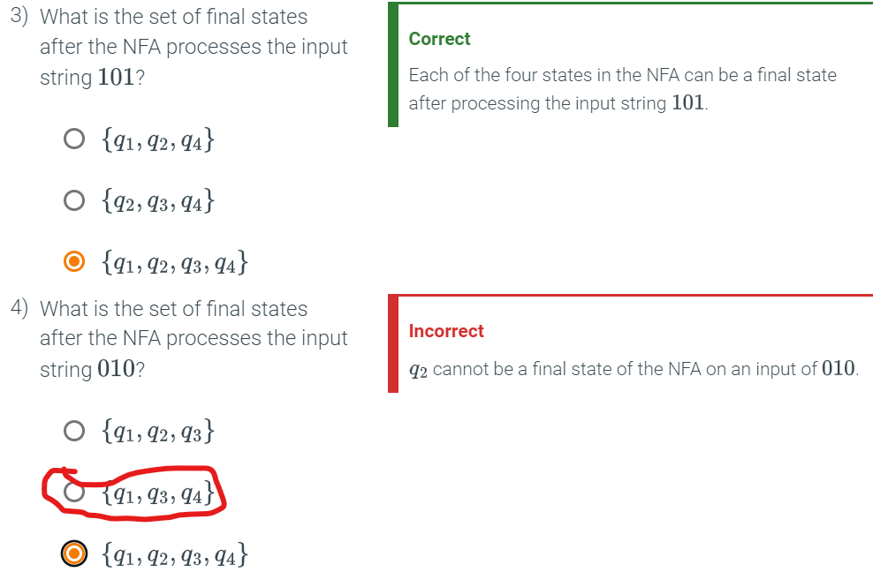  

## 6.14 NFA evaluating outcomes   

An NFA accepts a string as long as at least one valid sequence of 
transitions corresponding to the input symbols exists, putting the NFA in an 
accepting state at the end of the input string.  

NFA Accepted State:

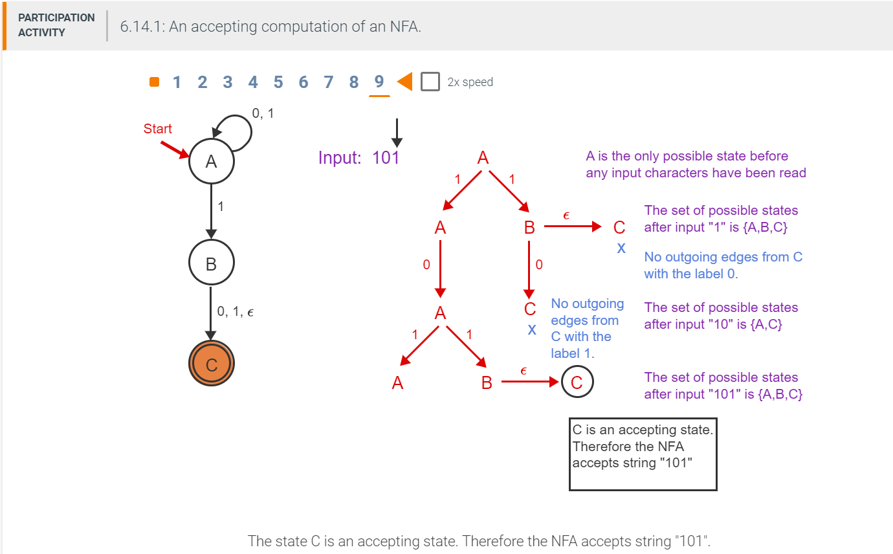  

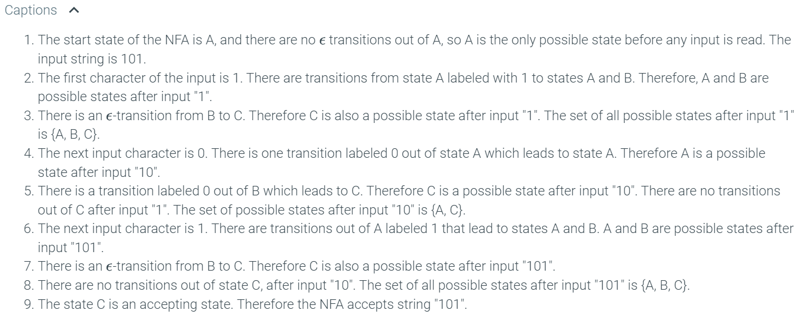  

NFA Rejected State:

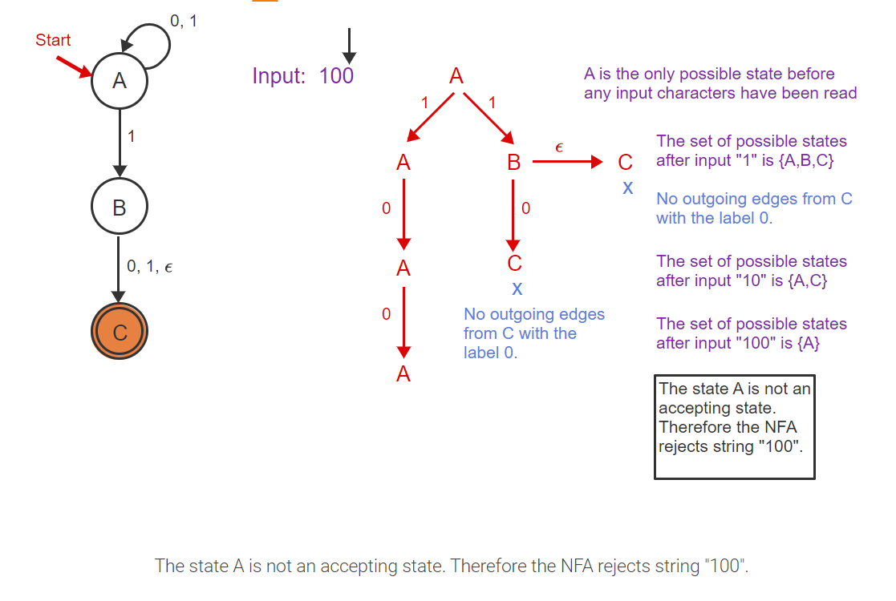  

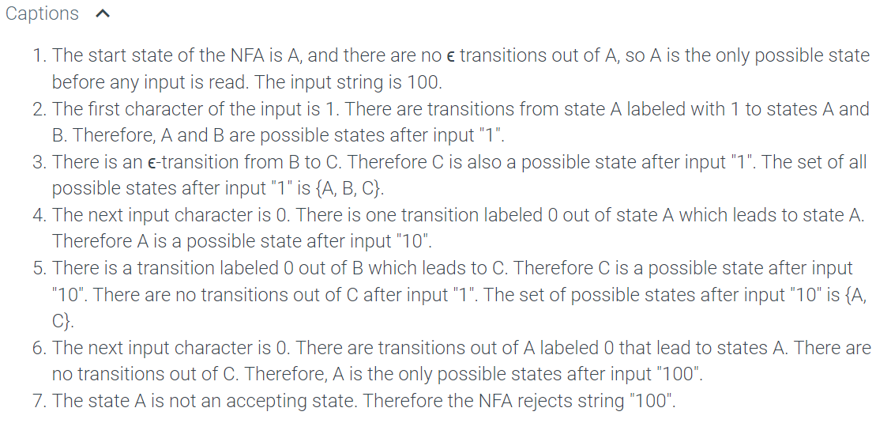  


