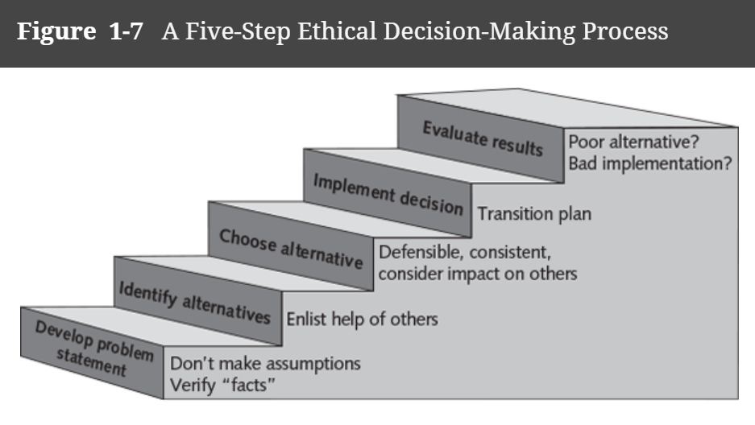
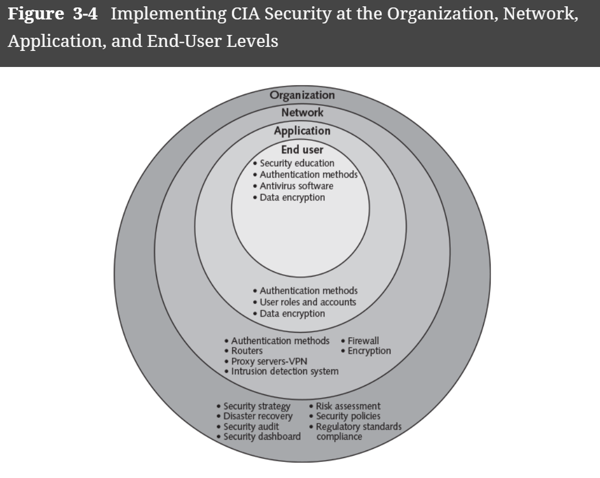
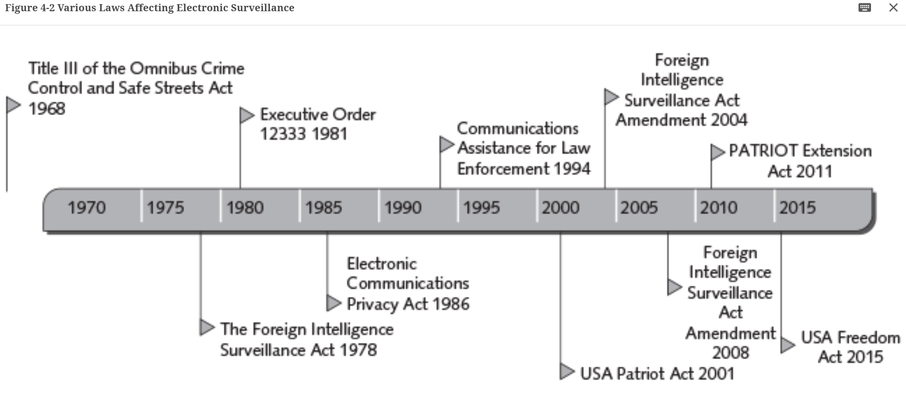
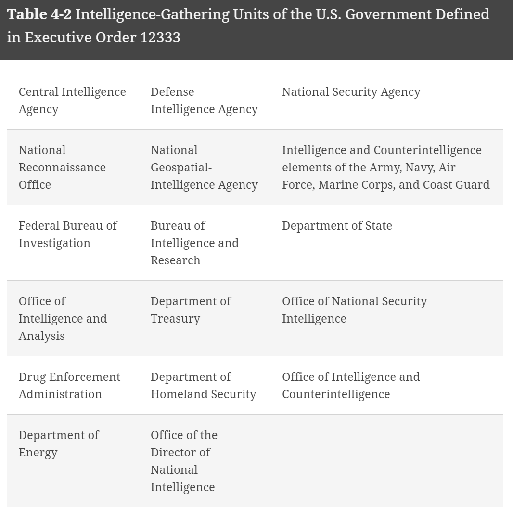
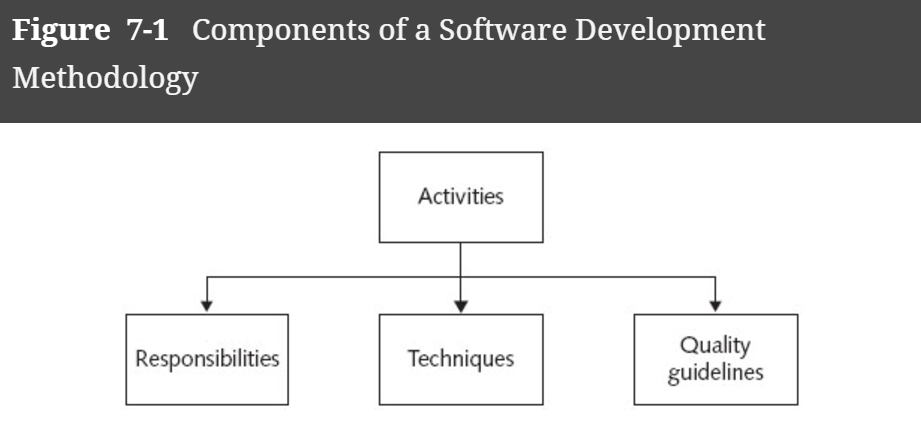
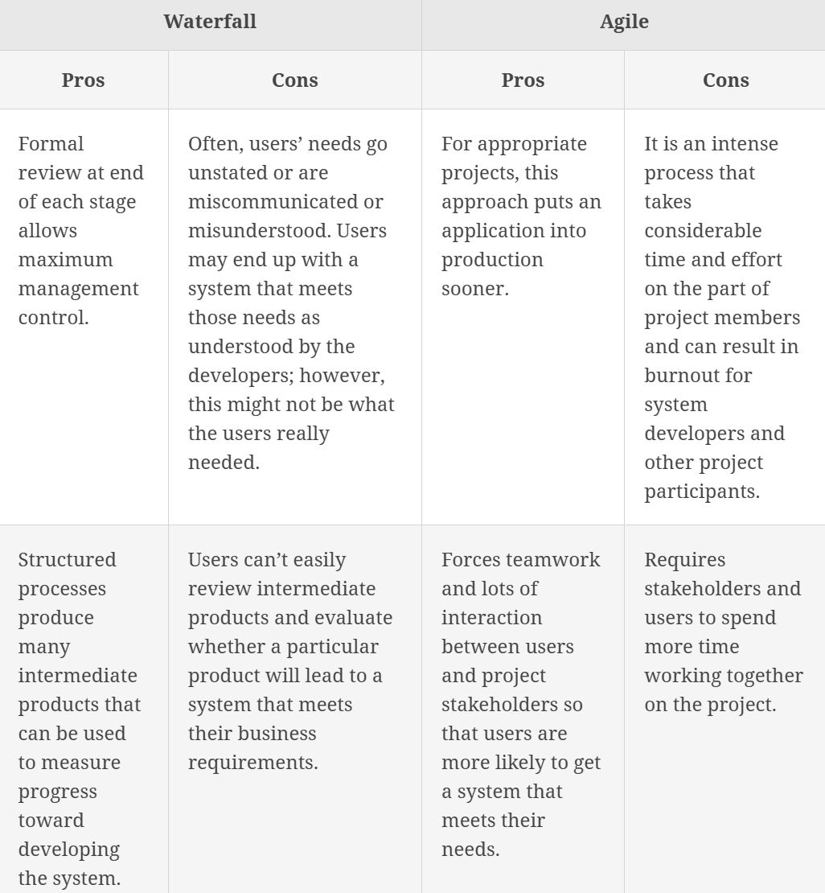
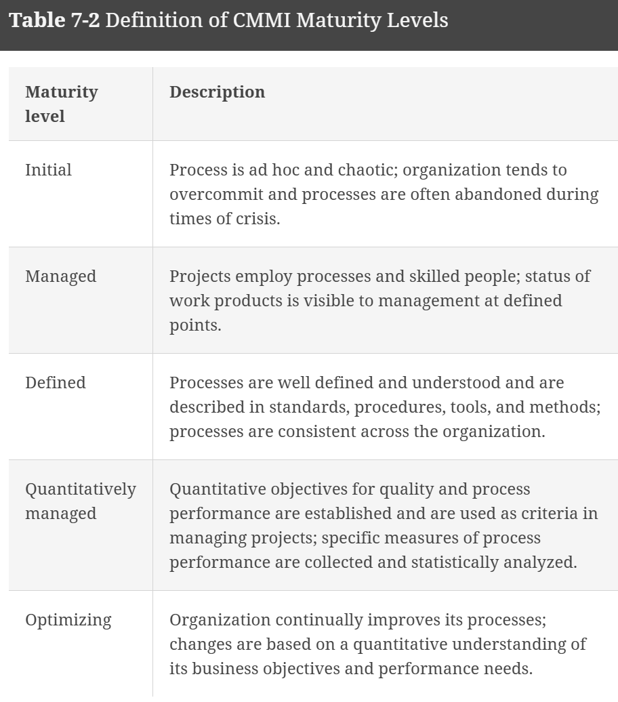
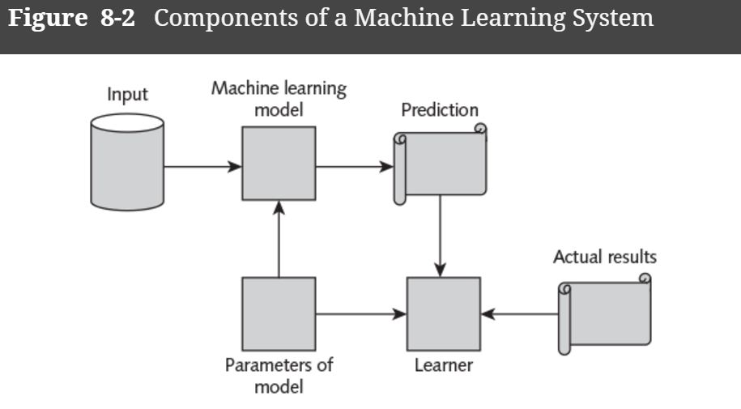

# Ethics in Technology  

Online staffing websites such as 99 Designs, Freelancer, Guru, Toptal, Witmart

## Module 1  

### Topics  

- What is ethics?
- What trends have increased the likelihood of unethical behavior?
- What is corporate social responsibility, and why is fostering good business ethics important?
- What measures can organizations take to improve their business ethics?
- How can you include ethical considerations in your decision-making?
- What trends have increased the risk that information technology will be used in an unethical manner?  

Sections 1.1-1.7 in Computing and Technology Ethics: Engaging Through Science Fiction.  

Ethical Statements are in two varieties:  
- **Normative**: one provides an assessment of how things should be rather than 
how they are. 
    - "he was wrong to do that" 
    - "being kind is more important than being the most successful"  
    - What is good and bad  
- **Descriptive**: furnishing the decision maker with a critical framework that 
enables you to understand what is happening in a given situation and what is at 
stake in any action you might take.  

**Participatory Design**:  

### Kinds of Ethics problems  

- **Limited Resources**: who do you give a donated kidney to?  
- **Competing kinds of goods**: Which school to attend?  
- **Different ideas about what is good**:  

### Ethics vs Morals  

It is a dispute; are ethics a subset of morals or morals a subset of ethics.  
The two definitions are similar.  

**Morals**: person's standards of behavior or beliefs concerning what is and is not 
acceptable for them to do. Morals are the personal principles that determine what 
an individual considers to be right or wrong

**Ethics**: thoughtful reflection on and application of our standards of behavior 
and beliefs about what is acceptable to do and not to do. Ethics is a code of behavior 
defined by a group an individual belongs to. 

### Invisibility factor  

James Moor presented the potential dangers of an *invisibility factor* with technology:  
- **Invisible abuse**: lower-level operations of a computer to invisibly exploit the 
user who is, for example, transferring money  
- **Invisible programming values**: decision-making algorithms that may ensure that 
different people are invisibley advantaged or disadvantaged by the use of an 
algorithm.  
- **Invisible complex calculations**: no human is able to inspect code and understand 
completely.  

### Societal Reconfigurations from computer technologies  
Deborah Johnson (1998) published an arguement for three changes:  

- **Reproducibility**:   

- **Information flow**: easier many-to-many communication  

- **Identity conditions**: Loss of anonymity or there is anonymity. Data tracks 
you on the internet.  

### Fantasy for moral imagination  

**Story frames**: highlights important topics, themes, or events of the story 
that one should read critically.  

**Story points**: 

### Professional Ethics  

Two societies promote the ethics in computer technology:  
AMC  
IEEE  
National Academy of Engineering   

### Ethical frameworks  

**Ethical frameworks**: important features of some ethical theories  

### Section 2 Module 1 Review  

- Property deals directly with information ownership  
- Privacy deals with revelaing information about an individual  
- Access deals with restricting the ability to access information.  
- Accuracy deals with the reliability, authenticity, and integrity of the information.  

# Introduction to Etical Frameworks, Section2 Module 2  

- What are ethical frameworks?
- How do ethical frameworks help us navigate complex problems?
- How would the different frameworks discussed in the text respond to a specific ethical problem?
- What are some of the problems with each of the ethical frameworks presented in the text?

Chapter 2 Computing and Technology Ethics: Engaging Through Science Fiction.  

Frameworks discussed:  
- deontology: moral obligation and perscribes or describes moral principles that govern 
action.    
- virtue ethics: center on human character as the locus of moral activity and pays 
special attention to how we develop and exercise good qualities.    
- communitarianism: interdependent nature of human life and examines how that 
interdependence shapes our possibilities for well-being and self-realization.  
- unitarianism: prioritizes the greatest happiness for the greatest number of
people and therfore focuses on the outcome of actions.  

Traditions: interpret core principles differently, different approaches to applying 
methods of the framework that they belong to.  

Metaphysics: our understanding of how the world works and the nature of reality, including 
what human beings are and are for.  

## Dentology  

**Dentology**: focuses on duties, rights, and moral obligations. Rightness or 
wrongness of actions.  
Determined by:  
- Social Contracts  
- A God or gods  
- Human reasoning  

**Obligation**: also called positive laws. A part of dentology where you should 
do and that require active effort on the part of the agent.  

**Prohibitions**: also called negative laws. A part of dentology, prohibits (forbids)  
certain kinds of actions. They are obeyed by refraining from acting in a way that 
has been described as wrong.  

### Political Authority  

**Contractarianism**: example of political authority.  Presumes humans are driven 
by self-interest.  It is decided which self-interests are all common among the 
people, and sign a contract. It is better to cooperate than constantly be at odds 
with eachother. Grew from social contract theory, Thomas Hobbes  

### Divine Authority  

**Divine command theory**: derives authority from God.  

The Ten Commandments is an example containing *obligations* and *prohibitions*.  

### Authority of Human Reasoning  

Enlightenment  

St.Thomas Aquinas  

### Kantian Deontology  

Developed as a response to a growing trend in religious authority.  Rejects 
the idea that any code of law handed down in a religious tradition or promulgated by 
the state can successfully address the full breadth and complexity of right 
and wrong.  

Assumptions:  
- All human beings are free and rational 
- They are familiar with both the experience of being moved by the feeling of 
duty or moral obligation. 

*Categorical imperative*: a law that is unconditionally and universally valid. 
True freedom is the freedom to act according to a law that you can both apply to 
yoursefl and universally legislate for all.  

An action has no moral worth if it is not done out of duty.  

### Modalities for Judgement  
- How fundamental is it?  
    - Do you choose to protect a stranger or a child, because you have a fundamental role as a parent?  
- How relevant is it?  
    - Do what is Right over what is Good  
    
Machine Ethics  
- Part of these ethics include training AI  
    - *bottom-up* approach: machines are given examples of proper behavior and 
    attempt to abstract from those what to do in situations.  
    - *top-down* approach: agents are given a set of rules and are expected to 
    incorporate the rules in the actions they take.  

## Virtue Ethics  

*Virtue ethics* is organized around the idea of human flourishing and human excellence. 
All humans share some basic qualities of character, some excell at those characters 
better than others based on experience. Humans are concerned with how to live 
the good life.  

Virtue ethics focuses on the whole person: the qualities of character that they have 
and the patterns of living that issue from and reveal those qualities.  
**habitus** is the pattern. Interlocking set of habits that are what feels right or natural for a person.    
**Virtues** is cultivating excellence in a range of basic humand capacities.  
- Nobody is bor virtuous. 
- It takes continual practice.
- It is goal-driven, for the creation of good outcomes  
- We all start out with the same tool set of virtues. It is up to us to develop 
the virtues.  

### Confucian Virtue Ethics  
His quotes were written in *the Analects*. Other writtings about him include 
*Mencius* and *Dctrine of the Mean*.  

*Hundred Schools of Thought*  

### Aristotelian Virtue Ethics  

Aristotle's *Nicomachean Ethics*  

What things a person needs to do in order to achieve deep happiness and satisfaction 
with life, to flourish.  

### Appetite, Desire, Virtue  

Basic human appetites include, hunger, fear, and emotional or psychological desires. 
The fact that these appetites and desires are a basic part of human nature means 
that they are fundamentally good for humans, and necessary for humans to flourish.   
Suppressing these appetites entirely is jas as damaging to a person as allowing them to 
expand out of control.  
Virtue places value on learning to regulate appetites and desires, exercise moderation.  

**Continence**: the forcible restraint of one's own appetite or desire. It is not 
a virtue because it requires us to suppress our desires and appetites.  

**Temperance**: training yourself to do what is right.  
**Wholeheartedness**: temperance in the terms of Confucius. One does not feel 
internal resistance or conflict but is genuinely and joyfully committed to a 
course of action.    

Virtue is a spectrum, not binary.  

**Practical Wisdom**: ability to judge what the best action would be in any given 
situation.  

## Communitarianism  

Communitarianism is an approach to ethics organized around self-realization in 
the context of interdependence.  Its basic assumption is that human 
beings exist in a state of mutual reliance on one another.   

Communities existed prior to any individual born and raised within them.  

*sympathetic awareness* of others.  

**Ubuntu**: comes from a family of Bantu languages.  Refers to a crucial 
quality that is central to communitarianism of southern and eastern Africa. Another 
general definition is to engage in the process of becoming and being human.  

**Yoruba**: Based in now Nigeria. Hearing is the foundation for how we percieve the
world.  

## Utilitarianism  

Utilitarianism is an approach to ethics organized around the idea of happiness. 
Humans are motivated to be happy. Which acts bring joy to the most amount of people. 

**Principle of utility** or **greatest happiness principle**: Decide on the actions
that bring happiness to the most amount of people.  

John Stuart Mill and Jeremy Bentham, proponent of utilitarianism  

Form of consequentialism, consequences determine the moral worth of an action.  

No one person's happiness is more valuable than anothers.  

## Contemporary Ethics  

### Responsibility Ethics  

Started by Hans Jonas.  

Responsiblity Ethics looks at cause and effect on a larger scale of environment 
and economy.  

- Accountability to all life  
    - Responsibility for our actions  
    - Responsibility to living beings and environment  
- Heuristics of fear  

### Feminist Ethics  

### The Capability Approach  
Capability Ethics: create conditions for people to fulfill thier potential. Pay 
attention to the freedoms, resources, and opportunities available to an individual.  

Introduced by Amartya Sen. It was an argument that countries were focused on 
economic growth at the expense of human well-being.  

Further developled by Martha Nussbaum.  

Creating the *potential* for good outcomes.  

# Ch 1 eText  

Ethics in Information Technology  

**Ethics**: is a code of behavior that is defined by the group to which an individual 
belongs. Ethical behavior conforms to generally accepted norms, which may change 
over time.  

**Morals** are the personal principles upon which an individual bases his or her 
decisions about what is right and what is wrong. They are core beliefs formed 
and adhered to by an individual.  

A **virtue** is a habit that inclines people to do what is acceptable

A **vice** is a habit of unacceptable behavior.  

A person who acts with **integrity** acts in accordance with a personal code of 
principles. One approach to acting with integrity is to extend to all people 
the same respect and consideration that you expect to receive from them.  

**Law** is a system of rules that tells us what we can and cannot do. Laws are enforced 
by a set of institutions (the police, courts, law-making bodies). Violation of 
a law can result in censure, fines, and/or imprisonment.  

generally accepted accounting practices (GAAP)  

The moral corruption of people in power, which is often facilitated by a tendency 
for people to look the other way when their leaders act inappropriately has been 
given the name **Bathsheba syndrome**—a reference to the biblical story of King 
David, who became corrupted by his power and success.  

**Corporate social responsibility (CSR)** is the concept that an organization should 
act ethically by taking responsibility for the impact of its actions on its 
shareholders, consumers, employees, community, environment, and suppliers.  

**Supply chain sustainability** is a component of CSR that focuses on developing 
and maintaining a supply chain that meets the needs of the present without 
compromising the ability of future generations to meet their needs.  

Why a business should pursue CSR:  
- Gaining the goodwill of the community  
- Creating an organization that operates consistently  
- Fostering good business practices  
- Protecting the organization and its employees from legal action  
- Avoiding unfavorable publicity  

A **stakeholder** is someone who stands to gain or lose, depending on how a particular 
situation is resolved.  

Appoint a Corporate Ethics Officer  

A **corporate ethics officer** (also called a corporate compliance officer) 
provides an organization with vision and leadership in the area of business 
conduct. This individual “aligns the practices of a workplace with the stated 
ethics and beliefs of that workplace, holding people accountable to ethical 
standards.” Responsibilities:

- Responsibility for compliance—that is, ensuring that ethical procedures are put into place and consistently adhered to throughout the organization
- Responsibility for creating and maintaining the ethics culture envisioned by the highest level of corporate authority
- Responsibility for being a key knowledge and contact person on issues relating to corporate ethics and principles
 
Require the Board of Directors to Set and Model High Ethical Standards  

Establish a Corporate Code of Ethics  

A **code of ethics** is a statement that highlights an organization’s key 
ethical issues and identifies the overarching values and principles that are 
important to the organization and its decision making.
  
Conduct Social Audits  

An increasing number of organizations conduct regular social audits of their 
policies and practices. In a **social audit**, an organization reviews how well it 
is meeting its ethical and social responsibility goals and communicates its new 
goals for the upcoming year.  

Require employees to take Ethics training  

Include Ethical Criteria in Employee Appraisals  

Create an Ethical Work Environment  

Include Ethical Considerations in Decision Making  

  

# Section 2, Module 2 Review  

> Francis, a software engineer for a database management company, discovers a security flaw in an upcoming release. A colleague encourages Francis to keep this discovery quiet, as it may affect a tight release window. Francis disagrees, citing their duty to abide by a code of conduct.
> Which theory best exemplifies Francis’ reasoning?
> **Deontology**  

> A car manufacturer decides to alter its emission testing to pass regulatory requirements. The emission reduction system is only used during tests. The system is not engaged during normal driving conditions to improve fuel efficiency, torque, and acceleration.
> Which step in the ethical decision-making process should have been used to evaluate the environmental impact of this decision?
> **Choose Alternatives**  

> A computer animator for a children’s show is reviewing the draft of script. In the script, the main character engages in behavior that seems to encourage dishonesty. The animator expresses a concern to the director, citing the need to help improve the moral character of all viewers.
> Which theory best exemplifies the animator’s reasoning?
> **Virtue Ethics**  

> A manager for a cybersecurity company is preparing an employee for an upcoming sales trip. During the preparation, the manager advises the employee to use their company card to host expensive dinners and entertainment events for potential clients. When the employee expresses concern about whether this approach aligns with their personal values, the manager responds that fostering strong relationships and integrating into the local business community is essential, and such practices are often seen as a way to build trust and rapport within those communities.
> Which theory best exemplifies the manager’s reasoning?  
> **Communitarianism**  

> Nadia is a park ranger who maintains a set number of visitors per hour to a specific attraction in a small regional park. When the attraction is at capacity, she often must turn visitors away. While Nadia acknowledges that her actions do disrupt some people, she justifies it by stating that it is for the greater good.
> Which theory best exemplifies Nadia’s reasoning?  
> **Utilitarianism**  

> Deron breaks his roommate's video game controller in a fit of rage. To avoid making his roommate angry with him, Deron claims the dog knocked it out of his hands and down some stairs.
> What best describes Deron’s actions?  
> **unethical/legal**  

# Professional Ethics, Section 2, Module 3  

## Chapter 6, Computing and Technology Ethics: Engaging Through Science Fiction.  

**Professional ethics**: the day-to-day expectations of the individual worker.

**Profession** is (Greenwood):  
- core body of ethical knowledge      
- deep specialized knowledge of professionals give them *authority*  
    - non-professionals are customers, customers have clients  
- profession is given special and often unique privileges by the community (like a license)  
- professions regulate themselves with *code of ethics*  
- profession is its own *culture*  

### Code of Ethics  

ACM: Association for Computing Machinery  
IEEE: Institute of Electronics and Electrical Engineering  

#### Prioritize public good  
> ACM 1.1: “Contribute to society and to human well-being, acknowledging that all people are stakeholders in computing.”
> IEEE 1: “To hold paramount the safety, health, and welfare of the public, to strive to comply with ethical design and sustainable development practices.”
> SECEPP 1.02: “Moderate the interests of the software engineer, the employer, the client and the users with the public good.”

#### Avoidance of harm and disclosing risks thereof  

> ACM 1.2: “Avoid harm.”
> IEEE 1: “To disclose promptly factors that might endanger the public or the environment.”
> SECEPP 1.03: “Approve software only if they have a well-founded belief that it is safe, meets specifications, passes appropriate tests, and does not diminish quality of life, diminish privacy or harm the environment. The ultimate effect of the work should be to the public good.”
> SECEPP 1.04: “Disclose to appropriate persons or authorities any actual or potential danger to the user, the public, or the environment, that they reasonably believe to be associated with software or related documents.”

#### Honesty  
> ACM 1.3: “Be honest and trustworthy.”
> IEEE 4: “To reject bribery in all its forms.”
> SECEPP 1.06: “Be fair and avoid deception in all statements, particularly public ones, concerning software or related documents, methods and tools.”
> SECEPP 4.04: “Not engage in deceptive financial practices such as bribery, double billing, or other improper financial practices.”

#### Accurate Assessment  
>ACM 2.5: “Give comprehensive and thorough evaluations of computer systems and their impacts, including analysis of possible risks.”
>IEEE 3: “To be honest and realistic in stating claims or estimates based on available data.”
>SECEPP 6.07: “Be accurate in stating the characteristics of software on which they work, avoiding not only false claims but also claims that might reasonably be supposed to be speculative, vacuous, deceptive, misleading, or doubtful.”

#### Avoidance or disclosure of conflicts of interest.
> ACM 1.3 elaboration: “Computing professionals should be forthright about any circumstances that might lead to either real or perceived conflicts of interest or otherwise tend to undermine the independence of their judgment.”
> IEEE 2: “To avoid real or perceived conflicts of interest whenever possible, and to disclose them to affected parties when they do exist.”
> SECEPP 4.06: “Refuse to participate, as members or advisors, in a private, governmental or professional body concerned with software related issues, in which they, their employers or their clients have undisclosed potential conflicts of interest.”

#### Nondiscriminatory treatment  
> ACM 1.4: “Be fair and take action not to discriminate.”
> IEEE 8: “To treat fairly all persons and to not engage in acts of discrimination based on race, religion, gender, disability, age, national origin, sexual orientation, gender identity, or gender expression.”
> SECEPP 8.07: “Not give unfair treatment to anyone because of any irrelevant prejudices.”

#### Educate the public  
> ACM 2.7: “Foster public awareness and understanding of computing, related technologies, and their consequences.”
> IEEE 5: “To improve the understanding by individuals and society of the capabilities and societal implications of conventional and emerging technologies, including intelligent systems.”
> SECEPP 1.08: “Be encouraged to volunteer professional skills to good causes and contribute to public education concerning the discipline.”

#### Working only in areas of competence  
> ACM 2.6: “Perform work only in areas of competence.”
> IEEE 6: “To undertake technological tasks for others only if qualified by training or experience, or after full disclosure of pertinent limitations.”
> SECEPP 2.01: “Provide service in their areas of competence, being honest and forthright about any limitations of their experience and education.”

#### Give credit and respect for intellectual property  
> ACM 1.5: “Respect the work required to produce new ideas, inventions, creative works, and computing artifacts.”
> IEEE 7: “To credit properly the contributions of others.”
> SECEPP 2.02: “Not knowingly use software that is obtained or retained either illegally or unethically.”
> SECEPP 7.03: “Credit fully the work of others and refrain from taking undue credit.”

#### Professional developement  
> ACM 2.2: “Maintain high standards of professional competence, conduct, and ethical practice.”
> ACM 3.5: “Create opportunities for members of the organization or group to grow as professionals.”
> IEEE 6: “To maintain and improve our technical competence.”
> IEEE 10: “To assist colleagues and coworkers in their professional development and to support them in following this code of ethics.”
> SECEPP 7.02: “Assist colleagues in professional development.”
> SECEPP 8.01: “Further their knowledge of developments in the analysis, specification, design, development, maintenance and testing of software and related documents, together with the management of the development process.”
> SECEPP 8.06: “Improve their knowledge of this Code, its interpretation, and its application to their work.”

#### Accepting and giving review  
> ACM 2.4: “Accept and provide appropriate professional review.”
> IEEE 7: “To seek, accept, and offer honest criticism of technical work, to acknowledge and correct errors.”

#### Workplace Condifentiality  
> ACM 1.7 elaboration: “Computing professionals should protect confidentiality except in cases where [the information] is evidence of the violation of law, of organizational regulations, or of the Code. In these cases, the nature or contents of that information should not be disclosed except to appropriate authorities.”
> SECEPP 2.05: “Keep private any confidential information gained in their professional work, where such confidentiality is consistent with the public interest and consistent with the law.”

#### Equitable design (ADA and equal opportunity)  
> ACM 1.4 elaboration: “Technologies and practices should be as inclusive and accessible as possible and computing professionals should take action to avoid creating systems or technologies that disenfranchise or oppress people.”
> SECEPP 1.07: “Consider issues of physical disabilities, allocation of resources, economic disadvantage and other factors that can diminish access to the benefits of software.”

#### Privacy-protected design  
> ACM 1.6: “Respect privacy.”
> SECEPP 3.12: “Work to develop software and related documents that respect the privacy of those who will be affected by that software.”

### Professional guidelines for Algorithms: Bias, Transparency, Accountability  

1. Awareness: Owners, designers, builders, users, and other stakeholders of analytic systems should be aware of the possible biases involved in their design, implementation, and use and the potential harm that biases can cause to individuals and society.
2. Access and redress: Regulators should encourage the adoption of mechanisms that enable questioning and redress for individuals and groups that are adversely affected by algorithmically informed decisions.
3. Accountability: Institutions should be held responsible for decisions made by the algorithms that they use, even if it is not feasible to explain in detail how the algorithms produce their results.
4. Explanation: Systems and institutions that use algorithmic decision-making are encouraged to produce explanations regarding both the procedures followed by the algorithm and the specific decisions that are made. This is particularly important in public policy contexts.
5. Data Provenance: A description of the way in which the training data was collected should be maintained by the builders of the algorithms, accompanied by an exploration of the potential biases induced by the human or algorithmic data-gathering process. Public scrutiny of the data provides maximum opportunity for corrections. However, concerns over privacy, protecting trade secrets, or revelation of analytics that might allow malicious actors to game the system can justify restricting access to qualified and authorized individuals.
6. Auditability: Models, algorithms, data, and decisions should be recorded so that they can be audited in cases where harm is suspected.
7. Validation and Testing: Institutions should use rigorous methods to validate their models and document those methods and results. In particular, they should routinely perform tests to assess and determine whether the model generates discriminatory harm. Institutions are encouraged to make the results of such tests public.

### Functions of the using Codes of Ethics  
Two types of professional ethics:  
- rules and guidelines that govern behavior and are aimed at preventing cases of professional misconduct  
- Aimed at positive, or aspirational ethics, aimed at using tech for the betterment of humankind  

### Suggestions on Making ethical decsions in practice  

Within the framework of utilitarianism, Harris et al. (2013) outline three possible approaches for solving moral disagreements:

- The cost-benefit analysis approach, where one attempts to quantify all the various costs and benefits to all the relevant parties to a decision.
- The act-utilitarian approach, where one tries to determine for each possible action what the benefits and consequences of each are and selects the one that brings about the greatest good.
- The rule-utilitarian approach, where one works to find rules that are justified by their utility.

These methods lead to a set of approaches that bear a close resemblance to the 
deontological and virtue ethics approaches:  
> The golden rule approach, which enjoins one to think about what would happen if others acted as we are considering.
> The self-defeating approach, which is a version of negative universalization that asks the question: if everyone were to act this way, would it invalidate the action or the usefulness of that action?
> And finally the rights approach, which starts from the position that all persons have a set of rights (e.g., life, physical integrity, and the right not to be deceived or cheated), and that actions should not infringe on these rights. Hence in order to make a decision, one should list the rights that are relevant and then choose an action that does not impinge this set of rights.

## Ethics in Information Tech, pg 57-61  

A **professional code of ethics** states the principles and core values that are essential to the work of a particular occupational group. Practitioners in many professions subscribe to a code of ethics that governs their behavior.

### Generic code of ethics:  

- Ethical decision making: Adherence to a professional code of ethics means that practitioners use a common set of core values and beliefs as a guideline for ethical decision making.  
- High standards of practice and ethical behavior: Adherence to a code of ethics reminds professionals of the responsibilities and duties that they may be tempted to compromise to meet the pressures of day-to-day business.   
- Trust and respect from the general public  
- Evaluation benchmark: A code of ethics provides an evaluation benchmark that a professional can use as a means of self-assessment. Peers of the professional can also use the code for recognition or censure.  

A software engineer is defined as one who applies engineering principles and practices to the design, development, implementation, testing, and maintenance of software.  

ACM and IEEE Software engineer code of ethics:  
Public - Software engineers shall act consistently with the public interest.

- Client and Employer - Software engineers shall act in a manner that is in the best interests of their client and employer consistent with the public interest.
- Product - Software engineers shall ensure that their products and related modifications meet the highest professional standards possible.
- Judgment - Software engineers shall maintain integrity and independence in their professional judgment.
- Management - Software engineering managers and leaders shall subscribe to and promote an ethical approach to the management of software development and maintenance.
- Profession - Software engineers shall advance the integrity and reputation of the profession consistent with the public interest.
- Colleagues - Software engineers shall be fair to and supportive of their colleagues.
- Self - Software engineers shall participate in lifelong learning regarding the practice of their profession and shall promote an ethical approach to the practice of the profession.

Source: Software Engineering Code of Ethics and Professional Practice. © acm.org, 2015. http://www.acm.org/about/se-code
  
**Negligence** is defined as not doing something that a reasonable person would do or doing something that a reasonable person would not do.

**Duty of care** refers to the obligation to protect people against any unreasonable harm or risk.

The courts decide whether parties owe a duty of care by applying a **reasonable person standard** to evaluate how an objective, careful, and conscientious person would have acted in the same circumstances.

Defendants who have particular expertise or competence are measured against a **reasonable professional standard**. For example, in a medical malpractice suit based on improper treatment of a broken bone, the standard of measure would be higher if the defendant were an orthopedic surgeon rather than a general practitioner.  

If a court finds that a defendant actually owed a duty of care, it must then determine whether the duty was breached. A breach of the duty of care is the failure to act as a reasonable person would act. A **breach of duty** might consist of an action, such as throwing a lit cigarette into a fireworks factory  

**Professional Malpractice**: Professionals who breach the duty of care are liable for injuries that their negligence causes.  

> What is an objective of a professional code of ethics in IT?  
> **Provide benchmarks for self-assessment**  

> Organizations like ACM and IEEE help define standards and ethical practices in software engineering.  

# Cyberattacks and Cybersecurity, Section 2, module 4  

A **zero-day exploit** is a cyberattack that takes place before the security community and/or software developers become aware of and fix a security vulnerability.  

**Vulnerability Equities Process (VEP)**: a policy where the government witholds 
known vulnerabilities to venders (zero-day attacks).  

Under VEP, the Federal Bureau of Investigation (FBI) found an exception that allowed it to refuse to reveal the vulnerability that enabled it to hack into the iPhone of the San Bernardino shooter who killed 14 people in late 2015.  

Tradeoffs when making IT security:  
- How much effort and money should be spent to safeguard against computer crime? (In other words, how safe is safe enough?)
- What should be done if recommended computer security safeguards make conducting business more difficult for customers and employees, resulting in lost sales and increased costs?
- If a firm is a victim of a cybercrime, should it pursue prosecution of the criminals at all costs, maintain a low profile to avoid the negative publicity, inform affected customers, or take some other action?  

An **exploit** is an attack on an information system that takes advantage of a particular system vulnerability.

**Black hat hacker**: Someone who violates computer or Internet security maliciously or for illegal personal gain (in contrast to a white hat hacker who is someone who has been hired by an organization to test the security of its information systems)

**Malicious insider**: An employee or contractor who attempts to gain financially and/or disrupt a company’s information systems and business operations  

**Industrial spy**: An individual who captures trade secrets and attempts to gain an unfair competitive advantage  

**Cybercriminal**: Someone who attacks a computer system or network for financial gain  

**Hacktivist**: An individual who hacks computers or websites in an attempt to promote a political ideology

**Cyberterrorist**: Someone who attempts to destroy the infrastructure components of governments, financial institutions, and other corporations, utilities, and emergency response units

**Ransomware**: is malware that stops you from using your computer or accessing your data until you meet certain demands  

**Virus** is a piece of programming code, usually disguised as something else, that causes a computer to behave in an unexpected and usually undesirable manner. For example, a virus may be programmed to display a certain message on an infected computer’s display screen, delete or modify a certain document, or reformat the hard drive.

**Worm**: is a harmful program that resides in the active memory of the computer and duplicates itself. Worms differ from viruses in that they can propagate without human intervention, often sending copies of themselves to other computers by email.

**Trojan** horse is a seemingly harmless program in which malicious code is hidden. A victim on the receiving end of a Trojan horse is usually tricked into opening it because it appears to be useful software from a legitimate source, such as an update for software the user currently has installed on his or her computer. The program’s harmful payload might be designed to enable the hacker to destroy hard drives, corrupt files, control the computer remotely, launch attacks against other computers, steal passwords, or spy on users by recording keystrokes and transmitting them to a server operated by a third party. A Trojan horse often creates a “backdoor” on a computer that enables an attacker to gain future access to the system and compromise confidential or private information.

Another type of Trojan horse is a **logic bomb**, which executes when it is triggered by a specific event. For example, logic bombs can be triggered by a change in a particular file, by typing a specific series of keystrokes, or at a specific time or date.

A **blended threat** is a sophisticated threat that combines the features of a virus, worm, Trojan horse, and other malicious code into a single payload.

The **Controlling the Assault of Non-Solicited Pornography and Marketing (CAN-SPAM) Act** states that it is legal to spam, provided the messages meet a few basic requirements—spammers cannot disguise their identity by using a false return address, the email must include a label specifying that it is an ad or a solicitation, and the email must include a way for recipients to indicate that they do not want future mass mailings.

A partial solution to this problem is the use of CAPTCHA to ensure that only humans obtain free accounts. **CAPTCHA (Completely Automated Public Turing Test to Tell Computers and Humans Apart)**  

**Distributed denial-of-service (DDoS)** attack is one in which a malicious hacker takes over computers via the Internet and causes them to flood a target site with demands for data and other small tasks.
- The term **botnet** is used to describe a large group of such computers, which are controlled from one or more remote locations by hackers, without the knowledge or consent of their owners.
- botnet computers are called **zombies**  

A **rootkit** is a set of programs that enables its user to gain administrator-level access to a computer without the end user’s consent or knowledge. Once installed, the attacker can gain full control of the system and even obscure the presence of the rootkit from legitimate system administrators.
- Rootkits are one part of a type of blended threat that consists of a dropper, a loader, and a rootkit.   
- The dropper code gets the rootkit installation started and can be activated by clicking on a link to a malicious website in an email or opening an infected PDF file. The dropper launches the loader program and then deletes itself. 
- The loader loads the rootkit into memory; 
- at that point, the computer has been compromised.  

An **advanced persistent threat (APT)** is a network attack in which an intruder gains access to a network and stays there—undetected—with the intention of stealing data over a long period of time (weeks or even months). 

Steps for APT:  

1. Reconnaissance—The intruder begins by conducting reconnaissance on the network to gain useful information about the target (security software installed, computing resources connected to the network, number of users).
2. Incursion—The attacker next launches incursions to gain access to the network at a low level to avoid setting off any alarms or suspicion. Some forms of spear phishing may be employed in this phase. After gaining entrance, the attacker establishes a back door, or a means of accessing a computer program that bypasses security mechanisms.
3. Discovery—The intruder now begins a discovery process to gather valid user credentials (especially administrative ones) and move laterally across the network, installing more back doors. These back doors enable the attacker to install bogus utilities for distributing malware that remains hidden in plain sight.
4. Capture—The attacker is now ready to access unprotected or compromised systems and capture information over a long period of time.
5. Export—Captured data are then exported back to the attacker’s home base for analysis and/or used to commit fraud and other crimes.  

**phishing** is the act of fraudulently using email to try to get the recipient to reveal personal data. 

**Spear phishing** is a variation of phishing in which the phisher sends fraudulent emails to a certain organization’s employees.

**Smishing** is another variation of phishing that involves the use of texting. In a smishing scam, people receive a legitimate-looking text message

**Vishing** is similar to smishing except that the victims receive a voice-mail message telling them to call a phone number or access a website  

**Cyberespionage** involves the deployment of malware that secretly steals data in the computer systems of organizations, such as government agencies, military contractors, political organizations, and manufacturing firms. The type of data most frequently targeted includes data that can provide an unfair competitive advantage to the perpetrator. 

**Cyberterrorism** is the intimidation of government or civilian population by using information technology to disable critical national infrastructure  

The **Department of Homeland Security (DHS)** is a large federal agency with more than 240,000 employees and a budget of almost $65 billion whose goal is to provide for a “safer, more secure America, which is resilient against terrorism and other potential threats.” The agency was formed in 2002 when 22 different federal departments and agencies were combined into a unified, integrated cabinet agency  

The DHS website (www.dhs.gov) provides a link that enables users to report cyber incidents. Incident reports go to the US-CERT Incident Reporting System, which assists analysts at the **U.S. Computer Emergency Readiness Team (US-CERT)** (a partnership between the DHS and the public and private sectors) in providing timely handling of security incidents as well as in conducting improved analysis of such incidents.  
 
North American Aerospace Defense Command (NORAD)  

**White hat hackers** are hired by an organization to penetration test security systems.
 
### Federal Laws for Prosecuting Computer Attacks  

*Section 814 of the USA Patriot Act defines cyberterrorism* as any hacking attempts designed to gain unauthorized access to a protected computer, which, if successful, would cause a person an aggregate loss greater than $5,000; adversely affect someone’s medical examination, diagnosis, or treatment; cause a person to be injured; cause a threat to public health or safety; or cause damage to a governmental computer that is used as a tool to administer justice, national defense, or national security

**Federal Laws That Address Computer Crime**
**Computer Fraud and Abuse Act (U.S. Code Title 18, Section 1030)**: Addresses fraud and related activities in association with computers, including the following:
- Accessing a computer without authorization or exceeding authorized access
- Transmitting a program, code, or command that causes harm to a computer
- Trafficking of computer passwords
- Threatening to cause damage to a protected computer
**Fraud and Related Activity in Connection with Access Devices Statute (U.S. Code Title 18, Section 1029)**: Covers false claims regarding unauthorized use of credit cards
**Stored Wire and Electronic Communications and Transactional Records Access Statutes (U.S. Code Title 18, Chapter 121)**: Focuses on unlawful access to stored communications to obtain, alter, or prevent authorized access to a wire or electronic communication while it is in electronic storage
**USA Patriot Act (Public Law 107-56)**: Defines cyberterrorism and associated penalties

**Federal Information Security Management Act**: Requires federal agencies to implement comprehensive information security programs to protect government information, operations, and assets against natural or man-made threats.  

**Gramm-Leach-Bliley Act**: Regulates the handling of personal financial information by financial institutions to safeguard consumer privacy and prevent misuse of financial data.

**Payment Card Industry Data Security Standard**: Establishes security requirements for organizations that handle credit card information to protect against data breaches and fraud.  

**Sarbanes-Oxley Act**: Mandates stringent financial reporting and internal controls for publicly traded companies to enhance transparency and prevent corporate fraud.

### CIA  

confidentiality, integrity, availability  

  

# Section 2 Review  

> What is the meaning of morals in the context of ethical judgment?  
> **The personal principles that determine what an individual considers to be right or wrong**  

> What is the primary goal for a supply chain relating to corporate social responsibility (CSR)?  
> **Sustainability**  

> Which factor is primarily used by deontology to evaluate morality of human actions?  
> According to deontology, morality is evaluated based on **duty**, without considering probable outcomes or consequences.

> Which part of the decision-making process involves defining a transition plan?  
> **Implementing the decision**  

> Which measure of the confidentiality, integrity, and availability (CIA) triad should be used by IT professionals at the organization level to supply validation of non-repudiation regarding data access in IT?  
> **Security Audit** an organization-level measure of the CIA triad that supplies validation of non-repudiation regarding data access in IT 

- Data encryption is an application-level measure of the CIA triad, and it does not supply validation of non-repudiation but instead offers *confidentiality assurances*.  
- Intrusion detection is a network-level measure of the CIA triad, and it does not supply validation of non-repudiation but instead offers protection *against cyberthreats*.  
- Antivirus software is an end user-level measure of the CIA triad, and it does not supply validation of non-repudiation but instead offers protection *against cyberthreats*.

> An IT professional wants the proper credentials and knowledge that is required to collect data from devices affected by cyberattacks to ensure such data would be admissible as evidence in a court of law.
> **Certified Computer Examiner**  

> What are two main elements of a professional code of ethics in IT?  
> **Core Values and Common beliefs**  

> Which type of guidance is provided by professional codes of ethics within IT?  
> Course of action in cases of conflict of interest  

> What are two components of the concept of information privacy?  
> **Communication privacy and Data privacy**  

> Which philosophy is doing what is morally correct instead of following a law?  
> **Deontology** says to do what is morally correct instead of following a law.  

- Altruists assume what is morally correct will help others.  
- Pluralism beliefs state that there can be multiple good ways to handle situations.  
- Egoism is people doing what is best for themselves.  

> Which type of attack is a common cause of data-level breaches with global scope?  
> **Phishing*  

- SQL injection targets individual websites that use relational databases as their data store, so their scope is limited.  
- Distributed Denial of Service (DDoS) attacks do not result in data breaches because their purpose is to affect service availability.  
- By definition, spear phishing is targeted, so it does not have a global scope.  

> A software developer publishes an application that can download and play animal videos. Employees of a company can download the application to their company-issued device from a third-party application store. The videos are being watched during business hours despite acceptable use policies that prohibit this. How might Epicurus respond to the question of whether it is ethical to obey or disobey the acceptable use policies?  
> **Epicurus would assert that pleasure is the greatest good for human beings, emphasizing the importance of pursuing enjoyment in life.**  

# Privacy Section 3, Module 1  

the **right of privacy** is “the right to be left alone—the most comprehensive of rights, and the right most valued by a free people.”

**information privacy** is the combination of communications privacy (the ability to communicate with others without those communications being monitored by other persons or organizations) and data privacy (the ability to limit access to one’s personal data by other individuals and organizations in order to exercise a substantial degree of control over that data and their use)

## Privacy Laws, Applications, and Court Rulings  

### Financial Data  

**The Fair Credit Reporting Act (15 U.S.C. § 1681)** (1970) regulates the operations of credit reporting bureaus, including how they collect, store, and use credit information. The act, enforced by the U.S. Federal Trade Commission

**The Right to Financial Privacy Act (12 U.S.C. § 3401)** (1978) protects the records of financial institution customers from unauthorized scrutiny by the federal government. Prior to the passage of this act, financial institution customers were not informed if their personal records were being turned over for review by a government authority
The customer must also be given written procedures to follow if he or she does not wish the records to be made available. In addition, to gain access to a customer’s financial records, the government must obtain one of the following:
- an authorization signed by the customer that identifies the records, the reasons the records are requested, and the customer’s rights under the act;
- an appropriate administrative or judicial subpoena or summons;
- a qualified search warrant or a formal written request by a government agency (can be used only if no administrative summons or subpoena authority is available).

**The Gramm-Leach-Bliley Act (GLBA) (Public Law 106-102)**, also known as the Financial Services Modernization Act of 1999, was a bank deregulation law that repealed a Depression-era law known as Glass-Steagall
Glass-Steagall prohibited any one institution from offering investment, commercial banking, and insurance services; individual companies were only allowed to offer one of those types of financial service products.  
GLBA also included three key rules that affect personal privacy:  
- *Financial Privacy Rule*: This rule established mandatory guidelines for the collection and disclosure of personal financial information by financial organizations. Under this provision, financial institutions must provide a privacy notice to each consumer that explains what data about the consumer are gathered, with whom that data are shared, how the data are used, and how the data are protected.  
- *Financial Privacy Rule*: This rule established mandatory guidelines for the collection and disclosure of personal financial information by financial organizations. Under this provision, financial institutions must provide a privacy notice to each consumer that explains what data about the consumer are gathered, with whom that data are shared, how the data are used, and how the data are protected.
- *Pretexting Rule*: This rule addresses attempts by people to access personal information without proper authority by means such as impersonating an account holder or phishing. GLBA encourages financial institutions to implement safeguards against pretexting.

**The Fair and Accurate Credit Transactions Act (Public Law 108-159)** was passed in 2003 as an amendment to the Fair Credit Reporting Act, and it allows consumers to request and obtain a free credit report once each year from each of the three primary consumer credit reporting companies (Equifax, Experian, and TransUnion)
Also established the National Fraud Alert system. Consumers can place an alert for fraud.  

### Health Information  

**The Health Insurance Portability and Accountability Act (HIPAA) (Public Law 104-191)** (1996) was designed to improve the portability and continuity of health insurance coverage; to reduce fraud, waste, and abuse in health insurance and healthcare delivery; and to simplify the administration of health insurance.

**The American Recovery and Reinvestment Act (Public Law 111-5)** is a wide-ranging act passed in 2009 that authorized $787 billion in spending and tax cuts over a 10-year period. Title XIII, Subtitle D, of this act (known as the Health Information Technology for Economic and Clinical Health Act, or HITECH) included strong privacy provisions for electronic health records (EHRs), including banning the sale of health information, promoting the use of audit trails and encryption, and providing rights of access for patients.

### Children's Personal Data  

**The Family Educational Rights and Privacy Act (FERPA) (20 U.S.C. § 1232g)**(1974) is a federal law that assigns certain rights to parents regarding their children’s educational records. These rights transfer to the student once the student reaches the age of 18,
- the right to access educational records maintained by a school;
- the right to demand that educational records be disclosed only with student consent;
- the right to amend educational records; and
- the right to file complaints against a school for disclosing educational records in violation of FERPA.

**According to the Children’s Online Privacy Protection Act (COPPA) (15 U.S.C. §§ 6501–6506)**(1998), any website that caters to children must offer comprehensive privacy policies, notify parents or guardians about its data collection practices, and receive parental consent before collecting any personal information from children under 13 years of age.

### Electronic Surveillance  

  

**Title III of the Omnibus Crime Control and Safe Streets Act (Public Law 90-351)**, also known as the Wiretap Act, regulates the interception of wire (telephone) and oral communications. It allows state and federal law enforcement officials to use wiretapping and electronic eavesdropping, but only under strict limitations. Under this act, a warrant must be obtained from a judge to conduct a wiretap

**The Foreign Intelligence Surveillance Act (FISA)(50 U.S.C.)** describes procedures for the electronic surveillance and collection of foreign intelligence information in communications between foreign powers and the agents of foreign powers.

Under **Executive Order 12333**, intelligence-gathering agencies are allowed to collect information—including message content—obtained in the course of a lawful foreign intelligence, counterintelligence, international drug, or international terrorism investigation, as well as incidentally obtained information that may indicate involvement in activities that may violate federal, state, local, or foreign laws
Conflicts with FISA  

  

The **Electronic Communications Privacy Act (ECPA) (18 U.S.C. § 2510-22)** (1986) deals with three main issues:
- Protect communications while in transfer from sender to receiver  
- Protection of communications held in electronic storage  
- Prohibition of devices from recording dialing, routing, addressing, and signaling 
information without a search warrant.  

The third part of ECPA establishes a requirement for court-approved law enforcement use of a **pen register**—a device that records electronic impulses to identify the numbers dialed for outgoing calls—or a **trap and trace**—a device that records the originating number of incoming calls for a particular phone number.

**The Communications Assistance for Law Enforcement Act (CALEA) (47 U.S.C. 1001-1010)** was passed by Congress in 1994 and amended both the Wiretap Act and ECPA. CALEA was a hotly debated law because it required the telecommunications industry to build tools into its products that federal investigators could use—after obtaining a court order—to eavesdrop on conversations and intercept electronic communications. 

**The USA PATRIOT Act (Uniting and Strengthening America by Providing Appropriate Tools Required to Intercept and Obstruct Terrorism) (Public Law 107-56)**: 
- increased law enforcement ability to search telephones, email, medical records, 
financial, and other records.  

**Foreign Intelligence Surveillance Act Amendments Act (2004)**: authorized intelligence gathering on individuals not affiliated with any known terrorist organization.  

**Foreign Intelligence Surveillance Act of 1978 Amendments Act of 2008**: warrantless eavesdropping on international communications.  
-The USA Freedom Act terminated the bulk collection of telephone metadata by the NSA in 2015  

__There is more, but I give up__  

### Consumer profiling  

### Electronic Discovery  

Part of a pretrial phase of a lawsuit, in which each party can obtain evidence 
from the other party by various means, including requests for the production of documents.  

Often organizations will send a **litigation hold notice** that informs its employees (or employees or officers of the opposing party) to save relevant data and to suspend data that might be due to be destroyed based on normal data-retention rules.

**predictive coding** is a process that couples human guidance with computer-driven concept searching in order to “train” document review software to recognize relevant documents within a document universe. 

### Workplace Monitoring  

**cyberloafing** is defined as using the Internet for purposes unrelated to work such as posting to Facebook, sending personal emails or Instant messages, or shopping online. 

### Advanced surveillance  

A **vehicle event data recorder (EDR)** is a device that records vehicle and occupant data for a few seconds before, during, and after any vehicle crash that is severe enough to deploy the vehicle’s air bags. 

Cell phone spy software called a **stalking app** can be loaded onto someone’s cell phone or smartphone within minutes, making it possible for the user to perform location tracking, record calls, view every text message or picture sent or received, and record the URLs of any website visited on the phone. 

## Review Questions  

> A security company performs a superficial investigation of a data breach and issues a root cause analysis that unintentionally misses key details about the means to remediate the existing vulnerabilities. It is found that the security company has insufficient expertise.
> What best describes the company’s problematic behavior?
> **Professional malpractice**  

> Which act protects the records of clients at financial institutions?  
> **GLBA**  

> Which amendment protects your right to privacy?  
> **4th, unreasonable search and seizures.**  

> Which EU law requires all businesses to implement privacy policies on the fair and appropriate usage of personal information?  
> **EU Data Protection Directive**

# Freedom of Expression, Section 3, Module 6  

Chapter 5 in Ethics in Information Technology.  

### First Amendment Right  
Freedom of expression  

### Obscene Speech  

Miller v. California is the 1973 Supreme Court case that established a test to determine if material is obscene and therefore not protected by the First Amendment. After conducting a mass mailing campaign to advertise the sale of adult material  
His material was determined to be a violation of the 1st amendment. Three questions must be asked for material protected under the 1st amendment:  

- Would the average person, applying contemporary community standards, find that the work, taken as a whole, appeals to the prurient interest?
- Does the work depict or describe, in a patently offensive way, sexual conduct specifically defined by the applicable state law?
- Does the work, taken as a whole, lack serious literary, artistic, political, or scientific value?

To determine the impact on an average adult in a community:  
- Who is an average adult?
- What are contemporary community standards?
- What is a community? (This question is particularly relevant in cases in which potentially obscene material is displayed worldwide via the Internet.)

### Defamation  

Making either an oral or a written statement of alleged fact that is false and that harms another person is **defamation**  

An oral defamatory statement is **slander**, and a written defamatory statement is **libel**

### Contolling Access to Information on the Internet  

Judged unconstitutional. **Title V of the Telecommunications Act was the Communications Decency Act (CDA)**, aimed at protecting children from pornography.

The ruling applied essentially the same free-speech protections to communication over the Internet as exist for print communication.  

**Section 230 of the CDA**, which was not ruled unconstitutional, states that “No provider or user of an interactive computer service shall be treated as the publisher or speaker of any information provided by another information content provider” (47 U.S.C. § 230). This provides immunity to an Internet service provider (ISP) that publishes user-generated content, as long as its actions do not rise to the level of a content provider.   

Unconstitutional. In October 1998, the **Child Online Protection Act (COPA)** was signed into law. This act is not to be confused with the Children’s Online Privacy Protection Act (COPPA)
makes any communication for commercial purposes that is available to any minor and that includes any material that is harmful to minors shall be fined and/or imprisoned  

An **Internet filter** is software that can be used to block access to certain websites that contain material deemed inappropriate or offensive.

### Internet Censorship  

**Internet censorship** is the control or suppression of the publishing or accessing of information on the Internet. 

### Strategic Lawsuit Against Public Participation  

A **strategic lawsuit against public participation (SLAPP)** is employed by corporations, government officials, and others against citizens and community groups who oppose them on matters of public interest.

**anti-SLAPP laws** are designed to reduce frivolous SLAPPs. As of 2015, 28 states and the District of Columbia had passed anti-SLAPP legislation to protect people who are the target of a SLAPP

### Anonymity on the Internet  

**Doxing** involves doing research on the Internet to obtain someone’s private personal information—such as home address, email address, phone numbers, and place of employment—and even private electronic documents, such as photographs, **and then posting that information online without permission.**  

Internet users who want to remain anonymous can send email to an **anonymous remailer service**, which uses a computer program to strip the originating header and/or IP number from the message. It then forwards the message to its intended recipient—an individual, a chat room, or a newsgroup—with either no IP address or a fake one, ensuring that the header information cannot be used to identify the author.

### John Doe Lawsuit  

An aggrieved party can file a **John Doe** lawsuit against a defendant whose identity is temporarily unknown because he or she is communicating anonymously or using a pseudonym. Once the John Doe lawsuit is filed, the plaintiff can request court permission to issue subpoenas to command a person to appear under penalty.

Test determined in *Doe v. 2TheMart.com* if a subpoena for a John Doe can be issued:  
- The subpoena was issued in good faith and not for any improper purpose.
- The information sought was related to a core claim or defense.
- The identifying information was directly and materially relevant to that claim or defense.
- Adequate information was unavailable from any other source.  

### Hate Speech  

Persistent or malicious harassment aimed at a specific person is **hate speech**, which can be prosecuted under the law  

### Porno on the Internet  

### Fake News  

## Review Questions  

> Why is fake news a threat in IT?  
> **It is misrepresented as facts** and **It is driven by ulterior motives**  

> Why is hate speech a threat in IT?  
> **There are insufficient resources to prescreen online content**  

> Which act requires email marketers to include an "unsubscribe" option for all spam?
> **CAN-SPAM**  

# Intellectual Property, Section 3, Module 7  

**intellectual property** is a term used to describe works of the mind—such as art, books, films, formulas, inventions, music, and processes—that are distinct and owned or created by a single person or group. It is protected through copyright, patent, and trade secret laws

## Copyrights  

Copyright and patent protection was established through the U.S. Constitution, Article I, section 8, clause 8  

A **copyright** is the exclusive right to distribute, display, perform, or reproduce an original work in copies or to prepare derivative works based on the work.
Sonny Bono Copyright Term Extension:  
- For works created after January 1, 1978, copyright protection endures for the life of the author plus 70 years.
- For works created but not published or registered before January 1, 1978, the term endures for the life of the author plus 70 years, but in no case expires earlier than December 31, 2004.
- For works created before 1978 that are still in their original or renewable term of copyright, the total term was extended to 95 years from the date the copyright was originally secured.

Eligible works include: architecture, art, audiovisual works, choreography, drama, graphics, literature, motion pictures, music, pantomimes, pictures, sculptures, sound recordings, and other intellectual works, as described in Title 17 of the U.S. Code

**copyright infringement** is a violation of the rights secured by the owner of a copyright

**Fair Use Doctrine**: allows portions of copyrighted materials to be used without permission under certain circumstances.  
Copyright law tries to strike a balance between protecting an author’s rights and enabling public access to copyrighted works.  

### The Prioritizing Resources and Organization for Intellectual Property Act of 2008  

### General Agreement on Tariffs and Trade (GATT)

The outcome was Agreement on Trade-Related Aspects of Intellectual Property Rights (TRIPS)  
establish minimum levels of protection that each government must provide to the intellectual property of all WTO members  

### The WTO and the WTO Trips Agreement (1994)  

### The World Intellectual Property Organization Copyright Treaty (1996)  

### The Digital Millennium Copyright Act (1998)  

## Patents  

Title 35 of the U.S. Code. Section 101  

A **patent** is a grant of a property right issued by the U.S. Patent and Trademark Office (USPTO) to an inventor. A patent permits its owner to exclude the public from making, using, or selling a protected invention, and it allows for legal action against violators. *Unlike a copyright, a patent prevents independent creation as well as copying.*   

There are six types of patents.  

- A **utility patent** is “issued for the invention of a new and useful process, machine, manufacture, or composition of matter, or a new and useful improvement thereof, it generally permits its owner to exclude others from making, using, or selling the invention for a period of up to twenty years from the date of patent application.  

- A design patent, which is “issued for a new, original, and ornamental design embodied in or applied to an article of manufacture,” permits its owner to exclude others from making, using, or selling the design in question. Design patents issued from applications filed on or after May 13, 2015, are granted for a term of 15 years from the date of grant.  

The U.S. Supreme Court has ruled that three classes of items cannot be patented: abstract ideas, laws of nature, and natural phenomena.   

**patent infringement**, or the violation of the rights secured by the owner of a patent, occurs when someone makes unauthorized use of another’s patent. Unlike with copyright infringement, there is no specified dollar amount limitation on the monetary penalty if patent infringement is found.  

Passed in 2011, the **Leahy-Smith America Invents Act, which amends Title 35 of the U.S. Code**: Under this law, the U.S. patent system changed from a “first-to-invent” to a “first-inventor-to-file”  

### Cross-Licensing Agreements  

Many large software companies have cross-licensing agreements in which each party agrees not to sue the other over patent infringements.  

## Trade Secrets  

A **trade secret** is defined as business information that represents something of economic value, has required effort or cost to develop, has some degree of uniqueness or novelty, is generally unknown to the public, and is kept confidential.

Trade secret law protects only against the misappropriation of trade secrets. If competitors come up with the same idea on their own, it is not misappropriation;  

- There are no time limitations on the protection of trade secrets, as there are with patents and copyrights.
- There is no need to file an application, make disclosures to any person or agency, or disclose a trade secret to outsiders to gain protection. (After the USPTO issues a patent, competitors can obtain a detailed description of it.) Hence, no filing or application fees are required to protect a trade secret.
- Although patents can be ruled invalid by the courts, meaning that the affected inventions no longer have patent protection, this risk does not exist for trade secrets.

### Uniform Trade Secrets Act  

### The Economic Espionage Act
  
### Defend Trade Secrets Act of 2016  

Because organizations can risk losing trade secrets when key employees leave, they often try to prohibit employees from revealing secrets by adding **nondisclosure clauses** to employment contracts.

A **noncompete agreement** prohibits an employee from working for any competitors for a period of time, often one to two years.

## Plagiarism  

**plagiarism** is the act of stealing someone’s ideas or words and passing them off as one’s own.

## Reverse Engineering  

**reverse engineering** is the process of taking something apart in order to understand it, build a copy of it, or improve it.

## Open Source Code  

open source code is any program whose source code is made available for use or modification, as users or other developers see fit  

## Competitive Intelligence  

**Competitive intelligence** is legally obtained information that is gathered to help a company gain an advantage over its rivals.  

Competitive intelligence is not the same as **industrial espionage**, which is the use of illegal means to obtain business information not available to the general public.  

Sources of Competitive Intelligence:  

- Crunchbase is a free database of technology of over 110,000 companies, people, and investors.
- CORI (http://cori.missouri.edu/pages/ksearch.htm) is an online database of more than 690,000 contract documents, most of which are executed agreements made public through SEC and other regulatory agency filings; users can access the database using a full-text search and retrieval system.
- ThomasNet.com is an excellent source for identifying suppliers and sources for products.
- WhoGotFunded.com is a comprehensive website of data about what organizations have received funding and for what purposes.

## Trademark Infringement  

A **trademark** is a logo, package design, phrase, sound, or word that enables a consumer to differentiate one company’s products from another’s. 

Nominative fair use is a defense often employed by the defendant in trademark infringement cases in which a defendant has used a plaintiff’s mark to identify the plaintiff’s products or services:  
- that the plaintiff’s product or service cannot be readily identifiable without using the plaintiff’s mark,
- that it uses only as much of the plaintiff’s mark as necessary to identify the defendant’s product or service, and
- that the defendant does nothing with the plaintiff’s mark that suggests endorsement or sponsorship by the plaintiff.  

## Cyber squatting  

**cybersquatters** registered domain names for famous trademarks or company names to which they had no connection, with the hope that the trademark’s owner would eventually buy the domain name  

## Review Questions  

> What are the ethical challenges with an IT professional reverse engineering an in-house-developed software and a third party-developed software?  
> Only reverse engineering a third party-developed software would be in violation of a professional code of ethics in IT.  

> Which two actions should be taken to address the potential ethical challenges associated with this scenario?
> **Implement safeguards that prevent industrial espionage**  
> **Obtain approval from the legal department for data-gathering methods**  

- Analysts should fully disclose their identity when conducting data-gathering interviews.
 
> Which law requires all World Trade Organization members to codify protections for intellectual property?  
> **TRIPS**  

> What act provided additional legal protections for trade secrets?  
> DTSA

- The LSAIA is a U.S. law designed to facilitate lawful surveillance and intelligence gathering by setting procedures and requirements for government agencies.
- The DTSA is a U.S. law that provides federal protection for trade secrets and allows companies to file lawsuits for misappropriation of trade secrets in federal court.  
- The DMCA is a U.S. law that offers copyright protection for digital content and establishes procedures for addressing online copyright infringement.  
- COPPA is a U.S. law that regulates the collection of personal information from children under 13 years old and requires websites to obtain parental consent before collecting such data.  

> What act grants a patent to the first person to file, not necessarily the first person to invent an item?  
> Leahy-Smith America Invents Act  

- The PRO-IP Act is a U.S. law aimed at enhancing the enforcement of intellectual property rights by strengthening federal enforcement and coordination efforts.  
- The Uniform Trade Secrets Act is a model law adopted by U.S. states to standardize the protection of trade secrets and provide legal remedies for their misappropriation.  

## Section 3 Review Questions  

> Which challenge associated with data overload in IT is addressed with predictive coding?  
> **Electronic discovery of a large volume of documents**  

> A company encourages its employees and their families to wear fitness trackers to promote healthy lifestyles and help address the cost of insurance benefits.  
> HIPPA  

- The Communication Assistance for Law Enforcement Act (CALEA) requires telecommunications industries to build eavesdropping tools into their products.  
- The Family Educational Rights and Privacy Act (FERPA) gives parents certain rights to their child’s education records.  
- The Children's Online Privacy Protection Act (COPPA) regulates websites that cater to children.  

> What are two implications of using advanced surveillance technologies in public locations from the technical, legal, and ethical standpoints?  
> **Diminishing individual privacy**
> **Proliferation of stalking apps**  

- Does no violate the 4th Amendment because this is done in a public space  

> What are two challenges of using stalking apps from the technical, legal, and ethical standpoints?  
> Selling and buying stalking apps over the internet is not prohibited by law.  
> Stalking apps allow for remote activation of the built-in microphone.  

> What are two implications of this decision from the technical, legal, and ethical standpoints?  
> Increased privacy rights infringement  
> Decreased legal liabilities  

- The First Amendment of the U.S. Constitution does not apply here at all because there are no free speech considerations.  

> What are two technical implications of fake news proliferation?  
> **Decreased data accuracy in the public domain**  
> **Increased bandwidth usage on the public internet**  

- Fake news proliferation increases bandwidth usage on the public internet because fake news releases are commonly shared among users.  

> Which two characteristics attributed to fake news releases are the most significant threats to data accuracy
> **Sensationalism** 
- **Editorialism** implies that the content is an opinion, rather than facts, so it should not affect data accuracy.
- The **multimedia attribute** increases the chances of verifying the accuracy of a news release.  
- Publishing speed (immediacy) is one of the characteristics attributed to fake news releases. These releases are a significant threat to data accuracy because the speed at which they are published implies that the news has not been verified and requires post-publication correction  
- Sensationalism is one of the characteristics attributed to fake news releases. The sensationalism of the releases is a significant threat to data accuracy because it implies that the release hides an ulterior agenda geared towards gaining attention rather than being fact based.  

> A software developer creates software and wants to ensure that it will always be in the public domain, including later modifications by others. How should the developer publish the software?  
> To the public domain with an open-source license  

> What is the primary argument against overly restrictive copyright laws?  
> **It stifles creativity**
 
> A software development company wants to make its application run on a database platform that is owned by a private company. Which two actions could the software development company take to address its need that would raise ethical concerns related to data property?  
> **Create a competitive intelligence team targeting the private company**  

- Signing a **cross-licensing agreement** with the private company would eliminate ethically questionable behavior.  
- Reverse engineering third-party products is ethically questionable because the products are owned by a third party.  
- Reverse engineering third-party products is ethically questionable because the products are owned by a third party. Hiring developers from the company that owns the product makes it even more questionable.  

# Ethical Decisions in Software Development, Section 4, Module 8  

Chapter 7 in Ethics in Information Technology  

### Software Quality and Why it is Important  

A **software** defect is any error that, if not removed, could cause a software system to fail to meet its users’ needs.

**software quality** is the degree to which a software product meets the needs of its users

**quality management** focuses on defining, measuring, and refining the quality of the development process and the products developed during its various stages. 

**Deliverable**: product delivered to customer  

### Software Product Liability  

The liability of manufacturers, sellers, lessors, and others for injuries caused by defective products is commonly referred to as **product liability**.  

There is no federal product liability law; instead, product liability in the United States is mainly covered by common law (made by state judges) and Article 2 of the Uniform Commercial Code, which deals with the sale of goods.  

**strict liability** means that the defendant is held responsible for injuring another person, regardless of negligence or intent

The defendant in a negligence case may either answer the charge with a legal justification for the alleged misconduct or demonstrate that the plaintiffs’ own actions contributed to their injuries (**contributory negligence**).

A **warranty** assures buyers or lessees that a product meets certain standards of quality. A warranty of quality may be either expressly stated or implied by law.  

## Strategies for developing Quality Software  

### Software Development Methedologies  

**software development methodology** —a standard, proven work process that enables systems analysts, programmers, project managers, and others to make controlled and orderly progress in developing high-quality software. 

  

  

**quality assurance (QA)** refers to methods within the development process that are designed to guarantee reliable operation of a product. Ideally, these methods are applied at each stage of the development cycle.

One approach to QA is to test the code for a completed unit of software by actually entering test data and comparing the results to the expected results in a process called **dynamic testing**.
Two types of dynamic testing:  
- **black-box testing** involves viewing the software unit as a device that has expected input and output behaviors but whose internal workings are unknown (a black box).
- **white-box testing** treats the software unit as a device that has expected input and output behaviors but whose internal workings, unlike the unit in black-box testing, are known.

Other types of testing:  
- **static testing**—This is a software-testing technique in which software is tested without actually executing the code. It consists of two steps—review and static analysis.  
    - Review: informal, walk-through, peer review, and inspection  
    - During the static analysis step, special software programs called static analyzers are run against the code. Rather than reviewing input and output, the static analyzer looks for suspicious patterns in programs that might indicate a defect.  
- **unit testing**: This involves testing individual components of code (subroutines, modules, and programs) to verify that each unit performs as intended. 
- **integration testing**: After successful unit testing, the software units are combined into an integrated subsystem that undergoes rigorous testing to ensure that the linkages among the various subsystems work successfully.
- **system testing**: After successful integration testing, the various subsystems are combined to test the entire system as a complete entity.
- **user acceptance testing**: Trained end users conduct independent user acceptance testing to ensure that the system operates as they expect.

### Capability Maturity Model Integration

Capability Maturity Model Integration (CMMI) models are collections of best practices that help organizations improve their processes. 

A **best practice** is a method or technique that has consistently shown results superior to those achieved with other means, and that is used as a benchmark within a particular industry. 

CMMI-Development (CMMI-DEV)—is frequently used to assess and improve software development practices.  
CMMI-DEV is a set of guidelines for 22 process areas related specifically to systems development.  

Five Levels of Software Development Maturity:  
  

### Developing Safety-Critical Systems  

A **safety-critical** system is one whose failure may cause human injury or death. The safe operation of many safety-critical systems relies on the flawless performance of software.

The key to ensuring that these additional tasks are completed is to appoint a **system safety engineer**, who has explicit responsibility for the system’s safety. The safety engineer uses a logging and monitoring system to track hazards from a project’s start to its finish.

This **hazard log** is used at each stage of the software development process to assess how it has accounted for detected hazards. 

### Risk Management  

**risk** is the potential of gaining or losing something of value.  
Risk can be quantified by three elements: a risk event, the probability of the event happening, and the impact (positive or negative) on the business outcome if the risk does actually occur  

The **annualized rate of occurrence (ARO)** is an estimate of the probability that this event will occur over the course of a year. 

The **single loss expectancy (SLE)** is the estimated loss that would be incurred if the event happens. 

The **annualized loss expectancy (ALE)** is the estimated loss from this risk over the course of a year.  

`ARO x SLE = ALE => 0.01 x $1,000,000 = $10,000`  

**risk management** is the process of identifying, monitoring, and limiting risks to a level that an organization is willing to accept. 
 The level of risk that remains after managing risk is called residual risk.   
 
**acceptance** —When the cost of avoiding a risk outweighs the potential loss of a risk, an organization will likely accept the risk.   

**avoidance**—An organization may choose to eliminate the vulnerability that gives rise to a particular risk in order to avoid the risk altogether.  

**mitigation** —Risk mitigation involves the reduction in either the likelihood or the impact of the occurrence of a risk  
    -  **N-version programming** is an approach to minimizing the impact of software errors by independently implementing the same set of user requirements N times. So multiple teams are building the same product. The idea is that each team might cover a different aspect, so it is less likely all version will fail.  

**redundancy** is the provision of multiple interchangeable components to perform a single function in order to cope with failures and errors.

**transference**—A common way to accomplish risk transference is for an individual or an organization to purchase insurance, such as auto or business liability insurance. 

**reliability** is a measure of the rate of failure in a system that would render it unusable over its expected lifetime.  

### Quality Management Standards  

International Organization for Standardization (ISO)

**ISO 9001 family of standards** serves as a guide to quality products, services, and management.  
- Have written procedures for all processes
- Follow those procedures
- Prove to an auditor that it has fulfilled the first two requirements; this proof can require observation of actual work practices and interviews with customers, suppliers, and employees

**failure mode and effects analysis (FMEA)** is an important technique used to develop ISO 9000–compliant quality systems by both evaluating reliability and determining the effects of system and equipment failures.
The use of FMEA helps to prioritize those actions necessary to reduce potential failures with the highest relative risks.  

A **failure mode** describes how a product or process could fail to perform the desired functions described by the customer.

An **effect** is an adverse consequence that the customer might experience. 

## Module 8 Review Questions  

> Which technique is used to develop International Organization for Standardization (ISO) 9000-compliant systems?  
> **Failure mode and effects analysis**  

> What is the primary purpose of Capability Maturity Model Integration (CMMI)?  
> **To evaluate and improve organizational processes**  

> What is meant by "residual risk" in the context of risk management?  
> **The level of risk that remains after implementing risk management strategies**  

# The Impact of Information Technology on Society, Module 9  

An **electronic health record (EHR)** is a comprehensive view of the patient’s complete medical history designed to be shared with authorized providers and staff from more than one organization.

**Health Information Technology for Economic and Clinical Health Act (HITECH)** program to incentivize physicians and hospitals to implement EHR.  

## The Impact of IT on the Standard of Living and Worker Productivity  

### IT Investment and Productivity  

**labor productivity** is a measure of economic performance that compares the amount of goods and services produced (output) with the number of labor hours used in producing those goods and services.

Fundamental Drivers for Productivity Performance:  
- Reduce the amount of input required to produce a given output by:  
    - Consolidating operations to better leverage economies of scale.  
    - Improving performance by becoming more efficient  
- Increse the value of the output produced by a given amount of input by:  
    - Selling higher-value goods and services  
    - Selling more goods and services to increase capacity and use of existing resources  
    
### IT and Workplace Automation  

### Artificial Intelligence  

**artificial intelligence systems** include the people, procedures, hardware, software, data, and knowledge needed to develop computer systems and machines that can simulate human intelligence processes, including *learning* (the acquisition of information and rules for using the information), *reasoning* (using rules to reach conclusions), and *self-correction* (using the outcome from one scenario to improve its performance on future scenarios).

**machine learning**, a type of artificial intelligence (AI), involves computer programs that can learn some task and improve their performance with experience.
- a model  
- parameter  
- learner  

The learner component of the system compares the prediction with reality and uses the difference between the two to modify the parameters that are used in the model. This learning process is repeated until the learning system is able to make predictions that are sufficiently accurate.  
  

Machine learning is employed in a wide spectrum of computing functions in which designing and programming explicit algorithms is not feasible.  

**robotics** is a branch of engineering that involves the development and manufacture of mechanical or computer devices that can perform tasks that require a high degree of precision or that are tedious or hazardous for human beings, such as painting cars or making precision welds.  

**natural language processing** is an aspect of artificial intelligence that involves technology that allows computers to understand, analyze, manipulate, and/or generate “natural” languages, such as English. Many companies provide natural language processing help over the phone  

## The Impact of IT on Health Care  

### Computerized Patient Records  

An **electronic medical record (EMR)** is a collection of health-related information on an individual that is created, managed, and consulted by authorized clinicians and staff within a single healthcare organization.  

An EHR, on the other hand, is a comprehensive view of the patient’s complete medical history designed to be shared with authorized providers and staff from more than one organization.   

**health information exchange (HIE)** is the process of sharing patient-level electronic health information between different organizations. HIE can result in more cost-effective and higher-quality care.  

A **personal health record (PHR)** includes those portions of the EHR that are routinely shared with the patient—such as personal identifiers, contact information, health provider information, problem list, medication history, allergies, immunizations, and lab and test results. 

### Clinical Decision Support  

**clinical decision support (CDS)** is a process and a set of tools designed to enhance healthcare-related decision making through the use of clinical knowledge and patient-specific information to improve healthcare delivery.

### Computerized Provider Order Entry  

A **computerized provider order entry (CPOE)** system enables physicians to place orders (for drugs, laboratory tests, radiology, physical therapy) electronically, with the orders transmitted directly to the recipient. CPOE streamlines the ordering process because lab techs, nurses, and pharmacy staffs do not need to seek clarification or solicit missing information due to illegible or incomplete orders.

### Telehealth  

**telehealth** employs electronic information processing and telecommunications to support at-a-distance health care, provide professional and patient health-related training, and support healthcare administration. 

**telemedicine** is the component of telehealth that provides medical care to people at a location different from the healthcare providers. 

**store-and-forward telemedicine** involves acquiring data, sound, images, and video from a patient and then transmitting everything to a medical specialist for later evaluation. 

**live telemedicine** requires the presence of patients and healthcare providers at different sites at the same time and often involves a video conference link between the two sites. 

**remote monitoring** (also called home monitoring) involves the regular, ongoing, accurate measurement of an individual’s vital signs (temperature, blood pressure, heart rate, and breathing rate) and other health measures (for example, glucose levels for a diabetic) and the transmission of this data to a healthcare provider.

## Module 9 Review Questions  

> An electronic health record (EHR) allows patient information to be shared immediately with other healthcare providers, including physical therapists and pharmacists.  
> **Electronic records can reduce the number of prescription errors using databases that can query drug interaction**  
> **Electronic records would decrease the amount of time to transfer prescriptions, getting patients their medication faster.**  

> A pharmaceutical company is automating the production of a vaccine to lessen the impact of a global pandemic. The application that controls the manufacturing does not have identity and access management controls.
> Which existential risk exists because of the lack of controls?  
> **Anyone could change the formula for the vaccine.** Changing the formula would be an existential risk because it could directly kill a large group of people.  

> An automobile company is preparing to manufacture a self-driving vehicle. The company has provided the vehicle with terabytes of information and rules on how to handle specific scenarios.
> Which two existential threats exist because of the use of artificial intelligence (AI)?
> **An error in rules was not corrected.** An error in a rule could cause the vehicle to behave in an unexpected manner, killing large groups of people.
> **Fake data could be fed to the vehicle.** Fake data could cause the vehicle to behave in an unexpected manner, killing large groups of people.  

# Social Media, Section 4, Module 10  

**social networking platform** creates an online community of Internet users that enables members to break down barriers created by time, distance, and cultural differences.
**social media marketing** involves the use of social networks to communicate and promote the benefits of products and services. 
**organic media marketing** employs tools provided by or tailored for a particular social media platform to build a social community and interact with it by sharing posts and responding to customer comments on the organization’s blog and social media accounts.
**paid media marketing** involves paying a third party to broadcast an organization’s display ads or sponsored messages to social media users. 

Two common methods of charging for paid media are cost per thousand impressions and cost per click:  
- **cost per thousand impressions (CPM)** ads are billed at a flat rate per 1,000 impressions, which is a measure of the number of times an ad is displayed  
- **cost per click (CPC)** ads are paid for only when someone actually clicks on them.  

**earned media** refers to the media exposure an organization gets through press and social media mentions, positive online ratings, and reviews, tweets and retweets, reposts (or “shares”), recommendations, and so on.  

**viral marketing** is an approach to social media marketing that encourages individuals to pass along a marketing message to others, thus creating the potential for exponential growth in the message’s exposure and influence as one person tells two people, each of those two people tell two or three more people, and so on.

Improving Customer Service Using Social Media: “A happy customer tells a few people, an unhappy customer tells everyone” has never been more true.  

**Social shopping platforms** combine two highly popular online activities—shopping and social networking.  

## Social Networking Ethical Issues  

**cyberabuse** is any form of mistreatment or lack of care, both physical and mental, based on the use of an electronic communications device that causes harm and distress to others. 
Cyberabuse encompasses both cyberharassment and cyberstalking:  
- **cyberharassment** is a form of cyberabuse in which the abusive behavior, which involves the use of an electronic communications device, is degrading, humiliating, hurtful, insulting, intimidating, malicious, or otherwise offensive to an individual or group of individuals causing substantial emotional distress.  
- **cyberstalking** is a subcategory of cyberabuse that consists of a long-term pattern of unwanted, persistent pursuit and intrusive behavior (involving the use of an electronic communications device) that is directed by one person against another and that causes fear and distress in the victim. 

# Section 4 Review Questions  

> What does a victim have to prove to win a strict liability case against a software company?  
> **The product was defective**. In a strict liability case, the victim does not need to prove vendor negligence.  

> Which two things should a government contractor ensure to defend against a strict liability case?  
> **The software is developed based on strict specifications.** and **The contractor warned the agency of defects.**  

> A government agency asks an outside company to develop an application based on a specific set of criteria. Deviations from the specifications are not allowed. During static and dynamic testing, flaws are discovered in the application.
> What should the company do to avoid losing a strict liability lawsuit?
> **Advise the client of the defects**  

> Which two things could happen if a person’s electronic health record (EHR) is compromised?  
> **The person could receive bills for procedures the person never had.**  
> **The person could be given the wrong medication.**  

> An organization is integrating AI to improve decision-making processes using predictive analytics. What should they focus on to prevent unauthorized access to the data and maintain data integrity?  
> **Implement data access controls and audit trails to monitor and secure data access**. Data access controls and audit trails help monitor, secure, and maintain the integrity of the data.  

# Ethics of IT Organizations, Section 5, Module 11  

**Executive Order 11246**, which was signed by President Lyndon B. Johnson in 1965, states that “It is the policy of the Government of the United States to provide equal opportunity in Federal employment for all qualified persons, to prohibit discrimination in employment because of race, creed, color, or national origin, and to promote the full realization of equal employment opportunity through a positive, continuing program in each executive department and agency. The policy of equal opportunity applies to every aspect of Federal employment policy and practice.”  

### Use of Contingent Workers  

**contingent work** as a job situation in which an individual does not have an explicit or implicit contract for long-term employment

professional employer organizations (PEOs)  

In **employee leasing**, a business (called the subscribing firm) transfers all or part of its workforce to another firm (called the leasing firm), which handles all human resource-related activities and costs, such as payroll, training, and the administration of employee benefits. 

Employee leasing creates a **coemployment relationship**, in which two employers have actual or potential legal rights and duties with respect to the same employee or group of employees.

A **professional employer organization (PEO)** is a business entity that coemploys the employees of its clients and typically assumes responsibility for all human resource management functions.

EIN (Employer Identification Number)  

The exact terms of the arrangement are specified in a *client service agreement*.  

### The Gig Economy  

A **gig** as a “a single project or task for which a worker is hired—often through a digital marketplace—to work on demand.”  

The **gig economy** refers to a work environment in which temporary positions are common and organizations contract with independent workers for short-term engagements.   
 

### Independent Contractors  

An **independent contractor** is an individual who provides services to another individual or organization according to terms defined in a written contract or within a verbal agreement. 

### H-1B Workers  

An **H-1B visa** is a temporary work visa granted by the U.S. Citizenship and Immigration Services (USCIS) for people who work in specialty occupations—jobs that require at least a four-year bachelor’s degree in a specific field, or equivalent experience.

Even though companies applying for H-1B visas must offer a wage that is at least 95 percent of the average salary for the occupation, some companies use H-1B visas as a way to lower salaries.  

Companies that employ H-1B workers are required to declare that they will not displace American workers. But companies are exempt from that requirement if 15 percent or more of their workers are on H-1B visas and the H-1B workers are paid at least $60,000 a year. Thus, H-1B workers at outsourcing firms often receive wages slightly above $60,000—below what similarly skilled American technology professionals earn, allowing those firms to offer services to U.S. companies at a lower cost, undercutting U.S. workers.  

### Outsourcing  

**outsourcing** is a long-term business arrangement in which a company contracts for services with an outside organization that has expertise in providing a specific function. 

**offshore outsourcing** is a form of outsourcing in which services are provided by an organization whose employees are in a foreign country. Any work done at a relatively high cost in the United States may become a candidate for offshore outsourcing—not just IT work.

The cost advantage for offshore outsourcing to India used to be 6:1 or more—you could hire six Indian IT workers for the cost of one U.S. IT worker. The cost advantage is shrinking, and once it reaches about 1.5:1, the cost savings will no longer be much of an incentive for U.S. offshore outsourcing to India.  

Statement on Standards for Attestation Engagements (SSAE)

A successful **SSAE No. 16 audit report** demonstrates that an outsourcing firm has effective internal controls in accordance with the Sarbanes-Oxley Act of 2002.

The **International Standard on Assurance Engagements (ISAE) No. 3402**, Assurance Reports on Controls at a Service Organization, was issued by the International Auditing and Assurance Standards Board (IAASB) and is the international counterpart to SSAE No. 16.

### Whistle-Blowing  

**whistle-blowing** is an effort to attract public attention to a negligent, illegal, unethical, abusive, or dangerous act by an individual or organization. In some cases, whistle-blowers are employees who act as informants on their company, revealing information to enrich themselves or to gain revenge for a perceived wrong. 

The **False Claims Act**, also known as the *Lincoln Law*, was enacted during the U.S. Civil War to combat fraud by companies that sold supplies to the Union Army. War profiteers sometimes shipped boxes of sawdust instead of guns, for instance, and some swindled the Union Army into purchasing the same cavalry horses several times. When it was enacted, the act’s goal was to entice whistle-blowers to come forward by offering them a share of the money recovered.
Violators of the False Claims Act are liable for three times the dollar amount for which the government was defrauded. 

The **qui tam** (“who sues on behalf of the king as well as for himself”) provision of the False Claims Act allows a private citizen to file a suit in the name of the U.S. government, charging fraud by government contractors and other entities who receive or use government funds. 
A qui tam plaintiff can receive between 15 and 30 percent of the total recovery from the defendant, depending on how helpful the person was to the success of the case.  

Steps for a whistle-blower to take:  
- Asess the seriousness of the situation  
- Begin documentation  
- Attempt to address the situation internally  
- Consider escalating the situation within the company  
- Assess the implications of becoming a whistle-blower  
- Use Experienced Resources to Develop an Action Plan  
- Execute the Action Plan  
- Live with the Consequences  

### Green Computing  

**green computing** is concerned with the efficient and environmentally responsible design, manufacture, operation, and disposal of IT-related products:  

Green computing has three goals:  

1. reduce the use of hazardous material
2. allow companies to lower their power-related costs, and
3. enable the safe disposal or recycling of computers and computer-related equipment.

**Electronic Product Environmental Assessment Tool (EPEAT)** is a system that enables purchasers to evaluate, compare, and select electronic products based on a total of 51 environmental criteria.

### Module 11 Review  

> A junior software engineer discovers a company conspiracy to defraud the government. She hacks into a senior engineer’s workstation to preserve evidence and distributes that evidence to the press.
> How would her actions be characterized?
> **Ethical/illegal**. The junior engineer's actions could be considered ethical due to the intent to expose a conspiracy, but hacking into a workstation and distributing evidence without authorization is illegal.  

# AI, Section 5, Module 12  

## Video, AI Bias  
AI Ethics: Understanding Bias and Fairness in Your Models
### AI Trust 3 Core components  
- Understanding: define haxards and thresholds  
- Action: Guardrails to mitigate hazard liklihood & severity  
- Explanations: Communicate ristk behaviors & events, i.e. compliance documentation & visualizations  

Understanding: 14 defined measurements for the AI model  
- Performance  
    - Data Quality  
    - Accuracy  
    - Robustness  
    - Stability  
    - Speed  
- Operations  
    - Monitoring  
    - Compliance  
    - Security  
    - Humility  
    - Business Rules  
- Ethics  
    - Inaterpretability  
    - Bias/fairness  
    - Governance  
    - Social Impact  
Asessment  

What are the sources of bias? Biased AI isn't doing anything wrong; it's exposing problems that already exist in human systems.  
Causes:  
- Skewed Sample: Skewed to a group that doesn't reflect the real world.    
- Limited Features: Feature collection for certain groups may not be informative or reliable.    
- Tainted Examples: Unreliable labels, historical bias.   
- Sample Size Disparity  
- Proxies: Zip cod or scholl can be proxies for race. A sport can be a proxy for gender. 

How do you solve AI bias?  
- Laws and Regulations  
- Margin of Tolerance for Bias  
- Cost/Accuracy vs fairness tradeoff  

1. Identify *protected features* in your dataset: race, color, gender,...    
2. Select an appropriate "fairness metric" for your use case and value system: conditional statistical parity, false negative parity      
3. *Build insights* to identify & understand your mode's potential bias  
4. *Mitigate bias* uncovered in your data or model  

## Book, Automated decision-making system bias  
Chapter 3.4 and Chapter 4.4 in Computing and Technology Ethics: Engaging Through Science Fiction.

**Bias** is tightly bound with a concept of fairness and typically means an inclination 
for or against some people, ideas, or things that result in treating them unfairly.  

Algorithms have reproduced subjective bias in harmful ways, to include:  
- **Predictive policing**: police using analytics to anticipate where crimes are 
more likely to be happening.  
- **Weblining**: alludes to "redlining", the practice of offering services such 
as home loans or insurance on a selective basis. Make resources unavailable to persons 
in poorer and minority areas.  
- **Targeted Advertising**: Retailers collect personal information to assist in 
targeting the customer's shopping habbit and interest  
- **Sentencing Software**: Decides for a judge the parole of an offender. Blacks 
were more frequently flagged as high-risk parole defendants.  
- **Hiring and admissions**: Hiring adds are placed on media platforms based on historical data. 
Algorithms sort resumes and college applications.  

All of the bias displayed in big data analytics replicated existing patterns of bias.  

## Module 12 review questions  

> What does the term “ethics washing” refer to in the context of automated decision-making systems?  
> **The development of new ethical guidelines for algorithm design.** Developing ethical guidelines is an attempt to address ethical concerns, whereas "ethics washing" involves pretending that ethical issues have been resolved when they have not.  

# Section 5 Review Questions  

> What is a result of adopting green computing?  
> **Safe recycling and disposal of computer equipment**  
- Green computing reduces the use of hazardous materials, not the number of hazardous materials.

> Which certification is the global version of the Statement on Standards for Attestation Engagements (SSAE) No. 16?  
> **International Auditing and Assurance Standards Board (IAASB)**  
- ISO 31000 is a standard for risk management.  
- EPEAT is a tool that helps buyers quickly evaluate and compare products.  

> How many consecutive years can an employer use an employee with an H-1B visa before the visa expires?  
> **6**  

> Which age does the Age Discrimination in Employment Act of 1967 start protecting people?  
> **40**  

> Which executive order prohibited employment discrimination based on race, creed, color, or national origin?  
> **Executive Order 11246 is about discrimination in employment.**  

> How can organizations avoid bias in their hiring practices?  
> **By identifying the protected features**  
> **By selecting the proper fairness metric**  

> Which philosophy is doing what is morally correct instead of following a law?  
> **Deontology**,Deontology says to do what is morally correct instead of following a law.  
- Altruists assume what is morally correct will help others.  
- Pluralism beliefs state that there can be multiple good ways to handle situations.  
- Egoism is people doing what is best for themselves.  

> What does data governance do in the context of ethics in artificial intelligence (AI)?
> **It ensures data lineage**, Ensuring data lineage is crucial for transparency and accountability, key elements of ethical AI practices.
- Defining business rules is part of governance, but it doesn't specifically capture the ethical implications of data use in AI.

> Which two compromises should be considered when evaluating the fairness of artificial intelligence (AI) algorithms?  
> **Accuracy**, Accuracy is critical in evaluating fairness, as biased algorithms can lead to incorrect outcomes that affect fairness.   
> **Cost**, Cost is an important compromise, as implementing fair AI often requires significant resources. 

