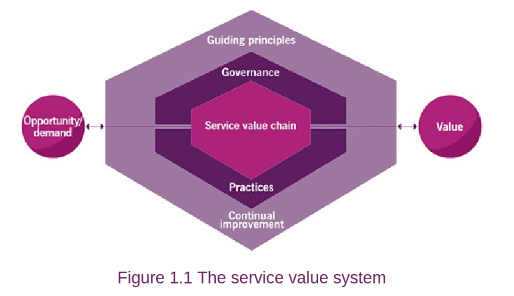
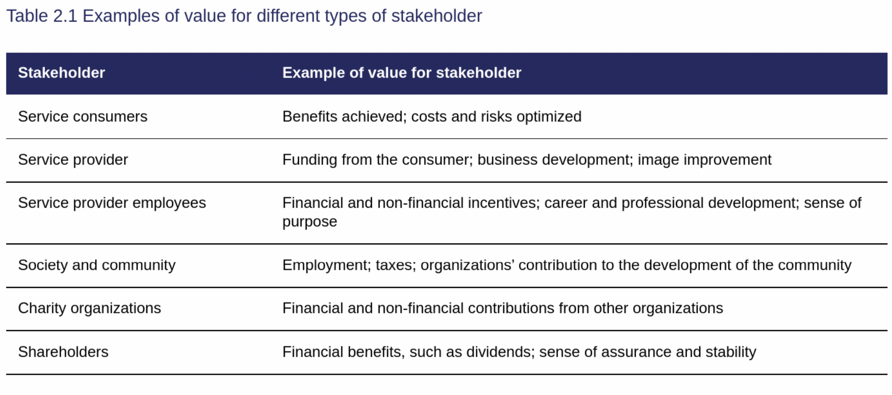
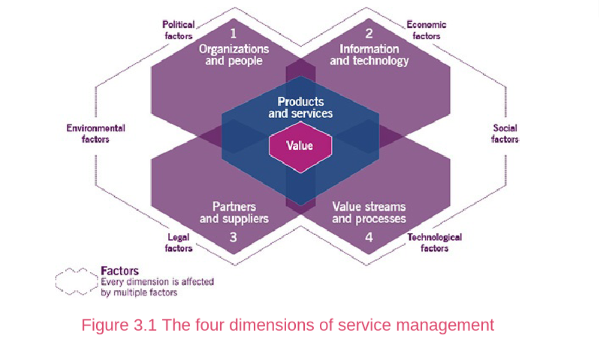
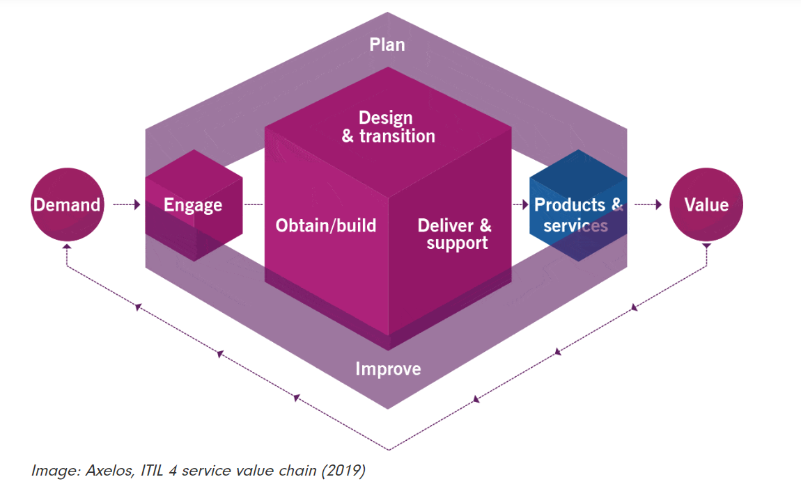
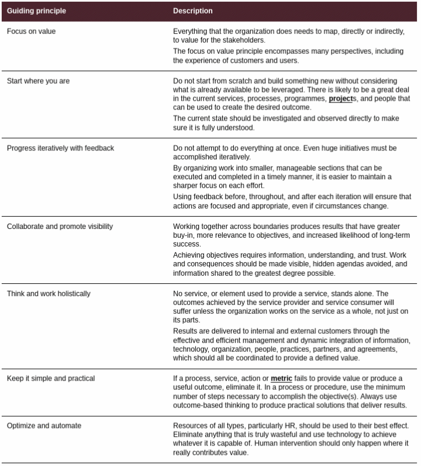
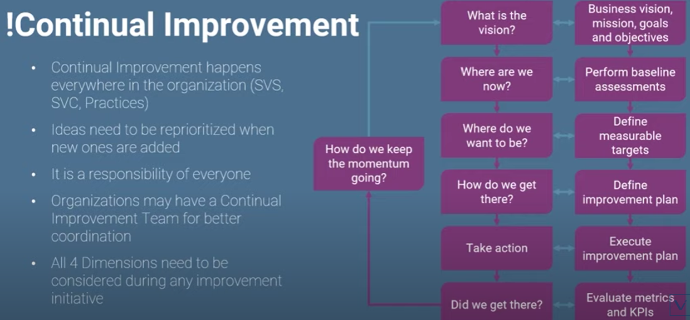
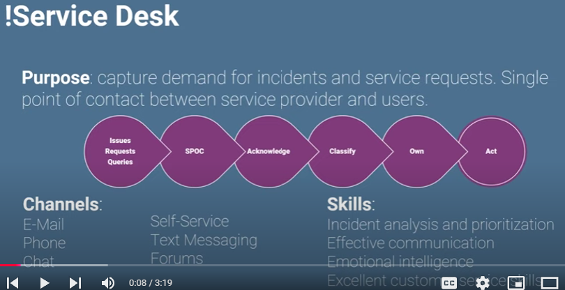

# D336 ITIL  

Dion Training practice exams  
CyberVista 

7,6,2,1 are the order of the most important chapters  

## Service Value System  
*What describes..* is a question that leads to the SVS  
- **Service Value Chain**: flexible model for the creation, delivery, and 
continual improvement of services  
	- Is the departments or people in an organization  
	
## Key Concepts of Service Management  
- 1.1 Recall definition of: 
	- Service: facilitates outcomes for customer with limited cost to them  
		- The means of enabling value co-creation by facilitating outcomes that customers want to achieve without the customer having to manage specific costs and risks.  
	- Utility: What the service does  
	- Warranty: How the service performs  
	- Customer: Person who defines requirement for service  
	- User: End user of services  
	- Service Management: Set of specialized organizational capabilities for enabling value to customers in the form of services. (Like Microsoft providing email or drive for a company)    
	- Sponsor: Person who authorizes budget for service  
	
- 1.2 Describe key concepts of creating value with services:  
	- Cost: Amount spent     
	- **Value**: PERCEIVED benefits, usefulness, or importance  
	- Organization: Person or group with its own functions  
	- Outcome: Result for stakeholder (The outcome of the output below is that emails are sent and communication is enhanced)      
	- Output: Deliverable of an activity (You are given a product, like email service)  
	- Risk: Possibile events that could cause harm or loss    
	- Utility: Functionality to meet a need (An airconditioner will cool 5,000sqf)     
	- Warranty: Assurance that requirements will be met (The airconditioner is lowering the temp in a 4,000 sqf room)    
	
- 1.3 Describe key concepts of service relationship:  
	- Service offering (The offer of the provision)
        - A formal description of one or more services, designed to address the needs 
        of a target consumer group.  Aservice offering may include goods, access to resources, 
        and service actions.  
	- Service relationship management (Usually the negotiations of all this)   
	- Service provision (The person offering)    
	- Service consumption (Who is receiving the offer)    
	
  

- Guiding principles: 
	- create the organization's culture  
	- Comman principles across organization  

- Governance  
	- organization align operations with stategic direction  
	
Four dimensions of Sevice Management:  
	- Organizations and people  
	- Information and technology  
	- partners and suppliers  
	- value streams and processes  

**Value**: the percieved benefits, usefulness, and importance of something  
- Values is subject to perception of the stakeholders  

### Value co-creation  

Mono-directional: a provider delivers the service without involvement of the consumer on the creation of the service  

Stake holders and consumers need to provide feedback to help build the service  

Stakeholders involved in value co-creation:  
- Organization  

Service Consumption involves:  
- Customer: role that defines the requirements for a service and takes 
responsibility for the outcomes of service consumption. The person negotiating the contract.      
- Users: the person using the service from the contract  
- Sponsors  

  

**Services**: A means of enabling value co-creationg by facilitation outcomes that customers 
want to achieve, without the customer having to manage specific costs and risks.  
**Product**: A configuration of an organization's resources designed to offer 
value for a customer.  

Service offerings are a specific mix of services and products sold ot a specific customer.  
**Service offerings** can be under the control of:  
- Prividers gives control to consumer (Goods)    
- (Access to resources) Provider keeps control of service, but grants access to consumer  
- *Service actions* performed to address needs of consumer on demand ( customer service, patch updates, for a good that was purchased)  

  

#### Service Relationships  
Service relationships are established between two or more organizations to co-create 
value. In a service relationship, organizations will take on the orles of service 
providers or service consumers. The two roles are not mutually exclusive, and 
organizations typically both provide and consume a number of services at any given time.  

**Service Relationship**: A cooperation between a service provider and service 
consumer. Service relationships include service provision, service consumption, and 
service relationship management.  
**Service provision**: Activities performed by an organization to provide services.  
- management of the provider's resources, configured to deliver the service  
- ensuring access to these resources for users  
- fulfillment of the agreed service actions  
- service level management and continual improvement  
- may also include the suppling of goods  

**Service consumption**: Activities performed by and organization to consume services.  
- management of the consumer's resources needed to use the service  
- service actions performed by users, including utilizing the provider's resources, and 
requesting service actions to be fulfilled  
- may also include the receiving of goods  
**Service relationship management**: Joint activities performed by a service provider  
and a service consumer to ensure continual value co-creation based on agreed and
available service offerings.  

#### Value: outcomes, costs, risks  
The resources needed to provide services have cost. This equates to risk. 

**Output**: A tangible or intangible deliverable of an activity.  
**Outcome**: A result for a stakeholder enabled by one or more outputs.  
**BRM (Business Relationship Manager)**: 

Two types of costs from a consumer's perspective in service relationship:  
- cost removed from consumer by service  
- Cost imposed on the consumer by service  

**Risk**: a possible event that could cause harm or loss, or make it more difficult 
to achieve objectives. Can also be defined as uncertainty of outcome, and can 
be used in the context of measuring the probability of positive outcomes as well as 
negative outcomes.  
- Risks removed from consumer by teh service  
- Risks imposed on the consumer by the service  
The provider manages the detailed level of risk on behalf of the consumer.  

The consumer contributes to the reduction of risk through: 
- Actively participating in the definition of the requirements of the service  
- clear communication of the **critical success factors (CSF)** and constraints  
- ensuring the provider has access tot he necessary resources  

#### Utility and Warranty  

Utility and Warranty ensure consumers get their expected outcome.  

**Utility**: the functionality offered by a product or service to meet a particular 
need. Utility can be summarized as 'what the servie does' and can be used to 
determine whether a service is 'fit for urpose'. To have utility, a service must either
support the performance of the consumer or remove constraints from the consumer.  
Many services do both.  

**Warranty**: assurance that a product or service will meet agreed requirements.  
Warranty can be summarixed as 'how the service performs' and can be used to 
determine whether a service is 'fit for use'. Warranty often relates to **service levels** 
aligned with the needs of service consumers.  This may be based on a formal agreement, or it 
may be marketing message or brand image.  Warranty typically addresses such areas as 
the **availability** of the service, its capacity, levels of security and continuity.  
A service may be said to provide acceptable assurance, or 'warranty', if all defined 
and agreed conditions are met.  

**These two equal expected value**  
Utility is getting from point A to point B.  
Warranty is HOW to get from point A to point B.

# Video 2  

### ITIL 7 Guiding Principles  
Allows organizations to integrate them into an overall approach to service management.  
Engourage and support organizations in continual improvement.    
Use the principles that are relevant to the situation.  

1. Focus on Value 
- all activities conducted by an organization should link back - directly or 
indirectly - to value for its customers, for its stakeholders, and for the organization itself.   
- What gives the most customer satisfaction  
- What brings customers back to you  
2. Start where you are  
- consider what is already available instead of starting from scratch  
3. Progress iteratively with feedback  
- break down the work into manageable components that can be executed 
iteratively to accomplish the objective  
4. Collaborate and promote visibility  
- efforts benefit from better buy-in  
- better information is available for decision making  
- Creative solutions, enthusiastic contributions, and important perspectives  
- Involve the right people at the right time and gather factual data to make the right decisions.   
can be obtained from unexpected sources  
- inclusion is generally a better policay than exclusion   
5. Think and work holistically  
- no service, practice process, department, or supplier stands alone  
- Think as a whole  
6. Keep it simple and practical  
- use the minimum number of steps necessary to accomplish an objective  
7. Optimize and automate  
- organizations should streamline activities and automate work, so that minimal human 
intervention is required.  

### Four dimensions of service management:  
VOIP, like voice over ip  
1. **O**rganizations and people  
2. **I**nformation and technology  
3. **P**artners and suppliers  
4. **V**alue streams and processes   

    

#### Partners and Suppliers  
Factors that may influence an organization's stategy when using suppliers:  
- Stategic focus: may outsource non-core supporting functions  
- Corporate culture: longstanding cultural bias  
- Resource scacity:  
- Cost concern:  
- Subject matter expertise:  
- External constraints:  
- Demand patterns:  

### Value Streams and Processes  
- A value stream is a series of steps undertaken by and organization to create 
and deliver products and services to consumers. It's implemented as a combination 
of the organization's value chain activities.  
- A process descibes what is done to accomplish an objective. Inputs into outputs.
- Activities the organization undertakes      

**Service value chain**: converts demand into value, can be used for mapping value streams     
- **P**lan: ensures shared understanding of vision, current status and direction    
- **I**mprove: continual improvment of products and services    
- **E**ngage: understand stakeholder needs and demands    
- **D**esign and Transition: make sure that services meet stakeholder needs    
- **O**btain/Build: ensure components are available when needed    
- **D**eliver and Support: ensure sla comform service delivery

#### External factors (PESTLE)  
- Political  
- Economic  
- Social  
- Technological  
- Legal  
- Environmental 

### Organizations and People  
- Roles and responsibilities  
- Formal organizational structure  
- Culture  
- Staffing and competencies  

### Information and Technology  
- Information created, managed, and used in the course of service provision and consumption  
- Technologies that support and enable that service  

### Partners and Suppliers  
- Some organizations might believe they can be best served by focusing their attention 
on developing core competencies, using partners and suppliers to provide other 
needs.  
- Other organizations might rely on their own resources, thus using partners and 
suppliers as little as necessary. Both these approaches represent extremes.  

### Service Value Chain (SVC)  
- It is an operating model  
- Outlines activities needed to transform demand into value  
- Universally applicable  
- Can be used for mapping value streams  
- practices include specific sequences of SVC activities  

Value chain activity (persons and departments): PIE-DOD   
- Plan  
- Imporve  
- Engage  
- Design and Transition  
- Obtain/Build  
- Deliver and Support  

### Engage (Sales representative)   
Provide a good understanding of relationships with all stakeholders.  
Key inputs to the Engage Activity:  
- A product and service portfolio provided by plan  
- High-level demand for services and products provided by internal and external customers  
- Detailed requirements for services and products provided by customers  
- Request and feedback from customers  
- Incidents, service requests, and feedback from users  
- Information on the completion of user support tasks from deliver and support  
- Marketing opportunities from current and potential customers and users  
- Cooperation opportunities and feedback provided by partners and suppliers 
- Contract and agreement requirements from all value chain activities  
- Knowledge and information about new and changed products and services from design 
and trasition and objtain/build  
- Knowledge and information about third-party service components from suppliers and partners  
- Product and service performance information from deliver and support  

Key outputs of the Engage activity:  
- Consolidated demands and opportunities for plan  
- Product and service requirements for design and transition  
- User support tasks for delivery and support  
- Improvement opportunities and stakeholders feedback for improve  
- Change or project initiation requests for obtain/build  
- Contracts and agreements with external and internal suppliers and partners for design and transition 
and obtain/build  
- Knowledge and information about third-party service components for all value chain activities  
- Service performance reports for customers  

### Plan  
Shared understanding of the vision  
Key inputs to the plan activity are:  
- Policies, requirements, and constraints provided by the organization's governing body  
- Consolidated demands and opportunities provided by Engage  
- Value chain performance information, improvement status reports, and improvement initiatieves 
from Improve  
- Knowledge and information about new and changed products and services from Design and Transition, and Obtain/Build  
- Knowledge and information about third-party service components from Engage  

Key outputs to the plan activity:  
- Stategic, tactical, and operational plans  
- Portfolio decisions for Design and Transition  
- Architectures and policies for Design and Transition  
- Improvement opportunities for Improve  
- A product and service portfolio for Engage  
- Contract and agreement requirements for Engage  

### Obtain/Build (Goes out and procures stuff)  
Service components are available when and where they are needed and that they meet 
agreed specifications.  
The key inputs to the Obtain/Build activity are:  
- Architectures an policies provided by Plan  
- Contracts and agreements with external and internal suppliers and pertners provided 
by engage  
- Goods and services provided by external and internal suppliers and partners  
- Requirements and specifications provided by Design and Transition   
- Improvement initiatives provided by Improve  
- Improvement status reports from Improve  
- Change requests provided by Deliver and Support  
- Knowledge and Information about new and changed products and services from Desing and Transition  
- Knowledge and Information about third-party service components from Engage  

The key Outputs:  
- Service components for Deliver and Suppoert  
- Service components for Design and Transition  
- Knowledge and Information about new and changed service components to all value chain activities  
- Contract and agreement requirement for Engage  
- Performance information and improvement opportunities for Improve  

### Design and Transition (The developers)  
Products and services meet expectations for quality, costs, and time to market.  
Key inputs:  
- Portfolio decisions provided by Plan  
- Architectures and policies provided by Plan  
- Product ans service requirements provided by Engage  
- Improvement initiatives provided by Improve  
- Improvement status reports from Improve  
- Service performance information provided b Deliver and Support and Improve  
- Service components from Obtain/Build  
- Knowledge and information About third-party service components from Engage  
- Knowledge and information about new and changed products and services from Obtain/Build  
- Contract and agreements with external and internal suppliers and partners provided 
by Engage  
Key outputs:  
- Requirements and specifications for Obtain/Build  
- Contract and agreement requirements for Engage  
- New and changed products and services for Deliver and Support  
- Knowledge and information about new and changed products and services to all value 
chain activities  
- Performance information and improvement opportunities for Improve  

### Improve  
Continual improvement of products, services, and practices  
Key inputs:  
- Product and service performance information provided by Deliver and Support  
- Stakeholders' feedback provided by Engage  
- Performance information and improvement opportunities provided by all value chain activities  
- Knowledge and information about new and changed products and services from Design and Transition and Obtain/Build  
- Knowledge and information about third-party service components from Engage  

Key outputs:  
- Improvement initiatives for all chain activities 
- Value chain performance information for Plan and governing body  
- Improvement status reports for all value chain activities  
- Contract and agreement requirements for Engage  
- Service performance information for Design and Transition  

## Service Value System

**Service Value System (SVS)**: Describes how all the components and activities of the 
organization work together as a system to enable value co-creation  

- Require **integration** and **coordination** of activities, practices, teams, 
authorities, and responsibilities.  

- Ensures continued co-create value  

- Engage: All incoming and outgoing interactions 
- All new resources are obtained through the obtain/build activity  
- Planning at all levels is performed via Plan activity  

### Continual Improvement  
Align the organization's practices and services with changing business needs through 
the ongoing indentification and improvement of services, service components, 
practices, or any element involved in the efficient and effective management of products
and services.  

### Practices    
**Practice**: set of organized resources designed for performing work or accomplishing 
and objective  

There are 34 of them, divided into 3 categories.  
- General Management. (14 practices) General management practices have been adapted 
from wider business domain.  
    - Architecture management  
    - Continual improvement  
    - Information security  
    - Knowledge management  
    - Measurement and reporting  
    - Organization change management  
    - Portfolio management  
    - Project management  
    - Relationship management  
    - Risk management  
    - Service financial management  
    - Strategy management  
    - Supplier management  
    - Workforce and talent management  
- Service Management. (17 practices) Service management practices have been created/adapted 
from the service management industry.  
    - Availability management  
    - Business analysis  
    - Capacity and performance management  
    - Change enablement  
    - Incident management  
    - IT asset management  
    - Monitoring and event management  
    - Problem management  
    - Release management  
    - Service catalog management  
    - Service configuration management  
    - Service continuity management  
    - Service design  
    - Service desk  
    - Service level management  
    - Service request management  
    - Service valication and testing  
- Technical Management. (3 practices) Technical functions which have been elevated to the 
level of a service.  
    - Deployment Management  
    - Infrastructure and Platform Management  
    - Software Development and Management  

Key inputs to the SVS are opportunity and demand.  
Opportunity represent options or ppossibilities to add value for stakeholders or 
otherwise improve the organization.  
Demand is the need or desire for products and services among internal and external consumers.  

**Guiding Principles**: Recommendations that can guide an organization in all 
circumstances, regardless of changes in its goals, stategeries, type of work, or 
management structure.  

**Governance**: The means by which an organization is directed and controlled.  

**Service value chain**: A set of interconnected activities that an organization performs 
to deliver a valuable product or service to its consumers and to facilitate value 
realization.  

**Practices**: Sets of oranizational resources designed for performing work or 
accomplishing an objective.  

**Continual improvement**: A recurring organizational activity performed at all
levels to ensure that an organization's performance continually meets stakeholders'
expectations. ITIL 4 supports continual improvement with the ITIL continual Improvement
model.  

**Organizational Silos**: prevent easy access to information, resistant to change  
**Organizational resilience**: thrive in changing external circumstances. anticipate, prepare for,
respond to changes and sudden disruptions.    
**Organizational agility**: move and adapt quickly  

- Opportunity and demand trigger activities within SVS, lead to creation of value  
**Opportunity**: options or posibilities to add value for stakeholders.  
**Demand**: need or desire for service.  

Guiding Principles:  
  

#### Focus on value  

##### Agile and ITIL together:  
- streamlining practices such as change enablement  
- establishing procedures to incorporate and prioritize the management of unplanned
interruptions (incidents), and to investigate the causes of failure.  
- separating interactions, if necessary, between systems of record (configuration 
management database), needed to manage services from system of engagement (collaboration
tools) used by software development teams.  

**DevOps**: builds on agile, close collaboration between developement and technical 
operations, use automation to free up time of skilled professionals to focus on 
value-adding activities. Combines Agile for software development, ITIL for 
value co-creation, improving the way value is generated with LEAN.  
- creating fast feedback loops  
- Streamlining value chain activities and value streams so that demand for work 
can be quickly converted to value for multiple stakeholders.  
- differentiating deployment management from release management  
- advocating a 'system view' that emphasizes close collaboration between enterprise 
governance, service teams, software development, and technology operations.  

Customer experience (CX) is both objective and subjective.  

Applying principles for achieving **Focus on Value**:  
- Know how service consumers use each service  
- Encourage a focus on value among all staff  
- Focus on value during normal operational activities as well as during improvment 
initiatives  
- Include focus on value in every step of any improvement initiative  

#### Start Where you are  

The role of measurement:  
> When a measurement becomes a target, it ceases to be a good measure, Goodhart's Law  

#### Progress interatively with feedback  

Benefits of Iteration and feedback together:  
- greater flexibility  
- faster responses to customer and business needs  
- the ability to discover and respond to failure  
- overall improvement in quality  

To apply this principle:  
- Comprehend the whole, but do something. Don't fall to 'analysis paralysis'  
- The ecosystem is constantly changing, so feedback is essential  
- Fast does not mean incomplete  

#### Collablorate and promote visibility  

Discuss important issues/tasks, not talking about them can appear that they are not 
important.  
Critical analysis of:  
- understanding flow of work in progress  
- identifying bottlenecks, as well as excess capacity  
- uncovering waste  

Advice for this principle:  
- collaboration does not mean consensus  
- Communicate is a way the audience can hear  
- Decisions can only be made on visible data  

#### Think about work holistically  

Applying this principle:  
- Recognize the complexity of the systems  
- Collaboration is key to thinking and working holistically  
- Where possible, look for patterns in the needs of and interactions between 
system elements  
- Automation can facilitate working holistically  

#### Keep it simple and practical  

Always use the minimum steps to accomplish an objective.  

Applying this value:  
- Ensure value  
- Simplicity is the ultimate sophistication  
- Do fewer things, but do them better  
- Respect the time of the people involved  
- Easier to understand, more likely to adopt  
- simplicity is the best route to achieving quick wins  

#### Optimize and automate  

Make something as effective and useful as it needs to be.  
Steps to optimization:  
- Understand and agree the context in which the proposed optimization exists.  
- Assess the current state of the proposed optimization  
- Agree what the future state and priorities of the organiztion should be, focusing
on simplification and value.  
- Ensure the optimization has the appropriate level of stakeholder engagement and commitment.  
- Execute the improvements in an iterative way.  
- Continually monitor the impact of optimization.  

Steps to automation:  
- simplify and/or optimize before automating  
- Define your metrics  
- Use the other guiding principles when applying this one.  
	- Progress iteratively with feedback  
	- Keep it simple and practical  
	- Focus on value  
	- Start where you are   

## Videos  

#### Continual Improvement  
Ongoing improvement of products, services, and practices, or any element involved 
in management of products and services.  

Continual Improvement Model:  
- Provides approach for continual improvement  
- Applies to SVS in its entirety  
- Supports iterative approach  
- Improvement efforts linked to organization's vision  

  

#### Change Enablement  
Maximize the number of successful changes through proper risk assessment and minimize 
the negative impact of failed changes  
Types:  
- Standard: Pre-authorized, low risk, low cost, basically Service Request. No additional authorization.    
- Normal: authorization depends on what kind of change it is. Goes through the normal 
change workflow. Authorization based on change type.    
- Emergency: needs rapid action. May have a separate change authority  

**Imporve**: Many improvements will require changes to be made, and these should 
be assessed and authorized in the same way as all other changes.  
**Design and transition**: Many changes are initiated as a result of new or 
changed services. Change control activity is a mahor contributor to transiton.  
**Obtain/build**: Changes to components are subject to change control, whether 
they are built in house or obtained from suppliers.  
**Deliver and Support**: Changes may have an impact on delivery and support, and 
information about changes must be communicated to personnel who carry out this value 
chain activity. These people may also play a part in assessing and authorizing changes.  

#### Incident Management  
Minimize negative impact of incidents by restoring normal operation as soon as 
possible.  

**Incident**: unplanned interruption or reduction of quality. Must be logged, prioritized 
and managed through their lifecycle. Uses same categorization as Problem Tickets. 
Swarming may help with complex issues. Normal is defined in the SLA.    
**Major Incidents**: need a *separate procedure*. Swarming can be used for quicker 
solutions.  

**Imporvement**: Incident record are a key input to improvement activities, and are 
prioritized both in terms of incident frequency and severity.  
**Engage**: Incidents are visible to users, and significant incidents are also visible 
to customers.  Good incident management requires regular communication to understand 
the issues, set expectations, provide status updates, and agree that the issue has 
been resolved so the incident can be closed.  
**Design and transition**: Incidents may occur in test environments, as well as 
during service release and deployment. The practice ensures these incidents are resolved 
in a timely and controlled manner.  
**Obtain/build**: Incidents may occur in development environments. Incident management 
practice ensures these incidents are resolved in a timely and controlled manner.  
**Deliver and support**: Incident management makes a significant contribution to 
support. THis value chain activity includes resolving incidents and problems.  

**Swarmming!!**  

#### Problem Management  
Reduce likelihood of recurring incidents by identifying actual and potential 
causes of incidents, manages workarounds and known errors.  

- Problem: unknown cause of one or more incidents  
- Known Error: a problem with a known root cause but no solution yet  
- Workaround: alternate solution, reducing the impact of the problem

**Phases**: problem identification =\> problem control =\> error control  

**Imporve**: This is the main focus area for problem management. Effective problem 
management provides the understanding needed to reduce the number of incidents and 
the impact of incidents that can't be prevented.  
**Deliver and support**: Problem management makes a significant contribution by 
preventing incident repetition and supporting timely incident resolution.  
**Engage**: Problems that have a significant impact on services will be visible to 
customers and users. In some cases, customers may wish to be involved in problem 
prioritization, and the status and plans for managing problems should be communicated.  
Workarounds are often presented to users via a serviceportal.  

#### Service Desk  
Capture demand for incidents and service requests. Single point of contact between 
service provider and users.  

  
SPOC: single point of contatct 

A service desk:  
- has a practical understanding of the wider, organization, the business processes, and the 
users.  
- have a major influence on the user experience and how the service provider is 
perceived.  

What services should a good service desk deliver:  
- Add value by understanding and acting on the business actions  
- Should provide empathetic and informed links between the service provider and its 
users.  

What skills should service desk staff have?  
- exellent customer service skills  
- empathy  
- incident analysis and prioritization  
- effective communication  
- emotional intelligence  

**Engage**: service desk is the main channel for tactical and operational engagement with users.  
**Deliver and support**: The service desk is the coordination point for managing incidents and servic requests.  
**Design and transition**: provides a channel for communicating with users about new 
and changed services. Service desk staff participate in release planning, testing, 
and early life support.  
**Improve**: activities are constantly monitored and evaluated to support continula 
improvement, alignment, and value creation. Feedback from users is collected by the 
service desk to support continual improvement.  

#### Service Level Management  
To set clear business-based targets for service performance, so that the delivery of
a service can be measured properly  

- SLA: agreement between customer and service provider  
- OLA(operational level agreements): agreement between different units of the same organization  
- UC(Underpinning Contracts): agreement between service provider and external supplier  

Recommendations:  
- clear language, no jargon  
- simply written, easy to understand  
- Should relate to defined outcomes  
- Listen actively to customer needs  

**Plan**: supports planning of the product and service portfolio and service offerings 
with information about the actual service performance and trends.  
**Engage**: ensures ongoing engagement with customers and users through geedback processing 
and continual service review.  

#### Service Request Management  
To support the agreed quality of services by handling all pre-defined, user-initiated 
service requests.  

**Service Request**: a formal request for something other than incident resolution 
(information, advice, how-to questions)  

Steps to fulfill requests should be well known (for both simple and complex requests) 
When defining new workflows, try to reuse already existing ones.  
User expectations must be managed in regards of what can be delivered  

1. Steps should be well known and proven, **agree times for fulfillemnt**, and provide clear communication 
of the status.  
2. Requests and their fulfilment should be standardized and automated to the greatest 
degree possible.  
3. Policies should be established regarding what service requests will be fulfilled with 
limited or even no additional approvals so that fulfilment can be streamlined.  
4. Expectations of users regarding times clearly set, based on what organiztion can 
realistically deliver.  
5. Opportunities for improvement identified and implemented to produce faster fulfillment 
times and benefit from automation.  

Policies and workflows included for documenting and redirecting any requests 
submitted as service requests, but which should actually be managed as incidents
or changes.  

Request Examples:  
- Report  
- Toner cartridge  
- Office hours  
- Phone  
- Laptop  
- Access to files  
- Feedback  
- Compliments  

#### Information Security Management  
Protects information needed by organizations to conduct business.   

Ensures appropriate levels of:  
- Confidentiality  
- Integrity  
- Availability  
- Authentication  
- Non-repudiation  

Protect the information needed by the organization to conduct its business.  This 
includes understanding and managing risks to the confidentiality, integrity, and 
availability of information, as well as other spects of information security 
such as authentication (ensuring someone is who they claim to be) and nonrepudiation 
(ensuring that someone can't deny that they took an action).  
- Prevention: ensuring security incidents do not occur  
- Detection: Rapidly and reliably detecting incidents that can't be prevented  
- Correction: Recovering from incidents after they are detected.  

#### Relationship Management  
Establishes and nurtures links between organizations and stakeholders at strategic and 
tactical levels.  
Makes sure we find the best possible ways to communicate and collaborate with different 
internal and external stakeholders.  

Relationships are identified =\> Analyzed =\> Monitored =\> Improved  

#### Supplier Management  
Ensures that suppliers of the organization and their performances are managed 
to support seamless service provision to customers.  

The goal is to make sure "we get what we paid for" from our vendors and suppliers.  

Agreements and contracts are made in the form of UCs (Underpinning Contracts). 

Includes creating closer, more collaborative relationships with key 
suppliers to uncover and realize new value and reduce the risk of failure.  
 

#### IT Asset Management  
Assets that have monetary value.  
Plans and manages the full lifecycle of IT assets to:  
- Maxamize their value  
- Control their costs  
- Support decisions about reusing or purchasing new assets  

**IT Asset**: any financially valuable component that can contribute to the 
delivery of IT products or services.  

#### Monitoring & Event Management  
Observes services and components and records changes in their state. Identifies 
those events, categorizes them and establishes standard responses.  

Systematically observes services an service components. Records and reports selected changes 
of state identified as events.  
Identifies and prioritizes infrastructure, services, business processes, and 
information security events.  Establish the appropriate reponse to those events, 
including to conditions that could lead to potential faults or incidents.   

**Event**: any change of state that has a significance for the management of 
a configuration item or service.  

**Types**: Informational, Warning, Exception  

#### Release Management  
Makes new and changed services and features available for use.  

**Release**: a version of a service or other configuration items, or a collection of 
configuration items, that is made available for use.  

Releases have been disconnected from deployments with **canary/dark release**  
(Canary/dark release is pushing something to production, but not showing it to end users. Some sort of toggle exists for using it)  

#### Service Configuration Management  
Ensures accurate information is available when needed about services, configuration 
items and their relationships.  

**Configuration Item (CI): any component that needs to be managed to deliver an IT 
service.  

**Configuration Management Database (CMDB)**: a database or collection of databases 
holding CIs and their connections.  
**CMS (Configuration Management System)**: a frontend / user interface for CMDBs  

#### Deployment Management  
Moves new or changed hardware, software documentation or any other components from 
one environment to the next.  
Move to a live environment.   
With the help of DevOps we can reach continuous delivery, where the developer 
build the change in DEV, which is automatically tested and moved to the next environment 
until it arrives in PROD. **Deployment is not equal to Release**.  

