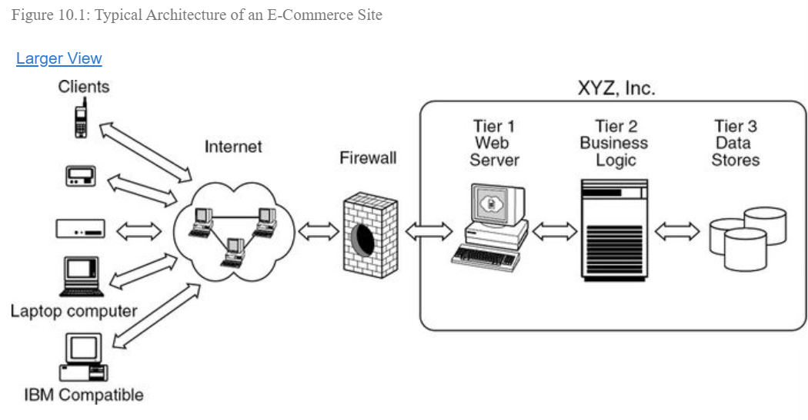

# D480 Software Engineering and Quality Assurance  

## Software Design  

### Software Requirements  
Referring to the requirements phase of the SDLC, requirements need to be 
**well-defined, clear, and measurable**.  

### Functional Requirements
Define system or component function  
- Calcualtions
- Data manipulation  
- Designed, coded, and tested  

#### Types  
- Transaction handling 
- Business rules  
- Certification requirements  
- Reporting
- Administrative 
- Authorization 
- Audit  
- External Interface  
- Historical data management 
- Legal and regulatory requirements  

### Non-Functional Requirements  
Behaviors and limitations.  Non-functional requirements cover HOW the functional 
requirements are performed. EX: *How* quickly will the site load, how usable is the UI?  
Other names for non-functional requirements are **constraints or quality attributes**  
Usually the "illities" of a project, like usability and functionality.   
Ensures compliance.  
Non-functional requirements can impact multiple systems. Functional requirements 
can be more atomic to one system.  

#### Types  
- Performance and scalability  
- Portability and compatibility  
- Reliability, availability, and maintainability  
- Security  
- Localization  
- Usability  

#### Comparing fuctional to Non-functional  
  

### Modularity  
Module = function  
Separate functions from each other, so that they test, run, and perform on their own.  
Encapsulated, internal workings are private.    
Modules are exclusive responsibility, narrow and focused, no overlap/do not share 
responsibility.  

**Mono-dependency**: only used in once instance. Since it is only used for one case,
it may not need to be modular.  

### Coupling  
Degree of interdependence between modules. How do modules perform separately?  

### Data Coupling  
Data coupling happens when different modules of a program communicate to each other by sharing data (passing data to each other). They usually do this by sending data through the parameters. This form of coupling is thought to be the best.   

**Tramp data**: passing data into a module that is just being passed to the next 
module without being used by the first.  

### Stamp Coupling  
Common data that two functions rely on. More closely connected.  

### Control Cooupling  
One modules sends data that has direct influence over the receiving module. This 
can mean the data shared is specific to the two methods.  If you see null passed 
in as a parameter.  

### External Coupling  
Components are not dependent on eachother, but are dependent on an external source.  
Stronger form of coupling. Ex: modules are dependent on a database.  

### Common Coupling
Tight coupling.  Modules share global data/variables.  Or reading and writing to 
the same data in a database.  

### Content Coupling  
One module can modify data of another.  One module cannot exist without the other.  
Very tightly coupled.  

### Design Cohesion  
Intra-dependency levels between module elements, how well the modules work together.  

  

- Functional Cohesion: add two numbers 
- Sequential: one output from a module serves as the input for the next.  
- Communication cohesion: Has two elements within the module that act on the same input.  
- Prodedural Cohesion: elements in module that must happen in order, but are not 
dependent on the input/output of the other. EX: print() on multiple lines.  
- Temporal cohesion: Tasks that happen at the same time, indirect dependency.  
- Logical cohesion: elements are only logically related. Database connections are 
all combined into a database class because they interact with the database. But 
they perform completely different functions, so should be put in separate modules.  
- Coindicental cohesion: a file called miscellaneous that has random functions  

### Software Product Vision  
Describes overall objective, explains the reason your product exists, and sets direction for future development.  

- Research  
- Create a Team  
- Define Core Product (MVP)  
- Validity  
- Refine and document  

### Product vision board  
Provides a board view of what you want your product to do and how it benefits the end users.  

- Vision statement  
- Target Group  
- Needs: What the needs this product fulfills. Why will people want this product.  
- Product: Important features, address the needs  
- Business goals: Why our organization should invest in building it.  

### Agile Scoping Tools  
Consultive questioning and listenting to find the scope  

- Establish project requirements  
- Align Objectives  

#### Scoping
- Go into product backlog.  
- Epics: Large pieces of scope that will not fit in a single sprint. Work towards a specific need.      
- Stories: self-contained, fit in single sprint
    - Who wants it.
    - What they want. 
    - Why they want it.  
- Themes: larger than Epic or story. Intangible goals. A category.    
- Initiatives: Multiple epics.  Not a category, but the overall goal for epics.  

### User Story Creation  
Focus on the viewpoint of the enduser.  
Not technical. Not detailed.    
Clarifies the reason for the requirement.  
Example:  `As a <role> I need.... So that....`  
Written in first person.  
The card as the following:  
- Unique story id  
- Short title  
- Story  
- Functional acceptance criteria  
- Non-functional acceptance criteria  

#### Three Cs  
lifecycle of the user story.  
- Added to a card and placed in backlog  
- Conversations over the userstory, written on card.  
- Confirmation that the story is complete  

#### INVEST  
When writing the story, follow: 
- Independent  
- Negotiable  
- Valuable  
- Estimable  
- Small   
- Testable  

### MVP  

### Definition of Done (DoD)  

### UX Design  
UX Hierarchy:
- Information Architecture  
- Visual Heirarchy  

UX Consistency:  
- Standard patterns  
- Design Languages  

UX Confirmation:  

UX User Controls:  
- Navigation  
- Settings  
- Undo actions  

UX Accessibility:  
- Color for visually impaired  

Note: Use dedicated UX resources. UX teams can't be spread out, they need to be 
one team. If the responsibility is spreadout, the UX will not be unified.  

## Higher Order Testing  
Chapter 6 of Myers, Sandler, and Badgett. (2011). The Art of Software Testing (3rd) Wiley.  

Higher-order testing: Above module testing.

### Design Phase:  
1. Translate the program user's needs into a set of written requirements. These are the goals for the product.

2. Translate the requirements into specific objectives by assessing feasibility, time, and cost, resolving conflicting requirements, and establishing priorities and trade-offs.

3. Translate the objectives into a precise product specification, viewing the product as a black box and considering only its interfaces and interactions with the end user. This description is called the external specification.

4. If the product is a system such as an operating system, flight-control system, database system, or employee personnel management system, rather than an application (e.g., compiler, payroll program, word processor), the next process is system design. This step partitions the system into individual programs, components, or subsystems, and defines their interfaces.

5. Design the structure of the program or programs by specifying the function of each module, the hierarchical structure of the modules, and the interfaces between modules.

6. Develop a precise specification that defines the interface to, and function of, each module.

7. Translate, through one or more substeps, the module interface specification into the source code algorithm of each module.

  

- **Requirements** specify why the program is needed.

- **Objectives** specify what the program should do and how well the program should do it.

- **External specifications** define the exact representation of the program to users.

- **Documentation** associated with the subsequent processes specifies, in increasing levels of detail, how the program is constructed.

The design and testing cycles should be combined in a one-to-one relationship: 
  

The advantages of this structure are that it avoids unproductive redundant testing and prevents you from overlooking large classes of errors.  

### Function Testing  
Find descrpancies between the program and the external specification.  
Black-box activity, the earlier module-testing process achieved white-box testing.  

### System Testing  
Compare the system or program to its original objectives.
System testing is not limited to systems. If the product is a program, system testing is the process of attempting to demonstrate how the program, as a whole, fails to meet its objectives.

System testing, by definition, is impossible if there is no set of written, measurable objectives for the product.  

Design the system test by analyzing the objectives; formulate test cases by analyzing the user documentation. This has the useful side effect of comparing the program to its objectives and to the user documentation, as well as comparing the user documentation to the objectives  

The person performing a system test must be capable of thinking like an end user

  

Categories of Test Cases:
- Facility: Ensure that the functionality in the objectives is implemented.
- Volume: Subject the program to abnormally large volumes of data to process.
- Stress: Subject the program to abnormally large loads, generally concurrent processing.
- Usability: Determine how well the end user can interact with the program.
- Security: Try to subvert the program's security measures.
- Performance: Determine whether the program meets response and throughput requirements.
- Storage: Ensure the program correctly manages its storage needs, both system and physical.
- Configuration: Check that the program performs adequately on the recommended configurations.
- Compatibility/Conversion: Determine whether new versions of the program are compatible with previous releases.
- Installation: Ensure the installation methods work on all supported platforms.
- Reliability: Determine whether the program meets reliability specifications such as uptime and MTBF.
- Recovery: Test whether the system's recovery facilities work as designed.
- Serviceability/Maintenance: Determine whether the application correctly provides mechanisms to yield data on events requiring technical support.
- Documentation: Validate the accuracy of all user documentation.
- Procedure: Determine the accuracy of special procedures required to use or maintain the program.

### Acceptance Testing  
comparing the program to its initial requirements and the current needs of its end users  
performed by the program's customer or end user and normally is not considered the responsibility of the development organization.  
the best way to do this is to devise test cases that attempt to show that the program does not meet the contract.  
  

### Installation Testing  
find errors that occur during the installation process.  

### Test Planning and Control  

The components of a good test plan are as follows:

- Objectives The objectives of each testing phase must be defined.
- Completion criteria Criteria must be designed to specify when each testing phase will be judged to be complete. This matter is discussed in the next section.
- Schedules Calendar time schedules are needed for each phase. They should indicate when test cases will be designed, written, and executed. Some software methodologies such as Extreme Programming (discussed in Chapter 9) require that you design the test cases and unit tests before application coding begins.
- Responsibilities For each phase, the people who will design, write, execute, and verify test cases, and the people who will repair discovered errors, should be identified. And, because in large projects disputes inevitably arise over whether particular test results represent errors, an arbitrator should be identified.
- Test case libraries and standards In a large project, systematic methods of identifying, writing, and storing test cases are necessary.
- Tools The required test tools must be identified, including a plan for who will develop or acquire them, how they will be used, and when they will be needed.
- Computer time This is a plan for the amount of computer time needed for each testing phase. It would include servers used for compiling applications, if required; desktop machines required for installation testing; Web servers for Web-based applications; networked devices, if required; and so forth.
- Hardware configuration If special hardware configurations or devices are needed, a plan is required that describes the requirements, how they will be met, and when they will be needed.
- Integration Part of the test plan is a definition of how the program will be pieced together (e.g., incremental top-down testing). A system containing major subsystems or programs might be pieced together incrementally, using the top-down or bottom-up approach, for instance, but where the building blocks are programs or subsystems, rather than modules. If this is the case, a system integration plan is necessary. The system integration plan defines the order of integration, the functional capability of each version of the system, and responsibilities for producing “scaffolding,” code that simulates the function of nonexistent components.
- Tracking procedures You must identify means to track various aspects of the testing progress, including the location of error-prone modules and estimation of progress with respect to the schedule, resources, and completion criteria.
- Debugging procedures You must define mechanisms for reporting detected errors, tracking the progress of corrections, and adding the corrections to the system. Schedules, responsibilities, tools, and computer time/resources also must be part of the debugging plan.
- Regression testing Regression testing is performed after making a functional improvement or repair to the program. Its purpose is to determine whether the change has regressed other aspects of the program. It usually is performed by rerunning some subset of the program's test cases. Regression testing is important because changes and error corrections tend to be much more error prone than the original program code (in much the same way that most typographical errors in newspapers are the result of last-minute editorial changes, rather than changes in the original copy). A plan for regression testing—who, how, when—also is necessary.

### Test Completion Criteria  

### THe independent Test Agency  

## Capability Maturity Model Integration (CMMI) Framework  

Chapter 3 of Chapters and Sections of Kasse, T. (2008). Practical Insight into CMMI. (2nd ed.) Artech House Publishers.  

CMMI provides a framework from which to organize and prioritize engineering, people, 
and business activities.  

It is all about improving processes.

Stages of CMMI:  
  

### Chapter 13  Reviews and Testing  

Peer reviews are human based testing.  
Why conduct reviews?:  
- Detect defects  
- Remove defects as close to the point of insertion as possible  
- Determine products progress/status  
- Identify potential improvements  
- Produce technical work of a more uniform and predictable quality.  
- Gain ownership by the project team.  
- Assist employees with cross-training  
- Reduce costs to build and maintain better products  
- Reduce development time.  
- Reduce testing cost and time.  
- Reduce total system maintenance cost dramatically.  

The sooner a defect is found, the less it will cost to fix it.  

- Project manager reviews: usually weekly 
- Milestone Reviews: meaningful points or dates.  
- Senior Management OVersight Reviews: Seniors own the project. They decide if more resources need to be allocated, or any other big decision.
- Peer Reviews: inspections, structured walkthroughs, technical reviews, buddy checks, circulation reviews  

### Full Stack Testing  
Chapter 1 of Mohan, G. (2022). Full stack testing. O'Reilly Media, Incorporated.  

Move Testing activities to the beginning of the SDLC so that it can produce high quality results.
Shift testing left:

  
Ten fullstack testing skills:  
  

## Managing Bugs  

A bug record contains several important elements:

- An accurate description of the problem
- The browser/operating system being used
- Steps to repeat the problem
- What was expected versus what actually happened
- Error messages (with screenshots), if applicable 

The following information is what you need to properly report a bug:

- A brief but accurate description of the problem. It is important that this description includes how and under what circumstances the problem is occurring.
- The environment where the problem was discovered. This is important because the environment may have been a contributing factor to the problem. Without this information, you may not be able to reproduce the problem. Environment details include:
    - Operating system and version
    - Browser and version
    - Environment URL
- Steps describing how to recreate the problem. This is important because the tester cannot always be present with the developer to describe how the problem was found. These steps provide the developer with the means to investigate the problem. Steps should be clear and provide any credentials that may be needed to recreate the issue.
- Expected vs. actual result. It is important for the tester to include the expected result to ensure there is a clear understanding of the functionality under test. A comparison of expected vs. actual result will inform the developer why the actual result was flagged as a problem.
- Error messages and screenshots, if possible. These are important because they provide visual representations of the problem. They can also sometimes offer additional clues as to where to start looking in the program.  

## Test Strategies  

### LinkedIn Test Strategy Doc

- Introduction: High level summary of the project. What testing and how it is carried out.  
- References  
- QA Deliverables  
- Test Management: test tools and environments  
- Scope of Testing: What types ot tests exist in the project. How much code each test convers. Who is responsible for the tests.  

### Usability Test   
Chapter 7 of Myers, Sandler, and Badgett. (2011). The Art of Software Testing (3rd) Wiley.

User based, black-box method.  

Considerations:  
- Has each user interface been tailored to the intelligence, educational background, and environmental pressures of the end user?
- Are the outputs of the program meaningful, noninsulting to the user, and devoid of computer gibberish?
- Are the error diagnostics, such as error messages, straightforward, or does the user need a PhD in computer science to comprehend them? For instance, does the program produce such messages as IEK022A OPEN ERROR ON FILE ‘SYSIN’ ABEND CODE=102? Messages such as these weren't all that uncommon in software systems of the 1970s and 1980s. Mass-market systems do better today in this regard, but users still will encounter unhelpful messages such as, “An unknown error has occurred,” or “This program has encountered an error and must be restarted.”
- Programs you design yourself are under your control and should not be plagued with such useless messages. Even if you didn't design the program, if you are on the testing team, you can push for improvements in this area of the human interface.
- Does the total set of user interfaces exhibit considerable conceptual integrity, an underlying consistency, and uniformity of syntax, conventions, semantics, format, style, and abbreviations?
- Where accuracy is vital, such as in an online banking system, is sufficient redundancy present in the input? For example, such a system should ask for an account number, a customer name, and a personal identification number (PIN) to verify that the proper person is accessing account information.
- Does the system contain an excessive number of options, or options that are unlikely to be used? One trend in modern software is to present to users only those menu choices they are most likely to use, based on software testing and design considerations. Then a well-designed program can learn from individual users and begin to present those menu items that they frequently access. Even with such an intelligent menu system, successful programs still must be designed so that accessing the various options is logical and intuitive.
- Does the system return some type of immediate acknowledgment to all inputs? Where a mouse click is the input, for example, the chosen item can change color, or a button object can depress or be presented in a raised format. If the user is expected to choose from a list, the selected number should be presented on the screen when the choice is made. Moreover, if the selected action requires some processing time—which is frequently the case when the software is accessing a remote system—then a message should be displayed informing the user of what is going on. This level of testing sometimes is referred to as component testing, whereby interactive software components are tested for reasonable selection and user feedback.
- Is the program easy to use? For example, is the input case-sensitive without making this fact clear to the user? Also, if a program requires navigation through a series of menus or options, is it clear how to return to the main menu? Can the user easily move up or down one level?
- Is the design conducive to user accuracy? One test would be an analysis of how many errors each user makes during data entry or when choosing program options. Were these errors merely an inconvenience—errors the user was able to correct—or did an incorrect choice or action cause some kind of application failure?
- Are the user actions easily repeated in later sessions? In other words, is the software design conducive to the user learning how to be more efficient in using the system?
- Did the user feel confident while navigating the various paths or menu choices? A subjective evaluation might be the user response to using the application. At the end of the session did the user feel stressed by or satisfied with the outcome? Would the user be likely to choose this system for his or her own use, or recommend it to someone else?
- Did the software live up to its design promise? Finally, usability testing should include an evaluation of the software specifications versus the actual operation. From the user perspective—real people using the software in a real-world environment—did the software perform according to its specifications?  

You should establish practical, real-world, repeatable exercises for each user to conduct. Design these testing scenarios to present the user with all aspects of the software, perhaps in various or random order.  

During each phase of the test, have observers document the user experience as they perform each task. When the test is complete, conduct an interview with the user or provide a written questionnaire to document other aspects of the user's experience, such as his or her perception of usage versus specification.

In addition, write down detailed instructions for user tests, to ensure that each user starts with the same information, presented in the same way. Otherwise, you risk coloring some of the tests if some users receive different instructions.  

A complete usability testing protocol usually involves multiple tests from the same users, as well as tests from multiple users. Why multiple tests from the same users? One area we want to test is user recall, that is, how much of what a user learns about software operation is retained from session to session.  

#### Data Gathering  
- Read aloud user actions  
- remote user testing  
- Questionnaire  

## Agile Testing  

Chapter 9 of Myers, Sandler, and Badgett. (2011). The Art of Software Testing (3rd) Wiley.  

Relies on automated testing  

### Extreme Programing  

You can group the 12 core XP practices into four concepts:

- Listening to the customer and other programmers.
- Collaborating with the customer to develop the application's specification and test cases.
- Coding with a programming partner.
- Testing, and retesting, the code base.

1. Planning and requirements

- Marketing and business development personnel work together to identify the maximum business value of each software feature.

- Each major software feature is written as a user story.

- Programmers provide time estimates to complete each user story.

- The customer chooses the software features based on time estimates and business value.

2. Small, incremental releases

- Strive to add small, tangible, value-added features and release a new code base often.

3. System metaphors

- Your programming team identifies an organizing metaphor to help with naming conventions and program flow.

4. Simple designs

- Implement the simplest design that allows your code to pass its unit tests. Assume change will come, so don't spend a lot of time designing; just implement.

5. Continuous testing

- Write unit tests before writing the code module. Each unit is not complete until it passes its unit test. Further, the program is not complete until it passes all unit tests, and acceptance tests are complete.

6. Refactoring

- Clean up and streamline your code base. Unit tests help ensure that you do not destroy the functionality in the process. You must rerun all unit tests after any refactoring.

7. Pair programming

- You and another programmer work together, at the same machine, to create the code base. This allows for real-time code review, which dramatically facilitates bug detection and resolution.

8. Collective ownership of the code

- All code is owned by all programmers.

- No single programmer is dedicated to a specific code base.

9. Continuous integration

- Every day, integrate all changes; after the code passes the unit tests, add it back into the code base.

10. Forty-hour workweek

- No overtime is allowed. If you work with dedication for 40 hours per week, overtime will not be needed. The exception is the week before a major release.

11. On-site customer presence

- You and your programming team have unlimited access to the customer, to enable you to resolve questions quickly and decisively, which keeps the development process from stalling.

12. Coding standards

- All code should look the same. Developing a system metaphor helps meet this principle.

## Testing Internet Applications  

From chapter 10 of Myers, Sandler, and Badgett. (2011). The Art of Software Testing (3rd) Wiley.  

  

Components of three tier architecture:  
- Web server: hosts the HTML website, also called the presentation tier    
- Business layer:  houses the application server.   
- Data source  

### Presentation Layer Testing:  
- Fonts the same in each browser  
- Confirm all links work  
- Grammar and spelling  
- Defaults are initially loaded on page  
- User friendly  

### Data Tier Testing:  
- Meets performance goals  
- Verify data is accurate  
- Data can be recovered  
- Test failover redundancy  
- Test security and encryption  
- Test api from business tier, ensure CRUD  

### Fault Tolerance and Recoverability Testing  

MTBF: Mean Time Between Failures  
MTTR: Mean Time to repair  

## Mobile Application Testing  

Chapter 11 of Myers, Sandler, and Badgett. (2011). The Art of Software Testing (3rd) Wiley.  

